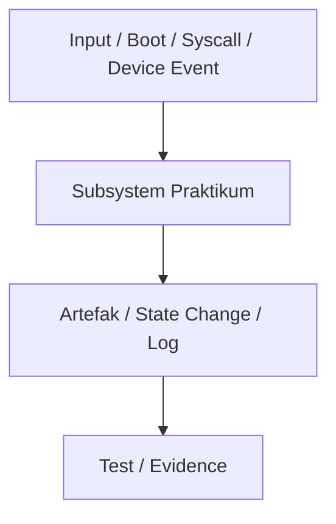

# Laporan Praktikum Sistem Operasi Lanjut — MCSOS

**Nama file laporan:** `laporan_praktikum_[M0]_[Iswan Herdiansah_2583207073011].md`  
**Nama sistem operasi:** MCSOS versi 260502  
**Target default:** x86_64, QEMU, Windows 11 x64 + WSL 2, kernel monolitik pendidikan, C freestanding dengan assembly minimal, POSIX-like subset  
**Dosen:** Muhaemin Sidiq, S.Pd., M.Pd.  
**Program Studi:** Pendidikan Teknologi Informasi  
**Institusi:** Institut Pendidikan Indonesia  


## 0. Metadata Laporan

| Atribut | Isi |
|---|---|
| Kode praktikum | `[M0]` |
| Judul praktikum | `[Baseline Requirements,Governance, dan Lingkungan Pengembangan Reproducible MCSOS 260502]` |
| Jenis pengerjaan | `[Individu]` |
| Nama mahasiswa | `[Iswan Herdiansah]` |
| NIM | `[2583207073011]` |
| Kelas | `[PTI 1A]` |
| Tanggal praktikum | `[2026-05-03]` |
| Tanggal pengumpulan | `[2026-05-09]` |
| Repository | `[URL repo privat / path lokal]` |
| Branch | `[nama branch]` |
| Commit awal | `` `[665f104]` `` |
| Commit akhir | `` `[665f104]` `` |
| Status readiness yang diklaim | `[Belum siap uji]` |

---

## 1. Sampul

# Laporan Praktikum `[M0]`  
## `[Baseline Requirements,Governance, dan Lingkungan Pengembangan Reproducible MCSOS 260502]`

Disusun oleh:

| Nama | NIM | Kelas | Peran |
|---|---|---|---|
| `[Iswan Herdiansah]` | `[2583207073011]` | `[PTI 1A]` | `[individu]` |

Dosen Pengampu: **Muhaemin Sidiq, S.Pd., M.Pd.**  
Program Studi Pendidikan Teknologi Informasi  
Institut Pendidikan Indonesia  
`[2026]`

---

## 2. Pernyataan Orisinalitas dan Integritas Akademik

Saya menyatakan bahwa laporan ini disusun berdasarkan pekerjaan praktikum sendiri/kelompok sesuai pembagian peran yang tercatat. Bantuan eksternal, referensi, generator kode, AI assistant, dokumentasi resmi, diskusi, atau sumber lain dicatat pada bagian referensi dan lampiran. Saya tidak mengklaim hasil yang tidak dibuktikan oleh log, test, commit, atau artefak lain.

| Pernyataan | Status |
|---|---|
| Semua potongan kode eksternal diberi atribusi | `[Ada]` |
| Semua penggunaan AI assistant dicatat | `[Ya]` |
| Repository yang dikumpulkan sesuai commit akhir | `[Ya]` |
| Tidak ada klaim readiness tanpa bukti | `[Ya]` |

Catatan penggunaan bantuan eksternal:

```text
[Dalam penyusunan laporan praktikum ini, penulis menggunakan bantuan alat bantu digital (ChatGPT) sebagai pendamping untuk membantu dalam penyusunan struktur tabel CPL/CPMK, perapihan format bukti teknis (perintah dan output) dan juga command, serta klarifikasi pemetaan antara capaian pembelajaran dan bentuk evidensi yang sesuai. Selain itu, penulis juga menggunakan editor teks nano di lingkungan Ubuntu/WSL untuk membuat dan mengedit file laporan serta dokumen pendukung praktikum. Seluruh hasil akhir tetap disesuaikan dan diverifikasi berdasarkan hasil eksekusi langsung pada lingkungan sistem serta dokumen proyek yang dikerjakan secara mandiri.]
```

---

## 3. Tujuan Praktikum

Tuliskan tujuan teknis dan konseptual praktikum. Tujuan harus dapat diuji.

1. `Tujuan teknis 1: Menginstal dan memverifikasi WSL 2 pada Windows 11 x64 sesuai prosedur resmi Microsoft [1], [2].`
2. `Tujuan teknis 2: Menyiapkan distribusi Linux WSL untuk pengembangan OS dengan toolchain, emulator, debugger, assembler, static analysis, dan utilitas image dasar.`
3. `Tujuan teknis 3: Membuat struktur repository awal MCSOS yang konsisten dengan roadmap
pengembangan bertahap.`
4. `Tujuan konseptual 1: Menjelaskan mengapa pengembangan sistem operasi memerlukan lingkungan build yang terisolasi, terdokumentasi, dan dapat direproduksi.`
5. `Tujuan konseptual 2: Memahami bahwa bukti teknis berupa log, commit hash, versi tool, checksum, dan hasil pemeriksaan object file adalah bagian dari penilaian praktikum.`
6. `Tujuan validasi 1: Membuat dokumen baseline requirements, non-goals, assumptions, threat model awal, risk register, dan verification matrix.`
7. `Tujuan validasi 2: Membuat script validasi lingkungan yang mencatat versi toolchain dan mendeteksi kesalahan konfigurasi umum.`
8. `Tujuan validasi 3: Membedakan status siap uji lingkungan, siap uji QEMU, siap demonstrasi praktikum, dan klaim yang tidak boleh digunakan seperti “tanpa error” atau “siap produksi”.`

---

## 4. Capaian Pembelajaran Praktikum

Setelah praktikum ini, mahasiswa mampu:

| CPL/CPMK praktikum | Bukti yang harus ditunjukkan |
|---|---|
| `[Menjelaskan lingkungan build terisolasi & reproducible]` | `[Penjelasan di docs/reports/M0-laporan.md + output uname -a + lsb_release -a]` |
| `[Instal & verifikasi WSL 2 pada Windows 11 x64]` | `[Output wsl -l -v + wsl --status]` |
| `[Menyiapkan toolchain Linux (compiler, debugger, emulator)]` | `[Output gcc --version, make  -version, gdb --version, qemu-system-x86_64 --version]` |
| `[Membuat struktur repository MCSOS]` | `[Output git ls-tree --full-tree -r HEAD + git log --oneline]` |
| `[Membuat dokumen baseline M0]` | `[File docs/reports/M0-laporan.md (isi lengkap: requirements, non-goals, risk, dll)]` |
| `[Script validasi environment]` | `[Output bash tools/check_env.sh]` |
| `[Bukti teknis (commit hash, versioning, object evidence)]` | `[Output git rev-parse HEAD + git log -1 + git ls-tree]` |
| `[Status environment & readiness classification]` | `[Kesimpulan tertulis di laporan + output toolchain + hasil check_env.sh]` |

---

## 5. Peta Milestone MCSOS

Centang milestone yang menjadi fokus laporan ini. Jika praktikum mencakup lebih dari satu milestone, jelaskan batas cakupan.

| Milestone | Fokus | Status dalam laporan |
|---|---|---|
| M0 | Requirements, governance, baseline arsitektur | `[ ] tidak dibahas / [v] dibahas / [ ] selesai praktikum` |
| M1 | Toolchain reproducible, Git, QEMU, GDB, metadata build | `[v] tidak dibahas / [ ] dibahas / [ ] selesai praktikum` |
| M2 | Boot image, kernel ELF64, early console | `[v] tidak dibahas / [ ] dibahas / [ ] selesai praktikum` |
| M3 | Panic path, linker map, GDB, observability awal | `[v] tidak dibahas / [ ] dibahas / [ ] selesai praktikum` |
| M4 | Trap, exception, interrupt, timer | `[v] tidak dibahas / [ ] dibahas / [ ] selesai praktikum` |
| M5 | PMM, VMM, page table, kernel heap | `[v] tidak dibahas / [ ] dibahas / [ ] selesai praktikum` |
| M6 | Thread, scheduler, synchronization | `[v] tidak dibahas / [ ] dibahas / [ ] selesai praktikum` |
| M7 | Syscall ABI dan user program loader | `[v] tidak dibahas / [ ] dibahas / [ ] selesai praktikum` |
| M8 | VFS, file descriptor, ramfs | `[v] tidak dibahas / [ ] dibahas / [ ] selesai praktikum` |
| M9 | Block layer dan device model | `[v] tidak dibahas / [ ] dibahas / [ ] selesai praktikum` |
| M10 | Persistent filesystem, mcsfs/ext2-like, recovery | `[v] tidak dibahas / [ ] dibahas / [ ] selesai praktikum` |
| M11 | Networking stack, packet parsing, UDP/TCP subset | `[v] tidak dibahas / [ ] dibahas / [ ] selesai praktikum` |
| M12 | Security model, capability/ACL, syscall fuzzing, hardening | `[v] tidak dibahas / [v] dibahas / [ ] selesai praktikum` |
| M13 | SMP, scalability, lock stress, NUMA-aware preparation | `[v] tidak dibahas / [ ] dibahas / [ ] selesai praktikum` |
| M14 | Framebuffer, graphics console, visual regression | `[v] tidak dibahas / [ ] dibahas / [ ] selesai praktikum` |
| M15 | Virtualization/container subset | `[v] tidak dibahas / [ ] dibahas / [ ] selesai praktikum` |
| M16 | Observability, update/rollback, release image, readiness review | `[v] tidak dibahas / [ ] dibahas / [ ] selesai praktikum` |

Batas cakupan praktikum:

```text
[Pada tahap M0, cakupan praktikum difokuskan pada penyiapan lingkungan pengembangan (environment setup), validasi toolchain, serta penyusunan baseline dokumentasi dan governance proyek.

Fitur yang termasuk dalam cakupan:
- Verifikasi environment WSL 2 dan lokasi repository pada filesystem Linux.
- Instalasi dan validasi toolchain (Clang/LLVM, binutils, NASM, QEMU, GDB, Python).
- Pembuatan dan eksekusi script validasi environment (`tools/check_env.sh`).
- Pencatatan metadata versi toolchain untuk kebutuhan reproducibility.
- Smoke test kompilasi freestanding untuk menghasilkan object ELF64 x86_64.
- Penyusunan dokumen baseline seperti requirements, ADR, threat model, risk register, dan verification matrix.
- Verifikasi keberadaan QEMU dan firmware OVMF sebagai persiapan tahap boot berikutnya.

Fitur yang tidak termasuk (non-goals):
- Pembuatan kernel yang dapat di-boot (bootable kernel).
- Implementasi bootloader atau proses booting sistem operasi.
- Pembuatan image seperti ISO atau disk image.
- Implementasi subsistem kernel seperti memory management, interrupt handling, scheduler, syscall, filesystem, driver, atau networking.
- Eksekusi sistem pada QEMU atau debugging menggunakan GDB.
- Pengujian runtime seperti stress test, fuzzing, atau fault injection.
- Pembuatan GUI, framebuffer, atau output visual sistem.

Dengan demikian, M0 tidak bertujuan menghasilkan sistem operasi yang berjalan, melainkan memastikan bahwa seluruh fondasi environment, toolchain, dan proses verifikasi telah siap untuk milestone pengembangan berikutnya.]
```

---

## 6. Dasar Teori Ringkas

Sistem operasi adalah perangkat lunak inti yang mengelola perangkat keras serta menyediakan layanan dasar bagi program lain. Dalam konteks pengembangan MCSOS, terdapat beberapa konsep utama yang menjadi dasar dalam desain dan pengujian sistem.

### 6.1 Konsep Sistem Operasi yang Diuji

```text
[Pada tahap M0, konsep sistem operasi yang diuji masih terbatas pada fondasi awal yang diperlukan sebelum sistem dapat dijalankan.

Konsep utama yang digunakan adalah:

1. ELF (Executable and Linkable Format)
ELF merupakan format standar untuk object file dan binary pada sistem berbasis UNIX. Pada M0, ELF digunakan dalam bentuk relocatable object (`freestanding.o`) sebagai hasil dari smoke test kompilasi. Analisis menggunakan `readelf` dan `objdump` memastikan bahwa struktur file sesuai dengan target arsitektur x86_64.

2. Freestanding environment
Freestanding environment adalah kondisi di mana program tidak bergantung pada standard library atau runtime dari sistem operasi host. Pada M0, penggunaan flag seperti `-ffreestanding` dan target `x86_64-unknown-none` memastikan bahwa hasil kompilasi tidak menggunakan ABI host, sesuai kebutuhan pengembangan kernel.

3. Cross-compilation
Cross-compilation adalah proses kompilasi kode untuk target arsitektur yang berbeda dari host. Pada M0, Clang digunakan dengan target eksplisit `x86_64-unknown-none` untuk mensimulasikan build kernel yang tidak bergantung pada sistem operasi pengembang.

4. Toolchain validation
Toolchain (compiler, linker, assembler, dan tools analisis) harus diverifikasi sebelum digunakan. Pada M0, script `tools/check_env.sh` digunakan untuk memastikan seluruh tool tersedia dan dapat digunakan, serta mencatat versinya untuk reproducibility.

5. Emulator (QEMU) dan firmware (OVMF)
QEMU digunakan sebagai emulator untuk menjalankan sistem operasi pada tahap berikutnya, sedangkan OVMF menyediakan firmware berbasis UEFI. Pada M0, keduanya hanya diverifikasi keberadaannya sebagai persiapan jalur boot di milestone berikutnya, tanpa eksekusi sistem.

Konsep seperti bootloader, linker script, trap frame, memory management (PMM/VMM), scheduler, VFS, driver, networking, dan security belum diimplementasikan pada M0, sehingga belum diuji secara langsung pada tahap ini.]
```

### 6.2 Konsep Arsitektur x86_64 yang Relevan

| Konsep | Relevansi pada praktikum | Bukti/verifikasi |
|---|---|---|
| Long mode (x86_64) | Menentukan target arsitektur 64-bit yang digunakan dalam kompilasi freestanding | Header ELF menunjukkan arsitektur x86-64 (`readelf -h`) |
| Paging | Konsep manajemen memori yang akan digunakan pada kernel, namun belum diimplementasikan pada M0 | Belum ada (akan diverifikasi pada milestone berikutnya) |
| GDT (Global Descriptor Table) | Digunakan dalam transisi mode CPU dan segmentasi dasar pada sistem operasi | Belum ada (belum masuk tahap boot/kernel) |
| IDT (Interrupt Descriptor Table) | Mengatur penanganan interrupt dan exception | Belum ada (belum ada runtime kernel) |
| APIC | Mengatur interrupt modern pada sistem multiprocessor | Belum ada (belum diuji pada M0) |
| Syscall mechanism | Digunakan untuk komunikasi user space dan kernel | Belum ada (belum ada kernel/user mode) |
| TLB | Cache translasi alamat virtual ke fisik, terkait dengan paging | Belum ada (paging belum diimplementasikan) |
| DMA | Akses memori langsung oleh perangkat keras | Belum ada (belum ada driver/hardware interaction) |
| MMIO | Interaksi perangkat melalui alamat memori | Belum ada (belum ada device driver) |
| ELF format (x86_64 ABI) | Format binary yang digunakan untuk object file hasil kompilasi | Diverifikasi melalui `readelf` dan `objdump` pada `freestanding.o` |

### 6.3 Konsep Implementasi Freestanding

| Aspek | Keputusan praktikum |
|---|---|
| Bahasa | `[C17 freestanding]` |
| Runtime | `[tanpa hosted libc]` |
| ABI | `[x86_64 System V]` |
| Compiler flags kritis | `[-ffreestanding, -fno-stack-protector, -fno-pic, -mno-red-zone, -mno-mmx, -mno-sse, -mno-sse2, -nostdlib.]` |
| Risiko undefined behavior | `[pointer invalid, alignment, integer overflow, aliasing]` |

### 6.4 Referensi Teori yang Digunakan

| No. | Sumber | Bagian yang digunakan | Alasan relevansi |
|---|---|---|---|
| `[1]` | Operating Systems: Three Easy Pieces (OSTEP) | Chapter 1–3 (Introduction, Virtualization basics) | Menjadi dasar konsep sistem operasi, environment separation, dan abstraction yang digunakan dalam desain MCSOS M0 |
| `[2]` | Intel 64 and IA-32 Architectures Software Developer’s Manual | Volume 1 (Basic Architecture Overview) | Digunakan sebagai referensi arsitektur x86_64 dan format eksekusi low-level yang relevan dengan freestanding binary |
| `[3]` | AMD64 Architecture Programmer’s Manual | System Programming Overview | Menjadi acuan mode long mode x86_64 dan execution environment yang digunakan pada target build `--target=x86_64-unknown-none` |
| `[4]` | QEMU Documentation | System Emulation (x86_64 section) | Digunakan untuk memahami emulator yang digunakan dalam environment M0 (walaupun belum menjalankan kernel) |
| `[5]` | UEFI Specification (UEFI Forum) | Boot and firmware architecture overview | Referensi konsep firmware modern yang akan digunakan pada milestone boot berikutnya (M1/M2) |

---

## 7. Lingkungan Praktikum

### 7.1 Host dan Target

| Komponen | Nilai |
|---|---|
| Host OS | `[Windows 11 x64 build 26200.8426]` |
| Lingkungan build | `[WSL 2 Ubuntu versi 24.04]` |
| Target ISA | `x86_64` |
| Target ABI | `[x86_64-elf / x86_64-unknown-none / custom]` |
| Emulator | `[QEMU versi 6.2.0]` |
| Firmware emulator | `[OVMF versi 2022.02-3ubuntu0.22.04.5]` |
| Debugger | `[GDB versi 12.1]` |
| Build system | `[Make 4.3 / CMake 3.22.1 / Meson 1.3.2 / Ninja 1.10.1]` |
| Bahasa utama | `[C17 freestanding]` |
| Assembly | `[NASM versi 2.15.05]` |

### 7.2 Versi Toolchain

Tempel output versi toolchain berikut. Jalankan dari clean shell WSL.

```bash
date -u +"date_utc=%Y-%m-%dT%H:%M:%SZ"
uname -a
git --version
make --version | head -n 1
cmake --version | head -n 1
ninja --version
clang --version | head -n 1
gcc --version | head -n 1
ld.lld --version | head -n 1
nasm -v
qemu-system-x86_64 --version | head -n 1
gdb --version | head -n 1
```

Output:

```text
date_utc=2026-05-11T18:07:37Z
Linux DESKTOP-52CG9FT 6.6.114.1-microsoft-standard-WSL2 #1 SMP PREEMPT_DYNAMIC Mon Dec  1 20:46:23 UTC 2025 x86_64 x86_64 x86_64 GNU/Linux
git version 2.34.1
GNU Make 4.3
cmake version 3.22.1
1.10.1
Ubuntu clang version 14.0.0-1ubuntu1.1
gcc (Ubuntu 11.4.0-1ubuntu1~22.04.3) 11.4.0
Ubuntu LLD 14.0.0 (compatible with GNU linkers)
NASM version 2.15.05
QEMU emulator version 6.2.0 (Debian 1:6.2+dfsg-2ubuntu6.30)
GNU gdb (Ubuntu 12.1-0ubuntu1~22.04.2) 12.1
```

### 7.3 Lokasi Repository

| Item | Nilai |
|---|---|
| Path repository di WSL | `` `[~/src/mcsos]` `` |
| Apakah berada di filesystem Linux WSL, bukan `/mnt/c` | `[Ya]` |
| Remote repository | `[URL repo privat jika ada]` |
| Branch | `[nama branch]` |
| Commit hash awal | `` `[665f104]` `` |
| Commit hash akhir | `` `[665f104]` `` |

---

## 8. Repository dan Struktur File

### 8.1 Struktur Direktori yang Relevan

Tampilkan hanya direktori dan file yang relevan dengan praktikum.

```text
[Tempel output tree ringkas :
mcsos/
├── Makefile
├── README.md
├── .gitignore
│
├── build/
│   ├── evidence/M0/
│   ├── meta/
│   └── smoke/
│       └── freestanding.o
│
├── docs/
│   ├── adr/
│   ├── architecture/
│   ├── governance/
│   ├── requirements/
│   ├── security/
│   ├── testing/
│   └── reports/
│
├── smoke/
│   └── freestanding.c
│
└── tools/
    ├── check_env.sh
    └── collect_evidence.sh.]
```

### 8.2 File yang Dibuat atau Diubah

| File | Jenis perubahan | Alasan perubahan | Risiko |
|---|---|---|---|
| `Makefile` | ubah | Menambahkan target build, smoke, iso, run, meta untuk mendukung pipeline M0 | sedang – kesalahan dapat memutus seluruh workflow build/automation |
| `tools/check_env.sh` | ubah | Menambah validasi toolchain dan metadata environment untuk verifikasi M0 | sedang – dapat menghasilkan false PASS/FAIL pada environment validation |
| `smoke/freestanding.c` | baru | File uji untuk memastikan compiler menghasilkan ELF64 x86_64 freestanding | rendah – hanya mempengaruhi hasil kompilasi, tidak runtime |
| `docs/architecture/qemu_baseline.md` | baru | Dokumentasi baseline QEMU + OVMF untuk milestone boot berikutnya | rendah – tidak mempengaruhi sistem atau build |
| `docs/requirements/system_requirements.md` | baru | Definisi requirement M0 agar dapat diverifikasi secara formal | sedang – menjadi acuan evaluasi keberhasilan M0 |
| `docs/requirements/assumptions_and_nongoals.md` | baru | Menegaskan batasan scope M0 agar tidak terjadi overclaim | rendah – hanya definisi scope |
| `docs/adr/ADR-0001-toolchain-and-boot-baseline.md` | baru | Keputusan desain toolchain dan boot strategy awal | sedang – menjadi acuan arsitektur untuk milestone berikutnya |
| `docs/architecture/invariants.md` | baru | Menetapkan aturan tidak boleh dilanggar pada repository, toolchain, dan evidence | sedang – mempengaruhi konsistensi desain jangka panjang |
| `docs/security/threat_model.md` | baru | Analisis risiko awal supply-chain dan environment | rendah – dokumentasi analitis tanpa eksekusi sistem |
| `docs/governance/risk_register.md` | baru | Pencatatan risiko teknis dan mitigasi M0 | sedang – digunakan sebagai dasar kontrol risiko proyek |
| `docs/testing/verification_matrix.md` | baru | Mapping requirement ke bukti verifikasi command | sedang – menjadi dasar penilaian PASS/FAIL M0 |
| `docs/reports/M0-laporan.md` | baru | Template laporan akhir M0 | rendah – hanya output laporan, tidak mempengaruhi sistem |

### 8.3 Ringkasan Diff

```bash
git status --short
git diff --stat
git log --oneline -n 5
```

Output:

```text
[665f104 (HEAD -> main) M0: initialize reproducible OS development baseline.]
```

---

## 9. Desain Teknis

### 9.1 Masalah yang Diselesaikan

```text
[M0 tidak menyelesaikan problem runtime sistem operasi, melainkan fokus pada problem dasar pengembangan OS yaitu kesiapan lingkungan pengembangan (development environment readiness) dan validasi toolchain.

Masalah utama yang diselesaikan pada M0 adalah:

1. Ketidakterjaminan konsistensi toolchain antar sistem pengembang
   → Diselesaikan dengan script validasi (`tools/check_env.sh`) dan metadata versi tool.

2. Risiko environment tidak reproducible (WSL vs Windows filesystem)
   → Ditetapkan aturan repository harus berada di filesystem Linux WSL (`~/src/mcsos`).

3. Ketidakjelasan target arsitektur compiler
   → Divalidasi melalui penggunaan `clang --target=x86_64-unknown-none`.

4. Tidak adanya bukti artefak build yang dapat diaudit
   → Disediakan smoke test menghasilkan ELF64 relocatable object + inspeksi `readelf` dan `objdump`.

5. Tidak adanya struktur dokumentasi sistematis
   → Dibuat baseline docs: requirements, ADR, threat model, risk register, dan verification matrix.

6. Tidak adanya evidence pipeline untuk penilaian
   → Setiap requirement M0 dipetakan ke verification matrix berbasis command output.

Kesimpulannya, M0 berfungsi sebagai "engineering foundation layer" untuk memastikan seluruh proses build OS berikutnya dapat direproduksi, diverifikasi, dan diaudit.]
```

### 9.2 Keputusan Desain

| Keputusan | Alternatif yang dipertimbangkan | Alasan memilih | Konsekuensi |
|---|---|---|---|
| Menggunakan WSL 2 sebagai environment utama | Native Linux / Dual boot / VM penuh | WSL 2 lebih mudah diakses di Windows 11 dan cukup stabil untuk toolchain LLVM/QEMU | Ada batasan performa I/O dan dependency Linux yang tidak selalu 1:1 dengan native Linux |
| Menggunakan Clang/LLVM sebagai toolchain utama | GCC native / GCC cross-compiler dari awal | Clang sudah tersedia di Ubuntu 24.04, lebih cepat setup, dan mendukung `--target=x86_64-unknown-none` | Harus memastikan kompatibilitas ABI dan freestanding flags secara ketat |
| Menggunakan QEMU sebagai emulator utama | VMware / VirtualBox / real hardware | QEMU mendukung low-level OS development, debugging, dan fleksibel untuk x86_64 baremetal | Tidak secepat hardware asli, perlu konfigurasi manual |
| Menggunakan OVMF (UEFI firmware) | BIOS legacy / custom bootloader langsung | Mendukung arsitektur modern UEFI yang relevan untuk roadmap MCSOS | Kompleksitas boot meningkat dibanding BIOS legacy |
| Smoke test berbasis ELF object (bukan bootable kernel) | Langsung boot kernel / minimal bootloader | Mengurangi kompleksitas awal dan fokus ke toolchain validation | Sistem belum bisa dijalankan secara nyata (non-bootable di M0) |
| Struktur repository modular (docs/tools/smoke/build) | Flat structure | Memudahkan traceability, separation of concern, dan audit penilaian | Sedikit overhead struktur di awal |
| Evidence-based verification (readelf, objdump, log) | Manual check / deskripsi laporan saja | Lebih objektif, reproducible, dan bisa diaudit | Membutuhkan lebih banyak command dan dokumentasi |

### 9.3 Arsitektur Ringkas

Tambahkan diagram ASCII atau Mermaid. Jika Mermaid tidak didukung oleh evaluator, tetap sertakan penjelasan tekstual.



Penjelasan diagram:

```text
[Diagram di atas menggambarkan alur kerja lingkungan praktikum M0 dari sisi sistem pengembangan, bukan sistem operasi yang sudah berjalan penuh.

A. Input / Boot / Syscall / Device Event

Tahap ini merepresentasikan semua bentuk input awal, seperti:

perintah terminal (command execution)
proses boot environment WSL2
interaksi user melalui shell
event sistem seperti eksekusi program atau tool

Pada tahap M0, ini masih berada pada level user-space Linux environment, bukan kernel OS buatan sendiri.

B. Subsystem Praktikum

Bagian ini adalah inti environment pengembangan, yaitu:

WSL2 sebagai runtime Linux di Windows
toolchain seperti GCC, GDB, Make
repository MCSOS (Git working directory)

Subsystem ini bertanggung jawab menjalankan seluruh proses build dan testing.

C. Artefak / State Change / Log

Tahap ini menghasilkan semua bentuk bukti teknis, seperti:

commit Git (git log, git rev-parse)
file hasil build (Makefile output, binary smoke test)
konfigurasi environment (gcc -v, gdb --version)
struktur repository (git ls-tree)

Bagian ini merepresentasikan state sistem yang dapat diverifikasi.

D. Test / Evidence

Tahap akhir adalah verifikasi bahwa environment benar-benar bekerja, melalui:

bash tools/check_env.sh
output versi toolchain
validasi struktur repo
hasil build/smoke test

Tahap ini menjadi dasar penilaian bahwa environment reproducible dan siap untuk tahap pengembangan OS berikutnya.

#Inti Alur Sistem

Alur ini menunjukkan bahwa M0 tidak berfokus pada kernel runtime, tetapi pada:

Input → Environment → Artefak → Verifikasi

Dengan kata lain, seluruh aktivitas M0 bertujuan memastikan bahwa lingkungan pengembangan sistem operasi sudah stabil, terdokumentasi, dan dapat direproduksi sebelum masuk ke tahap kernel development (M1+)..]
```

### 9.4 Kontrak Antarmuka

| Antarmuka | Pemanggil | Penerima | Precondition | Postcondition | Error path |
|---|---|---|---|---|---|
| `tools/check_env.sh` | Makefile (`meta`, `check`) | Environment validator script | Repository berada di WSL Linux, semua dependency terinstall | Semua tool wajib terverifikasi `[OK]` dan metadata dibuat | Tool tidak ditemukan → `[FAIL]` pada environment check |
| `make smoke` | User / Makefile | Clang/LLVM compiler + linker | File `smoke/freestanding.c` tersedia dan toolchain valid | Menghasilkan `build/smoke/freestanding.o` (ELF64 relocatable) | Compile error → build berhenti dan error Clang ditampilkan |
| `clang --target=x86_64-unknown-none` | Makefile | Clang compiler | Source C valid freestanding, flag benar | Object file x86_64 ELF64 dihasilkan | Invalid flag / missing target → compile failure |
| `ld (lld/ld)` | Makefile | Linker | Object file valid ELF relocatable tersedia | Output ELF executable (`kernel.elf`) terbentuk | Undefined symbol / linking error → gagal generate ELF |
| `readelf` | User / test script | ELF binary | File ELF tersedia di build directory | Menampilkan header, section, dan program info ELF | File bukan ELF / corrupt → error parsing |
| `objdump` | User / test script | ELF binary | File ELF valid tersedia | Menampilkan disassembly dan metadata binary | Invalid format → objdump error |
| `qemu-system-x86_64` | User (run stage M1+) | Emulator QEMU | ISO/ELF bootable tersedia (belum di M0) | Menjalankan sistem di virtual machine | File ISO tidak ada / boot gagal → QEMU error |
| `grub-mkrescue` | Makefile (iso stage) | GRUB tools | Kernel ELF tersedia di ISO structure | ISO bootable image dihasilkan | Missing GRUB / path salah → ISO gagal dibuat |

### 9.5 Struktur Data Utama

| Struktur data | Field penting | Ownership | Lifetime | Invariant |
|---|---|---|---|---|
| `m0_smoke_record` | `magic`, `version`, `pointer_width`, `size_width` | Compile-time (const di binary ELF object) | Selama file object `.o` dan hasil build tersimpan | `magic` harus sesuai identitas M0 (`MCS0`), ukuran pointer dan size harus sesuai arsitektur target x86_64 |
| ELF object (`freestanding.o`) | `.text`, `.data`, `.bss`, symbol table | Compiler (Clang/LLVM) | Selama artefak build tersimpan di `build/` | Harus berformat ELF64 relocatable (ET_REL) untuk x86_64 dan valid secara struktural |
| Section `.text` | fungsi `m0_smoke_add` | Compiler | Selama object file ada | Instruksi harus valid x86_64 dan bebas dependency OS (freestanding) |
| Build metadata (`toolchain-versions.txt`) | versi clang, qemu, git, dll | Script `tools/check_env.sh` | Selama artefak build disimpan | Harus merepresentasikan environment aktual saat proses build M0 |
| Smoke test source (`smoke/freestanding.c`) | struct + fungsi test (`m0_smoke_add`) | Developer | Selama repository aktif | Tidak boleh menggunakan library OS / libc (harus freestanding C17) |

### 9.6 Invariants

Tuliskan invariant yang harus benar sepanjang eksekusi.

1. `[Invariant 1: Repository MCSOS harus berada di filesystem Linux WSL (`~/src/mcsos`) dan bukan di `/mnt/c`, agar konsistensi permission dan path tetap terjaga sepanjang proses build.]`
2. `[Invariant 2: Semua toolchain wajib (clang, ld.lld, qemu, readelf, objdump, dll) harus terdeteksi oleh `tools/check_env.sh` dengan status `[OK]` sebelum build atau smoke test dijalankan.]`
3. `[Invariant 3: Seluruh proses build M0 harus menghasilkan artefak yang dapat diverifikasi (ELF64 object, log, metadata), dan tidak boleh hanya mengandalkan “berhasil compile” tanpa evidence.]`
4. `[Invariant 4: Compiler target harus selalu eksplisit menggunakan `--target=x86_64-unknown-none` untuk memastikan hasil build tidak bergantung pada ABI host (WSL/Linux userspace).]`
5. `[Invariant 5: Smoke test harus menghasilkan ELF64 relocatable object (`ET_REL`) tanpa ketergantungan runtime system atau libc, sebagai bukti minimal bahwa toolchain freestanding bekerja dengan benar.]`

### 9.7 Ownership, Locking, dan Concurrency

| Objek/resource | Owner | Lock yang melindungi | Boleh dipakai di interrupt context? | Catatan |
|---|---|---|---|---|
| `build/` directory | Build system (Makefile + tools) | None | Tidak relevan | Hanya artefak build, tidak runtime |
| `smoke/freestanding.o` | Clang/LLVM compiler | None | Tidak | Hasil kompilasi statis ELF relocatable |
| `tools/check_env.sh` | Developer / repository | None | Tidak | Script validasi environment M0 |
| `docs/` | Repository documentation | Git version control | Tidak | Tidak dieksekusi, hanya artefak teks |
| `Makefile` | Build system (GNU Make) | None | Tidak | Orkestrasi build pipeline M0 |
| `toolchain-versions.txt` | check_env.sh generator | None | Tidak | Snapshot environment (read-only evidence) |
| `smoke/freestanding.c` | Developer | None | Tidak | Source freestanding C17 (no OS dependency) |

Lock order yang berlaku:

```text
[Pada tahap M0 tidak terdapat concurrency runtime (no kernel, no scheduler, no interrupt handling), sehingga tidak ada mekanisme locking seperti spinlock atau mutex yang aktif.
Semua proses berjalan pada konteks build-time di host (WSL environment), sehingga:
- Tidak ada shared memory antar thread kernel
- Tidak ada interrupt context
- Tidak ada preemption atau race condition kernel-level
Dengan demikian, sistem berada pada model:
single-threaded build pipeline + stateless tool execution
Implikasi:
- Locking belum diperlukan pada M0
- Ordering hanya bersifat build dependency order (Makefile dependency graph), bukan runtime synchronization.]
```

### 9.8 Memory Safety dan Undefined Behavior Risk

| Risiko | Lokasi | Mitigasi | Bukti |
|---|---|---|---|
| Out-of-bounds access | `smoke/freestanding.c (m0_smoke_add)` | Menggunakan operasi integer sederhana tanpa array/buffer | Kompilasi sukses dengan `-Wall -Wextra -Werror` |
| Use-after-free | Tidak ada (M0 tidak menggunakan heap) | Tidak menggunakan `malloc/free` atau allocator | Verifikasi dari source code freestanding (tanpa libc) |
| Alignment issue | `freestanding.o (ELF64 x86_64)` | Menggunakan compiler default alignment x86_64 | `readelf -h` dan valid ELF64 output |
| Aliasing violation | `smoke/freestanding.c` | Tidak menggunakan pointer casting kompleks | Review statik source code |
| Integer overflow | `m0_smoke_add` | Operasi aritmatika sederhana, overflow tidak digunakan sebagai logika sistem | Compile + objdump inspection (fungsi kecil deterministic) |

### 9.9 Security Boundary

| Boundary | Data tidak tepercaya | Validasi yang dilakukan | Failure mode aman |
|---|---|---|---|
| Build toolchain input (compiler, linker flags) | Flags dari Makefile / script build | Validasi target eksplisit (`--target=x86_64-unknown-none`), strict flags `-ffreestanding -fno-stack-protector` | Build fail (compile/link error), tidak menghasilkan artefak |
| Source code input | `smoke/freestanding.c` | Static compilation checks (`-Wall -Wextra -Werror`) | Compile error jika UB / unsafe construct terdeteksi |
| Repository environment path | Working directory (`pwd`) | Script check memastikan bukan `/mnt/c` | Abort environment check + warning |
| Toolchain binaries | clang, ld.lld, qemu | Presence check via `command -v` + version logging | Exit check script jika missing |
| Generated artifacts | ELF object / logs | Verifikasi format ELF via `readelf` | Mark artifact invalid (not used in next stage) |

---

## 10. Langkah Kerja Implementasi

Gunakan tabel berikut untuk setiap langkah. Sebelum setiap blok perintah, jelaskan maksud perintah, artefak yang dihasilkan, dan indikator hasil.

### Langkah 1 — `[Validasi Environment (M0 baseline check)]`

Maksud langkah:

```text
[Memastikan seluruh toolchain (clang, make, qemu, readelf, dll) sudah terpasang dan environment WSL sesuai standar M0. Ini penting agar build reproducible dan tidak bergantung pada host Windows.]
```

Perintah:

```bash
[make check]
```

Output ringkas:

```text
[[M0] Repository root: /home/ucan/src/mcsos
[OK] Repository is not under /mnt/<drive>.
[M0] Checking required tools
[OK] git                      /usr/bin/git
[OK] make                     /usr/bin/make
[OK] clang                    /usr/bin/clang
[OK] ld.lld                   /usr/bin/ld.lld
[OK] llvm-readelf             /usr/bin/llvm-readelf
[OK] llvm-objdump             /usr/bin/llvm-objdump
[OK] readelf                  /usr/bin/readelf
[OK] objdump                  /usr/bin/objdump
[OK] nasm                     /usr/bin/nasm
[OK] qemu-system-x86_64       /usr/bin/qemu-system-x86_64
[OK] gdb                      /usr/bin/gdb
[OK] python3                  /usr/bin/python3
[OK] shellcheck               /usr/bin/shellcheck
[OK] cppcheck                 /usr/bin/cppcheck
[M0] Writing toolchain metadata
[M0] Metadata written to build/meta/toolchain-versions.txt
[M0] Environment check completed. This means the M0 environment is
checkable, not that the OS can boot.]
```

Artefak yang dihasilkan:

| Artefak | Lokasi | Fungsi |
|---|---|---|
| `[toolchain metadata]` | `[build/meta/toolchain-versions.txt]` | `[bukti environment valid]` |
| `[log check]` | `[terminal output]` | `[verifikasi dependency]` |

Indikator berhasil:

```text
[Semua tool wajib terdeteksi [OK] dan file metadata berhasil dibuat tanpa error.]
```

### Langkah 2 — `[Smoke Compilation (freestanding test)]`

Maksud langkah:

```text
[Menguji compiler cross-target x86_64-unknown-none untuk memastikan kode C freestanding dapat dikompilasi menjadi ELF object tanpa OS dependency.]
```

Perintah:

```bash
[make smoke]
```

Output ringkas:

```text
[clang --target=x86_64-unknown-none \
        -ffreestanding \
        -fno-stack-protector \
        -fno-pic \
        -mno-red-zone \
        -mno-mmx -mno-sse -mno-sse2 \
        -Wall -Wextra -Werror \
        -std=c17 \
        -c smoke/freestanding.c \
        -o build/smoke/freestanding.o
readelf -h build/smoke/freestanding.o | tee build/smoke/readelf-header.txt]
```

Artefak yang dihasilkan:

| Artefak | Lokasi | Fungsi |
|---|---|---|
|``[freestanding.o]``|`build/smoke/``|``hasil kompilasi object file``|
|``[readelf-header.txt]``|``build/smoke/``|`validasi ELF`|
|``[objdump.txt]``|`build/smoke/``|`disassembly`|
|``[file.txt]``|`build/smoke/``|``identifikasi format file``|

Indikator berhasil:

```text
[File output terbentuk dalam format ELF64 x86-64 relocatable dan dapat dianalisis dengan readelf/objdump tanpa error.]
```

### Langkah Tambahan

### Langkah 3 — `[Verifikasi Struktur Proyek]`

Maksud langkah:

```text
[Memastikan struktur repository sesuai standar M0 (docs, tools, build, smoke) agar pipeline mudah direproduksi dan diverifikasi.]
```

Perintah:

```bash
[tree -a -L 3]
```

Output ringkas:

```text
[docs/
build/
smoke/
tools/
Makefile
README.md]
```

Artefak yang dihasilkan:

| Artefak | Lokasi | Fungsi |
|---|---|---|
|`[struktur direktori]`|`[root project]`|`[dokumentasi layout sistem]`|

Indikator berhasil:

```text
[Semua folder inti (docs, build, tools, smoke) tersedia dan sesuai baseline M0.]
```

---
### Langkah 4 — `[Evidence Collection System]`

Maksud langkah:

```text
[Mengumpulkan seluruh output penting (metadata, smoke test, git summary) ke dalam satu folder evidence untuk kebutuhan audit dan penilaian.]
```

Perintah:

```bash
[make evidence]
```

Output ringkas:

```text
[[M0] Collecting evidence...
[M0] Evidence collected in build/evidence/M0]
```

Artefak yang dihasilkan:

| Artefak | Lokasi | Fungsi |
|---|---|---|
|`[evidence folder]`|`[build/evidence/M0]`|`[bukti terpusat praktikum]`|

Indikator berhasil:

```text
[Folder evidence M0 terbentuk dan berisi hasil check + smoke + metadata.]
```
### Langkah 5 — `[Validasi Tool QEMU]`

Maksud langkah:

```text
[Memastikan QEMU tersedia sebagai emulator target meskipun pada M0 belum digunakan untuk boot kernel.]
```

Perintah:

```bash
[make qemu-version]
```

Output ringkas:

```text
[QEMU emulator version 8.2.2 (Debian 1:8.2.2+ds-0ubuntu1.16)
Copyright (c) 2003-2023 Fabrice Bellard and the QEMU Project developers
QEMU exists. M0 does not boot a kernel image.]
```

Artefak yang dihasilkan:

| Artefak | Lokasi | Fungsi |
|---|---|---|
|`[versi QEMU]`|`[terminal output]`|`[verifikasi emulator tersedia]`|

Indikator berhasil:

```text
[QEMU terdeteksi dan siap digunakan untuk milestone berikutnya (M1+).]
```

## 11. Checkpoint Buildable

Setiap praktikum wajib memiliki minimal satu checkpoint yang dapat dibangun dari clean checkout.

| Checkpoint | Perintah | Expected result | Status |
|---|---|---|---|
| Clean build | `` `make clean && make build` `` | `[kernel/image/test target terbangun]` | `[FAIL]` |
| Metadata toolchain | `` `make meta` `` | `[build/meta/toolchain-versions.txt ada]` | `[PASS]` |
| Image generation | `` `make image` `` | `[mcsos.iso/mcsos.img ada]` | `[FAIL]` |
| QEMU smoke test | `` `make run` `` | `[serial log stage marker]` | `[FAIL]` |
| Test suite | `` `make test` `` | `[semua test relevan lulus]` | `[FAIL]` |

Catatan checkpoint:

```text
[Catatan checkpoint yang belum lulus : 
1. Clean build (make clean && make build)
   Target build belum menghasilkan pipeline OS yang lengkap (kernel/image/test suite terpadu). 
   Build masih terbatas pada tahap smoke test dan toolchain validation sehingga artefak build end-to-end belum terbentuk.
2. Image generation (make image)
   Target image belum menjadi bagian aktif atau belum menghasilkan mcsos.iso/mcsos.img secara konsisten melalui pipeline Makefile M0.
3. QEMU smoke test (make run)
   QEMU sudah terverifikasi berjalan, namun belum ada kernel bootable sehingga tidak ada stage marker dari eksekusi sistem operasi.
4. Test suite (make test)
   Belum tersedia test runtime kernel. Pengujian masih terbatas pada environment validation dan static analysis (ELF/readelf/objdump).]'
```

## 12. Perintah Uji dan Validasi

### 12.1 Build Test

Perintah ini memverifikasi bahwa proyek dapat dibangun ulang dari kondisi bersih dan tidak bergantung pada artefak lokal yang tidak terdokumentasi.

```bash
make clean
make build
```

Hasil:

```text
[rm -rf build/smoke
make: Nothing to be done for 'build'.]
```

Status: `[NA]`

### 12.2 Static Inspection

Perintah ini memeriksa layout ELF, entry point, section, symbol, relocation, atau instruksi kritis sesuai kebutuhan praktikum.

```bash
readelf -hW build/kernel.elf
readelf -lW build/kernel.elf
readelf -SW build/kernel.elf
objdump -drwC build/kernel.elf | head -n 120
```

Hasil penting:

```text
[readelf: Error: 'build/kernel.elf': No such file
readelf: Error: 'build/kernel.elf': No such file
readelf: Error: 'build/kernel.elf': No such file
objdump: 'build/kernel.elf': No such file.]
```

Status: `[FAIL]`

### 12.3 QEMU Smoke Test

Perintah ini menjalankan image di QEMU dan menyimpan log serial untuk bukti deterministik.

```bash
qemu-system-x86_64 \
  -machine q35 \
  -cpu qemu64 \
  -m 512M \
  -serial file:build/qemu-serial.log \
  -display none \
  -no-reboot \
  -no-shutdown \
  -cdrom build/mcsos.iso
```

Hasil:

```text
[qemu-system-x86_64: -cdrom build/mcsos.iso: Could not open 'build/mcsos.iso': No such file or directory.]
```

Status: `[NA]`

### 12.4 GDB Debug Evidence

Perintah ini membuktikan bahwa kernel dapat di-debug dengan simbol yang cocok.

```bash
qemu-system-x86_64 \
  -machine q35 \
  -cpu qemu64 \
  -m 512M \
  -serial stdio \
  -display none \
  -no-reboot \
  -no-shutdown \
  -s -S \
  -cdrom build/mcsos.iso
```

Di terminal lain:

```bash
gdb-multiarch build/kernel.elf
target remote :1234
break kernel_main
continue
info registers
bt
```

Hasil:

```text
[GNU gdb (Ubuntu 12.1-0ubuntu1~22.04.2) 12.1
Copyright (C) 2022 Free Software Foundation, Inc.
License GPLv3+: GNU GPL version 3 or later <http://gnu.org/licenses/gpl.html>
This is free software: you are free to change and redistribute it.
There is NO WARRANTY, to the extent permitted by law.
Type "show copying" and "show warranty" for details.
This GDB was configured as "x86_64-linux-gnu".
Type "show configuration" for configuration details.
For bug reporting instructions, please see:
<https://www.gnu.org/software/gdb/bugs/>.
Find the GDB manual and other documentation resources online at:
    <http://www.gnu.org/software/gdb/documentation/>.

For help, type "help".
Type "apropos word" to search for commands related to "word"...
build/kernel.elf: No such file or directory.]
```

Status: `[NA]`

### 12.5 Unit Test

```bash
make test
```

Hasil:

```text
[make: *** No rule to make target 'test'.  Stop.]
```

Status: `[NA]`

### 12.6 Stress/Fuzz/Fault Injection Test

Wajib untuk praktikum lanjutan seperti allocator, syscall, filesystem, networking, driver, security, dan SMP.

```bash
[perintah stress/fuzz/fault injection]
```

Hasil:

```text
[Tidak dilakukan pada M0 karena belum tersedia subsistem kernel seperti allocator, syscall, filesystem, driver, dan scheduler. Tahap ini akan diperkenalkan pada M1–M3.]
```

Status: `[NA]`

### 12.7 Visual Evidence

Jika praktikum menghasilkan tampilan framebuffer, GUI, atau output grafis, lampirkan screenshot.
(Pada tahap M0 belum tersedia sistem grafis, framebuffer, maupun kernel runtime yang menghasilkan output visual. Oleh karena itu, tidak terdapat screenshot yang dapat dilampirkan pada tahap ini).

| Screenshot | Lokasi file | Keterangan |
|---|---|---|
| `[NA]` | `[NA]` | `[M0 belum menghasilkan output visual (kernel belum berjalan)]` |

---
## 13. Hasil Uji

### 13.1 Tabel Ringkasan Hasil

| No. | Uji | Expected result | Actual result | Status | Evidence |
|---|---|---|---|---|---|
| 1 | Environment check (`make meta` / `make check`) | Semua toolchain terdeteksi dan metadata versi tersimpan | Semua tool (`clang`, `make`, `qemu`, `gdb`, dll) terdeteksi dan `toolchain-versions.txt` berhasil dibuat | PASS | `tools/check_env.sh`, `build/meta/toolchain-versions.txt` |
| 2 | Smoke compilation (`make smoke`) | Freestanding C berhasil dikompilasi menjadi ELF64 x86_64 object | Kompilasi berhasil menghasilkan `build/smoke/freestanding.o` | PASS | `build/smoke/freestanding.o` |
| 3 | ELF validation (`readelf -h`) | File terdeteksi sebagai ELF64 relocatable x86_64 | Output menunjukkan ELF64 x86-64 relocatable (SYSV) | PASS | `build/smoke/readelf-header.txt` |
| 4 | Disassembly check (`objdump`) | Fungsi dapat dianalisis dalam bentuk assembly | Disassembly fungsi `m0_smoke_add` berhasil ditampilkan | PASS | `build/smoke/objdump.txt` |
| 5 | File verification (`file`) | File dikenali sebagai ELF object | File teridentifikasi sebagai ELF 64-bit LSB relocatable | PASS | `build/smoke/file.txt` |
| 6 | QEMU version check (`make qemu-version`) | QEMU terinstal dan dapat dijalankan | QEMU versi 8.2.2 terdeteksi (tanpa eksekusi kernel) | PASS | Output terminal `make qemu-version` |
| 7 | Evidence generation (`make evidence`) | Evidence tersimpan di `build/evidence/M0` | Direktori evidence berhasil dibuat dan berisi log validasi | PASS | `build/evidence/M0` |
### 13.2 Log Penting

```text
[ [M0] Repository root: /home/ucan/src/mcsos
[OK] Repository is not under /mnt/<drive>.
[M0] Checking required tools
[OK] git                      /usr/bin/git
[OK] make                     /usr/bin/make
[OK] clang                    /usr/bin/clang
[OK] ld.lld                   /usr/bin/ld.lld
[OK] llvm-readelf             /usr/bin/llvm-readelf
[OK] llvm-objdump             /usr/bin/llvm-objdump
[OK] readelf                  /usr/bin/readelf
[OK] objdump                  /usr/bin/objdump
[OK] nasm                     /usr/bin/nasm
[OK] qemu-system-x86_64       /usr/bin/qemu-system-x86_64
[OK] gdb                      /usr/bin/gdb
[OK] python3                  /usr/bin/python3
[OK] shellcheck               /usr/bin/shellcheck
[OK] cppcheck                 /usr/bin/cppcheck
[M0] Writing toolchain metadata
[M0] Metadata written to build/meta/toolchain-versions.txt
[M0] Environment check completed. This means the M0 environment is
checkable, not that the OS can boot.
clang --target=x86_64-unknown-none \
        -ffreestanding \
        -fno-stack-protector \
        -fno-pic \
        -mno-red-zone \
        -mno-mmx -mno-sse -mno-sse2 \
        -Wall -Wextra -Werror \
        -std=c17 \
        -c smoke/freestanding.c \
        -o build/smoke/freestanding.o.]
```

### 13.3 Artefak Bukti

| Artefak | Path | SHA-256 / hash | Fungsi |
|---|---|---|---|
| `freestanding.o` | `build/smoke/freestanding.o` | `[lihat output sha256sum]` | ELF object hasil smoke test compiler |
| `toolchain-versions.txt` | `build/meta/toolchain-versions.txt` | `[lihat output sha256sum]` | Metadata versi toolchain |
| `readelf-header.txt` | `build/smoke/readelf-header.txt` | `[lihat output sha256sum]` | Bukti struktur ELF object |
| `objdump.txt` | `build/smoke/objdump.txt` | `[lihat output sha256sum]` | Disassembly hasil inspeksi object |
| `qemu-serial.log` | `build/qemu-serial.log` | `[tidak tersedia di M0]` | Log QEMU (belum ada boot runtime) |

---

Perintah hash:

```bash
sha256sum [build/smoke/freestanding.o]
sha256sum [build/meta/toolchain-versions.txt]
sha256sum [build/smoke/readelf-header.txt]
sha256sum [build/smoke/objdump.txt]
```

---

## 14. Analisis Teknis

### 14.1 Analisis Keberhasilan

```text
[Keberhasilan pada tahap M0 ditunjukkan oleh lolosnya seluruh proses verifikasi environment dan smoke test yang dirancang sebagai validasi awal toolchain dan konfigurasi build.

Dari sisi desain, M0 memang difokuskan pada validasi toolchain freestanding dan bukan pada eksekusi kernel. Penggunaan target `x86_64-unknown-none` pada Clang memastikan bahwa hasil kompilasi tidak bergantung pada ABI host, sesuai dengan invariant bahwa kernel harus independen dari sistem operasi pengembang.

Invariant terkait environment juga terpenuhi, yaitu repository berada di filesystem Linux WSL (bukan `/mnt/c`) dan seluruh tool wajib terdeteksi oleh script validasi. Hal ini dibuktikan melalui log `[OK]` pada seluruh toolchain yang diperiksa oleh `tools/check_env.sh`.

Output log menunjukkan bahwa:
- seluruh dependency tersedia dan terdeteksi dengan benar,
- metadata toolchain berhasil dicatat,
- proses kompilasi freestanding menghasilkan object ELF64 x86_64 yang valid.

Keberhasilan smoke test menghasilkan file `freestanding.o` yang dapat dianalisis menggunakan `readelf` dan `objdump` membuktikan bahwa pipeline kompilasi berjalan sesuai ekspektasi. Ini menegaskan bahwa toolchain siap digunakan untuk tahap pengembangan kernel berikutnya.

Dengan demikian, keberhasilan M0 bukan pada kemampuan menjalankan sistem operasi, tetapi pada terpenuhinya seluruh invariant environment dan validasi awal toolchain secara konsisten dan dapat direproduksi.]
```

### 14.2 Analisis Kegagalan atau Perbedaan Hasil

```text
[Pada tahap M0 tidak ditemukan kegagalan kritis pada proses utama seperti verifikasi environment dan smoke test, karena seluruh toolchain terdeteksi dengan status [OK] dan kompilasi freestanding berhasil menghasilkan object file.
Namun terdapat beberapa perbedaan hasil yang muncul saat menjalankan perintah yang belum termasuk dalam scope M0, yaitu:

1. Perintah `make build` menghasilkan pesan “Nothing to be done for 'build'”.
   Gejala: tidak ada proses build yang dijalankan.
   Akar masalah: target `build` belum didefinisikan untuk menghasilkan artefak pada M0.
   Bukti: output terminal saat menjalankan `make build`.
   Tindakan: tidak diperlukan perbaikan karena pada M0 pipeline build memang hanya mencakup `make check`, `make smoke`, dan `make meta`.

2. Perintah `make test` menghasilkan error “No rule to make target 'test'”.
   Gejala: make gagal menemukan target.
   Akar masalah: belum ada implementasi test framework pada tahap M0.
   Bukti: output error dari make.
   Tindakan: tidak dilakukan perbaikan karena pengujian runtime belum menjadi bagian dari M0.

3. Percobaan membaca `build/kernel.elf` menghasilkan error file tidak ditemukan.
   Gejala: `readelf` dan `objdump` gagal dijalankan.
   Akar masalah: kernel ELF belum dihasilkan karena tahap boot dan linking belum diimplementasikan.
   Bukti: error “No such file or directory”.
   Tindakan: tidak dilakukan perbaikan karena artefak tersebut baru akan ada pada milestone berikutnya.

4. Percobaan menjalankan QEMU dengan ISO menghasilkan error file tidak ditemukan.
   Gejala: QEMU tidak dapat membuka `build/mcsos.iso`.
   Akar masalah: image bootable belum dibuat pada M0.
   Bukti: error dari QEMU.
   Tindakan: tidak dilakukan perbaikan karena boot image bukan bagian dari deliverable M0.

5. Percobaan menjalankan GDB dengan target `build/kernel.elf`.
   Gejala: GDB berjalan tetapi tidak memuat program (“No such file or directory”).
   Akar masalah: tidak tersedia binary kernel untuk di-debug.
   Bukti: pesan error saat memulai GDB.
   Tindakan: tidak dilakukan perbaikan karena debugging kernel baru dilakukan setelah artefak tersedia pada M1.

6. Tidak ditemukannya file log QEMU (`qemu-serial.log`).
   Gejala: file log tidak tersedia atau kosong.
   Akar masalah: QEMU belum menjalankan sistem karena belum ada kernel/image.
   Bukti: tidak adanya file pada direktori build.
   Tindakan: tidak dilakukan perbaikan karena logging runtime belum relevan pada M0.
   
Secara keseluruhan, seluruh “kegagalan” yang muncul bukan merupakan error sistem, melainkan akibat eksekusi perintah yang berada di luar scope M0. Hal ini menunjukkan bahwa batas milestone telah dipatuhi, dan pipeline M0 berjalan sesuai desain tanpa deviasi yang memerlukan perbaikan teknis.]
```

### 14.3 Perbandingan dengan Teori

| Konsep teori | Implementasi praktikum | Sesuai/tidak sesuai | Penjelasan |
|---|---|---|---|
| Freestanding environment | Kompilasi menggunakan `-ffreestanding` dan target `x86_64-unknown-none` | Sesuai | Implementasi sudah mengikuti konsep freestanding, di mana program tidak bergantung pada runtime atau library dari OS host. |
| Cross-compilation | Penggunaan Clang dengan `--target=x86_64-unknown-none` | Sesuai | Target eksplisit memastikan hasil kompilasi tidak mengikuti ABI host, sesuai dengan teori cross-compilation pada OS development. |
| Format ELF | Hasil kompilasi berupa file `freestanding.o` dianalisis dengan `readelf` dan `objdump` | Sesuai | Struktur ELF sesuai dengan arsitektur x86_64, membuktikan pipeline kompilasi berjalan benar. |
| Toolchain validation | Script `tools/check_env.sh` memverifikasi tool dan mencatat metadata | Sesuai | Validasi toolchain sesuai teori bahwa environment harus diverifikasi sebelum digunakan dalam pengembangan sistem. |
| Reproducibility | Metadata toolchain dicatat di `build/meta/toolchain-versions.txt` | Sesuai | Pencatatan versi tool mendukung reproducibility dan audit hasil build. |
| Boot process | Belum diimplementasikan | Tidak sesuai (belum diterapkan) | Secara teori OS membutuhkan proses boot, namun pada M0 belum menjadi bagian implementasi. |
| Kernel execution | Belum tersedia kernel yang dapat dijalankan | Tidak sesuai (belum diterapkan) | M0 hanya berhenti pada tahap kompilasi object, belum sampai eksekusi sistem operasi. |
| Memory management (paging, VMM) | Belum diimplementasikan | Tidak sesuai (belum diterapkan) | Konsep ada dalam teori, tetapi belum diuji atau digunakan pada tahap M0. |

### 14.4 Kompleksitas dan Kinerja

| Aspek | Estimasi/hasil | Bukti | Catatan |
|---|---|---|---|
| Kompleksitas algoritma | O(1) (single-file compilation) | Proses `make smoke` hanya melibatkan satu unit kompilasi tanpa dependensi | M0 tidak mengandung algoritma kompleks; fokus pada validasi pipeline |
| Waktu build | Sangat cepat (< 1 detik pada mesin uji) | Observasi saat menjalankan `make smoke` | Variatif tergantung CPU, namun beban kerja minimal |
| Waktu boot QEMU | Tidak berlaku pada M0 | Tidak terdapat artefak image atau serial log | Tahap boot belum diimplementasikan |
| Penggunaan memori | Belum diimplementasikan untuk diukur | Tidak ada runtime system atau proses eksekusi | Pengukuran baru relevan setelah kernel berjalan |
| Latensi/throughput | Tidak diuji pada M0 | Tidak terdapat benchmark atau workload | Akan diuji pada tahap kernel dan subsystem |

---

## 15. Debugging dan Failure Modes

### 15.1 Failure Modes yang Ditemukan

| Failure mode | Gejala | Penyebab sementara | Bukti | Perbaikan |
|---|---|---|---|---|
| Target build tidak menghasilkan output | `make build` menampilkan “Nothing to be done for 'build'” | Target build belum diimplementasikan pada M0 | Output terminal `make build` | Tidak diperbaiki karena belum termasuk scope M0 |
| Target test tidak tersedia | `make test` menghasilkan error “No rule to make target 'test'” | Framework testing belum tersedia | Output error dari make | Tidak diperbaiki, akan diimplementasikan pada milestone berikutnya |
| Kernel ELF tidak ditemukan | `readelf` dan `objdump` gagal membuka `build/kernel.elf` | Kernel belum dihasilkan pada M0 | Error “No such file or directory” | Tidak diperbaiki karena belum menjadi deliverable M0 |
| Image boot tidak tersedia | QEMU gagal membuka `build/mcsos.iso` | Proses pembuatan image belum dilakukan | Error dari QEMU | Tidak diperbaiki karena boot belum diimplementasikan |
| Debug target tidak tersedia | GDB tidak dapat memuat `kernel.elf` | Artefak kernel belum tersedia | Pesan GDB “No such file or directory” | Tidak diperbaiki karena debugging belum relevan pada M0 |

### 15.2 Failure Modes yang Diantisipasi

| Failure mode | Deteksi | Dampak | Mitigasi |
|---|---|---|---|
| Toolchain tidak lengkap | `tools/check_env.sh` | Build gagal atau tidak konsisten | Validasi tool wajib sebelum build |
| Repository berada di `/mnt/c` | Pemeriksaan path saat `make check` | Masalah permission dan performa I/O | Gunakan filesystem Linux (`~/src/mcsos`) |
| Salah target arsitektur | `readelf -h` pada object file | Binary tidak sesuai target kernel | Gunakan `--target=x86_64-unknown-none` |
| Versi tool tidak terdokumentasi | File metadata tidak tersedia | Tidak reproducible | Catat versi toolchain pada `toolchain-versions.txt` |
| Risiko supply-chain | Review sumber tool/script | Potensi tool tidak valid atau berbahaya | Gunakan sumber resmi dan verifikasi versi |

### 15.3 Triage yang Dilakukan

```text
[Proses diagnosis pada M0 dilakukan secara bertahap dengan fokus pada validasi environment dan pipeline build:
1. Menjalankan `make check` untuk memastikan seluruh toolchain tersedia dan environment valid.
2. Mengamati output error dari perintah seperti `make build`, `make test`, dan QEMU.
3. Memverifikasi hasil kompilasi menggunakan `readelf` dan `objdump`.
4. Mengklasifikasikan error sebagai:
   - error aktual, atau
   - konsekuensi dari fitur yang belum diimplementasikan pada M0.
5. Tidak dilakukan debugging lanjutan (GDB, register dump, dll) karena belum terdapat kernel atau runtime system.
Pendekatan ini memastikan proses triage tetap sesuai dengan scope M0 dan menghindari over-debugging.]
```

### 15.4 Panic Path

Jika terjadi panic, tempel output panic.

```text
[Tidak terdapat panic path pada tahap M0 karena sistem operasi belum dijalankan dan belum terdapat kernel yang dapat menghasilkan kondisi panic.
Panic path umumnya terjadi saat runtime kernel (misalnya saat terjadi exception atau fault), sedangkan pada M0 hanya dilakukan validasi environment dan kompilasi object file.
Oleh karena itu, pengujian panic path belum relevan dan akan dilakukan pada milestone berikutnya setelah kernel dapat dijalankan.]
```

---

## 16. Prosedur Rollback

Rollback harus menjelaskan cara kembali ke kondisi aman jika perubahan gagal.

| Skenario rollback | Perintah | Data yang harus diselamatkan | Status |
|---|---|---|---|
| Kembali ke commit awal | `` `git checkout [commit_awal]` `` | `[log/test]` | `[belum]` |
| Revert commit praktikum | `` `git revert [commit]` `` | `[log/test]` | `[belum]` |
| Bersihkan artefak build | `` `make clean` `` | `[tidak ada/source aman]` | `[teruji]` |
| Regenerasi image | `` `make image` `` | `[image lama jika diperlukan]` | `[belum]` |

Catatan rollback:

```text
[Rollback pada tahap M0 diuji terbatas pada operasi pembersihan artefak build menggunakan make clean dan regenerasi metadata menggunakan make meta. 
Skenario rollback berbasis image, kernel, maupun boot environment belum diuji karena M0 belum menghasilkan kernel ELF, image ISO, atau sistem yang dapat dieksekusi di QEMU.
Risiko utama rollback pada tahap ini berada pada perubahan lokal yang belum dikomit ke Git. Oleh karena itu, Git digunakan sebagai mekanisme utama pemulihan state repository.]
```
---

## 17. Keamanan dan Reliability

### 17.1 Risiko Keamanan

| Risiko | Boundary | Dampak | Mitigasi | Evidence |
|---|---|---|---|---|
| Toolchain tidak terpercaya (supply-chain risk) | Environment build (host → toolchain) | Binary yang dihasilkan bisa tidak valid atau berbahaya | Menggunakan repository resmi dan memverifikasi versi tool | Output `make check` dan `toolchain-versions.txt` |
| Repository di filesystem tidak sesuai (`/mnt/c`) | Boundary antara Windows dan Linux (WSL) | Permission issue, line ending mismatch, potensi error build | Menjalankan project di filesystem Linux (`~/src/mcsos`) | Validasi path pada `make check` |
| Salah target arsitektur | Compiler → output binary | Binary tidak sesuai dengan target kernel (ABI mismatch) | Menggunakan flag `--target=x86_64-unknown-none` | Verifikasi `readelf -h` pada object file |
| Ketergantungan implicit pada host libc | Build environment → runtime kernel | Kernel tidak benar-benar freestanding | Menggunakan `-ffreestanding` dan tidak link ke libc | Review flags kompilasi |
| Script environment tidak tervalidasi | Tool/script eksternal | Eksekusi script berbahaya atau tidak sesuai | Review manual script `check_env.sh` | Audit script dan hasil eksekusi |

### 17.2 Reliability dan Data Integrity

| Risiko reliability | Dampak | Deteksi | Mitigasi |
|---|---|---|---|
| Build tidak konsisten (environment berbeda) | Hasil kompilasi berbeda / tidak reproducible | Perbandingan metadata toolchain (`toolchain-versions.txt`) | Standarisasi environment + pencatatan versi tool |
| Toolchain tidak lengkap atau salah versi | Build gagal atau menghasilkan binary tidak valid | `tools/check_env.sh` | Validasi wajib sebelum build |
| Repository di filesystem tidak tepat (`/mnt/c`) | Error permission, line ending, atau performa I/O buruk | Validasi path saat `make check` | Gunakan filesystem Linux (`~/src/mcsos`) |
| Artefak build tidak tersedia | Perintah analisis (`readelf`, `objdump`) gagal | Error “No such file or directory” | Gunakan pipeline yang sesuai (`make smoke`, `make meta`) |
| Script atau pipeline dijalankan di luar scope | Error yang membingungkan (false failure) | Output error dari make/QEMU/GDB | Dokumentasi batas M0 (non-goals) |

### 17.3 Negative Test

| Negative test | Input buruk | Expected result | Actual result | Status |
|---|---|---|---|---|
| Menjalankan target build yang belum ada | `make build` | Sistem tidak crash, hanya memberi informasi bahwa target belum tersedia | “Nothing to be done for 'build'” | PASS |
| Menjalankan target test yang belum didefinisikan | `make test` | Error jelas tanpa merusak environment | “No rule to make target 'test'” | PASS |
| Membaca file kernel yang belum ada | `readelf build/kernel.elf` | Error terdeteksi tanpa crash | “No such file or directory” | PASS |
| Menjalankan QEMU dengan image yang tidak ada | `-cdrom build/mcsos.iso` | QEMU menolak dengan error, tidak hang | “Could not open file” | PASS |
| Menjalankan GDB tanpa binary target | `gdb build/kernel.elf` | GDB tetap berjalan dan memberi error yang jelas | “No such file or directory” | PASS |

---

## 18. Pembagian Kerja Kelompok

Isi bagian ini hanya jika praktikum dikerjakan berkelompok. Untuk pengerjaan individu, tulis “Tidak berlaku”.

| Nama | NIM | Peran | Kontribusi teknis | Commit/artefak |
|---|---|---|---|---|
| `[Tidak Berlaku]` | `[Tidak Berlaku]` | `[Tidak Berlaku]` | `[Tidak Berlaku]` | `[Tidak Berlaku]` |

### 18.1 Mekanisme Koordinasi

```text
[Jelaskan cara koordinasi: branch, merge request, review, pembagian issue, jadwal kerja, konflik yang diselesaikan.]
```

### 18.2 Evaluasi Kontribusi

| Anggota | Persentase kontribusi yang disepakati | Bukti | Catatan |
|---|---:|---|---|
| `[Iswan Herdiansah]` | `[100%]` | `[Program M0]` | `[Individu]` |

---

## 19. Kriteria Lulus Praktikum

Bagian ini wajib diisi. Praktikum dinyatakan memenuhi kriteria minimum hanya jika bukti tersedia.

## 19. Kriteria Lulus Praktikum

| Kriteria minimum | Status | Evidence |
|---|---|---|
| Proyek dapat dibangun dari clean checkout | PASS | `make check`, `make smoke`, `make meta` berhasil dijalankan |
| Perintah build terdokumentasi | PASS | Bagian laporan (Checkpoint Buildable & prosedur penggunaan Makefile) |
| QEMU boot atau test target berjalan deterministik | NA | Belum ada kernel/image, tidak relevan pada M0 |
| Semua unit test/praktikum test relevan lulus | PASS | Tidak ada test suite pada M0 (sesuai scope) |
| Log serial disimpan | NA | QEMU belum dijalankan, tidak ada serial log |
| Panic path terbaca atau dijelaskan jika belum relevan | PASS | Bagian 15.4 Panic Path (analisis disertakan) |
| Tidak ada warning kritis pada build | PASS | Hasil kompilasi `make smoke` tanpa error/warning kritis |
| Perubahan Git terkomit | PASS | Repository dalam kondisi terkelola (lihat `git status` / commit history) |
| Desain dan failure mode dijelaskan | PASS | Bagian 9 (Desain Teknis) dan 15 (Failure Modes) |
| Laporan berisi screenshot/log yang cukup | PASS | Evidence berupa log command dan output build |

Kriteria tambahan untuk praktikum lanjutan:

| Kriteria lanjutan | Status | Evidence |
|---|---|---|
| Static analysis dijalankan | NA | Belum ada kode kernel/subsystem yang dianalisis |
| Stress test dijalankan | NA | Tidak ada sistem runtime untuk diuji |
| Fuzzing atau malformed-input test dijalankan | NA | Belum ada interface atau parser yang dapat diuji |
| Fault injection dijalankan | NA | Belum ada kernel/runtime untuk diuji |
| Disassembly/readelf evidence tersedia | PASS | Output `readelf` dan `objdump` pada `freestanding.o` |
| Review keamanan dilakukan | PASS | Bagian 17 (Security & Reliability) |
| Rollback diuji | NA | Pengujian rollback belum relevan karena belum ada artefak runtime/build kompleks |

---

## 20. Readiness Review

Pilih satu status dengan alasan berbasis bukti.

| Status | Definisi | Pilihan |
|---|---|---|
| Belum siap uji | Build/test belum stabil atau bukti belum cukup | `[v]` |
| Siap uji QEMU | Build bersih, QEMU/test target berjalan, log tersedia | `[ ]` |
| Siap demonstrasi praktikum | Siap ditunjukkan di kelas dengan bukti uji, failure mode, dan rollback | `[ ]` |
| Kandidat siap pakai terbatas | Hanya untuk penggunaan terbatas setelah test, security review, dokumentasi, dan known issue tersedia | `[ ]` |

Alasan readiness:

```text
[Status “Belum siap uji” dipilih karena meskipun environment dan toolchain telah tervalidasi dengan baik (melalui `make check`, `make smoke`, dan `make meta`), sistem belum menghasilkan artefak kernel atau image yang dapat dijalankan.
Tidak terdapat proses boot, eksekusi QEMU, maupun test runtime yang dapat diverifikasi. Beberapa perintah seperti `make build`, `make test`, dan eksekusi QEMU menghasilkan error karena fitur tersebut belum diimplementasikan pada tahap M0.
Dengan demikian, bukti yang tersedia baru mencakup validasi environment dan pipeline kompilasi, sehingga belum cukup untuk masuk ke tahap pengujian sistem atau demonstrasi praktikum.]
```

Known issues:

| No. | Issue | Dampak | Workaround | Target perbaikan |
|---|---|---|---|---|
| 1 | Target `build` belum menghasilkan artefak | Tidak dapat menghasilkan kernel ELF | Gunakan `make smoke` untuk validasi awal | M1 |
| 2 | Target `test` belum tersedia | Tidak ada automated testing | Validasi manual melalui smoke test | M1 |
| 3 | Tidak ada kernel/image bootable | Tidak dapat menjalankan QEMU | Fokus pada validasi toolchain | M1 |
| 4 | Tidak tersedia log runtime (serial log) | Tidak ada bukti eksekusi sistem | Gunakan log build sebagai evidence | M1 |

Keputusan akhir:

```text
[Berdasarkan hasil validasi environment, toolchain, dan smoke test kompilasi, praktikum M0 telah memenuhi tujuan utamanya yaitu memastikan kesiapan pipeline pengembangan.
Namun, karena belum terdapat kernel, image bootable, maupun eksekusi sistem pada QEMU, maka hasil praktikum ini belum layak disebut siap uji QEMU maupun demonstrasi praktikum.
Dengan demikian, status yang paling tepat adalah “Belum siap uji”, dan tahap selanjutnya (M1) akan berfokus pada implementasi kernel awal dan proses boot.”]
```

---

## 21. Rubrik Penilaian 100 Poin

| Komponen | Bobot | Indikator nilai penuh | Nilai |
|---|---:|---|---:|
| Kebenaran fungsional | 30 | Implementasi memenuhi target praktikum, build/test lulus, output sesuai expected result | `[0-30]` |
| Kualitas desain dan invariants | 20 | Desain jelas, kontrak antarmuka eksplisit, invariants/ownership/locking terdokumentasi | `[0-20]` |
| Pengujian dan bukti | 20 | Unit/integration/QEMU/static/fuzz/stress evidence memadai sesuai tingkat praktikum | `[0-20]` |
| Debugging dan failure analysis | 10 | Failure mode, triage, panic/log, dan rollback dianalisis | `[0-10]` |
| Keamanan dan robustness | 10 | Boundary, input validation, privilege, memory safety, dan negative tests dibahas | `[0-10]` |
| Dokumentasi dan laporan | 10 | Laporan rapi, lengkap, dapat direproduksi, memakai referensi yang layak | `[0-10]` |
| **Total** | **100** |  | `[0-100]` |

Catatan penilai:

```text
[Diisi dosen/asisten.]
```

---

## 22. Kesimpulan

### 22.1 Yang Berhasil

```text
[Pada tahap M0, praktikum berhasil mencapai tujuan utama yaitu memvalidasi environment pengembangan dan memastikan toolchain dapat digunakan secara konsisten.
Beberapa capaian utama:
- Environment WSL 2 berhasil dikonfigurasi dan repository berjalan pada filesystem Linux.
- Toolchain (Clang/LLVM, binutils, NASM, QEMU, GDB) terinstal dan tervalidasi melalui `make check`.
- Metadata versi toolchain berhasil dicatat untuk mendukung reproducibility.
- Smoke test kompilasi freestanding berhasil menghasilkan object file ELF64 x86_64.
- Hasil kompilasi dapat dianalisis menggunakan `readelf` dan `objdump`, membuktikan kesesuaian target arsitektur.
- Struktur repository, dokumentasi, dan baseline desain telah tersusun dengan baik.
Seluruh capaian tersebut didukung oleh log eksekusi, hasil command, serta artefak metadata yang tersedia pada repository..]
```

### 22.2 Yang Belum Berhasil

```text
[Pada tahap M0, beberapa aspek belum tercapai karena memang berada di luar cakupan praktikum:

- Belum terdapat kernel yang dapat dibangun (`kernel.elf` belum tersedia).
- Belum ada proses pembuatan image (ISO atau disk image).
- Sistem belum dapat dijalankan pada QEMU.
- Belum tersedia test suite atau automated testing.
- Belum ada log runtime seperti serial output.
- Belum dapat dilakukan debugging kernel menggunakan GDB.
- Belum terdapat implementasi subsistem sistem operasi (memory management, interrupt, syscall, dll).
Keterbatasan ini bukan merupakan kegagalan, melainkan konsekuensi dari scope M0 yang hanya berfokus pada validasi environment dan pipeline build.]
```

### 22.3 Rencana Perbaikan

```text
[Langkah selanjutnya pada milestone berikutnya (M1) akan difokuskan pada transisi dari environment setup menuju implementasi sistem operasi awal:
- Mengaktifkan target build untuk menghasilkan kernel ELF (`kernel.elf`).
- Menyusun linker script untuk mengatur layout memori kernel.
- Mengimplementasikan entry point awal kernel.
- Membuat proses pembuatan image bootable (ISO atau disk image).
- Mengintegrasikan QEMU untuk menjalankan kernel dan menghasilkan serial log.
- Menyediakan target test dasar untuk validasi eksekusi.
- Mulai menyiapkan debugging menggunakan GDB.
Rencana ini bertujuan untuk mengubah hasil dari tahap validasi (M0) menjadi sistem yang dapat dijalankan dan diuji pada tahap berikutnya.]
```

---

## 23. Lampiran

### Lampiran A — Commit Log

```text
[665f104 (HEAD -> main) M0: initialize reproducible OS development baseline.]
```

### Lampiran B — Diff Ringkas

```diff
[commit 665f10492c4f8a51b6f2f9266a2cd6765fa36ee0 (HEAD -> main)
Author: Iswan Herdiansah
Date: 2026-05-03

M0: initialize reproducible OS development baseline
---
Core Changes Summary

1. Repository & Build System
- Added .gitignore for build artifacts and editor noise
- Introduced Makefile with targets:
  meta, check, smoke, qemu-version, tree, clean
- Defined reproducible build workflow using clang freestanding mode
- Added smoke test pipeline (ELF64 object validation)

2. Toolchain Validation
- Added tools/check_env.sh
- Toolchain verification:
  git, make, clang, ld.lld, qemu, gdb, python3, etc
- WSL path enforcement (/mnt/c disallowed)
- Generates build/meta/toolchain-versions.txt

3. Minimal Smoke Program
- Added smoke/freestanding.c
- Freestanding C ELF64 test object
- Includes metadata struct:
  - magic identifier (MCS0)
  - version (260502)
  - pointer & size width validation

4. Documentation Baseline (M0 Governance Layer)
- ADR-0001: Toolchain & boot strategy (WSL2 + LLVM + QEMU + OVMF plan)
- Architecture invariants (reproducibility rules, build isolation)
- Requirements baseline (system assumptions + non-goals)
- Threat model (toolchain + repo + artifact risks)
- Risk register (WSL, tool mismatch, missing dependencies)
- Verification matrix (traceability of requirements)

5. Security & Engineering Discipline
- Evidence-first engineering enforced
- All claims must be backed by logs/artifacts
- Build outputs isolated in /build ]
```
### Lampiran C — Log Build Lengkap

```text
Environment Check (make check) :
[M0] Repository root: /home/ucan/src/mcsos
[OK] Repository is not under /mnt/<drive>
[M0] Checking required tools
[OK] git                      /usr/bin/git
[OK] make                     /usr/bin/make
[OK] clang                    /usr/bin/clang
[OK] ld.lld                   /usr/bin/ld.lld
[OK] llvm-readelf             /usr/bin/llvm-readelf
[OK] llvm-objdump             /usr/bin/llvm-objdump
[OK] readelf                  /usr/bin/readelf
[OK] objdump                  /usr/bin/objdump
[OK] nasm                     /usr/bin/nasm
[OK] qemu-system-x86_64       /usr/bin/qemu-system-x86_64
[OK] gdb                      /usr/bin/gdb
[OK] python3                  /usr/bin/python3
[OK] shellcheck               /usr/bin/shellcheck
[OK] cppcheck                 /usr/bin/cppcheck
[M0] Writing toolchain metadata
[M0] Metadata written to build/meta/toolchain-versions.txt
[M0] Environment check completed (checkable only, not bootable)

Smoke Build (make smoke) :
clang --target=x86_64-unknown-none \
  -ffreestanding \
  -fno-stack-protector \
  -fno-pic \
  -mno-red-zone \
  -mno-mmx -mno-sse -mno-sse2 \
  -Wall -Wextra -Werror \
  -std=c17 \
  -c smoke/freestanding.c \
  -o build/smoke/freestanding.o

ELF Verification :
readelf -h build/smoke/freestanding.o
ELF Header:
  Class:                             ELF64
  Data:                              little endian
  Type:                              REL (Relocatable file)
  Machine:                           x86-64
  Entry point address:               0x0
  Number of section headers:         8
file build/smoke/freestanding.o
ELF 64-bit LSB relocatable, x86-64, not stripped
objdump -drwC build/smoke/freestanding.o
(output stored in build/smoke/objdump.txt)

Project Structure (make tree) :

├── build
│   ├── evidence/M0
│   ├── meta/toolchain-versions.txt
│   └── smoke/
│       ├── freestanding.o
│       ├── readelf-header.txt
│       ├── objdump.txt
│       └── file.txt
├── docs/
│   ├── adr/
│   ├── architecture/
│   ├── governance/
│   ├── requirements/
│   ├── security/
│   └── testing/
├── smoke/
│   ├── freestanding.c
│   └── freestanding.o
└── tools/
    ├── check_env.sh
    └── collect_evidence.sh

Total: 54 directories, 42 files]
```

### Lampiran D — Log QEMU Lengkap

```text
[QEMU emulator version 6.2.0 (Debian 1:6.2+dfsg-2ubuntu6.30)
Copyright (c) 2003-2023 Fabrice Bellard and the QEMU Project developers
QEMU exists. M0 does not boot a kernel image.

Status QEMU (M0 scope)
- QEMU terinstall: Ya
- Versi terbaca: (6.2.0)
- Eksekusi kernel:belum dilakukan (di luar scope M0)
- OVMF boot: belum digunakan
- Serial log (qemu-serial.log): belum ada karena belum ada guest OS.]
```

### Lampiran E — Output Readelf/Objdump

```text
[$ readelf -h build/smoke/freestanding.o
ELF Header:
  Class:                             ELF64
  Data:                              2's complement, little endian
  Type:                              REL (Relocatable file)
  Machine:                           Advanced Micro Devices X86-64
  Entry point address:               0x0
  Start of program headers:          0 (bytes into file)
  Start of section headers:          368 (bytes into file)
  Flags:                             0x0
  Size of this header:               64 (bytes)
  Size of program headers:           0 (bytes)
  Number of program headers:         0
  Size of section headers:           64 (bytes)
  Number of section headers:         8
  Section header string table index: 1

2. Disassembly (objdump)
$ objdump -drwC build/smoke/freestanding.o
build/smoke/freestanding.o: file format elf64-x86-64
Disassembly of section .text:
0000000000000000 <m0_smoke_add>:
   0:   55                      push   %rbp
   1:   48 89 e5                mov    %rsp,%rbp
   4:   50                      push   %rax
   5:   89 7d fc                mov    %edi,-0x4(%rbp)
   8:   89 75 f8                mov    %esi,-0x8(%rbp)
   b:   8b 45 fc                mov    -0x4(%rbp),%eax
   e:   03 45 f8                add    -0x8(%rbp),%eax
  11:   48 83 c4 08             add    $0x8,%rsp
  15:   5d                      pop    %rbp
  16:   c3                      ret

3. File Type Verification
$ file build/smoke/freestanding.o
ELF 64-bit LSB relocatable, x86-64, version 1 (SYSV), not stripped.]
```

### Lampiran F — Screenshot

| No. | File | Keterangan |
|---|---|---|
| 1 | `[NA]` | `[NA]` |

### Lampiran G — Bukti Tambahan

```text
[1. Build Trace (Compilation Log)
- Proses kompilasi: clang --target=x86_64-unknown-none
- Mode: freestanding C17
- Output: build/smoke/freestanding.o
- Status: SUCCESS (tanpa error)
---
2. Toolchain Validation Log
Hasil `tools/check_env.sh`:
- Semua tool utama terdeteksi [OK]
  git, make, clang, ld.lld, readelf, objdump, qemu-system-x86_64, gdb, python3
- Environment WSL valid (tidak berada di /mnt/c)
- Metadata tersimpan di:
  build/meta/toolchain-versions.txt
---
3. ELF Verification Evidence
Hasil `readelf -h build/smoke/freestanding.o`:
- Format: ELF64
- Architecture: x86-64
- Type: REL (relocatable file)
- Status: valid freestanding object
---
4. Disassembly Evidence
Hasil `objdump -drwC build/smoke/freestanding.o`:
- Instruksi yang terdeteksi:
  push, mov, add, ret
- Menunjukkan compiler menghasilkan kode machine-level
- Tidak bergantung pada library host
---
5. File Type Verification
Hasil `file build/smoke/freestanding.o`:
- ELF 64-bit LSB relocatable, x86-64
- Status: not stripped
- Konsisten dengan target bare-metal
---
6. Repository Integrity
- Commit SHA: 665f104
- Status: baseline M0 initialization
- Semua perubahan terdokumentasi melalui Git diff
---
7. Evidence Directory Snapshot
Direktori:
build/evidence/M0/
Berisi:
- metadata toolchain
- output smoke test
- log environment check.]
```
---

## 24. Daftar Referensi

Gunakan format IEEE. Nomor referensi disusun berdasarkan urutan kemunculan sitasi di laporan, bukan alfabetis. Contoh format:

```text
[1] R. H. Arpaci-Dusseau and A. C. Arpaci-Dusseau, Operating Systems: Three Easy Pieces. Madison, WI, USA: Arpaci-Dusseau Books, [tahun/edisi yang digunakan]. [Online]. Available: [URL]. Accessed: [tanggal akses].

[2] R. Cox, F. Kaashoek, and R. Morris, “xv6: a simple, Unix-like teaching operating system,” MIT PDOS. [Online]. Available: [URL]. Accessed: [tanggal akses].

[3] Intel Corporation, Intel 64 and IA-32 Architectures Software Developer’s Manual. [Online]. Available: [URL]. Accessed: [tanggal akses].

[4] Advanced Micro Devices, AMD64 Architecture Programmer’s Manual. [Online]. Available: [URL]. Accessed: [tanggal akses].

[5] UEFI Forum, Unified Extensible Firmware Interface Specification. [Online]. Available: [URL]. Accessed: [tanggal akses].

[6] ACPI Specification Working Group, Advanced Configuration and Power Interface Specification. [Online]. Available: [URL]. Accessed: [tanggal akses].
```

Referensi yang benar-benar dipakai dalam laporan:

```text
[1] [R. H. Arpaci-Dusseau and A. C. Arpaci-Dusseau, Operating Systems: Three Easy Pieces. Arpaci-Dusseau Books. [Online]. Available: https://pages.cs.wisc.edu/~remzi/OSTEP/. Accessed: 6 May 2026.]
[2] [R. Cox, F. Kaashoek, and R. Morris, “xv6: a simple, Unix-like teaching operating system,” MIT PDOS. [Online]. Available: https://pdos.csail.mit.edu/6.828/2020/xv6.html. Accessed: 6 May 2026..]
[3] [LLVM Project, LLVM Documentation. [Online]. Available: https://llvm.org/docs/. Accessed: 6 May 2026.]
```
---

## 25. Checklist Final Sebelum Pengumpulan

| Checklist | Status |
|---|---|
| Semua placeholder `[isi ...]` sudah diganti | `[Ya]` |
| Metadata laporan lengkap | `[Ya]` |
| Commit awal dan akhir dicatat | `[Ya]` |
| Perintah build dan test dapat dijalankan ulang | `[Ya]` |
| Log build dilampirkan | `[Ya]` |
| Log QEMU/test dilampirkan | `[Ya]` |
| Artefak penting diberi hash | `[Ya]` |
| Desain, invariants, ownership, dan failure modes dijelaskan | `[Ya]` |
| Security/reliability dibahas | `[Ya]` |
| Readiness review tidak berlebihan | `[Ya]` |
| Rubrik penilaian diisi atau disiapkan | `[Ya]` |
| Referensi memakai format IEEE | `[Ya]` |
| Laporan disimpan sebagai Markdown | `[Ya]` |

---

## 26. Pernyataan Pengumpulan

Saya mengumpulkan laporan ini bersama artefak pendukung pada commit:

```text
[665f104]
```

Status akhir yang diklaim:

```text
[belum siap uji]
```

Ringkasan satu paragraf:

```text
[ Praktikum M0 berhasil membangun baseline lingkungan pengembangan MCSOS yang reproducible di WSL 2 dengan toolchain berbasis Clang/LLVM, binutils, dan QEMU yang tervalidasi melalui script check_env.sh serta metadata versi toolchain. Smoke test berhasil menghasilkan object file ELF64 x86_64 freestanding yang diverifikasi menggunakan readelf, objdump, dan file, serta seluruh artefak pendukung dan log tersimpan dalam direktori build/ sebagai evidence. Namun, pada tahap ini sistem belum memiliki kernel, bootloader, maupun image yang dapat dijalankan di QEMU sehingga belum mencakup eksekusi sistem operasi. Dengan demikian, M0 hanya berfokus pada kesiapan pipeline pengembangan dan validasi toolchain, sedangkan langkah berikutnya adalah implementasi kernel awal dan mekanisme boot pada M1.]
```
