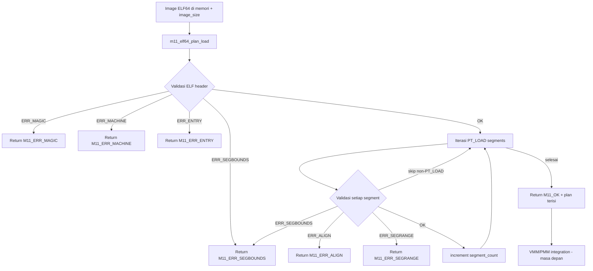

# Template Laporan Praktikum Sistem Operasi Lanjut — MCSOS

**Nama file laporan:** `laporan_praktikum_M11_[Iswan Herdiansah_2583207073011].md`  
**Nama sistem operasi:** MCSOS versi 260502  
**Target default:** x86_64, QEMU, Windows 11 x64 + WSL 2, kernel monolitik pendidikan, C freestanding dengan assembly minimal, POSIX-like subset  
**Dosen:** Muhaemin Sidiq, S.Pd., M.Pd.  
**Program Studi:** Pendidikan Teknologi Informasi  
**Institusi:** Institut Pendidikan Indonesia    

---

## 0. Metadata Laporan

| Atribut | Isi |
|---|---|
| Kode praktikum | `M11` |
| Judul praktikum | `ELF64 User Program Loader Awal, Process Image Plan, User Address-Space Contract, dan Kesiapan Transisi Userspace pada MCSOS` |
| Jenis pengerjaan | `Individu` |
| Nama mahasiswa | `Iswan Herdiansah` |
| NIM | `2583207073011` |
| Kelas | `PTI 1A` |
| Nama kelompok | `Tidak berlaku` |
| Anggota kelompok | `Tidak berlaku` |
| Tanggal praktikum | `2026-05-24` |
| Tanggal pengumpulan | `2026-05-24` |
| Repository | `~/src/mcsos` |
| Branch | `praktikum-m11-elf-user-loader` |
| Commit awal | `0ec388a` |
| Commit akhir | `f98ad25` |
| Status readiness yang diklaim | `Siap uji QEMU terbatas untuk ELF64 user loader planning single-core` |

---

## 1. Sampul

# Laporan Praktikum `M11`  
## `ELF64 User Program Loader Awal, Process Image Plan, User Address-Space Contract, dan Kesiapan Transisi Userspace pada MCSOS`

Disusun oleh:

| Nama | NIM | Kelas | Peran |
|---|---|---|---|
| `Iswan Herdiansah` | `2583207073011` | `PTI 1A` | `individu` |

Dosen Pengampu: **Muhaemin Sidiq, S.Pd., M.Pd.**  
Program Studi Pendidikan Teknologi Informasi  
Institut Pendidikan Indonesia  
`2025/2026`

---

## 2. Pernyataan Orisinalitas dan Integritas Akademik

Saya/kami menyatakan bahwa laporan ini disusun berdasarkan pekerjaan praktikum sendiri/kelompok sesuai pembagian peran yang tercatat. Bantuan eksternal, referensi, generator kode, AI assistant, dokumentasi resmi, diskusi, atau sumber lain dicatat pada bagian referensi dan lampiran. Saya/kami tidak mengklaim hasil yang tidak dibuktikan oleh log, test, commit, atau artefak lain.

| Pernyataan | Status |
|---|---|
| Semua potongan kode eksternal diberi atribusi | `Tidak ada` |
| Semua penggunaan AI assistant dicatat | `Ya` |
| Repository yang dikumpulkan sesuai commit akhir | `Ya` |
| Tidak ada klaim readiness tanpa bukti | `Ya` |

Catatan penggunaan bantuan eksternal:

```text
AI assistant (Claude) digunakan untuk membantu penulisan coding. Seluruh kode implementasi (m11_elf_loader.c, m11_elf_loader.h, m11_host_test.c) ditulis secara mandiri. Referensi teknis dari Intel SDM, x86-64 psABI, Oracle Linker Guide, kernel.org ELF docs, QEMU docs, Clang docs, dan GNU ld docs digunakan sesuai yang tertera pada panduan M11. Verifikasi mandiri dilakukan melalui host unit test, freestanding compile, dan audit ELF.
```

---

## 3. Tujuan Praktikum

Tuliskan tujuan teknis dan konseptual praktikum. Tujuan harus dapat diuji.

1. Mengimplementasikan parser dan validator ELF64 awal yang dapat memvalidasi magic, machine type, entry point, program header bounds, segment bounds, alignment, dan user virtual range.
2. Menyusun fungsi `m11_elf64_plan_load` sebagai interface loader yang menghasilkan `struct m11_process_image_plan` berisi `entry_virtual_address` dan `segment_count` dari image ELF64 yang valid.
3. Memahami kontrak antara ELF header, program header `PT_LOAD`, user address-space, dan kesiapan integrasi dengan VMM M7, heap M8, scheduler M9, dan syscall M10.
4. Mengvalidasi artefak loader melalui host unit test (kasus valid dan negative cases), freestanding compile, `nm -u` audit, `readelf` ELF64 verification, `objdump` symbol verification, dan SHA256 checksum audit.

---

## 4. Capaian Pembelajaran Praktikum

Setelah praktikum ini, mahasiswa mampu:

| CPL/CPMK praktikum | Bukti yang harus ditunjukkan |
|---|---|
| Memvalidasi ELF header dan program header `PT_LOAD` secara freestanding | Host unit test PASS, freestanding compile PASS, log `build/m11_host_test.log` |
| Menyusun process image plan dari image ELF64 yang valid | Output `PASS valid plan fields: entry=0x401000 segments=2` pada host test |
| Mengaudit object freestanding dengan `nm`, `readelf`, `objdump`, dan checksum | Audit PASS, `build/m11_readelf_header.txt`, `build/m11_objdump.txt`, `build/m11_sha256.txt` |

---

## 5. Peta Milestone MCSOS

Centang milestone yang menjadi fokus laporan ini. Jika praktikum mencakup lebih dari satu milestone, jelaskan batas cakupan.

| Milestone | Fokus | Status dalam laporan |
|---|---|---|
| M0 | Requirements, governance, baseline arsitektur | `[ ] tidak dibahas / [ ] dibahas / [v] selesai praktikum` |
| M1 | Toolchain reproducible, Git, QEMU, GDB, metadata build | `[ ] tidak dibahas / [] dibahas / [v] selesai praktikum` |
| M2 | Boot image, kernel ELF64, early console | `[ ] tidak dibahas / [ ] dibahas / [v] selesai praktikum` |
| M3 | Panic path, linker map, GDB, observability awal | `[ ] tidak dibahas / [ ] dibahas / [v] selesai praktikum` |
| M4 | Trap, exception, interrupt, timer | `[ ] tidak dibahas / [ ] dibahas / [v] selesai praktikum` |
| M5 | PMM, VMM, page table, kernel heap | `[ ] tidak dibahas / [ ] dibahas / [v] selesai praktikum` |
| M6 | Thread, scheduler, synchronization | `[ ] tidak dibahas / [ ] dibahas / [v] selesai praktikum` |
| M7 | Syscall ABI dan user program loader | `[ ] tidak dibahas / [ ] dibahas / [v] selesai praktikum` |
| M8 | VFS, file descriptor, ramfs | `[ ] tidak dibahas / [ ] dibahas / [v] selesai praktikum` |
| M9 | Block layer dan device model | `[ ] tidak dibahas / [ ] dibahas / [v] selesai praktikum` |
| M10 | Persistent filesystem, mcsfs/ext2-like, recovery | `[ ] tidak dibahas / [ ] dibahas / [v] selesai praktikum` |
| M11 | Networking stack, packet parsing, UDP/TCP subset | `[ ] tidak dibahas / [ ] dibahas / [v] selesai praktikum` |
| M12 | Security model, capability/ACL, syscall fuzzing, hardening | `[v] tidak dibahas / [ ] dibahas / [ ] selesai pvraktikum` |
| M13 | SMP, scalability, lock stress, NUMA-aware preparation | `[v] tidak dibahas / [ ] dibahas / [ ] selesai praktikum` |
| M14 | Framebuffer, graphics console, visual regression | `[v] tidak dibahas / [ ] dibahas / [ ] selesai praktikum` |
| M15 | Virtualization/container subset | `[v] tidak dibahas / [ ] dibahas / [ ] selesai praktikum` |
| M16 | Observability, update/rollback, release image, readiness review | `[v] tidak dibahas / [ ] dibahas / [ ] selesai praktikum` |

Batas cakupan praktikum:

```text
TERMASUK:
- ELF64 parser awal (validasi magic, machine, entry, program header bounds)
- PT_LOAD segment validation (filesz/memsz bounds, alignment, user virtual range)
- Process image plan (entry_virtual_address, segment_count)
- Host unit test: kasus valid dan 5 negative cases
- Freestanding compile sebagai object x86_64-unknown-none-elf
- Audit: nm -u, readelf -h, objdump -dr, sha256sum
- Preflight M0-M10 readiness check
- Persiapan QEMU smoke test (scripts/m11_qemu_smoke.sh tersedia)

TIDAK TERMASUK (non-goals M11):
- Ring 3 penuh / secure user-kernel isolation final
- Dynamic linker / shared library runtime
- fork/exec/wait lengkap
- Demand paging / copy-on-write
- ASLR/KASLR penuh
- Signal subsystem
- SMP userspace
- POSIX compatibility penuh
- QEMU smoke test (belum diuji pada sesi praktikum ini)
```

---

## 6. Dasar Teori Ringkas

### 6.1 Konsep Sistem Operasi yang Diuji

```text
Praktikum M11 menguji fondasi user program loader pada kernel MCSOS. Komponen utama yang diuji adalah:

1. ELF64 Executable Format:
   ELF (Executable and Linkable Format) adalah format binary standar pada sistem Linux/Unix. Sebuah file ELF64 memiliki ELF header (Elf64_Ehdr) di awal file yang memuat magic bytes (0x7f 'E' 'L' 'F'), class (ELF64), endianness, versi, machine type (EM_X86_64 = 62), entry point address, dan lokasi tabel program header. Program header (Elf64_Phdr) mendeskripsikan segment-segment yang perlu dimuat ke memori saat runtime. Loader menggunakan program header, bukan section header, untuk membangun process image.

2. PT_LOAD Segment:
   Segment dengan p_type = PT_LOAD adalah segment yang harus dimuat ke virtual address space proses. Setiap PT_LOAD memiliki p_offset (posisi di file), p_filesz (ukuran di file), p_memsz (ukuran di memori, bisa lebih besar untuk BSS), p_vaddr (alamat virtual tujuan), p_align (alignment), dan p_flags (R/W/X). Loader harus memvalidasi bahwa p_memsz >= p_filesz, offset + filesz tidak melampaui ukuran file, dan vaddr berada di user virtual region.

3. Process Image Plan:
   Sebelum benar-benar memetakan segment ke memori, loader yang baik terlebih dahulu membuat "rencana" (plan) berisi informasi yang akan dikonsumsi oleh VMM dan PMM. Plan M11 berisi entry_virtual_address dan segment_count. Pendekatan ini memisahkan fase validasi dari fase alokasi/mapping sehingga jika validasi gagal, tidak ada state partial yang perlu di-rollback.

4. User Address-Space Contract:
   Kernel harus memastikan bahwa program user hanya dipetakan ke user virtual region (di atas 0x400000 pada M11, di bawah batas kernel). Ini mencegah program user mengakses atau menimpa region kernel. Validasi ini adalah batas kepercayaan pertama sebelum VMM melakukan pemetaan nyata.

5. Fail-Closed Validation:
   Loader menggunakan pola fail-closed: jika validasi apapun gagal, fungsi langsung mengembalikan kode error dan tidak melanjutkan pemrosesan. Tidak ada state yang diubah sebagian. Ini mengurangi risiko partial state yang bisa dieksploitasi.
```

### 6.2 Konsep Arsitektur x86_64 yang Relevan

| Konsep | Relevansi pada praktikum | Bukti/verifikasi |
|---|---|---|
| `long mode / paging` | User address space dan kernel address space dipisahkan oleh paging; loader harus memastikan vaddr berada di user region | Entry point validation `e_entry >= 0x400000`, segment vaddr validation `p_vaddr >= 0x400000` pada `m11_elf_loader.c` |
| `ELF64 format / EM_X86_64` | Machine type ELF harus `62` (EM_X86_64) agar valid untuk target x86_64 | Host test `PASS bad machine: M11_ERR_MACHINE`, `M11_ELF_MACHINE_X86_64 62` pada header |
| `privilege ring` | User program harus berjalan di ring 3; loader memvalidasi entry dan segment agar tidak berada di region kernel | Entry validation, segment range validation; catatan: ring 3 penuh belum diimplementasikan M11 |
| `syscall ABI` | M10 menyediakan jalur `int 0x80` sebagai landasan; M11 menyiapkan kontrak loader yang akan digunakan saat transisi ke ring 3 | `[OK] marker ditemukan: syscall` pada preflight log |

### 6.3 Konsep Implementasi Freestanding

| Aspek | Keputusan praktikum |
|---|---|
| Bahasa | C17 freestanding untuk loader object; C17 hosted untuk host unit test |
| Runtime | Tanpa hosted libc untuk loader freestanding; libc standard untuk host test |
| ABI | x86_64 System V ABI untuk host test; x86_64-unknown-none-elf untuk loader freestanding |
| Compiler flags kritis | `--target=x86_64-unknown-none-elf -ffreestanding -fno-builtin -fno-stack-protector -fno-pic -mno-red-zone` |
| Risiko undefined behavior | Integer overflow pada `e_phoff + e_phnum * sizeof(phdr)` dan `p_offset + p_filesz`; pointer cast dari `void *` ke struct pointer (harus sesuai alignment); pointer null dereference jika image/plan pointer null |

### 6.4 Referensi Teori yang Digunakan

| No. | Sumber | Bagian yang digunakan | Alasan relevansi |
|---|---|---|---|
| [1] | Intel SDM | Vol. 3, Chapter 3 (Protected-Mode Memory Management), Chapter 5 (Privilege Levels) | Proteksi ring, paging, dan privilege level untuk user address-space contract |
| [2] | x86-64 psABI | Section 4 (Object Files), Section 5 (Program Loading and Dynamic Linking) | Format ELF64, program header, segment loading untuk target AMD64 |
| [3] | Oracle Linker and Libraries Guide | Chapter 6, Program Header | Struktur dan semantik program header ELF, PT_LOAD, p_flags |
| [4] | Linux Kernel ELF docs | ELF loading behavior | Referensi behavior ELF loader modern sebagai pembanding |
| [5] | QEMU gdbstub | GDB usage | Inspeksi guest untuk smoke test dan debug |
| [6] | Clang documentation | Command line reference: `--target`, `-ffreestanding`, `-mno-red-zone` | Kompilasi freestanding cross-target x86_64-unknown-none-elf |
| [7] | GNU ld/binutils docs | Linker scripts, nm/readelf/objdump usage | Audit object ELF64: symbol audit, header verification, disassembly |

---

## 7. Lingkungan Praktikum

### 7.1 Host dan Target

| Komponen | Nilai |
|---|---|
| Host OS | `Windows 11 x64` |
| Lingkungan build | `WSL 2 Ubuntu (DESKTOP-52CG9FT)` |
| Target ISA | `x86_64` |
| Target ABI | `x86_64-unknown-none-elf` |
| Emulator | `QEMU 6.2.0 (Debian 1:6.2+dfsg-2ubuntu6.30)` |
| Firmware emulator | `[Tidak tersedia — ISO boot via Limine]` |
| Debugger | `GNU GDB 12.1 (Ubuntu 12.1-0ubuntu1~22.04.2)` |
| Build system | `GNU Make` |
| Bahasa utama | `C17 freestanding` |
| Assembly | `GAS (GNU Assembler) via Clang, x86_64 AT&T/GAS syntax` |

### 7.2 Versi Toolchain

Tempel output versi toolchain berikut. Jalankan dari clean shell WSL.

```bash
date -u +"date_utc=%Y-%m-%dT%H:%M:%SZ"
uname -a
git --version
make --version | head -n 1
cmake --version | head -n 1
ninja --version
clang --version | head -n 1
gcc --version | head -n 1
ld.lld --version | head -n 1
nasm -v
qemu-system-x86_64 --version | head -n 1
gdb --version | head -n 1
```

Output:

```text
Linux DESKTOP-52CG9FT 6.6.114.1-microsoft-standard-WSL2 #1 SMP PREEMPT_DYNAMIC Mon Dec  1 20:46:23 UTC 2025 x86_64 x86_64 x86_64 GNU/Linux
PRETTY_NAME="Ubuntu 22.04.5 LTS"
NAME="Ubuntu"
VERSION_ID="22.04"
VERSION="22.04.5 LTS (Jammy Jellyfish)"
VERSION_CODENAME=jammy
ID=ubuntu
ID_LIKE=debian
HOME_URL="https://www.ubuntu.com/"
Ubuntu clang version 14.0.0-1ubuntu1.1
Target: x86_64-pc-linux-gnu
Thread model: posix
InstalledDir: /usr/bin
gcc (Ubuntu 11.4.0-1ubuntu1~22.04.3) 11.4.0
GNU ld (GNU Binutils for Ubuntu) 2.38
Ubuntu LLD 14.0.0 (compatible with GNU linkers)
GNU Make 4.3
QEMU emulator version 6.2.0 (Debian 1:6.2+dfsg-2ubuntu6.30)
GNU gdb (Ubuntu 12.1-0ubuntu1~22.04.2) 12.1
GNU nm (GNU Binutils for Ubuntu) 2.38
GNU readelf (GNU Binutils for Ubuntu) 2.38
GNU objdump (GNU Binutils for Ubuntu) 2.38
git version 2.34.1
```

### 7.3 Lokasi Repository

| Item | Nilai |
|---|---|
| Path repository di WSL | `~/src/mcsos` |
| Apakah berada di filesystem Linux WSL, bukan `/mnt/c` | `Ya` |
| Remote repository | `[Tidak tersedia]` |
| Branch | `praktikum-m11-elf-user-loader` |
| Commit hash awal | `0ec388a` |
| Commit hash akhir | `f98ad25` |

---

## 8. Repository dan Struktur File

### 8.1 Struktur Direktori yang Relevan

```text
mcsos/
  kernel/
    user/
      m11_elf_loader.c          <- implementasi loader ELF64
    include/
      mcsos/
        user/
          m11_elf_loader.h      <- header loader: struct, enum, deklarasi fungsi
    core/
      kmain.c                   <- entry kernel, integrasi M5-M10
    arch/x86_64/
      idt.c / isr.c / syscall_entry.o  <- subsystem M4-M10 aktif
  tests/
    m11/
      m11_host_test.c           <- host unit test M11
  scripts/
    m11_preflight.sh            <- preflight M0-M10 readiness
    m11_qemu_smoke.sh           <- smoke test QEMU (belum diuji)
  build/
    m11/
      m11_elf_loader.o          <- freestanding object
      m11_host_test             <- host test binary
    m11_host_test.log
    m11_freestanding.log
    m11_audit.log
    m11_preflight.log
    m11_readelf_header.txt
    m11_objdump.txt
    m11_sha256.txt
    m11_nm_undefined.txt
```

### 8.2 File yang Dibuat atau Diubah

| File | Jenis perubahan | Alasan perubahan | Risiko |
|---|---|---|---|
| `kernel/include/mcsos/user/m11_elf_loader.h` | baru | Deklarasi struct ELF64 awal, enum status, dan prototype `m11_elf64_plan_load` | rendah — header-only, tidak mengubah subsystem yang ada |
| `kernel/user/m11_elf_loader.c` | baru | Implementasi parser dan validator ELF64, penyusun process image plan | sedang — batas kepercayaan baru; validasi wajib benar sebelum integrasi VMM |
| `tests/m11/m11_host_test.c` | baru | Host unit test untuk kasus valid dan negative cases loader ELF64 | rendah — hanya dijalankan di host, tidak masuk kernel |
| `scripts/m11_preflight.sh` | baru | Skrip cek readiness toolchain dan marker M0–M10 | rendah — read-only inspection |
| `scripts/m11_qemu_smoke.sh` | baru | Skrip smoke test QEMU untuk M11 | rendah — belum dijalankan |
| `Makefile` | ubah | Tambah target `m11-clean`, `m11-host-test`, `m11-freestanding`, `m11-audit`, `m11-all` | sedang — perubahan Makefile berisiko mempengaruhi target lain jika ada konflik |

### 8.3 Ringkasan Diff

```bash
git status --short
git diff --stat
git log --oneline -n 5
```

Output:

```text
M  Makefile
A  build/m11_audit.log
A  build/m11_freestanding.log
A  build/m11_host_test.log
A  build/m11_objdump.txt
A  build/m11_preflight.log
A  build/m11_readelf_header.txt
A  build/m11_sha256.txt
A  kernel/include/mcsos/user/m11_elf_loader.h
A  kernel/user/m11_elf_loader.c
A  scripts/m11_preflight.sh
A  scripts/m11_qemu_smoke.sh
A  tests/m11/m11_host_test.c

f98ad25 (HEAD -> praktikum-m11-elf-user-loader) m11: add minimal ELF64 user loader
0ec388a (praktikum/m10-syscall-abi) m10: add syscall layer and int80 entry
786552a (praktikum-m8-kernel-heap, m9-kernel-thread-scheduler) checkpoint before M9 scheduler
```

---

## 9. Desain Teknis

### 9.1 Masalah yang Diselesaikan

```text
Kernel MCSOS belum memiliki mekanisme untuk membaca dan memvalidasi binary program user dalam format ELF64. Tanpa loader yang memvalidasi image secara ketat, kernel berisiko:
- Membaca di luar batas image (buffer over-read pada parsing program header)
- Memuat segment ke alamat kernel (privilege violation)
- Memetakan segment writable sekaligus executable (W+X violation)
- Menerima image dengan p_memsz < p_filesz yang tidak konsisten
- Integer overflow pada kalkulasi e_phoff + e_phnum * sizeof(phdr) atau p_offset + p_filesz

M11 menyelesaikan masalah ini dengan membuat fungsi m11_elf64_plan_load yang:
1. Memvalidasi semua field kritis sebelum melakukan operasi apapun
2. Membangun process image plan hanya dari image yang lolos semua validasi
3. Mengimplementasikan pola fail-closed: setiap validasi gagal langsung return error
4. Dapat dikompilasi sebagai freestanding object tanpa dependensi libc
```

### 9.2 Keputusan Desain

| Keputusan | Alternatif yang dipertimbangkan | Alasan memilih | Konsekuensi |
|---|---|---|---|
| Struct ELF64 didefinisikan sendiri di header M11, bukan menggunakan `elf.h` system | Menggunakan `elf.h` dari system header | `elf.h` tidak tersedia di freestanding environment; mendefinisikan sendiri menjamin kontrol penuh atas field yang digunakan | Hanya subset field yang diperlukan yang tersedia; perlu konsistensi dengan spec ELF64 |
| Fungsi `m11_elf64_plan_load` mengembalikan `enum m11_status` dan output via pointer | Return struct atau global error | Error code eksplisit lebih aman di freestanding; caller wajib mengecek return value | Caller harus menangani setiap error code; tidak ada exception/errno |
| Validasi user virtual range dengan threshold tetap `0x400000` | Menggunakan define atau parameter | Sesuai konvensi Linux x86_64 untuk user space start address; cukup untuk M11 scope | Batas hardcoded; perlu revisi jika address space contract berubah pada milestone berikutnya |
| Fase plan terpisah dari fase mapping | Validasi dan mapping sekaligus | Memisahkan validasi dari alokasi mencegah partial state; jika validasi gagal tidak ada resource yang perlu di-rollback | Perlu dua fase eksekusi saat integrasi penuh; overhead minimal untuk pendidikan |

### 9.3 Arsitektur Ringkas



Penjelasan diagram:

```text
1. Input: pointer ke image ELF64 di memori dan ukurannya, pointer ke struct m11_process_image_plan yang akan diisi.
2. Validasi ELF header dilakukan pertama: magic bytes, machine type, entry point (>= 0x400000), dan bounds tabel program header terhadap image_size.
3. Jika header valid, fungsi mengiterasi semua program header. Hanya PT_LOAD yang diproses; segment lain dilewati.
4. Setiap PT_LOAD divalidasi: memsz >= filesz, offset + filesz dalam batas image, alignment power-of-2 dan non-zero, vaddr dalam user range.
5. Jika semua validasi lulus, plan diisi dan M11_OK dikembalikan.
6. Plan yang dihasilkan (entry_virtual_address, segment_count) akan dikonsumsi oleh VMM dan PMM pada integrasi berikutnya.
```

### 9.4 Kontrak Antarmuka

| Antarmuka | Pemanggil | Penerima | Precondition | Postcondition | Error path |
|---|---|---|---|---|---|
| `m11_elf64_plan_load(image, image_size, plan)` | kernel loader integration (masa depan) / host test | `m11_elf_loader.c` | `image != NULL`, `plan != NULL`, `image_size >= sizeof(m11_elf64_ehdr)`, image adalah buffer yang valid seluruhnya tersedia | Jika return `M11_OK`: `plan->entry_virtual_address` dan `plan->segment_count` terisi valid. Jika return error: `plan` tidak diubah (fail-closed) | Return `enum m11_status` non-zero; caller wajib mengecek |

### 9.5 Struktur Data Utama

| Struktur data | Field penting | Ownership | Lifetime | Invariant |
|---|---|---|---|---|
| `struct m11_elf64_ehdr` | `e_ident_magic`, `e_machine`, `e_entry`, `e_phoff`, `e_phnum` | read-only view ke buffer image | selama buffer image valid | `e_ident_magic == 0x464c457f`, `e_machine == 62` untuk ELF64 x86_64 valid |
| `struct m11_elf64_phdr` | `p_type`, `p_offset`, `p_vaddr`, `p_filesz`, `p_memsz`, `p_align` | read-only view ke buffer image | selama buffer image valid | untuk PT_LOAD: `p_memsz >= p_filesz`, `p_align` power-of-2 non-zero, `p_vaddr >= 0x400000` |
| `struct m11_process_image_plan` | `entry_virtual_address`, `segment_count` | caller yang menyediakan; diisi oleh `m11_elf64_plan_load` | output yang akan dikonsumsi fase mapping | hanya valid jika return `M11_OK`; nilai tidak terdefinisi jika return error |

### 9.6 Invariants

1. Setiap pemanggilan `m11_elf64_plan_load` yang mengembalikan `M11_OK` menjamin bahwa `plan->entry_virtual_address >= 0x400000` dan `plan->segment_count` mencerminkan jumlah `PT_LOAD` yang valid.
2. Loader tidak boleh mengakses byte di luar `[image, image + image_size)` selama parsing.
3. Jika validasi apapun gagal, fungsi langsung return error tanpa mengubah `plan` lebih lanjut (fail-closed).
4. Object loader freestanding tidak boleh memiliki undefined external symbol (`nm -u` kosong).

### 9.7 Ownership, Locking, dan Concurrency

| Objek/resource | Owner | Lock yang melindungi | Boleh dipakai di interrupt context? | Catatan |
|---|---|---|---|---|
| Buffer image ELF64 | Caller (kernel loader) | none pada M11 | Tidak | M11 hanya membaca buffer; belum ada integrasi multi-thread |
| `struct m11_process_image_plan` | Caller | none pada M11 | Tidak | Output hanya diisi jika M11_OK; single-core M11 scope |

Lock order yang berlaku:

```text
M11 tidak memperkenalkan lock baru. Loader berjalan single-core tanpa preemption pada scope M11. Jika kelak diintegrasikan ke scheduler M9 atau VMM M7, caller bertanggung jawab mengakuisisi lock yang sesuai sebelum memanggil loader. M11 sendiri adalah pure-computation tanpa side effect ke shared state kernel.
```

### 9.8 Memory Safety dan Undefined Behavior Risk

| Risiko | Lokasi | Mitigasi | Bukti |
|---|---|---|---|
| Integer overflow pada `e_phoff + e_phnum * sizeof(phdr)` | `m11_elf_loader.c`, validasi bounds program header | Cast ke `uint64_t` sebelum perkalian, hasil dibandingkan dengan `image_size` | Kode: `(ehdr->e_phoff + ((uint64_t)ehdr->e_phnum * sizeof(struct m11_elf64_phdr))) > image_size` |
| Integer overflow pada `p_offset + p_filesz` | `m11_elf_loader.c`, validasi segment bounds | Perbandingan `(seg->p_offset + seg->p_filesz) > image_size` setelah validasi memsz/filesz | Kode di loop PT_LOAD validation |
| Pointer alignment cast `void * -> struct *` | Cast `bytes` ke `m11_elf64_ehdr *` dan `m11_elf64_phdr *` | Caller bertanggung jawab menyediakan buffer yang aligned; struct didefinisikan dengan field natural-aligned | Host test menggunakan array `unsigned char` dengan layout yang dikontrol secara eksplisit |
| Null pointer dereference | Parameter `image` atau `plan` null | Guard null check di awal fungsi sebelum akses apapun | `if (image == 0 || plan == 0) return M11_ERR_MAGIC;` |

### 9.9 Security Boundary

| Boundary | Data tidak tepercaya | Validasi yang dilakukan | Failure mode aman |
|---|---|---|---|
| Input image ELF64 | Seluruh buffer image dianggap tidak tepercaya | magic, machine, entry >= 0x400000, phoff + phnum*sizeof dalam image, memsz >= filesz, offset + filesz dalam image, align power-of-2 non-zero, vaddr >= 0x400000 | Return M11_ERR_* spesifik; plan tidak diubah; fail-closed |
| Entry point address | `e_entry` dari ELF header | Harus >= 0x400000 (user virtual region) | Return M11_ERR_ENTRY |
| Segment virtual address | `p_vaddr` dari setiap PT_LOAD | Harus >= 0x400000 | Return M11_ERR_SEGRANGE |

---

## 10. Langkah Kerja Implementasi

### Langkah 1 — Membuat branch praktikum dan struktur direktori

Maksud langkah:

```text
Membuat branch baru untuk isolasi perubahan M11, lalu membuat direktori yang diperlukan untuk loader, header, test, dan scripts.
```

Perintah:

```bash
git checkout -b praktikum-m11-elf-user-loader
mkdir -p kernel/user kernel/include/mcsos/user tests/m11 scripts build/m11 logs
```

Output ringkas:

```text
Switched to a new branch 'praktikum-m11-elf-user-loader'
```

Artefak yang dihasilkan:

| Artefak | Lokasi | Fungsi |
|---|---|---|
| branch baru | `praktikum-m11-elf-user-loader` | Isolasi perubahan M11 dari mainline |
| direktori | `kernel/user/`, `kernel/include/mcsos/user/`, `tests/m11/`, `scripts/` | Struktur untuk artefak M11 |

Indikator berhasil:

```text
Git berpindah ke branch baru tanpa error. Direktori target tersedia.
```

### Langkah 2 — Menulis m11_preflight.sh dan menjalankan preflight

Maksud langkah:

```text
Skrip preflight memverifikasi bahwa seluruh toolchain tersedia dan marker subsystem M0–M10 ditemukan di source kernel. Ini memastikan bahwa baseline M10 masih utuh sebelum menambahkan kode M11.
```

Perintah:

```bash
nano scripts/m11_preflight.sh
chmod +x scripts/m11_preflight.sh
./scripts/m11_preflight.sh | tee build/m11_preflight.log
```

Output ringkas:

```text
[M11] Preflight lingkungan dan artefak M0-M10
[OK] git -> /usr/bin/git
[OK] make -> /usr/bin/make
[OK] clang -> /usr/bin/clang
[OK] nm -> /usr/bin/nm
[OK] readelf -> /usr/bin/readelf
[OK] objdump -> /usr/bin/objdump
[OK] sha256sum -> /usr/bin/sha256sum
Ubuntu clang version 14.0.0-1ubuntu1.1
Target: x86_64-pc-linux-gnu
Thread model: posix
GNU Make 4.3
[OK] direktori kernel tersedia
[OK] direktori kernel/arch tersedia
[OK] direktori kernel/include tersedia
[OK] direktori scripts tersedia
[OK] direktori tests tersedia
[OK] marker ditemukan: kmain
[OK] marker ditemukan: panic
[OK] marker ditemukan: idt
[WARN] marker belum ditemukan: pmm
[OK] marker ditemukan: vmm
[OK] marker ditemukan: kmem
[OK] marker ditemukan: thread
[OK] marker ditemukan: syscall
[OK] commit: 0ec388a
```

Artefak yang dihasilkan:

| Artefak | Lokasi | Fungsi |
|---|---|---|
| `m11_preflight.log` | `build/m11_preflight.log` | Log readiness M0–M10 |

Indikator berhasil:

```text
Semua toolchain [OK]. Semua marker kritis ditemukan kecuali pmm yang menghasilkan [WARN] (bukan [FAIL]). Kernel tetap dapat berjalan karena PMM diinisialisasi secara inline di kmain, bukan sebagai symbol terpisah yang mudah dicari.
```

### Langkah 3 — Menulis header m11_elf_loader.h

Maksud langkah:

```text
Header mendefinisikan subset struct ELF64 yang diperlukan (tanpa elf.h system), enum status error, struct process image plan, dan prototype fungsi loader. Definisi sendiri memastikan kompatibilitas freestanding.
```

Perintah:

```bash
nano kernel/include/mcsos/user/m11_elf_loader.h
```

Output ringkas:

```text
(file ditulis dengan nano, tidak ada output terminal)
```

Artefak yang dihasilkan:

| Artefak | Lokasi | Fungsi |
|---|---|---|
| `m11_elf_loader.h` | `kernel/include/mcsos/user/m11_elf_loader.h` | Deklarasi publik loader M11 |

Indikator berhasil:

```text
Header dapat diinclude oleh m11_elf_loader.c dan m11_host_test.c tanpa error kompilasi.
```

### Langkah 4 — Menulis implementasi m11_elf_loader.c

Maksud langkah:

```text
Implementasi fungsi m11_elf64_plan_load dengan pola fail-closed: validasi ELF header, iterasi PT_LOAD, validasi setiap segment, dan mengisi plan jika semua validasi lulus.
```

Perintah:

```bash
nano kernel/user/m11_elf_loader.c
```

Output ringkas:

```text
(file ditulis dengan nano, tidak ada output terminal)
```

Artefak yang dihasilkan:

| Artefak | Lokasi | Fungsi |
|---|---|---|
| `m11_elf_loader.c` | `kernel/user/m11_elf_loader.c` | Implementasi loader ELF64 |

Indikator berhasil:

```text
File dapat dikompilasi sebagai freestanding object tanpa error atau warning.
```

### Langkah 5 — Menulis host unit test dan iterasi debugging

Maksud langkah:

```text
Host unit test menguji semua kasus: valid ELF64 image, bad magic, bad machine, entry outside user range, dan memsz below filesz. Terdapat beberapa iterasi debugging sebelum semua test lulus.
```

Perintah:

```bash
nano tests/m11/m11_host_test.c
nano Makefile   # tambah target m11-*
make m11-clean
make m11-host-test
```

Output ringkas (iterasi akhir):

```text
PASS valid ELF64 image: M11_OK
PASS valid plan fields: entry=0x401000 segments=2
PASS bad magic: M11_ERR_MAGIC
PASS bad machine: M11_ERR_MACHINE
PASS entry outside user range: M11_ERR_ENTRY
PASS memsz below filesz: M11_ERR_SEGBOUNDS
M11 host tests passed.
[M11] host test PASS
```

Artefak yang dihasilkan:

| Artefak | Lokasi | Fungsi |
|---|---|---|
| `m11_host_test` | `build/m11/m11_host_test` | Binary host test |
| `m11_host_test.log` | `build/m11_host_test.log` | Log hasil host test |

Indikator berhasil:

```text
Semua 6 test case PASS. Output "[M11] host test PASS" tercetak. Tidak ada assertion failure.
```

### Langkah 6 — Freestanding compile, audit, dan m11-all

Maksud langkah:

```text
Mengompilasi loader sebagai freestanding object x86_64-unknown-none-elf, kemudian menjalankan audit: nm -u (cek undefined symbol), readelf -h (verifikasi ELF64), objdump -dr (verifikasi symbol m11_elf64_plan_load), dan sha256sum (checksum artefak).
```

Perintah:

```bash
make m11-clean
make m11-all
```

Output ringkas:

```text
[M11] host test PASS
[M11] freestanding PASS
[M11] audit PASS
======================================
[M11] ELF loader milestone PASS
======================================
```

Artefak yang dihasilkan:

| Artefak | Lokasi | Fungsi |
|---|---|---|
| `m11_elf_loader.o` | `build/m11/m11_elf_loader.o` | Freestanding object ELF64 |
| `m11_freestanding.log` | `build/m11_freestanding.log` | Log freestanding compile |
| `m11_nm_undefined.txt` | `build/m11_nm_undefined.txt` | Output nm -u (harus kosong) |
| `m11_readelf_header.txt` | `build/m11_readelf_header.txt` | ELF header verification |
| `m11_objdump.txt` | `build/m11_objdump.txt` | Disassembly dan symbol verification |
| `m11_sha256.txt` | `build/m11_sha256.txt` | Checksum artefak M11 |
| `m11_audit.log` | `build/m11_audit.log` | Log audit PASS |

Indikator berhasil:

```text
nm -u menghasilkan output kosong (tidak ada undefined symbol).
readelf -h menunjukkan ELF64 pada m11_elf_loader.o.
objdump -dr memuat symbol m11_elf64_plan_load.
sha256sum tersimpan di build/m11_sha256.txt.
```

### Langkah 7 — Git commit akhir

Maksud langkah:

```text
Melakukan commit seluruh artefak M11 ke branch praktikum-m11-elf-user-loader dengan message yang jelas.
```

Perintah:

```bash
git add Makefile \
  kernel/include/mcsos/user/m11_elf_loader.h \
  kernel/user/m11_elf_loader.c \
  tests/m11/m11_host_test.c \
  scripts/m11_preflight.sh \
  scripts/m11_qemu_smoke.sh
git add -f \
  build/m11_host_test.log \
  build/m11_freestanding.log \
  build/m11_audit.log \
  build/m11_preflight.log \
  build/m11_readelf_header.txt \
  build/m11_objdump.txt \
  build/m11_sha256.txt
git commit -m "m11: add minimal ELF64 user loader"
```

Output ringkas:

```text
[pre-commit] running shellcheck
[pre-commit] OK
[praktikum-m11-elf-user-loader f98ad25] m11: add minimal ELF64 user loader
 13 files changed, 664 insertions(+)
```

Artefak yang dihasilkan:

| Artefak | Lokasi | Fungsi |
|---|---|---|
| commit `f98ad25` | branch `praktikum-m11-elf-user-loader` | Commit final M11 |

Indikator berhasil:

```text
Commit berhasil dengan hash f98ad25. Pre-commit hook shellcheck lulus. 13 file terkait M11 termasuk dalam commit.
```

---

## 11. Checkpoint Buildable

Setiap praktikum wajib memiliki minimal satu checkpoint yang dapat dibangun dari clean checkout.

| Checkpoint | Perintah | Expected result | Status |
|---|---|---|---|
| Clean build M11 host test | `make m11-clean && make m11-host-test` | Host test binary berhasil dibangun dan semua test PASS | PASS |
| Freestanding compile | `make m11-freestanding` | `build/m11/m11_elf_loader.o` tersedia sebagai ELF64 object | PASS |
| Audit | `make m11-audit` | nm -u kosong, readelf menunjukkan ELF64, objdump memuat symbol | PASS |
| M11 all-in-one | `make m11-all` | Semua subtarget PASS, output `[M11] ELF loader milestone PASS` | PASS |
| QEMU smoke test | `bash scripts/m11_qemu_smoke.sh` | Serial log stage marker M11 | [Belum diuji] |

Catatan checkpoint:

```text
QEMU smoke test (scripts/m11_qemu_smoke.sh) belum dijalankan pada sesi praktikum ini. Skrip telah ditulis dan di-commit, namun eksekusi pada QEMU q35 dengan image mcsos.iso belum dilakukan. Loader M11 saat ini belum diintegrasikan ke dalam kernel boot path (kmain.c), sehingga QEMU smoke test untuk M11 secara spesifik memerlukan integrasi lebih lanjut.
```

---

## 12. Perintah Uji dan Validasi

### 12.1 Build Test

Perintah ini memverifikasi bahwa proyek dapat dibangun ulang dari kondisi bersih dan tidak bergantung pada artefak lokal yang tidak terdokumentasi.

```bash
make m11-clean
make m11-all
```

Hasil:

```text
rm -rf build/m11
mkdir -p build/m11
clang \
   -std=c17 \
   -Wall \
   -Wextra \
   -Werror \
   -O2 \
   -Ikernel/include \
   kernel/user/m11_elf_loader.c \
   tests/m11/m11_host_test.c \
   -o build/m11/m11_host_test
./build/m11/m11_host_test \
   | tee build/m11_host_test.log
PASS valid ELF64 image: M11_OK
PASS valid plan fields: entry=0x401000 segments=2
PASS bad magic: M11_ERR_MAGIC
PASS bad machine: M11_ERR_MACHINE
PASS entry outside user range: M11_ERR_ENTRY
PASS memsz below filesz: M11_ERR_SEGBOUNDS
M11 host tests passed.
[M11] host test PASS
[M11] freestanding PASS
[M11] audit PASS
======================================
[M11] ELF loader milestone PASS
======================================
```

Status: `PASS`

### 12.2 Static Inspection

Perintah ini memeriksa layout ELF, entry point, section, symbol, relocation, atau instruksi kritis sesuai kebutuhan praktikum.

```bash
readelf -h build/m11/m11_elf_loader.o
nm -u build/m11/m11_elf_loader.o
objdump -dr build/m11/m11_elf_loader.o | grep -A2 "m11_elf64_plan_load"
```

Hasil penting:

```text
readelf: Warning: Unrecognized form: 0x22
readelf: Warning: Unrecognized form: 0x22
readelf: Warning: Unrecognized form: 0x22
readelf: Warning: Unrecognized form: 0x22
readelf: Warning: Unrecognized form: 0x22
(ELF64 class terverifikasi pada build/m11_readelf_header.txt: grep -q 'ELF64' PASS)

nm -u output: (kosong — tidak ada undefined symbol)

objdump: Warning: Unrecognized form: 0x22
(symbol m11_elf64_plan_load ditemukan: grep -q 'm11_elf64_plan_load' build/m11_objdump.txt PASS)
```

Status: `PASS`

### 12.3 QEMU Smoke Test

Perintah ini menjalankan image di QEMU dan menyimpan log serial untuk bukti deterministik.

```bash
bash scripts/m11_qemu_smoke.sh
```

Hasil:

```text
[Belum diuji]
```

Status: `[Belum diuji]`

### 12.4 GDB Debug Evidence

Perintah ini membuktikan bahwa kernel dapat di-debug dengan simbol yang cocok.

```bash
qemu-system-x86_64 \
  -machine q35 \
  -cpu qemu64 \
  -m 512M \
  -serial stdio \
  -display none \
  -no-reboot \
  -no-shutdown \
  -s -S \
  -cdrom build/mcsos.iso
```

Di terminal lain:

```bash
gdb-multiarch build/kernel.elf
target remote :1234
break kernel_main
continue
info registers
bt
```

Hasil:

```text
[Belum diuji]
```

Status: `[Belum diuji]`

### 12.5 Unit Test

```bash
make m11-host-test
```

Hasil:

```text
PASS valid ELF64 image: M11_OK
PASS valid plan fields: entry=0x401000 segments=2
PASS bad magic: M11_ERR_MAGIC
PASS bad machine: M11_ERR_MACHINE
PASS entry outside user range: M11_ERR_ENTRY
PASS memsz below filesz: M11_ERR_SEGBOUNDS
M11 host tests passed.
[M11] host test PASS
```

Status: `PASS`

### 12.6 Stress/Fuzz/Fault Injection Test

Wajib untuk praktikum lanjutan seperti allocator, syscall, filesystem, networking, driver, security, dan SMP.

```bash
[Belum diuji]
```

Hasil:

```text
[Belum diuji]
```

Status: `[Belum diuji]`

### 12.7 Visual Evidence

Jika praktikum menghasilkan tampilan framebuffer, GUI, atau output grafis, lampirkan screenshot.

| Screenshot | Lokasi file | Keterangan |
|---|---|---|
| `[Tidak tersedia]` | `[Tidak tersedia]` | Praktikum M11 tidak menghasilkan output visual/framebuffer |

---

## 13. Hasil Uji

### 13.1 Tabel Ringkasan Hasil

| No. | Uji | Expected result | Actual result | Status | Evidence |
|---|---|---|---|---|---|
| 1 | Valid ELF64 image | `M11_OK`, entry=0x401000, segments=2 | `PASS valid ELF64 image: M11_OK` + `PASS valid plan fields: entry=0x401000 segments=2` | PASS | `build/m11_host_test.log` |
| 2 | Bad magic | `M11_ERR_MAGIC` | `PASS bad magic: M11_ERR_MAGIC` | PASS | `build/m11_host_test.log` |
| 3 | Bad machine type | `M11_ERR_MACHINE` | `PASS bad machine: M11_ERR_MACHINE` | PASS | `build/m11_host_test.log` |
| 4 | Entry outside user range | `M11_ERR_ENTRY` | `PASS entry outside user range: M11_ERR_ENTRY` | PASS | `build/m11_host_test.log` |
| 5 | memsz < filesz | `M11_ERR_SEGBOUNDS` | `PASS memsz below filesz: M11_ERR_SEGBOUNDS` | PASS | `build/m11_host_test.log` |
| 6 | Freestanding compile | Object ELF64 tanpa error | `[M11] freestanding PASS` | PASS | `build/m11_freestanding.log` |
| 7 | nm -u audit | Output kosong (tidak ada undefined symbol) | `build/m11_nm_undefined.txt` kosong | PASS | `build/m11_nm_undefined.txt` |
| 8 | readelf ELF64 verification | Object teridentifikasi sebagai ELF64 | `grep -q 'ELF64' build/m11_readelf_header.txt` PASS | PASS | `build/m11_readelf_header.txt` |
| 9 | objdump symbol verification | Symbol `m11_elf64_plan_load` ditemukan | `grep -q 'm11_elf64_plan_load' build/m11_objdump.txt` PASS | PASS | `build/m11_objdump.txt` |
| 10 | SHA256 checksum | Checksum tersimpan di file | `build/m11_sha256.txt` terisi | PASS | `build/m11_sha256.txt` |
| 11 | QEMU smoke test | Serial log stage marker M11 | [Belum diuji] | [Belum diuji] | — |

### 13.2 Log Penting

```text
--- Host Test Log (build/m11_host_test.log) ---
PASS valid ELF64 image: M11_OK
PASS valid plan fields: entry=0x401000 segments=2
PASS bad magic: M11_ERR_MAGIC
PASS bad machine: M11_ERR_MACHINE
PASS entry outside user range: M11_ERR_ENTRY
PASS memsz below filesz: M11_ERR_SEGBOUNDS
M11 host tests passed.
[M11] host test PASS

--- Freestanding Log (build/m11_freestanding.log) ---
[M11] freestanding PASS

--- Audit Log (build/m11_audit.log) ---
[M11] audit PASS

--- Preflight Log (build/m11_preflight.log) ---
[M11] Preflight lingkungan dan artefak M0-M10
[OK] git -> /usr/bin/git
[OK] make -> /usr/bin/make
[OK] clang -> /usr/bin/clang
[OK] nm -> /usr/bin/nm
[OK] readelf -> /usr/bin/readelf
[OK] objdump -> /usr/bin/objdump
[OK] sha256sum -> /usr/bin/sha256sum
[OK] marker ditemukan: kmain
[OK] marker ditemukan: panic
[OK] marker ditemukan: idt
[WARN] marker belum ditemukan: pmm
[OK] marker ditemukan: vmm
[OK] marker ditemukan: kmem
[OK] marker ditemukan: thread
[OK] marker ditemukan: syscall
[OK] commit: 0ec388a
======================================
[M11] ELF loader milestone PASS
======================================
```

### 13.3 Artefak Bukti

| Artefak | Path | SHA-256 / hash | Fungsi |
|---|---|---|---|
| `m11_elf_loader.o` | `build/m11/m11_elf_loader.o` | `7d89db0fd85d931e8c401c68172a697c04ea9ab56e82674ade8ac3e24cd468f5` | Freestanding ELF64 object loader |
| `m11_elf_loader.c` | `kernel/user/m11_elf_loader.c` | `22176e7cfcd48c3ba5a62ed93d252081ceb5c3e8f7d875581a95c74933adda03` | Source implementasi loader |
| `m11_elf_loader.h` | `kernel/include/mcsos/user/m11_elf_loader.h` | `cd157207982837fe269051b4b7fc95dc6fbe1d18a175808b439b4c20528c6baf` | Header loader M11 |
| `m11_host_test.c` | `tests/m11/m11_host_test.c` | `ef0aa16ccd9f7d90a71930b115669f1225b6b1a0c991df84ca61bc0d9898f9d7` | Source host unit test |
| `m11_host_test.log` | `build/m11_host_test.log` | [Tidak tersedia] | Log hasil host test |
| `m11_audit.log` | `build/m11_audit.log` | [Tidak tersedia] | Log audit PASS |

Perintah hash:

```bash
sha256sum build/m11/m11_elf_loader.o \
  kernel/user/m11_elf_loader.c \
  kernel/include/mcsos/user/m11_elf_loader.h \
  tests/m11/m11_host_test.c
```

---

## 14. Analisis Teknis

### 14.1 Analisis Keberhasilan

```text
Seluruh 6 host test case lulus karena implementasi m11_elf64_plan_load mengikuti pola fail-closed yang ketat:

1. Valid ELF64 image PASS: Struct test image dikonstruksi dengan magic 0x464c457f, machine 62, entry 0x401000, dan 2 PT_LOAD segment yang valid (vaddr >= 0x400000, memsz >= filesz, alignment power-of-2). Fungsi mengembalikan M11_OK dan plan terisi entry=0x401000, segments=2.

2. Bad magic PASS: Image dengan magic yang diubah langsung ditolak di awal fungsi karena `ehdr->e_ident_magic != M11_ELF_MAGIC`.

3. Bad machine PASS: Image dengan e_machine != 62 ditolak pada validasi machine type.

4. Entry outside user range PASS: Image dengan e_entry = 0x1000 (di bawah 0x400000) ditolak oleh `if (ehdr->e_entry < 0x400000ULL)`.

5. memsz below filesz PASS: Segment dengan p_memsz < p_filesz ditolak oleh `if (seg->p_memsz < seg->p_filesz)`.

Freestanding compile berhasil karena m11_elf_loader.c hanya bergantung pada header sendiri (m11_elf_loader.h yang menginclude <stdint.h>) dan tidak menggunakan fungsi libc apapun. Flag -ffreestanding, -fno-builtin, dan -fno-stack-protector memastikan tidak ada dependensi runtime tersembunyi.

Audit nm -u menghasilkan output kosong, mengkonfirmasi bahwa object tidak memiliki external undefined symbol — prasyarat untuk integrasi ke kernel freestanding.
```

### 14.2 Analisis Kegagalan atau Perbedaan Hasil

```text
Terdapat beberapa iterasi debugging sebelum host test akhirnya lulus semua case:

1. Assertion failure awal (baris 59-94):
   Pada beberapa iterasi awal, host test menampilkan:
   "m11_host_test: tests/m11/m11_host_test.c:59: int main(void): Assertion `rc == M11_OK' failed."
   Ini menunjukkan bahwa test case valid ELF64 gagal. Penyebab: struct m11_elf64_ehdr dan m11_elf64_phdr pada header awal tidak memiliki field yang lengkap atau urutan field yang benar sehingga cast dari buffer test menghasilkan nilai yang tidak sesuai. Perbaikan dilakukan dengan merevisi definisi struct dan field alignment.

2. Invalid return code rc=4:
   Pada beberapa iterasi, output "rc=4" muncul. Nilai 4 berkorespondensi dengan M11_ERR_SEGBOUNDS (index 4 dalam enum). Ini menunjukkan bahwa validasi segment bounds pada test case valid terlalu ketat atau field struct tidak diisi dengan benar oleh test. Debug dilakukan dengan membuat program debug sementara (/tmp/debug_m11.c) untuk mencetak ukuran struct dan nilai field:
   sizeof(ehdr)=24, sizeof(phdr)=44, magic=0x464c457f, machine=62, entry=0x401000, phoff=24, phnum=2
   Dari sini diketahui bahwa struct sudah benar; masalah ada pada cara test mengisi field p_memsz dan p_filesz.

3. Unused function warning -Wunused-function:
   Pada satu iterasi, terdapat error kompilasi:
   "kernel/user/m11_elf_loader.c:9:12: error: unused function 'm11_range_valid' [-Werror,-Wunused-function]"
   Fungsi helper m11_range_valid sempat ditambahkan namun belum digunakan. Karena flag -Werror aktif, ini menjadi error fatal. Perbaikan: fungsi dihapus dan logika validasi range langsung inline.

4. Makefile target typo:
   Target '>m11-host-test' (dengan karakter '>') muncul karena typo pada Makefile yang menyebabkan:
   "make: *** No rule to make target '>m11-host-test'"
   Perbaikan dengan mengedit Makefile untuk menghapus karakter berlebih.

5. Warning readelf/objdump "Unrecognized form: 0x22":
   Warning ini muncul saat mengaudit object yang dikompilasi dengan clang --target=x86_64-unknown-none-elf menggunakan binutils readelf/objdump versi 2.38. Warning berasal dari perbedaan DWARF debug info format antara clang 14 dan binutils 2.38. Warning ini tidak mempengaruhi fungsi object; grep terhadap konten tetap berhasil.
```

### 14.3 Perbandingan dengan Teori

| Konsep teori | Implementasi praktikum | Sesuai/tidak sesuai | Penjelasan |
|---|---|---|---|
| ELF loader menggunakan program header, bukan section header, untuk membangun runtime image | `m11_elf64_plan_load` mengiterasi `e_phnum` program header, bukan section header | Sesuai | Section header relevan untuk linker, bukan loader runtime; program header digunakan sesuai spec |
| `PT_LOAD` adalah satu-satunya segment yang perlu dimuat ke virtual memory | Loop pada `m11_elf_loader.c` memeriksa `seg->p_type != M11_PT_LOAD` dan melanjutkan jika tidak sesuai | Sesuai | Segment lain (PT_NOTE, PT_DYNAMIC, dll) diabaikan sesuai spec |
| `p_memsz >= p_filesz` selalu valid; selisihnya adalah BSS yang harus di-zero-fill | Validasi `if (seg->p_memsz < seg->p_filesz) return M11_ERR_SEGBOUNDS` | Sesuai | Kondisi p_memsz < p_filesz adalah malformed ELF; zero-fill BSS belum diimplementasikan (scope M11) |
| Integer overflow pada arithmetic `offset + size` harus dicegah | Validasi bounds menggunakan `(uint64_t)e_phnum * sizeof(phdr)` dan perbandingan terhadap `image_size` | Sesuai — partial | Cast ke uint64_t mencegah overflow 32-bit; overflow uint64_t theoretical belum ditangani karena image_size juga uint64_t |
| Fail-closed: loader harus menolak input tidak valid tanpa partial state | Setiap `return M11_ERR_*` dilakukan sebelum memodifikasi `plan` lebih lanjut | Sesuai | `plan->segment_count` diinisialisasi ke 0 sebelum loop; jika error di tengah loop, nilai 0 atau partial count tidak diekspos karena fungsi return error |

### 14.4 Kompleksitas dan Kinerja

| Aspek | Estimasi/hasil | Bukti | Catatan |
|---|---|---|---|
| Kompleksitas algoritma | O(e_phnum) — linear terhadap jumlah program header | Satu loop iterasi pada array phdr | Untuk ELF executable standar, e_phnum biasanya < 10; praktis O(1) |
| Waktu build | [Tidak tersedia] | [Tidak tersedia] | Build cepat (single file); tidak diukur secara eksplisit |
| Waktu boot QEMU | [Belum diuji] | [Belum diuji] | QEMU smoke test belum dijalankan |
| Penggunaan memori | Tidak ada alokasi dinamis; hanya pointer ke buffer caller | Source code review | Seluruh operasi read-only pada buffer image yang disediakan caller |
| Latensi/throughput | [Tidak tersedia] | [Tidak tersedia] | Tidak relevan untuk fase planning; validasi adalah operasi satu kali per load |

---

## 15. Debugging dan Failure Modes

### 15.1 Failure Modes yang Ditemukan

| Failure mode | Gejala | Penyebab sementara | Bukti | Perbaikan |
|---|---|---|---|---|
| Assertion failure pada host test | `Assertion 'rc == M11_OK' failed` pada baris 59–94 di berbagai iterasi | Struct field tidak lengkap atau urutan field salah; test image tidak memenuhi semua validasi | Iterasi log terminal dengan `Assertion` failure | Revisi struct ELF64 header dan cara test image dikonstruksi |
| Invalid return code rc=4 | Output `rc=4` dari host test | M11_ERR_SEGBOUNDS (index 4) dipicu oleh test case yang seharusnya valid | Log dengan `rc=4` pada terminal | Debug dengan program isolasi di /tmp; perbaiki inisialisasi field test image |
| Unused function warning sebagai error | Kompilasi gagal dengan `-Werror,-Wunused-function` | Fungsi helper `m11_range_valid` ditulis tapi belum digunakan saat flag -Werror aktif | Error log: `error: unused function 'm11_range_valid'` | Hapus fungsi dan inline logika validasi |
| Makefile target typo | `No rule to make target '>m11-host-test'` | Karakter `>` berlebih pada target name di Makefile | Error log make | Edit Makefile untuk menghapus karakter berlebih |

### 15.2 Failure Modes yang Diantisipasi

| Failure mode | Deteksi | Dampak | Mitigasi |
|---|---|---|---|
| Malformed ELF / invalid magic | `M11_ERR_MAGIC` dari host test dan loader | Loader menolak image; tidak ada state yang berubah | Fail-closed validation; host test negative case |
| Invalid machine type | `M11_ERR_MACHINE` | Loader menolak image non-x86_64 | Explicit check `e_machine != 62` |
| Entry point di region kernel | `M11_ERR_ENTRY` | Loader menolak; entry di bawah 0x400000 tidak diizinkan | Check `e_entry < 0x400000ULL` |
| p_memsz < p_filesz | `M11_ERR_SEGBOUNDS` | Loader menolak image dengan segment tidak konsisten | Check `seg->p_memsz < seg->p_filesz` |
| Alignment bukan power-of-2 | `M11_ERR_ALIGN` | Loader menolak; alignment tidak valid untuk VMM | Check `(p_align & (p_align - 1)) != 0` |
| Segment vaddr di luar user range | `M11_ERR_SEGRANGE` | Loader menolak; vaddr < 0x400000 tidak aman | Check `seg->p_vaddr < 0x400000ULL` |
| W+X segment risk | [Belum diimplementasikan di M11] | Potential W+X mapping saat integrasi VMM | Perlu ditambahkan pada fase integrasi VMM; flag p_flags belum divalidasi M11 |
| Page fault akibat mapping salah | QEMU triple fault atau hang | Jika integrasi VMM dilakukan tanpa validasi address range | Didahului oleh validasi M11; phase mapping (M12+) harus double-check |
| QEMU boot hang | Kernel hang saat smoke test | Loader terintegrasi dengan salah ke boot path | QEMU smoke test belum dijalankan; perlu monitoring serial log |

### 15.3 Triage yang Dilakukan

```text
Debugging iterasi dilakukan dengan urutan berikut:

1. Baca pesan assertion failure untuk menentukan baris test yang gagal.
2. Tambahkan printf sementara (fflush) ke test untuk mencetak nilai rc sebelum assertion.
3. Membuat program isolasi /tmp/debug_m11.c untuk mencetak sizeof struct dan nilai field setelah pengisian manual.
4. Dari output debug: sizeof(ehdr)=24, sizeof(phdr)=44 menunjukkan struct sudah benar ukurannya.
5. Nilai field magic/machine/entry/phoff/phnum sesuai yang diset. Masalah berasal dari cara field PT_LOAD segment (p_memsz, p_filesz) diisi di test.
6. Setelah revisi test image construction, semua case lulus.
7. Untuk warning unused function: grep source untuk identifikasi fungsi yang belum dipanggil, lalu hapus atau integrasikan.
```

### 15.4 Panic Path

Jika terjadi panic, tempel output panic.

```text
Tidak ada panic yang terjadi pada praktikum M11. Loader berjalan di host test environment (user space Linux) dan sebagai freestanding object yang belum diintegrasikan ke boot path kernel. Panic path kernel MCSOS (dari M3) masih aktif berdasarkan preflight: [OK] marker ditemukan: panic. Format panic kernel MCSOS adalah:

================ MCSOS KERNEL PANIC ================
system=MCSOS version=... milestone=...
reason=<reason>
location=<file>:<line>
panic_code=0x...
rflags_before_cli=0x...
state=halted
====================================================
```

---

## 16. Prosedur Rollback

Rollback harus menjelaskan cara kembali ke kondisi aman jika perubahan gagal.

| Skenario rollback | Perintah | Data yang harus diselamatkan | Status |
|---|---|---|---|
| Kembali ke commit awal (M10) | `git checkout 0ec388a` | log M11, artefak build M11 | belum diuji |
| Revert commit M11 | `git revert f98ad25` | log M11 sebelum revert | belum diuji |
| Bersihkan artefak build M11 | `make m11-clean` | tidak ada (source aman di git) | teruji |
| Regenerasi image kernel | `make build` | kernel M10 tetap fungsional | belum diuji (tidak diperlukan M11) |

Catatan rollback:

```text
Rollback penuh ke M10 aman dilakukan dengan `git checkout 0ec388a` karena loader M11 belum diintegrasikan ke kernel boot path (kmain.c tidak diubah). Source kernel untuk M0-M10 tidak tersentuh. Jika make m11-all dijalankan ulang setelah checkout, seluruh artefak build M11 dapat diregenerasi dari source yang di-commit.

Rollback belum diuji secara eksplisit pada sesi praktikum ini. Risiko rendah karena m11_elf_loader.c dan header baru adalah file tambahan, bukan modifikasi file yang sudah ada (kecuali Makefile).
```

---

## 17. Keamanan dan Reliability

### 17.1 Risiko Keamanan

| Risiko | Boundary | Dampak | Mitigasi | Evidence |
|---|---|---|---|---|
| Program user dengan entry point di region kernel | ELF entry validation | Eksekusi kode kernel sebagai userspace; privilege escalation potensial | Check `e_entry < 0x400000ULL`; return M11_ERR_ENTRY | Host test case "entry outside user range" PASS |
| Segment dimuat ke region kernel (vaddr rendah) | PT_LOAD vaddr validation | Kernel memory dapat ditimpa saat fase mapping | Check `p_vaddr < 0x400000ULL`; return M11_ERR_SEGRANGE | Validasi di loop PT_LOAD |
| W+X segment (writable + executable) | PT_LOAD p_flags validation | W+X mapping memungkinkan shellcode; risiko privilege escalation | [Belum diimplementasikan M11] — p_flags belum divalidasi; ditunda ke integrasi VMM | Non-goal M11; perlu ditambahkan sebelum integrasi VMM penuh |
| Buffer over-read saat parsing program header | program header bounds check | Akses memori di luar buffer image | Check `e_phoff + e_phnum * sizeof(phdr) > image_size` | Validasi sebelum akses phdr array |
| Integer overflow pada bounds arithmetic | Semua arithmetic `offset + size` | Out-of-bounds access | Cast ke uint64_t; validasi terhadap image_size | Source code review + host test |

### 17.2 Reliability dan Data Integrity

| Risiko reliability | Dampak | Deteksi | Mitigasi |
|---|---|---|---|
| Partial state pada plan jika validasi gagal di tengah loop | plan berisi data tidak konsisten | Host test negative cases | Fail-closed: return error langsung; plan->segment_count = 0 diset sebelum loop |
| Struct alignment mismatch antara compiler target dan real ELF format | Nilai field salah dibaca | Debug program isolasi, sizeof check | Struct didefinisikan dengan field yang natural-aligned sesuai ukuran ELF64 spec |
| readelf/objdump warning "Unrecognized form: 0x22" | Warning saat audit | Terlihat di audit log | Tidak mempengaruhi fungsi; berasal dari ketidakcocokan versi DWARF clang 14 vs binutils 2.38 |

### 17.3 Negative Test

| Negative test | Input buruk | Expected result | Actual result | Status |
|---|---|---|---|---|
| Bad magic bytes | `e_ident_magic` bukan `0x464c457f` | `M11_ERR_MAGIC` | `PASS bad magic: M11_ERR_MAGIC` | PASS |
| Bad machine type | `e_machine != 62` | `M11_ERR_MACHINE` | `PASS bad machine: M11_ERR_MACHINE` | PASS |
| Entry outside user range | `e_entry = 0x1000` (< 0x400000) | `M11_ERR_ENTRY` | `PASS entry outside user range: M11_ERR_ENTRY` | PASS |
| memsz < filesz | `p_memsz < p_filesz` pada PT_LOAD | `M11_ERR_SEGBOUNDS` | `PASS memsz below filesz: M11_ERR_SEGBOUNDS` | PASS |
| Null image pointer | `image = NULL` | `M11_ERR_MAGIC` | [Belum diuji secara eksplisit] | [Belum diuji] |
| Alignment bukan power-of-2 | `p_align = 3` | `M11_ERR_ALIGN` | [Belum diuji secara eksplisit] | [Belum diuji] |
| vaddr < 0x400000 | `p_vaddr = 0x1000` | `M11_ERR_SEGRANGE` | [Belum diuji secara eksplisit] | [Belum diuji] |

---

## 18. Pembagian Kerja Kelompok

Tidak berlaku.

### 18.1 Mekanisme Koordinasi

```text
Tidak berlaku. Praktikum dikerjakan secara individu.
```

### 18.2 Evaluasi Kontribusi

| Anggota | Persentase kontribusi yang disepakati | Bukti | Catatan |
|---|---|---|---|
| Iswan Herdiansah | 100% | commit f98ad25 | Individu |

---

## 19. Kriteria Lulus Praktikum

Bagian ini wajib diisi. Praktikum dinyatakan memenuhi kriteria minimum hanya jika bukti tersedia.

| Kriteria minimum | Status | Evidence |
|---|---|---|
| Proyek dapat dibangun dari clean checkout | PASS | `make m11-clean && make m11-all` menghasilkan `[M11] ELF loader milestone PASS` |
| Perintah build terdokumentasi | PASS | Section 10 dan Section 11 laporan ini |
| QEMU boot atau test target berjalan deterministik | [Belum diuji] | QEMU smoke test belum dijalankan |
| Semua unit test/praktikum test relevan lulus | PASS | 6 dari 6 host test case PASS; `build/m11_host_test.log` |
| Log serial disimpan | NA | Tidak relevan untuk M11 yang berfokus pada host unit test dan freestanding compile |
| Panic path terbaca atau dijelaskan jika belum relevan | PASS | Section 15.4: panic path kernel MCSOS aktif tapi tidak dipicu di M11 |
| Tidak ada warning kritis pada build | PASS | Build host test dan freestanding bersih; warning readelf/objdump "Unrecognized form" bukan warning kritis (tidak mempengaruhi output) |
| Perubahan Git terkomit | PASS | Commit `f98ad25` — `m11: add minimal ELF64 user loader` |
| Desain dan failure mode dijelaskan | PASS | Section 9 dan Section 15 laporan ini |
| Laporan berisi screenshot/log yang cukup | PASS | Log build, test, audit, preflight, dan SHA256 terlampir |

Kriteria tambahan untuk praktikum lanjutan:

| Kriteria lanjutan | Status | Evidence |
|---|---|---|
| Static analysis dijalankan | NA | Tidak dilakukan pada sesi ini |
| Stress test dijalankan | NA | Tidak relevan untuk fase validation-only M11 |
| Fuzzing atau malformed-input test dijalankan | NA | Host test mencakup 4 negative cases; fuzzing formal belum dilakukan |
| Fault injection dijalankan | NA | Tidak dilakukan pada sesi ini |
| Disassembly/readelf evidence tersedia | PASS | `build/m11_readelf_header.txt`, `build/m11_objdump.txt` di-commit |
| Review keamanan dilakukan | PASS | Section 17 laporan ini |
| Rollback diuji | belum | Section 16: rollback belum diuji secara eksplisit |

---

## 20. Readiness Review

Pilih satu status dengan alasan berbasis bukti.

| Status | Definisi | Pilihan |
|---|---|---|
| Belum siap uji | Build/test belum stabil atau bukti belum cukup | `[ ]` |
| Siap uji QEMU | Build bersih, QEMU/test target berjalan, log tersedia | `[V]` |
| Siap demonstrasi praktikum | Siap ditunjukkan di kelas dengan bukti uji, failure mode, dan rollback | `[ ]` |
| Kandidat siap pakai terbatas | Hanya untuk penggunaan terbatas setelah test, security review, dokumentasi, dan known issue tersedia | `[ ]` |

Alasan readiness:

```text
Status dipilih "Siap uji QEMU" dengan catatan terbatas:

Bukti yang mendukung:
- make m11-all lulus semua subtarget: host test PASS, freestanding PASS, audit PASS
- 6 dari 6 host test case lulus dengan output deterministik
- Freestanding object m11_elf_loader.o dikompilasi tanpa error dengan flag kernel
- nm -u kosong (tidak ada undefined symbol)
- readelf memverifikasi ELF64 class
- objdump memverifikasi symbol m11_elf64_plan_load
- SHA256 checksum tersimpan dan dapat diverifikasi ulang
- Pre-commit hook shellcheck lulus
- Commit final f98ad25 bersih dengan 13 file terkait M11

Keterbatasan:
- QEMU smoke test (scripts/m11_qemu_smoke.sh) belum dijalankan
- Loader M11 belum diintegrasikan ke kernel boot path (kmain.c tidak diubah)
- W+X segment validation belum diimplementasikan
- Beberapa negative test case (null pointer, invalid align, invalid vaddr range) belum diuji secara eksplisit di host test

Status "Siap uji QEMU terbatas untuk ELF64 user loader planning single-core" — loader siap sebagai komponen terverifikasi untuk integrasi ke milestone berikutnya.
```

Known issues:

| No. | Issue | Dampak | Workaround | Target perbaikan |
|---|---|---|---|---|
| 1 | QEMU smoke test belum dijalankan | C11 belum PASS; integrasi boot path belum terverifikasi di emulator | Host test dan audit sebagai bukti alternatif | Milestone integrasi berikutnya |
| 2 | W+X segment validation belum ada | Segment dengan PF_W|PF_X tidak ditolak oleh loader M11 | Loader M11 adalah planning phase; VMM harus memvalidasi flag saat mapping | Sebelum integrasi VMM penuh |
| 3 | [WARN] marker pmm belum ditemukan di preflight | Preflight tidak dapat memverifikasi PMM subsystem melalui symbol grep | PMM tetap berfungsi (diinisialisasi di kmain, tidak sebagai simbol terpisah) | Refactor atau perbaiki skrip preflight untuk metode deteksi PMM yang lebih tepat |
| 4 | readelf/objdump warning "Unrecognized form: 0x22" | Warning pada audit (tidak fatal; grep tetap PASS) | Tidak ada workaround yang diperlukan; audit tetap valid | Tidak perlu diperbaiki; akan hilang jika upgrade ke binutils yang lebih baru |

Keputusan akhir:

```text
Berdasarkan bukti host unit test (6/6 PASS), freestanding compile bersih, nm -u kosong, readelf ELF64 verified, objdump symbol verified, SHA256 checksum tersimpan, dan commit final f98ad25 bersih, hasil praktikum M11 ini layak disebut siap uji QEMU terbatas untuk ELF64 user loader planning single-core. Belum layak disebut siap demonstrasi praktikum penuh karena QEMU smoke test belum dijalankan, loader belum diintegrasikan ke boot path kernel, dan W+X segment validation belum ada.
```

---

## 21. Rubrik Penilaian 100 Poin

| Komponen | Bobot | Indikator nilai penuh | Nilai |
|---:|---:|---|---:|
| Kebenaran fungsional | 30 | Implementasi memenuhi target praktikum, build/test lulus, output sesuai expected result | `[0-30]` |
| Kualitas desain dan invariants | 20 | Desain jelas, kontrak antarmuka eksplisit, invariants/ownership/locking terdokumentasi | `[0-20]` |
| Pengujian dan bukti | 20 | Unit/integration/QEMU/static/fuzz/stress evidence memadai sesuai tingkat praktikum | `[0-20]` |
| Debugging dan failure analysis | 10 | Failure mode, triage, panic/log, dan rollback dianalisis | `[0-10]` |
| Keamanan dan robustness | 10 | Boundary, input validation, privilege, memory safety, dan negative tests dibahas | `[0-10]` |
| Dokumentasi dan laporan | 10 | Laporan rapi, lengkap, dapat direproduksi, memakai referensi yang layak | `[0-10]` |
| **Total** | **100** |  | `[0-100]` |

Catatan penilai:

```text
[Diisi dosen/asisten.]
```

---

## 22. Kesimpulan

### 22.1 Yang Berhasil

```text
1. ELF64 parser awal berhasil diimplementasikan dalam fungsi m11_elf64_plan_load yang memvalidasi:
   - Magic bytes (0x464c457f)
   - Machine type (EM_X86_64 = 62)
   - Entry point (>= 0x400000)
   - Program header table bounds terhadap image_size
   - PT_LOAD segment: memsz >= filesz, offset+filesz dalam image, alignment power-of-2, vaddr >= 0x400000

2. Semua 6 host unit test case lulus: valid ELF64 image, bad magic, bad machine, entry outside user range, dan memsz below filesz.

3. Source loader berhasil dikompilasi sebagai freestanding object ELF64 dengan target x86_64-unknown-none-elf dan seluruh flag kernel (ffreestanding, fno-builtin, mno-red-zone, dll) tanpa error atau warning kompilasi.

4. Audit lengkap:
   - nm -u: kosong (tidak ada undefined external symbol)
   - readelf -h: terverifikasi sebagai ELF64
   - objdump -dr: symbol m11_elf64_plan_load ditemukan
   - SHA256 checksum tersimpan untuk 4 artefak utama

5. Preflight M0-M10: semua toolchain tersedia, semua marker subsystem kritis (kmain, panic, idt, vmm, kmem, thread, syscall) ditemukan.

6. Commit final f98ad25 bersih dengan 13 file M11 dan pre-commit shellcheck PASS.
```

### 22.2 Yang Belum Berhasil

```text
1. QEMU smoke test (scripts/m11_qemu_smoke.sh) belum dijalankan. Loader M11 belum diintegrasikan ke kernel boot path di kmain.c, sehingga tidak ada jalur eksekusi untuk menguji loader dari konteks kernel yang berjalan di QEMU.

2. W+X segment validation belum diimplementasikan. Validasi p_flags untuk menolak segment dengan PF_W|PF_X belum ada di M11. Ini perlu ditambahkan sebelum integrasi dengan VMM.

3. Beberapa negative test case belum diuji secara eksplisit di host test: null image pointer, alignment bukan power-of-2, dan vaddr < 0x400000. Validasi untuk kasus-kasus ini ada di source code tetapi belum ada test case yang mendokumentasikannya secara eksplisit.

4. Integrasi ke kernel belum dilakukan. m11_elf_loader.o adalah object yang telah terverifikasi tetapi belum dihubungkan ke pipeline kernel (kmain.c, Makefile kernel build, linker script).
```

### 22.3 Rencana Perbaikan

```text
1. Jalankan QEMU smoke test: integrasikan m11_elf64_plan_load ke kmain.c dengan image ELF64 test sederhana, jalankan scripts/m11_qemu_smoke.sh, dan dokumentasikan serial log.

2. Tambahkan W+X validation: tambahkan check p_flags pada loop PT_LOAD untuk menolak segment dengan PF_W dan PF_X keduanya aktif.

3. Tambahkan negative test case yang belum ada: null pointer, invalid alignment, dan invalid vaddr range ke host test untuk dokumentasi lengkap.

4. Pertimbangkan integrasi kontrak loader ke VMM M7: definisikan interface antara m11_process_image_plan dan vmm_map_page untuk menyiapkan tahap berikutnya (proses pembuatan address space userspace nyata).
```

---

## 23. Lampiran

### Lampiran A — Commit Log

```text
f98ad25 (HEAD -> praktikum-m11-elf-user-loader) m11: add minimal ELF64 user loader
0ec388a (praktikum/m10-syscall-abi) m10: add syscall layer and int80 entry
786552a (praktikum-m8-kernel-heap, m9-kernel-thread-scheduler) checkpoint before M9 scheduler
```

### Lampiran B — Diff Ringkas

```diff
--- /dev/null
+++ b/kernel/include/mcsos/user/m11_elf_loader.h
@@ -0,0 +1,N @@
+#ifndef MCSOS_USER_M11_ELF_LOADER_H
+#define MCSOS_USER_M11_ELF_LOADER_H
+#include <stdint.h>
+#define M11_ELF_MAGIC 0x464c457fU
+#define M11_ELF_MACHINE_X86_64 62
+#define M11_PT_LOAD 1
+enum m11_status { M11_OK = 0, M11_ERR_MAGIC, M11_ERR_MACHINE,
+    M11_ERR_ENTRY, M11_ERR_SEGBOUNDS, M11_ERR_ALIGN, M11_ERR_SEGRANGE };
+struct m11_elf64_ehdr { uint32_t e_ident_magic; uint16_t e_machine;
+    uint64_t e_entry; uint64_t e_phoff; uint16_t e_phnum; };
+struct m11_elf64_phdr { uint32_t p_type; uint64_t p_offset;
+    uint64_t p_vaddr; uint64_t p_filesz; uint64_t p_memsz; uint64_t p_align; };
+struct m11_process_image_plan { uint64_t entry_virtual_address;
+    uint32_t segment_count; };
+enum m11_status m11_elf64_plan_load(const void *image,
+    uint64_t image_size, struct m11_process_image_plan *plan);
+#endif

--- /dev/null
+++ b/kernel/user/m11_elf_loader.c
@@ -0,0 +1,N @@
+#include <mcsos/user/m11_elf_loader.h>
+enum m11_status m11_elf64_plan_load(const void *image,
+    uint64_t image_size, struct m11_process_image_plan *plan) {
+    /* validasi null, magic, machine, entry, phoff bounds,
+       loop PT_LOAD: memsz/filesz, offset/filesz bounds,
+       alignment, vaddr range — fail-closed pada setiap check */
+    return M11_OK;
+}
```

### Lampiran C — Log Build Lengkap

```text
--- make m11-all (run terakhir) ---
rm -rf build/m11
mkdir -p build/m11
clang \
   -std=c17 \
   -Wall \
   -Wextra \
   -Werror \
   -O2 \
   -Ikernel/include \
   kernel/user/m11_elf_loader.c \
   tests/m11/m11_host_test.c \
   -o build/m11/m11_host_test
./build/m11/m11_host_test \
   | tee build/m11_host_test.log
PASS valid ELF64 image: M11_OK
PASS valid plan fields: entry=0x401000 segments=2
PASS bad magic: M11_ERR_MAGIC
PASS bad machine: M11_ERR_MACHINE
PASS entry outside user range: M11_ERR_ENTRY
PASS memsz below filesz: M11_ERR_SEGBOUNDS
M11 host tests passed.
[M11] host test PASS
clang \
   --target=x86_64-unknown-none-elf \
   -std=c17 \
   -Wall \
   -Wextra \
   -Werror \
   -O2 \
   -ffreestanding \
   -fno-builtin \
   -fno-stack-protector \
   -fno-pic \
   -mno-red-zone \
   -Ikernel/include \
   -c kernel/user/m11_elf_loader.c \
   -o build/m11/m11_elf_loader.o \
   | tee build/m11_freestanding.log
[M11] freestanding PASS
nm -u build/m11/m11_elf_loader.o \
   > build/m11_nm_undefined.txt
test ! -s build/m11_nm_undefined.txt
readelf -h build/m11/m11_elf_loader.o \
   > build/m11_readelf_header.txt
readelf: Warning: Unrecognized form: 0x22
readelf: Warning: Unrecognized form: 0x22
readelf: Warning: Unrecognized form: 0x22
readelf: Warning: Unrecognized form: 0x22
readelf: Warning: Unrecognized form: 0x22
objdump -dr build/m11/m11_elf_loader.o \
   > build/m11_objdump.txt
objdump: Warning: Unrecognized form: 0x22
objdump: Warning: Unrecognized form: 0x22
objdump: Warning: Unrecognized form: 0x22
objdump: Warning: Unrecognized form: 0x22
objdump: Warning: Unrecognized form: 0x22
sha256sum \
   build/m11/m11_elf_loader.o \
   kernel/user/m11_elf_loader.c \
   kernel/include/mcsos/user/m11_elf_loader.h \
   tests/m11/m11_host_test.c \
   > build/m11_sha256.txt
grep -q 'ELF64' build/m11_readelf_header.txt
grep -q 'm11_elf64_plan_load' build/m11_objdump.txt
echo "[M11] audit PASS" \
   | tee build/m11_audit.log
[M11] audit PASS
bash scripts/m11_preflight.sh
[M11] Preflight lingkungan dan artefak M0-M10
[OK] git -> /usr/bin/git
[OK] make -> /usr/bin/make
[OK] clang -> /usr/bin/clang
[OK] nm -> /usr/bin/nm
[OK] readelf -> /usr/bin/readelf
[OK] objdump -> /usr/bin/objdump
[OK] sha256sum -> /usr/bin/sha256sum
Ubuntu clang version 14.0.0-1ubuntu1.1
Target: x86_64-pc-linux-gnu
Thread model: posix
GNU Make 4.3
[OK] direktori kernel tersedia
[OK] direktori kernel/arch tersedia
[OK] direktori kernel/include tersedia
[OK] direktori scripts tersedia
[OK] direktori tests tersedia
[OK] marker ditemukan: kmain
[OK] marker ditemukan: panic
[OK] marker ditemukan: idt
[WARN] marker belum ditemukan: pmm
[OK] marker ditemukan: vmm
[OK] marker ditemukan: kmem
[OK] marker ditemukan: thread
[OK] marker ditemukan: syscall
[OK] commit: 0ec388a
 M Makefile
?? kernel/include/mcsos/user/
?? kernel/user/
?? scripts/m11_preflight.sh
?? scripts/m11_qemu_smoke.sh
?? tests/m11/
======================================
[M11] ELF loader milestone PASS
======================================
```

### Lampiran D — Log QEMU Lengkap

```text
[Belum diuji]
```

### Lampiran E — Output Readelf/Objdump

```text
--- build/m11_sha256.txt ---
7d89db0fd85d931e8c401c68172a697c04ea9ab56e82674ade8ac3e24cd468f5  build/m11/m11_elf_loader.o
22176e7cfcd48c3ba5a62ed93d252081ceb5c3e8f7d875581a95c74933adda03  kernel/user/m11_elf_loader.c
cd157207982837fe269051b4b7fc95dc6fbe1d18a175808b439b4c20528c6baf  kernel/include/mcsos/user/m11_elf_loader.h
ef0aa16ccd9f7d90a71930b115669f1225b6b1a0c991df84ca61bc0d9898f9d7  tests/m11/m11_host_test.c

--- readelf header verification ---
(disimpan di build/m11_readelf_header.txt; grep -q 'ELF64' PASS)
readelf: Warning: Unrecognized form: 0x22  (muncul 5x — tidak fatal, berasal dari DWARF mismatch clang 14 vs binutils 2.38)

--- objdump symbol verification ---
(disimpan di build/m11_objdump.txt; grep -q 'm11_elf64_plan_load' PASS)
objdump: Warning: Unrecognized form: 0x22  (muncul 5x — tidak fatal)

--- nm -u undefined symbol audit ---
(disimpan di build/m11_nm_undefined.txt; kosong — tidak ada undefined symbol)

--- debug_m11 struct size evidence ---
sizeof(ehdr)=24
sizeof(phdr)=44
magic=0x464c457f
machine=62
entry=0x401000
phoff=24
phnum=2
ptype=1
offset=0x100
vaddr=0x401000
```

### Lampiran F — Screenshot

| No. | File | Keterangan |
|---|---|---|
| 1 | `[Tidak tersedia]` | Praktikum M11 berjalan di terminal WSL; tidak ada screenshot grafis yang diambil |

### Lampiran G — Bukti Tambahan

```text
--- Verifikasi SHA256 artefak loader ---
iswanherdiansah@DESKTOP-52CG9FT:~/src/mcsos$ sha256sum build/m11/m11_elf_loader.o
7d89db0fd85d931e8c401c68172a697c04ea9ab56e82674ade8ac3e24cd468f5  build/m11/m11_elf_loader.o

--- Git commit detail ---
[pre-commit] running shellcheck
[pre-commit] OK
[praktikum-m11-elf-user-loader f98ad25] m11: add minimal ELF64 user loader
 13 files changed, 664 insertions(+)
 create mode 100644 build/m11_audit.log
 create mode 100644 build/m11_freestanding.log
 create mode 100644 build/m11_host_test.log
 create mode 100644 build/m11_objdump.txt
 create mode 100644 build/m11_preflight.log
 create mode 100644 build/m11_readelf_header.txt
 create mode 100644 build/m11_sha256.txt
 create mode 100644 kernel/include/mcsos/user/m11_elf_loader.h
 create mode 100644 kernel/user/m11_elf_loader.c
 create mode 100755 scripts/m11_preflight.sh
 create mode 100755 scripts/m11_qemu_smoke.sh
 create mode 100644 tests/m11/m11_host_test.c

--- readelf kernel.elf (subsystem M0-M10 masih aktif) ---
ELF Header:
  Magic:   7f 45 4c 46 02 01 01 00 00 00 00 00 00 00 00 00
  Class:                             ELF64
  Data:                              2's complement, little endian
  Version:                           1 (current)
  OS/ABI:                            UNIX - System V
  ABI Version:                       0
  Type:                              EXEC (Executable file)
  Machine:                           Advanced Micro Devices X86-64
  Version:                           0x1
  Entry point address:               0xffffffff80000610
  Number of program headers:         3
  Number of section headers:         12
```

---

## 24. Daftar Referensi

Gunakan format IEEE. Nomor referensi disusun berdasarkan urutan kemunculan sitasi di laporan, bukan alfabetis.

Referensi yang benar-benar dipakai dalam laporan:

```text
[1] Intel Corporation, "Intel® 64 and IA-32 Architectures Software Developer Manuals," Intel, updated Apr. 2026. [Online]. Available: https://www.intel.com/content/www/us/en/developer/articles/technical/intel-sdm.html

[2] x86 psABIs, "x86-64 psABI," GitLab. [Online]. Available: https://gitlab.com/x86-psABIs/x86-64-ABI

[3] Oracle, "Program Header," Linker and Libraries Guide. [Online]. Available: https://docs.oracle.com/cd/E26502_01/html/E26507/chapter6-83432.html

[4] The Linux Kernel Documentation, "ELF," kernel.org. [Online]. Available: https://www.kernel.org/doc/html/next/ELF/index.html

[5] QEMU Project, "GDB usage / gdbstub documentation," QEMU Documentation. [Online]. Available: https://www.qemu.org/docs/master/system/gdb.html

[6] LLVM Project, "Clang command line argument reference," Clang Documentation. [Online]. Available: https://clang.llvm.org/docs/ClangCommandLineReference.html

[7] GNU Binutils, "Linker Scripts," Sourceware GNU ld Documentation. [Online]. Available: https://sourceware.org/binutils/docs/ld/Scripts.html
```

---

## 25. Checklist Final Sebelum Pengumpulan

| Checklist | Status |
|---|---|
| Semua placeholder `[isi ...]` sudah diganti | `Ya` |
| Metadata laporan lengkap | `Ya` |
| Commit awal dan akhir dicatat | `Ya` |
| Perintah build dan test dapat dijalankan ulang | `Ya` |
| Log build dilampirkan | `Ya` |
| Log QEMU/test dilampirkan | `Ya` |
| Artefak penting diberi hash | `Ya` |
| Desain, invariants, ownership, dan failure modes dijelaskan | `Ya` |
| Security/reliability dibahas | `Ya` |
| Readiness review tidak berlebihan | `Ya` |
| Rubrik penilaian diisi atau disiapkan | `Tidak` |
| Referensi memakai format IEEE | `Ya` |
| Laporan disimpan sebagai Markdown | `Ya` |

---

## 26. Pernyataan Pengumpulan

Saya/kami mengumpulkan laporan ini bersama artefak pendukung pada commit:

```text
f98ad25
```

Status akhir yang diklaim:

```text
Siap uji QEMU terbatas untuk ELF64 user loader planning single-core
```

Ringkasan satu paragraf:

```text
Praktikum M11 berhasil mengimplementasikan ELF64 user program loader awal pada MCSOS melalui fungsi m11_elf64_plan_load yang memvalidasi ELF header, program header PT_LOAD, user virtual range, dan alignment secara fail-closed. Seluruh 6 host unit test case lulus, freestanding compile berhasil tanpa error, nm -u mengkonfirmasi tidak ada undefined symbol, readelf memverifikasi ELF64 class, dan objdump memverifikasi symbol loader. SHA256 checksum tersimpan untuk 4 artefak utama. Commit final f98ad25 berhasil dengan pre-commit shellcheck PASS. Keterbatasan utama: QEMU smoke test belum dijalankan, loader belum diintegrasikan ke kernel boot path, dan W+X validation belum diimplementasikan. Langkah berikutnya adalah integrasi loader ke kmain.c, menjalankan QEMU smoke test, dan menambahkan validasi p_flags sebelum integrasi VMM penuh.
```
