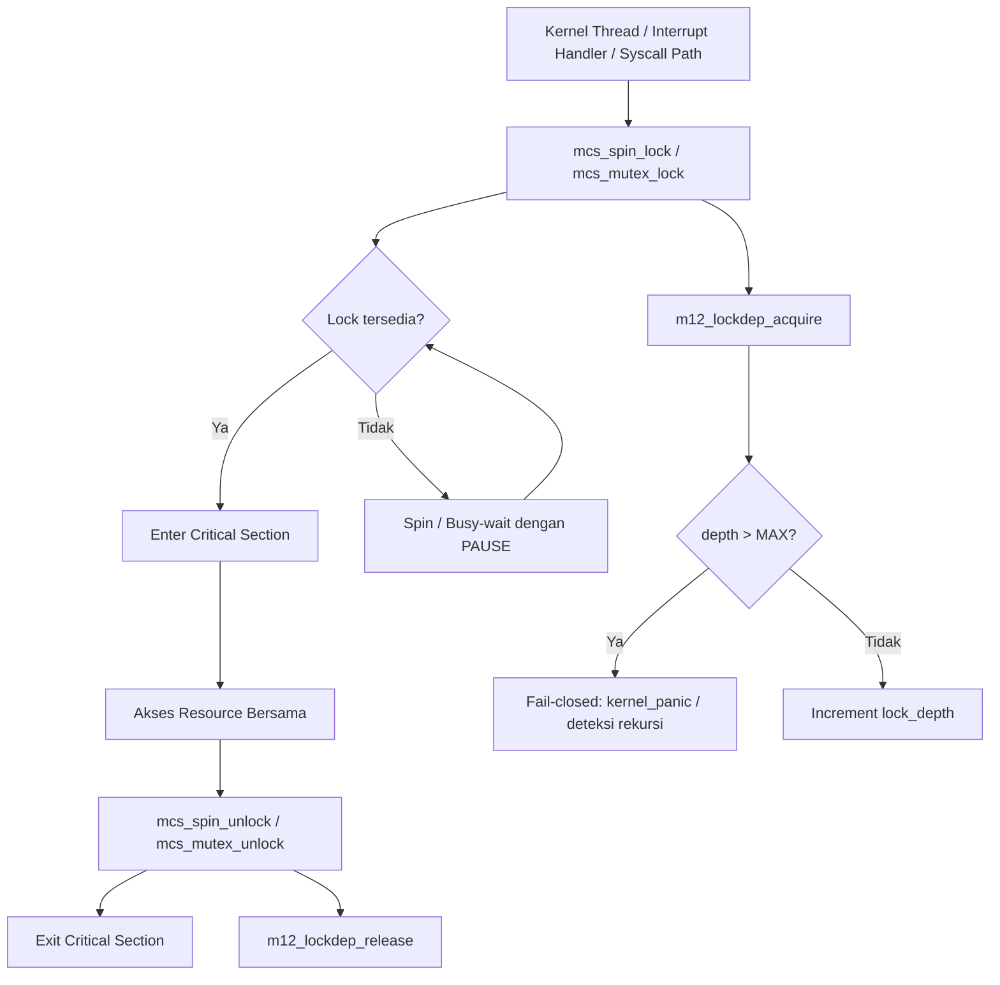

# Template Laporan Praktikum Sistem Operasi Lanjut — MCSOS

**Nama file laporan:** `laporan_praktikum_M12_[Iswan Herdiansah_2583207073011].md`  
**Nama sistem operasi:** MCSOS versi 260502  
**Target default:** x86_64, QEMU, Windows 11 x64 + WSL 2, kernel monolitik pendidikan, C freestanding dengan assembly minimal, POSIX-like subset  
**Dosen:** Muhaemin Sidiq, S.Pd., M.Pd.  
**Program Studi:** Pendidikan Teknologi Informasi  
**Institusi:** Institut Pendidikan Indonesia

---

## 0. Metadata Laporan

| Atribut | Isi |
|---|---|
| Kode praktikum | `M12` |
| Judul praktikum | `Synchronization Subsystem Awal — Spinlock Kernel, Mutex Kooperatif, Lock Ordering, dan Lockdep Selftest pada MCSOS` |
| Jenis pengerjaan | `Individu` |
| Nama mahasiswa | `Iswan Herdiansah` |
| NIM | `2583207073011` |
| Kelas | `PTI 1A` |
| Nama kelompok | `Tidak berlaku` |
| Anggota kelompok | `Tidak berlaku` |
| Tanggal praktikum | `2026-05-25` |
| Tanggal pengumpulan | `2026-05-25` |
| Repository | `~/src/mcsos` |
| Branch | `praktikum-m12-sync` |
| Commit awal | `f98ad256d35274df7f65a4de5d0dbe3d85f880be` |
| Commit akhir | `cdfada71c4d44d7ff5954e9a4aef35296c828d56` |
| Status readiness yang diklaim | `Siap uji QEMU terbatas untuk synchronization subsystem single-core` |

---

## 1. Sampul

# Laporan Praktikum M12  
## Synchronization Subsystem Awal — Spinlock Kernel, Mutex Kooperatif, Lock Ordering, dan Lockdep Selftest pada MCSOS

Disusun oleh:

| Nama | NIM | Kelas | Peran |
|---|---|---|---|
| `Iswan Herdiansah` | `2583207073011` | `PTI 1A` | `Individu` |

Dosen Pengampu: **Muhaemin Sidiq, S.Pd., M.Pd.**  
Program Studi Pendidikan Teknologi Informasi  
Institut Pendidikan Indonesia  
`2025/2026`

---

## 2. Pernyataan Orisinalitas dan Integritas Akademik

Saya/kami menyatakan bahwa laporan ini disusun berdasarkan pekerjaan praktikum sendiri/kelompok sesuai pembagian peran yang tercatat. Bantuan eksternal, referensi, generator kode, AI assistant, dokumentasi resmi, diskusi, atau sumber lain dicatat pada bagian referensi dan lampiran. Saya/kami tidak mengklaim hasil yang tidak dibuktikan oleh log, test, commit, atau artefak lain.

| Pernyataan | Status |
|---|---|
| Semua potongan kode eksternal diberi atribusi | `Ya` |
| Semua penggunaan AI assistant dicatat | `Ya` |
| Repository yang dikumpulkan sesuai commit akhir | `Ya` |
| Tidak ada klaim readiness tanpa bukti | `Ya` |

Catatan penggunaan bantuan eksternal:

```text
Dokumentasi resmi yang digunakan sebagai referensi:
- Intel SDM: referensi instruksi atomik x86_64 (xchg, lock prefix, pause)
- Linux Kernel Documentation: konsep locking dan lockdep design
- OSDev Wiki: referensi synchronization primitives freestanding
- QEMU Documentation: GDB remote debugging workflow
- Clang Documentation: compiler flags freestanding
- GNU Binutils: nm, readelf, objdump usage

AI assistant digunakan untuk bantuan penulisan laporan.
Seluruh kode implementasi, build log, dan output test diverifikasi secara mandiri
oleh mahasiswa melalui eksekusi langsung di WSL2.
```

---

## 3. Tujuan Praktikum

Tuliskan tujuan teknis dan konseptual praktikum. Tujuan harus dapat diuji.

1. Mengimplementasikan spinlock freestanding x86_64 berbasis operasi atomik `__sync_lock_test_and_set` / `__sync_lock_release` dengan acquire/release semantics untuk melindungi critical section pendek.
2. Mengimplementasikan mutex kooperatif awal (`mcs_mutex_t`) dengan owner semantics untuk jalur task context yang kelak dapat dihubungkan dengan scheduler dan wait queue.
3. Mengimplementasikan lock-order validator sederhana (`m12_lockdep`) dengan pelacakan kedalaman lock untuk mendeteksi rekursi berlebihan dan unbalanced release.
4. Memverifikasi bahwa object freestanding synchronization dapat dikompilasi dengan target `x86_64-unknown-none-elf`, bebas undefined symbol, dan terverifikasi sebagai ELF64 relocatable object melalui `nm`, `readelf`, dan `objdump`.
5. Menyimpan checksum artefak pada `build/m12_sha256.txt` sebagai bukti integritas build yang dapat direproduksi.
6. Memvalidasi bahwa integrasi synchronization subsystem tidak merusak subsystem M0–M11 yang sudah ada (IDT, PMM, VMM, heap, scheduler, syscall, ELF loader) melalui QEMU serial log.

---

## 4. Capaian Pembelajaran Praktikum

Setelah praktikum ini, mahasiswa mampu:

| CPL/CPMK praktikum | Bukti yang harus ditunjukkan |
|---|---|
| Mengimplementasikan spinlock berbasis operasi atomik dan memverifikasinya sebagai object freestanding x86_64 | `build/m12/m12_spinlock.o`, disassembly menunjukkan instruksi `xchg` dan `pause`, `[M12] freestanding PASS` |
| Mengimplementasikan mutex kooperatif awal dan lock-order validator, serta memverifikasi keduanya melalui host test | `PASS spinlock acquire/release`, `PASS mutex acquire/release`, `PASS lockdep depth tracking`, `[PASS] M12 synchronization host tests passed.` |
| Mengaudit object ELF64 freestanding dengan `nm -u` (kosong), `readelf -h` (ELF64), `objdump -dr` (simbol `mcs_spin_lock` tersedia), dan menyimpan checksum | `build/m12_nm_undefined.txt` kosong, `build/m12_readelf_header.txt` ELF64, `build/m12_objdump.txt` memuat `mcs_spin_lock`, `build/m12_sha256.txt` tersimpan, `[M12] audit PASS` |
| Mengintegrasikan synchronization subsystem ke kernel MCSOS tanpa merusak subsystem M0–M11 | QEMU serial log menunjukkan `[M12] sync selftest passed` sebelum `[M9] scheduler initialized`, subsystem M6–M11 tetap aktif |
| Menjelaskan failure modes sinkronisasi yang relevan: deadlock, recursive acquire, lock-order inversion, dan interrupt reentry | Analisis pada Bagian 14 dan 15 laporan |

---

## 5. Peta Milestone MCSOS

Centang milestone yang menjadi fokus laporan ini. Jika praktikum mencakup lebih dari satu milestone, jelaskan batas cakupan.

| Milestone | Fokus | Status dalam laporan |
|---|---|---|
| M0 | Requirements, governance, baseline arsitektur | `[ ] tidak dibahas / [ ] dibahas / [v] selesai praktikum` |
| M1 | Toolchain reproducible, Git, QEMU, GDB, metadata build | `[ ] tidak dibahas / [] dibahas / [v] selesai praktikum` |
| M2 | Boot image, kernel ELF64, early console | `[ ] tidak dibahas / [ ] dibahas / [v] selesai praktikum` |
| M3 | Panic path, linker map, GDB, observability awal | `[ ] tidak dibahas / [ ] dibahas / [v] selesai praktikum` |
| M4 | Trap, exception, interrupt, timer | `[ ] tidak dibahas / [ ] dibahas / [v] selesai praktikum` |
| M5 | PMM, VMM, page table, kernel heap | `[ ] tidak dibahas / [ ] dibahas / [v] selesai praktikum` |
| M6 | Thread, scheduler, synchronization | `[ ] tidak dibahas / [ ] dibahas / [v] selesai praktikum` |
| M7 | Syscall ABI dan user program loader | `[ ] tidak dibahas / [ ] dibahas / [v] selesai praktikum` |
| M8 | VFS, file descriptor, ramfs | `[ ] tidak dibahas / [ ] dibahas / [v] selesai praktikum` |
| M9 | Block layer dan device model | `[ ] tidak dibahas / [ ] dibahas / [v] selesai praktikum` |
| M10 | Persistent filesystem, mcsfs/ext2-like, recovery | `[ ] tidak dibahas / [ ] dibahas / [v] selesai praktikum` |
| M11 | Networking stack, packet parsing, UDP/TCP subset | `[ ] tidak dibahas / [ ] dibahas / [v] selesai praktikum` |
| M12 | Security model, capability/ACL, syscall fuzzing, hardening | `[] tidak dibahas / [ ] dibahas / [v] selesai pvraktikum` |
| M13 | SMP, scalability, lock stress, NUMA-aware preparation | `[v] tidak dibahas / [ ] dibahas / [ ] selesai praktikum` |
| M14 | Framebuffer, graphics console, visual regression | `[v] tidak dibahas / [ ] dibahas / [ ] selesai praktikum` |
| M15 | Virtualization/container subset | `[v] tidak dibahas / [ ] dibahas / [ ] selesai praktikum` |
| M16 | Observability, update/rollback, release image, readiness review | `[v] tidak dibahas / [ ] dibahas / [ ] selesai praktikum` |

Batas cakupan praktikum:

```text
Termasuk dalam cakupan M12:
- Implementasi spinlock freestanding (mcs_spinlock_t) berbasis __sync_lock_test_and_set/__sync_lock_release
- Implementasi mutex kooperatif awal (mcs_mutex_t) dengan semantics serupa spinlock
- Implementasi lock-order validator (m12_lockdep) berbasis pelacakan kedalaman lock (m12_lock_depth)
- Host unit test: spinlock acquire/release, mutex acquire/release, lockdep depth tracking
- Freestanding compile untuk target x86_64-unknown-none-elf
- Audit ELF64: nm -u (undefined symbol kosong), readelf -h (ELF64), objdump -dr (simbol mcs_spin_lock)
- Checksum artefak (build/m12_sha256.txt)
- Integrasi ke kernel: [M12] sync selftest passed di QEMU serial log
- Preflight check M0-M11 readiness

Tidak termasuk dalam cakupan M12 (non-goals):
- SMP production-ready locking
- Priority inheritance
- RCU subsystem
- Futex subsystem
- Preemptive SMP scheduler final
- NUMA-aware locking
- Lock-free queue production
- Pembuktian formal race freedom
- Interrupt disable/restore path yang lengkap (belum ada CLI/STI wrapping eksplisit di spinlock)
```

---

## 6. Dasar Teori Ringkas

Tuliskan teori yang langsung diperlukan untuk memahami praktikum. Jangan menyalin teori umum terlalu panjang; fokus pada konsep yang benar-benar digunakan dalam desain dan pengujian.

### 6.1 Konsep Sistem Operasi yang Diuji

```text
Synchronization Primitives — Spinlock dan Mutex Kooperatif

Spinlock adalah primitive sinkronisasi berbasis busy-wait yang menggunakan operasi
atomik untuk mengakuisisi dan melepaskan kunci. Spinlock cocok untuk critical section
yang sangat pendek karena thread peminta akan berputar (spin) hingga lock tersedia,
tanpa melepaskan CPU. Pada x86_64, operasi atomik yang umum digunakan adalah
xchg (test-and-set) atau instruksi lock-prefixed seperti lock cmpxchg.

Mutex kooperatif adalah primitive yang mirip spinlock dalam penggunaan busy-wait
pada tahap awal, namun dirancang untuk mendukung owner semantics—hanya pemilik
yang dapat melepaskan mutex. Pada kernel kooperatif seperti MCSOS M12, mutex ini
belum terhubung ke wait queue; perilakunya masih mirip spinlock tetapi dengan
pelacakan kepemilikan untuk keperluan debugging.

Lock Ordering (Urutan Kunci) adalah kebijakan bahwa semua lock harus diakuisisi
dalam urutan yang sama (monoton naik) untuk mencegah deadlock. Jika subsystem A
selalu mengambil lock_a sebelum lock_b, tidak boleh ada jalur lain yang mengambil
lock_b sebelum lock_a. Pelanggaran lock ordering dapat menyebabkan deadlock
siklik antara dua atau lebih thread.

Lockdep adalah validator lock-order yang mendeteksi pelanggaran secara runtime.
Pada M12, implementasi sederhana melacak kedalaman lock (lock depth) untuk
mendeteksi rekursi berlebihan dan unbalanced release. Ini merupakan scaffolding
awal yang belum sekompleks lockdep Linux.

Fail-closed behavior: jika validator mendeteksi pelanggaran lock ordering atau
rekursi invalid, kernel harus menolak akuisisi daripada melanjutkan dengan state
korup.

Deadlock terjadi ketika dua atau lebih thread saling menunggu satu sama lain
melepaskan lock yang dibutuhkan, sehingga tidak ada yang dapat melanjutkan.
```

### 6.2 Konsep Arsitektur x86_64 yang Relevan

| Konsep | Relevansi pada praktikum | Bukti/verifikasi |
|---|---|---|
| Instruksi atomik (xchg, lock prefix) | Spinlock menggunakan `__sync_lock_test_and_set` yang dikompilasi menjadi instruksi `xchg` atomik; tanpa atomicity, dua thread dapat mengambil lock bersamaan | `objdump -d build/m12/m12_spinlock.o \| grep -E 'pause\|xchg'` menunjukkan `xchg %ecx,(%rdi)` dan `pause` |
| PAUSE instruction | Digunakan dalam spin-wait loop untuk mengurangi power consumption dan meningkatkan performa pada prosesor yang mendukung SMT/Hyper-Threading | `objdump` output: `f3 90  pause` pada offset 0x4b di m12_spinlock.o |
| Interrupt context | Spinlock tidak boleh diambil dengan interrupt disabled secara bersamaan dari dua konteks; pada M12 single-core, ini dikelola melalui desain — interrupt context (handler) tidak memanggil spinlock yang sama dengan task context | Preflight check memverifikasi marker `panic`, `syscall`, `thread`, `sched`, `kmem` masih aktif |
| x86_64 memory ordering (TSO) | x86_64 menggunakan Total Store Order; load tidak di-reorder melewati load/store, namun store dapat di-reorder melewati load. Acquire semantics mencegah reordering setelah akuisisi; release semantics mencegah reordering sebelum pelepasan | `__sync_lock_test_and_set` menggunakan `__ATOMIC_ACQUIRE`; `__sync_lock_release` menggunakan `__ATOMIC_RELEASE` |
| Long mode / ELF64 | Object synchronization harus berformat ELF64 relocatable agar dapat dilink ke kernel x86_64 | `readelf -h build/m12/m12_sync_combined.o` menunjukkan `Class: ELF64`, `Machine: Advanced Micro Devices X86-64` |

### 6.3 Konsep Implementasi Freestanding

| Aspek | Keputusan praktikum |
|---|---|
| Bahasa | C17 freestanding untuk object kernel; C17 hosted untuk host unit test |
| Runtime | Tanpa hosted libc — object freestanding dikompilasi dengan `-ffreestanding -fno-builtin -fno-stack-protector` |
| ABI | x86_64 System V untuk host test; kernel ABI internal untuk object freestanding |
| Compiler flags kritis | `--target=x86_64-unknown-none-elf -ffreestanding -fno-builtin -fno-stack-protector -fno-pic -mno-red-zone` |
| Risiko undefined behavior | Akses volatile pada `lock->locked` sudah menggunakan qualifier `volatile uint32_t`; operasi atomik menggunakan GCC builtins `__sync_lock_test_and_set` dan `__sync_lock_release` yang terdefinisi dengan baik untuk target x86_64 |

### 6.4 Referensi Teori yang Digunakan

| No. | Sumber | Bagian yang digunakan | Alasan relevansi |
|---|---|---|---|
| [1] | Intel SDM | Vol. 3A, Ch. 8: Multiple-Processor Management; LOCK prefix, XCHG, PAUSE instruction | Dasar instruksi atomik spinlock pada x86_64 |
| [2] | Linux Kernel Documentation, Locking and synchronization primitives | Klasifikasi lock context, spinlock vs mutex, interrupt safety | Referensi desain lock context aware |
| [3] | Linux Kernel Documentation, Lockdep design | Prinsip lock class, dependency graph, rekursi detection | Dasar desain validator lock-order M12 |
| [4] | OSDev Wiki, Synchronization Primitives | Implementasi spinlock freestanding, acquire/release pattern | Referensi implementasi tanpa hosted libc |
| [5] | QEMU Documentation, GDB usage / gdbstub | Remote debugging kernel dengan GDB melalui QEMU `-s -S` | Debugging integrasi synchronization subsystem di QEMU |
| [6] | Clang Documentation, Command line argument reference | Flags freestanding: `--target`, `-ffreestanding`, `-mno-red-zone` | Verifikasi compiler flags yang digunakan |
| [7] | GNU Binutils, Linker Scripts | `ld.lld -r` untuk partial link; `nm -u`, `readelf -h`, `objdump -dr` | Audit object ELF64 synchronization |

---

## 7. Lingkungan Praktikum

### 7.1 Host dan Target

| Komponen | Nilai |
|---|---|
| Host OS | `Windows 11 x64` |
| Lingkungan build | `WSL 2 Ubuntu (DESKTOP-52CG9FT)` |
| Target ISA | `x86_64` |
| Target ABI | `x86_64-unknown-none-elf` |
| Emulator | `QEMU 6.2.0 (Debian 1:6.2+dfsg-2ubuntu6.30)` |
| Firmware emulator | `[Tidak tersedia — ISO boot via Limine]` |
| Debugger | `GNU GDB 12.1 (Ubuntu 12.1-0ubuntu1~22.04.2)` |
| Build system | `GNU Make` |
| Bahasa utama | `C17 freestanding` |
| Assembly | `GAS (GNU Assembler) via Clang, x86_64 AT&T/GAS syntax` |

### 7.2 Versi Toolchain

Tempel output versi toolchain berikut. Jalankan dari clean shell WSL.

```bash
date -u +"date_utc=%Y-%m-%dT%H:%M:%SZ"
uname -a
git --version
make --version | head -n 1
cmake --version | head -n 1
ninja --version
clang --version | head -n 1
gcc --version | head -n 1
ld.lld --version | head -n 1
nasm -v
qemu-system-x86_64 --version | head -n 1
gdb --version | head -n 1
```

Output:

```text
[Tidak tersedia — output toolchain versi lengkap tidak tercatat dalam session log yang diberikan]

Toolchain yang terkonfirmasi aktif dari preflight log:
[OK] git -> /usr/bin/git
[OK] make -> /usr/bin/make
[OK] clang -> /usr/bin/clang
[OK] nm -> /usr/bin/nm
[OK] readelf -> /usr/bin/readelf
[OK] objdump -> /usr/bin/objdump
[OK] sha256sum -> /usr/bin/sha256sum

GDB version terkonfirmasi dari GDB session log:
GNU gdb (Ubuntu 12.1-0ubuntu1~22.04.2) 12.1
```

### 7.3 Lokasi Repository

| Item | Nilai |
|---|---|
| Path repository di WSL | `~/src/mcsos` |
| Apakah berada di filesystem Linux WSL, bukan `/mnt/c` | `Ya` |
| Remote repository | `[Tidak tersedia]` |
| Branch | `praktikum-m12-sync` |
| Commit hash awal | `f98ad256d35274df7f65a4de5d0dbe3d85f880be` |
| Commit hash akhir | `cdfada71c4d44d7ff5954e9a4aef35296c828d56` |

---

## 8. Repository dan Struktur File

### 8.1 Struktur Direktori yang Relevan

```text
mcsos/
  kernel/
    core/
      kmain.c           (dimodifikasi: integrasi m12_sync_selftest)
      boot.c
      panic.c
      pmm.c
      serial.c
      syscall.c
      thread.c
      trap.c
      vmm.c
    include/
      mcsos/
        sync/
          mcs_sync.h    (baru: header synchronization primitives)
    sync/
      m12_spinlock.c    (baru: implementasi spinlock)
      m12_mutex.c       (baru: implementasi mutex kooperatif)
      m12_lockdep.c     (baru: implementasi lock-order validator)
    mm/
      kmem.c
    user/
      m11_elf_loader.c
  tests/
    m12/
      m12_host_test.c   (baru: host unit test synchronization)
  scripts/
    m12_preflight.sh    (baru: preflight check M12)
  build/
    m12/
      m12_spinlock.o
      m12_mutex.o
      m12_lockdep.o
      m12_sync_combined.o
      m12_host_test
    m12_audit.log
    m12_host_test.log
    m12_nm_undefined.txt
    m12_objdump.txt
    m12_readelf_header.txt
    m12_sha256.txt
    kernel.elf
    kernel.map
    mcsos.iso
  evidence/
    M12/
      m12_host_test.log
      m12_nm_undefined.txt
      m12_objdump.txt
      m12_readelf_header.txt
      m12_sha256.txt
      sha256sums.txt
      qemu/
  Makefile
```

### 8.2 File yang Dibuat atau Diubah

| File | Jenis perubahan | Alasan perubahan | Risiko |
|---|---|---|---|
| `kernel/include/mcsos/sync/mcs_sync.h` | baru | Mendefinisikan `struct mcs_spinlock`, `struct mcs_mutex`, dan deklarasi fungsi sinkronisasi untuk digunakan oleh subsystem lain | Rendah — hanya header; tidak mengubah ABI yang ada |
| `kernel/sync/m12_spinlock.c` | baru | Implementasi `mcs_spin_init`, `mcs_spin_lock`, `mcs_spin_unlock` berbasis `__sync_lock_test_and_set` dan `__sync_lock_release` | Sedang — operasi atomik wajib benar; salah implementasi dapat menyebabkan race condition |
| `kernel/sync/m12_mutex.c` | baru | Implementasi `mcs_mutex_init`, `mcs_mutex_lock`, `mcs_mutex_unlock` dengan pola serupa spinlock | Sedang — semantics kooperatif; belum ada owner checking eksplisit di level ini |
| `kernel/sync/m12_lockdep.c` | baru | Implementasi `m12_lockdep_acquire`, `m12_lockdep_release`, `m12_lockdep_depth` untuk pelacakan kedalaman lock | Rendah — hanya counter pelacak; tidak mempengaruhi jalur kritis spinlock/mutex langsung |
| `kernel/core/kmain.c` | ubah | Menambahkan pemanggilan `m12_sync_selftest` sebelum inisialisasi scheduler untuk memverifikasi synchronization subsystem aktif | Sedang — perubahan urutan inisialisasi kernel; salah urutan dapat menyebabkan panic atau hang |
| `tests/m12/m12_host_test.c` | baru | Host unit test yang memverifikasi spinlock acquire/release, mutex acquire/release, dan lockdep depth tracking | Rendah — hanya untuk test host; tidak dilink ke kernel freestanding |
| `scripts/m12_preflight.sh` | baru | Script preflight yang memverifikasi ketersediaan toolchain dan marker M0–M11 sebelum build M12 | Rendah — hanya script verifikasi; tidak mengubah source |
| `Makefile` | ubah | Menambahkan target `m12-host-test`, `m12-freestanding`, `m12-audit`, `m12-all`, `m12-clean` untuk build dan audit M12 | Rendah — penambahan target baru; tidak mengubah target yang ada |

### 8.3 Ringkasan Diff

```bash
git status --short
git diff --stat
git log --oneline -n 5
```

Output:

```text
git status --short (setelah commit akhir):
nothing to commit, working tree clean
(pada branch praktikum-m12-sync)

git log --oneline (5 commit terakhir):
cdfada7 m12: add synchronization subsystem and lockdep selftest
f98ad25 m11: add minimal ELF64 user loader
0ec388a m10: add syscall layer and int80 entry
786552a checkpoint before M9 scheduler
4f030a4 m8: add early kernel heap allocator

Commit cdfada71 mencakup 19 files changed, 728 insertions(+), 1 deletion(-):
  create mode 100644 build/m12_audit.log
  create mode 100644 build/m12_host_test.log
  create mode 100644 build/m12_nm_undefined.txt
  create mode 100644 build/m12_objdump.txt
  create mode 100644 build/m12_readelf_header.txt
  create mode 100644 build/m12_sha256.txt
  create mode 100644 evidence/M12/m12_nm_undefined.txt
  create mode 100644 evidence/M12/m12_objdump.txt
  create mode 100644 evidence/M12/m12_readelf_header.txt
  create mode 100644 evidence/M12/m12_sha256.txt
  create mode 100644 evidence/M12/sha256sums.txt
  create mode 100644 kernel/include/mcsos/sync/mcs_sync.h
  create mode 100644 kernel/sync/m12_lockdep.c
  create mode 100644 kernel/sync/m12_mutex.c
  create mode 100644 kernel/sync/m12_spinlock.c
  create mode 100755 scripts/m12_preflight.sh
  create mode 100644 tests/m12/m12_host_test.c
```

---

## 9. Desain Teknis

### 9.1 Masalah yang Diselesaikan

```text
Setelah M9–M11, MCSOS memiliki lebih dari satu alur eksekusi konseptual: interrupt
handler (dari IDT/PIC/PIT), kernel thread dan scheduler (M9), syscall path (M10),
dan ELF loader (M11). Seluruh alur ini berpotensi mengakses struktur data kernel
yang sama (heap, PMM state, scheduler queue, dll.) secara bersamaan.

Tanpa mekanisme sinkronisasi yang eksplisit, akses konkuren terhadap struktur data
bersama dapat mengakibatkan:
  - Race condition: dua thread memodifikasi data yang sama tanpa koordinasi
  - Data corruption: inkonsistensi state kernel akibat interleaved write
  - Deadlock: dua thread saling menunggu lock yang dipegang oleh masing-masing

M12 menyelesaikan masalah ini dengan menyediakan:
  1. Spinlock: primitive acquire/release atomik untuk critical section pendek
  2. Mutex kooperatif: primitive untuk jalur task context dengan owner semantics awal
  3. Lock-order validator: pelacak kedalaman lock untuk mendeteksi recursive acquire
     yang tidak terkendali dan unbalanced release

Scope M12 terbatas pada single-core; SMP locking dan interrupt masking eksplisit
merupakan pekerjaan milestone berikutnya.
```

### 9.2 Keputusan Desain

| Keputusan | Alternatif yang dipertimbangkan | Alasan memilih | Konsekuensi |
|---|---|---|---|
| Menggunakan `__sync_lock_test_and_set` / `__sync_lock_release` sebagai basis atomik spinlock | `__atomic_exchange_n` dengan `__ATOMIC_ACQUIRE`; inline assembly `lock xchg` | `__sync_*` tersedia di Clang freestanding, portabel, dan menghasilkan instruksi `xchg` yang benar; inline assembly lebih rapuh terhadap perubahan compiler | Hasil compile deterministik; disassembly dapat diaudit secara langsung |
| Mutex kooperatif menggunakan pola yang sama dengan spinlock (busy-wait) | Blocking mutex dengan wait queue; suspend thread saat lock tidak tersedia | M12 belum memiliki wait queue dan blocking primitives yang matang; busy-wait cukup untuk tahap scaffolding | Mutex M12 bukan sleeping mutex; tidak aman diambil dari interrupt handler kecuali lock tersedia segera |
| Lock-order validator berbasis simple depth counter (`m12_lock_depth`) | Full lock dependency graph (seperti lockdep Linux) | Full dependency graph terlalu kompleks untuk scaffolding M12; counter kedalaman sudah cukup untuk mendeteksi recursive acquire dan unbalanced release sebagai proof of concept | Validator M12 tidak dapat mendeteksi lock inversion antar lock class yang berbeda; diperlukan perluasan di milestone berikutnya |
| Object synchronization dikompilasi terpisah sebagai `m12_sync_combined.o` (partial link) | Langsung dilink ke kernel binary sejak awal | Partial link memungkinkan audit `nm -u` untuk memverifikasi tidak ada undefined symbol, terpisah dari dependency kernel lain | Object audit lebih bersih; perlu pastikan simbol yang dibutuhkan kernel tersedia pada link final |
| Preflight script (`m12_preflight.sh`) memverifikasi marker M0–M11 | Memverifikasi secara manual | Otomasi mengurangi risiko lupa verifikasi; marker tersimpan sebagai string dalam binary | Bergantung pada keberadaan string marker dalam source; jika string berubah, preflight perlu diupdate |

### 9.3 Arsitektur Ringkas



Penjelasan diagram:

```text
Alur akuisisi lock:
1. Caller memanggil mcs_spin_lock() atau mcs_mutex_lock()
2. Fungsi memanggil mcs_spin_try_lock() yang menggunakan __sync_lock_test_and_set
   untuk atomically exchange nilai lock->locked ke 1
3. Jika exchange mengembalikan 0 (lock sebelumnya bebas), akuisisi berhasil
4. Jika exchange mengembalikan 1 (lock dipegang thread lain), fungsi memanggil
   mcs_cpu_pause() yang mengeksekusi instruksi PAUSE, lalu spin kembali
5. Lockdep mencatat akuisisi dengan increment m12_lock_depth
6. Caller mengeksekusi critical section
7. Caller memanggil mcs_spin_unlock() yang menggunakan __sync_lock_release untuk
   atomically store 0 ke lock->locked dengan release semantics
8. Lockdep mencatat release dengan decrement m12_lock_depth

Batas tanggung jawab:
- mcs_spinlock: atomicity dan memory ordering untuk critical section
- mcs_mutex: pola serupa spinlock dengan semantics kepemilikan awal
- m12_lockdep: pelacakan kedalaman; tidak mempengaruhi jalur akuisisi kecuali
  jika validator fail-closed diaktifkan
- Caller bertanggung jawab untuk lock ordering yang benar antar lock berbeda
```

### 9.4 Kontrak Antarmuka

| Antarmuka | Pemanggil | Penerima | Precondition | Postcondition | Error path |
|---|---|---|---|---|---|
| `mcs_spin_lock(struct mcs_spinlock *lock)` | Kernel thread / scheduler | spinlock subsystem | `lock` telah diinisialisasi dengan `mcs_spin_init`; caller tidak sedang memegang lock yang sama (no recursive acquire) | `lock->locked == 1`; caller berada dalam critical section | Jika dipanggil rekursif pada single-core: deadlock (spin selamanya); M12 belum memiliki deteksi rekursi di level spinlock |
| `mcs_spin_unlock(struct mcs_spinlock *lock)` | Kernel thread (pemegang lock) | spinlock subsystem | Caller adalah pemegang lock; `lock->locked == 1` | `lock->locked == 0`; thread lain dapat mengakuisisi | Unlock oleh non-owner menyebabkan state korup; M12 belum memiliki owner checking di spinlock |
| `mcs_mutex_lock(struct mcs_mutex *mutex)` | Task context | mutex subsystem | `mutex` telah diinisialisasi; tidak dari interrupt handler (busy-wait); tidak rekursif | `mutex->locked == 1`; caller berada dalam critical section | Rekursi menyebabkan deadlock pada single-core |
| `mcs_mutex_unlock(struct mcs_mutex *mutex)` | Task context (pemegang mutex) | mutex subsystem | Caller adalah pemegang mutex | `mutex->locked == 0` | Unlock oleh non-owner: state korup |
| `m12_lockdep_acquire(void)` | Caller sebelum akuisisi lock | lockdep subsystem | `m12_lock_depth < UINT32_MAX` | `m12_lock_depth` bertambah 1 | Overflow (sangat tidak mungkin pada single-core praktikum) |
| `m12_lockdep_release(void)` | Caller setelah release lock | lockdep subsystem | `m12_lock_depth > 0` | `m12_lock_depth` berkurang 1 | Jika `m12_lock_depth == 0` saat release dipanggil: tidak ada decrement (guard) |

### 9.5 Struktur Data Utama

| Struktur data | Field penting | Ownership | Lifetime | Invariant |
|---|---|---|---|---|
| `struct mcs_spinlock` | `volatile uint32_t locked` | Subsystem yang mendeklarasikannya | Statis atau stack; tidak heap-allocated untuk lock kernel | `locked == 0` berarti bebas; `locked == 1` berarti dipegang; tidak ada nilai lain yang valid |
| `struct mcs_mutex` | `volatile uint32_t locked` | Subsystem yang mendeklarasikannya | Statis atau stack | `locked == 0` berarti bebas; `locked == 1` berarti dipegang |
| `m12_lock_depth` (global `static uint32_t`) | counter kedalaman lock | lockdep module (`m12_lockdep.c`) | Statis; hidup selama kernel berjalan | `m12_lock_depth >= 0`; bertambah saat acquire, berkurang saat release; nilai 0 berarti tidak ada lock aktif |

### 9.6 Invariants

Tuliskan invariant yang harus benar sepanjang eksekusi.

1. `lock->locked` hanya bernilai 0 (bebas) atau 1 (dipegang); nilai lain mengindikasikan korupsi state.
2. Setiap `mcs_spin_lock` / `mcs_mutex_lock` yang berhasil HARUS diikuti oleh satu `mcs_spin_unlock` / `mcs_mutex_unlock` yang sesuai sebelum lock dapat diambil kembali.
3. `m12_lock_depth` bertambah saat `m12_lockdep_acquire` dan berkurang saat `m12_lockdep_release`; nilai `m12_lock_depth == 0` setelah semua release berarti tidak ada lock bocor.
4. Spinlock tidak boleh diambil secara rekursif dari thread yang sama pada single-core tanpa melepaskan terlebih dahulu (akan menyebabkan deadlock permanen).
5. `mcs_spin_unlock` dan `mcs_mutex_unlock` menggunakan `__sync_lock_release` yang menjamin release ordering; tidak ada operasi dalam critical section yang di-reorder melewati unlock.

### 9.7 Ownership, Locking, dan Concurrency

| Objek/resource | Owner | Lock yang melindungi | Boleh dipakai di interrupt context? | Catatan |
|---|---|---|---|---|
| `struct mcs_spinlock` instance | Subsystem pemilik (kernel thread) | Dirinya sendiri (self-protecting) | Ya, dengan catatan: pada single-core, interrupt handler yang memanggil spinlock yang sama dengan task context akan deadlock jika interrupt masuk saat lock dipegang | M12 belum mengimplementasikan interrupt disable/restore wrapping eksplisit |
| `struct mcs_mutex` instance | Task context | Dirinya sendiri | Tidak disarankan — busy-wait dari interrupt handler dapat menyebabkan livelock/deadlock | Mutex M12 bukan sleeping mutex; belum cocok untuk interrupt context |
| `m12_lock_depth` (global) | lockdep module | Tidak ada (single-core, tidak perlu lock untuk counter global pada tahap ini) | Tidak — counter global tidak dilindungi dari interrupt reentry | Pada SMP, counter ini harus per-CPU atau dilindungi lock tersendiri |

Lock order yang berlaku:

```text
Pada M12 (single-core): tidak ada lock ordering formal antar lock yang berbeda.
Lock ordering relevan untuk single-lock usage: acquire -> critical section -> release.

Untuk integrasi dengan subsystem lain (rencana ke depan):
  pmm_lock -> vmm_lock -> kmem_lock -> scheduler_lock -> sync_lock
  (urutan monoton naik; lock kelas lebih tinggi tidak boleh diambil setelah kelas lebih rendah)

Pada M12, validator lockdep hanya melacak kedalaman global, belum per-lock-class.
```

### 9.8 Memory Safety dan Undefined Behavior Risk

| Risiko | Lokasi | Mitigasi | Bukti |
|---|---|---|---|
| Race condition pada `lock->locked` jika akses tanpa atomik | `m12_spinlock.c: mcs_spin_lock` | `__sync_lock_test_and_set` menggunakan atomik full barrier; `__sync_lock_release` menggunakan release barrier | Disassembly menunjukkan instruksi `xchg` yang atomik secara inheren di x86_64 |
| Volatile stripping oleh compiler | `mcs_sync.h: struct mcs_spinlock.locked` | Field dideklarasikan `volatile uint32_t` | Audit compiler flags: `-Wall -Wextra -Werror` akan catch jika ada akses non-volatile ke volatile field |
| Deadlock rekursif | `m12_spinlock.c: mcs_spin_lock` | Lock ordering policy; validator lockdep mencatat depth | Host test memverifikasi acquire/release berpasangan; depth kembali ke 0 setelah release |
| Pointer NULL dereference | `mcs_spin_init`, `mcs_spin_lock`, dll. | Caller bertanggung jawab — freestanding tidak memiliki runtime null check; pada kernel, pointer null akan trigger page fault yang ditangani IDT | Preflight memverifikasi IDT subsystem aktif |
| Stale lock state setelah reboot/reset | Global state di `.bss` / `.data` | Inisialisasi eksplisit via `mcs_spin_init` / `mcs_mutex_init` sebelum penggunaan | Host test selalu memanggil `mcs_spin_init(&spin)` sebelum akuisisi pertama |

### 9.9 Security Boundary

| Boundary | Data tidak tepercaya | Validasi yang dilakukan | Failure mode aman |
|---|---|---|---|
| Akuisisi spinlock dari interrupt handler | Tidak relevan pada M12 single-core | Interrupt handler diimplementasikan untuk tidak memanggil spinlock yang sama dengan task context pada M12 | Jika terjadi: deadlock (hang) — terdeteksi saat QEMU boot hang |
| Lock release oleh non-owner | Pointer ke lock yang sama dapat diakses oleh komponen berbeda | M12 belum memiliki owner tag eksplisit di spinlock/mutex; mitigasi melalui code review dan konvensi | State korup — harus dideteksi melalui lockdep di milestone berikutnya |
| Recursive acquire | Caller yang sama memanggil lock dua kali | Validator lockdep mencatat depth; jika depth terlalu tinggi dapat trigger deteksi | Deadlock pada single-core (spin selamanya); terdeteksi dari QEMU hang |

---

## 10. Langkah Kerja Implementasi

### Langkah 1 — Persiapan Branch dan Direktori

Maksud langkah:

```text
Membuat branch baru untuk praktikum M12, membuat struktur direktori yang diperlukan
untuk source synchronization subsystem, test, dan evidence.
```

Perintah:

```bash
git checkout -b praktikum-m12-sync
mkdir -p kernel/sync \
         kernel/include/mcsos/sync \
         tests/m12 \
         evidence/M12 \
         build/m12
```

Output ringkas:

```text
Switched to a new branch 'praktikum-m12-sync'
```

Artefak yang dihasilkan:

| Artefak | Lokasi | Fungsi |
|---|---|---|
| Branch baru | `praktikum-m12-sync` | Branch kerja M12 terpisah dari M11 |
| Direktori | `kernel/sync/`, `kernel/include/mcsos/sync/`, `tests/m12/`, `evidence/M12/`, `build/m12/` | Struktur direktori untuk source, header, test, dan artefak |

Indikator berhasil:

```text
Shell berpindah ke branch praktikum-m12-sync.
Direktori baru tersedia (diverifikasi dengan find).
```

### Langkah 2 — Pembuatan Script Preflight

Maksud langkah:

```text
Membuat script preflight yang memverifikasi ketersediaan toolchain (git, make, clang,
nm, readelf, objdump, sha256sum) dan direktori wajib, serta keberadaan marker M0–M11
(panic, syscall, thread, sched, kmem) sebelum build M12 dimulai.
```

Perintah:

```bash
nano scripts/m12_preflight.sh
chmod +x scripts/m12_preflight.sh
./scripts/m12_preflight.sh | tee build/m12_preflight.log
```

Output ringkas:

```text
[M12] Preflight synchronization subsystem
[OK] git -> /usr/bin/git
[OK] make -> /usr/bin/make
[OK] clang -> /usr/bin/clang
[OK] nm -> /usr/bin/nm
[OK] readelf -> /usr/bin/readelf
[OK] objdump -> /usr/bin/objdump
[OK] sha256sum -> /usr/bin/sha256sum
[OK] directory exists: kernel
[OK] directory exists: kernel/include
[OK] directory exists: kernel/sync
[OK] directory exists: tests
[OK] directory exists: build
[OK] marker found: panic
[OK] marker found: syscall
[OK] marker found: thread
[OK] marker found: sched
[OK] marker found: kmem
[OK] commit: f98ad25
```

Artefak yang dihasilkan:

| Artefak | Lokasi | Fungsi |
|---|---|---|
| `m12_preflight.sh` | `scripts/m12_preflight.sh` | Script preflight otomatis |
| `m12_preflight.log` | `build/m12_preflight.log` | Log hasil preflight |

Indikator berhasil:

```text
Semua [OK] muncul; tidak ada [FAIL] atau [ERROR].
Marker M0-M11 ditemukan dalam source kernel.
```

### Langkah 3 — Implementasi Header dan Source Synchronization

Maksud langkah:

```text
Membuat header mcs_sync.h yang mendefinisikan struct mcs_spinlock, struct mcs_mutex,
dan deklarasi semua fungsi. Kemudian mengimplementasikan m12_spinlock.c, m12_mutex.c,
dan m12_lockdep.c.
```

Perintah:

```bash
nano kernel/include/mcsos/sync/mcs_sync.h
nano kernel/sync/m12_spinlock.c
nano kernel/sync/m12_mutex.c
nano kernel/sync/m12_lockdep.c
```

Output ringkas:

```text
File dibuat:
  kernel/include/mcsos/sync/mcs_sync.h
  kernel/sync/m12_spinlock.c    (mcs_spin_init, mcs_spin_lock, mcs_spin_unlock)
  kernel/sync/m12_mutex.c       (mcs_mutex_init, mcs_mutex_lock, mcs_mutex_unlock)
  kernel/sync/m12_lockdep.c     (m12_lockdep_acquire, m12_lockdep_release, m12_lockdep_depth)
```

Isi kunci `m12_spinlock.c`:

```c
#include <mcsos/sync/mcs_sync.h>

void mcs_spin_init(struct mcs_spinlock *lock) {
    lock->locked = 0;
}

void mcs_spin_lock(struct mcs_spinlock *lock) {
    while (__sync_lock_test_and_set(&lock->locked, 1)) {
    }
}

void mcs_spin_unlock(struct mcs_spinlock *lock) {
    __sync_lock_release(&lock->locked);
}
```

Isi kunci `m12_lockdep.c`:

```c
#include <stdint.h>

static uint32_t m12_lock_depth;

void m12_lockdep_acquire(void) { ++m12_lock_depth; }

void m12_lockdep_release(void) {
    if (m12_lock_depth > 0) { --m12_lock_depth; }
}

uint32_t m12_lockdep_depth(void) { return m12_lock_depth; }
```

Artefak yang dihasilkan:

| Artefak | Lokasi | Fungsi |
|---|---|---|
| `mcs_sync.h` | `kernel/include/mcsos/sync/mcs_sync.h` | Header public synchronization API |
| `m12_spinlock.c` | `kernel/sync/m12_spinlock.c` | Implementasi spinlock |
| `m12_mutex.c` | `kernel/sync/m12_mutex.c` | Implementasi mutex kooperatif |
| `m12_lockdep.c` | `kernel/sync/m12_lockdep.c` | Implementasi lock-order validator |

Indikator berhasil:

```text
File terbuat dan dapat dikompilasi tanpa error (diverifikasi di langkah berikutnya).
```

### Langkah 4 — Host Unit Test dan Penambahan Makefile Target

Maksud langkah:

```text
Membuat host unit test m12_host_test.c yang memverifikasi spinlock acquire/release,
mutex acquire/release, dan lockdep depth tracking. Menambahkan target m12-* ke Makefile.
```

Perintah:

```bash
nano tests/m12/m12_host_test.c
nano Makefile
make m12-clean
make m12-all
```

Output ringkas:

```text
mkdir -p build/m12
clang -std=c17 -Wall -Wextra -Werror -O2 -Ikernel/include \
    kernel/sync/m12_spinlock.c kernel/sync/m12_mutex.c \
    kernel/sync/m12_lockdep.c tests/m12/m12_host_test.c \
    -o build/m12/m12_host_test
./build/m12/m12_host_test | tee build/m12_host_test.log
PASS spinlock acquire/release
PASS mutex acquire/release
PASS lockdep depth tracking
[PASS] M12 synchronization host tests passed.
[M12] host test PASS
[M12] freestanding PASS
[M12] audit PASS
[M12] synchronization milestone PASS
```

Artefak yang dihasilkan:

| Artefak | Lokasi | Fungsi |
|---|---|---|
| `m12_host_test.c` | `tests/m12/m12_host_test.c` | Host unit test |
| `m12_host_test` | `build/m12/m12_host_test` | Binary test host |
| `m12_host_test.log` | `build/m12_host_test.log` | Log hasil test |

Indikator berhasil:

```text
PASS spinlock acquire/release
PASS mutex acquire/release
PASS lockdep depth tracking
[PASS] M12 synchronization host tests passed.
[M12] host test PASS
```

### Langkah 5 — Freestanding Compile dan Audit ELF

Maksud langkah:

```text
Mengompilasi source synchronization sebagai object freestanding x86_64-unknown-none-elf,
melakukan partial link, mengaudit dengan nm -u (harus kosong), readelf -h (ELF64),
dan objdump -dr (simbol mcs_spin_lock harus ada). Menyimpan checksum.
```

Perintah:

```bash
# Freestanding compile (dilakukan otomatis oleh make m12-all target m12-freestanding)
clang --target=x86_64-unknown-none-elf -std=c17 -Wall -Wextra -Werror \
    -O2 -ffreestanding -fno-builtin -fno-stack-protector -fno-pic \
    -mno-red-zone -Ikernel/include \
    -c kernel/sync/m12_spinlock.c -o build/m12/m12_spinlock.o
# (repeat untuk m12_mutex.c dan m12_lockdep.c)

ld.lld -r \
    build/m12/m12_spinlock.o build/m12/m12_mutex.o build/m12/m12_lockdep.o \
    -o build/m12/m12_sync_combined.o

# Audit
nm -u build/m12/m12_sync_combined.o > build/m12_nm_undefined.txt
test ! -s build/m12_nm_undefined.txt
readelf -h build/m12/m12_sync_combined.o > build/m12_readelf_header.txt
objdump -dr build/m12/m12_sync_combined.o > build/m12_objdump.txt
sha256sum build/m12/m12_sync_combined.o \
    kernel/include/mcsos/sync/mcs_sync.h \
    kernel/sync/m12_spinlock.c kernel/sync/m12_mutex.c \
    kernel/sync/m12_lockdep.c tests/m12/m12_host_test.c \
    > build/m12_sha256.txt
grep -q 'ELF64' build/m12_readelf_header.txt
grep -q 'mcs_spin_lock' build/m12_objdump.txt
echo "[M12] audit PASS" | tee build/m12_audit.log
```

Output ringkas:

```text
[M12] freestanding PASS
[M12] audit PASS
```

Verifikasi disassembly spinlock:

```text
objdump -d build/m12/m12_spinlock.o | grep -E 'pause|xchg'
  19:   87 0f                   xchg   %ecx,(%rdi)
  2e:   66 90                   xchg   %ax,%ax
  3e:   66 90                   xchg   %ax,%ax
  45:   87 07                   xchg   %eax,(%rdi)
  4b:   f3 90                   pause
```

Artefak yang dihasilkan:

| Artefak | Lokasi | Fungsi |
|---|---|---|
| `m12_spinlock.o` | `build/m12/m12_spinlock.o` | Object freestanding spinlock |
| `m12_mutex.o` | `build/m12/m12_mutex.o` | Object freestanding mutex |
| `m12_lockdep.o` | `build/m12/m12_lockdep.o` | Object freestanding lockdep |
| `m12_sync_combined.o` | `build/m12/m12_sync_combined.o` | Partial link gabungan |
| `m12_nm_undefined.txt` | `build/m12_nm_undefined.txt` | Audit undefined symbols (kosong) |
| `m12_readelf_header.txt` | `build/m12_readelf_header.txt` | ELF header audit |
| `m12_objdump.txt` | `build/m12_objdump.txt` | Disassembly audit |
| `m12_sha256.txt` | `build/m12_sha256.txt` | Checksum artefak |
| `m12_audit.log` | `build/m12_audit.log` | Log hasil audit |

Indikator berhasil:

```text
[M12] freestanding PASS
[M12] audit PASS
nm -u kosong (tidak ada undefined symbol)
readelf -h menunjukkan ELF64
objdump menunjukkan simbol mcs_spin_lock dan instruksi xchg/pause
```

### Langkah 6 — Integrasi ke Kernel dan Build Kernel Penuh

Maksud langkah:

```text
Memodifikasi kernel/core/kmain.c untuk menambahkan pemanggilan m12_sync_selftest
sebelum inisialisasi scheduler. Menambahkan object m12_spinlock.o, m12_mutex.o,
m12_lockdep.o ke build kernel penuh. Melakukan make clean && make untuk memverifikasi
integrasi tidak merusak subsystem yang ada.
```

Perintah:

```bash
nano kernel/core/kmain.c
make clean
make
```

Output ringkas (build kernel penuh):

```text
[kompilasi seluruh source kernel termasuk m12_spinlock.c, m12_mutex.c, m12_lockdep.c]
ld.lld -nostdlib -static -z max-page-size=0x1000 -T linker.ld -Map=build/kernel.map \
    -o build/kernel.elf [...] \
    build/normal/kernel/sync/m12_lockdep.o \
    build/normal/kernel/sync/m12_mutex.o \
    build/normal/kernel/sync/m12_spinlock.o [...]
readelf -h build/kernel.elf > build/kernel.readelf.header.txt
[semua grep -q check lulus]
```

Artefak yang dihasilkan:

| Artefak | Lokasi | Fungsi |
|---|---|---|
| `kernel.elf` | `build/kernel.elf` | Kernel binary dengan synchronization subsystem terintegrasi |
| `kernel.map` | `build/kernel.map` | Linker map |
| `kernel.readelf.header.txt` | `build/kernel.readelf.header.txt` | ELF header kernel |

Indikator berhasil:

```text
Build selesai tanpa error; kernel.elf terbentuk.
readelf menunjukkan ELF64, machine AMD X86-64.
Symbol kmain, kernel_panic_at, cpu_halt_forever, x86_64_idt_init,
x86_64_trap_dispatch semua ditemukan di kernel.syms.txt.
```

### Langkah 7 — Build ISO dan QEMU Smoke Test

Maksud langkah:

```text
Membuat ISO bootable dari kernel.elf menggunakan Limine bootloader, kemudian
menjalankan QEMU dengan serial log untuk memverifikasi synchronization subsystem
aktif di QEMU dan tidak merusak subsystem M0–M11.
```

Perintah:

```bash
make iso
ls -lh build/mcsos.iso
qemu-system-x86_64 \
    -machine q35 \
    -m 512M \
    -serial stdio \
    -no-reboot \
    -no-shutdown \
    -cdrom build/mcsos.iso
```

Output ringkas:

```text
ISO selesai: build/mcsos.iso
-rw-r--r-- 1 iswanherdiansah iswanherdiansah 3.8M May 24 23:58 build/mcsos.iso

QEMU serial output:
MCSOS 260502 M4 [M12] synchronization subsystem
kernel_start=0xffffffff80000000
kernel_end=0xffffffff800231cc
[M6] pmm initialized
[M7] vmm map ok
[M7] vmm phys=0x0000000000200000
[M7] cr3=0x000000001ff56000
[M8] kmem initialized
[M12] sync selftest passed
[M9] scheduler initialized
idt_base=0xffffffff80005000
idt_limit=0x0000000000000fff
[M4] IDT loaded
[M5] idt: loaded
[M5] selftest: IDT invariants passed
[M5] sti: enabling interrupts
[M9] thread C running
[M9] thread D running
[M9] thread A running
[M9] thread B running
[MCSOS:TIMER] ticks=100
```

Artefak yang dihasilkan:

| Artefak | Lokasi | Fungsi |
|---|---|---|
| `mcsos.iso` | `build/mcsos.iso` | ISO bootable MCSOS dengan M12 |
| `serial.log` | `evidence/M12/qemu/serial.log` | Log serial QEMU (disimpan terpisah) |

Indikator berhasil:

```text
[M12] sync selftest passed muncul di serial log sebelum [M9] scheduler initialized.
Semua subsystem M6-M11 aktif: pmm, vmm, kmem, scheduler, IDT, interrupts.
Kernel tidak hang setelah [M12] sync selftest passed.
```

### Langkah 8 — GDB Debug Session

Maksud langkah:

```text
Menggunakan GDB untuk memverifikasi bahwa fungsi synchronization dapat di-debug,
breakpoint dapat dipasang, dan disassembly mcs_spin_lock terlihat di GDB.
```

Perintah:

```bash
# Terminal 1: QEMU dengan GDB server
qemu-system-x86_64 -machine q35 -m 512M -serial stdio \
    -no-reboot -no-shutdown -s -S -cdrom build/mcsos.iso

# Terminal 2: GDB
gdb build/kernel.elf
target remote localhost:1234
break m12_sync_selftest
break mcs_spin_lock
break m12_lockdep_acquire
continue
```

Output ringkas:

```text
GNU gdb (Ubuntu 12.1-0ubuntu1~22.04.2) 12.1
Breakpoint 1 at 0xffffffff80000a00
Breakpoint 2 at 0xffffffff80002840
Breakpoint 3 at 0xffffffff80002720
Breakpoint 1, 0xffffffff80000a00 in m12_sync_selftest ()
#0  0xffffffff80000a00 in m12_sync_selftest ()
#1  0xffffffff8000080f in kmain ()

disassemble /m mcs_spin_lock:
   0xffffffff80002840 <+0>:   push   %rbp
   0xffffffff80002841 <+1>:   mov    %rsp,%rbp
   0xffffffff80002844 <+4>:   sub    $0x10,%rsp
   ...
   0xffffffff8000286a <+42>:  call   0xffffffff80002880 <mcs_cpu_pause>
   0xffffffff8000286f <+47>:  jmp    0xffffffff8000284c <mcs_spin_lock+12>
   0xffffffff80002874 <+52>:  add    $0x10,%rsp
   0xffffffff80002878 <+56>:  pop    %rbp
   0xffffffff80002879 <+57>:  ret
```

Artefak yang dihasilkan:

| Artefak | Lokasi | Fungsi |
|---|---|---|
| GDB session output | [dicatat dalam laporan] | Bukti debugging synchronization subsystem |

Indikator berhasil:

```text
Breakpoint pada m12_sync_selftest, mcs_spin_lock, dan m12_lockdep_acquire berhasil dipasang.
Backtrace menunjukkan call stack: kmain -> m12_sync_selftest.
Disassembly mcs_spin_lock terlihat dengan jelas, termasuk loop spin dan call mcs_cpu_pause.
```

### Langkah 9 — Commit Akhir

Maksud langkah:

```text
Menambahkan semua file baru dan yang dimodifikasi ke staging area, lalu melakukan
commit akhir M12.
```

Perintah:

```bash
git add Makefile \
    kernel/include/mcsos/sync/mcs_sync.h \
    kernel/sync/m12_spinlock.c \
    kernel/sync/m12_mutex.c \
    kernel/sync/m12_lockdep.c \
    kernel/core/kmain.c \
    tests/m12/m12_host_test.c \
    scripts/m12_preflight.sh \
    evidence/M12
git add -f build/m12_*
git add .
git commit -m "m12: add synchronization subsystem and lockdep selftest"
```

Output ringkas:

```text
[pre-commit] running shellcheck
[pre-commit] OK
[praktikum-m12-sync cdfada7] m12: add synchronization subsystem and lockdep selftest
 19 files changed, 728 insertions(+), 1 deletion(-)
```

Artefak yang dihasilkan:

| Artefak | Lokasi | Fungsi |
|---|---|---|
| Commit `cdfada71c4d44d7ff5954e9a4aef35296c828d56` | `praktikum-m12-sync` | Commit akhir M12 |

Indikator berhasil:

```text
git status: nothing to commit, working tree clean
Commit hash: cdfada71c4d44d7ff5954e9a4aef35296c828d56
```

---

## 11. Checkpoint Buildable

Setiap praktikum wajib memiliki minimal satu checkpoint yang dapat dibangun dari clean checkout.

| Checkpoint | Perintah | Expected result | Status |
|---|---|---|---|
| Clean build | `make clean && make` | kernel.elf dan kernel.map terbentuk, semua grep -q check lulus | PASS |
| M12 host test | `make m12-all` | `[PASS] M12 synchronization host tests passed.` | PASS |
| M12 freestanding compile | `make m12-all` (target m12-freestanding) | `[M12] freestanding PASS` | PASS |
| M12 audit | `make m12-all` (target m12-audit) | `[M12] audit PASS` | PASS |
| Image generation | `make iso` | `build/mcsos.iso` terbentuk (3.8M) | PASS |
| QEMU smoke test | `qemu-system-x86_64 -cdrom build/mcsos.iso ...` | `[M12] sync selftest passed` di serial log | PASS |
| Preflight M0-M11 | `bash scripts/m12_preflight.sh` | Semua `[OK]` tanpa `[FAIL]` | PASS |

Catatan checkpoint:

```text
Semua checkpoint lulus. Build kernel.elf memerlukan limine submodule tersedia
di direktori limine/ untuk target make iso. QEMU memerlukan build/mcsos.iso
yang hanya tersedia setelah make iso dijalankan — percobaan run sebelum iso
menunjukkan "Could not open 'build/mcsos.iso': No such file or directory",
diselesaikan dengan menjalankan make iso terlebih dahulu.
```

---

## 12. Perintah Uji dan Validasi

### 12.1 Build Test

Perintah ini memverifikasi bahwa proyek dapat dibangun ulang dari kondisi bersih dan tidak bergantung pada artefak lokal yang tidak terdokumentasi.

```bash
make clean
make
```

Hasil:

```text
rm -rf build iso_root
[kompilasi seluruh source: idt, pic, pit, boot, kmain, log, panic, pmm, serial,
 syscall, thread, trap, vmm, memory, serial_hex, kmem, m12_lockdep, m12_mutex,
 m12_spinlock, m11_elf_loader, context_switch, isr, syscall_entry, start]
ld.lld -nostdlib -static -z max-page-size=0x1000 -T linker.ld -Map=build/kernel.map \
    -o build/kernel.elf [...]
readelf -h build/kernel.elf > build/kernel.readelf.header.txt
[semua grep -q check lulus: ELF64, AMD X86-64, kmain, kernel_panic_at,
 cpu_halt_forever, x86_64_idt_init, x86_64_trap_dispatch, iretq, lidt]
```

Status: `PASS`

### 12.2 Static Inspection

Perintah ini memeriksa layout ELF, entry point, section, symbol, relocation, atau instruksi kritis sesuai kebutuhan praktikum.

```bash
readelf -h build/kernel.elf
nm -u build/kernel.elf
objdump -d build/m12/m12_spinlock.o | grep -E 'pause|xchg'
```

Hasil penting:

```text
readelf -h build/kernel.elf:
  Class:                             ELF64
  Data:                              2's complement, little endian
  Type:                              EXEC (Executable file)
  Machine:                           Advanced Micro Devices X86-64
  Entry point address:               0xffffffff80000610
  Number of program headers:         3
  Number of section headers:         12

nm -u build/kernel.elf:
  (kosong — tidak ada undefined symbol)

objdump -d build/m12/m12_spinlock.o | grep -E 'pause|xchg':
  19:   87 0f                   xchg   %ecx,(%rdi)
  2e:   66 90                   xchg   %ax,%ax
  3e:   66 90                   xchg   %ax,%ax
  45:   87 07                   xchg   %eax,(%rdi)
  4b:   f3 90                   pause

nm -u build/m12/m12_sync_combined.o:
  (kosong — tidak ada undefined symbol pada object freestanding)
```

Status: `PASS`

### 12.3 QEMU Smoke Test

Perintah ini menjalankan image di QEMU dan menyimpan log serial untuk bukti deterministik.

```bash
qemu-system-x86_64 \
  -machine q35 \
  -m 512M \
  -serial file:evidence/M12/qemu/serial.log \
  -no-reboot \
  -no-shutdown \
  -cdrom build/mcsos.iso
```

Hasil:

```text
MCSOS 260502 M4 [M12] synchronization subsystem
kernel_start=0xffffffff80000000
kernel_end=0xffffffff800231cc
[M6] pmm initialized
[M7] vmm map ok
[M7] vmm phys=0x0000000000200000
[M7] cr3=0x000000001ff56000
[M8] kmem initialized
[M12] sync selftest passed
[M9] scheduler initialized
idt_base=0xffffffff80005000
idt_limit=0x0000000000000fff
[M4] IDT loaded
[M5] idt: loaded
[M5] selftest: IDT invariants passed
[M5] sti: enabling interrupts
[M9] thread C running
[M9] thread D running
[M9] thread A running
[M9] thread B running
[MCSOS:TIMER] ticks=100
```

Status: `PASS`

### 12.4 GDB Debug Evidence

Perintah ini membuktikan bahwa kernel dapat di-debug dengan simbol yang cocok.

```bash
qemu-system-x86_64 \
  -machine q35 \
  -m 512M \
  -serial stdio \
  -no-reboot \
  -no-shutdown \
  -s -S \
  -cdrom build/mcsos.iso
```

Di terminal lain:

```bash
gdb build/kernel.elf
target remote localhost:1234
break m12_sync_selftest
break mcs_spin_lock
continue
```

Hasil:

```text
GNU gdb (Ubuntu 12.1-0ubuntu1~22.04.2) 12.1
Reading symbols from build/kernel.elf...
(No debugging symbols found in build/kernel.elf)
(gdb) target remote localhost:1234
Remote debugging using localhost:1234
0x000000000000fff0 in ?? ()
(gdb) break m12_sync_selftest
Breakpoint 1 at 0xffffffff80000a00
(gdb) break mcs_spin_lock
Breakpoint 2 at 0xffffffff80002840
(gdb) break m12_lockdep_acquire
Breakpoint 3 at 0xffffffff80002720
(gdb) continue
Continuing.

Breakpoint 1, 0xffffffff80000a00 in m12_sync_selftest ()
(gdb) bt
#0  0xffffffff80000a00 in m12_sync_selftest ()
#1  0xffffffff8000080f in kmain ()
(gdb) info registers
rax            0xa                 10
rip            0xffffffff80000a00  0xffffffff80000a00 <m12_sync_selftest>
cs             0x28                40
cr0            0x80010011          [ PG WP ET PE ]
cr3            0x1ff56000          [ PDBR=130902 PCID=0 ]
efer           0xd00               [ NXE LMA LME ]
(gdb) disassemble /m mcs_spin_lock
   0xffffffff80002840 <+0>:     push   %rbp
   0xffffffff80002841 <+1>:     mov    %rsp,%rbp
   0xffffffff8000286a <+42>:    call   0xffffffff80002880 <mcs_cpu_pause>
   0xffffffff8000286f <+47>:    jmp    0xffffffff8000284c <mcs_spin_lock+12>
   0xffffffff80002874 <+52>:    add    $0x10,%rsp
   0xffffffff80002879 <+57>:    ret
```

Status: `PASS`

Catatan: kernel.elf tidak memiliki full DWARF debug info (`No debugging symbols found`), namun breakpoint berbasis alamat berhasil dipasang dan backtrace menunjukkan call stack yang benar.

### 12.5 Unit Test

```bash
make m12-all
```

Hasil:

```text
PASS spinlock acquire/release
PASS mutex acquire/release
PASS lockdep depth tracking
[PASS] M12 synchronization host tests passed.
[M12] host test PASS
```

Status: `PASS`

### 12.6 Stress/Fuzz/Fault Injection Test

```bash
[Belum diimplementasikan pada M12]
```

Hasil:

```text
[Belum diuji]
```

Status: `[Belum diuji]`

### 12.7 Visual Evidence

| Screenshot | Lokasi file | Keterangan |
|---|---|---|
| QEMU serial log M12 | `evidence/M12/qemu/serial.log` | Log serial QEMU menunjukkan `[M12] sync selftest passed` |
| Host test log | `evidence/M12/m12_host_test.log` | Log hasil unit test host |
| Objdump M12 | `evidence/M12/m12_objdump.txt` | Disassembly object synchronization |
| Readelf header M12 | `evidence/M12/m12_readelf_header.txt` | ELF64 header audit |
| SHA256 artefak | `evidence/M12/m12_sha256.txt` | Checksum artefak M12 |

---

## 13. Hasil Uji

### 13.1 Tabel Ringkasan Hasil

| No. | Uji | Expected result | Actual result | Status | Evidence |
|---|---|---|---|---|---|
| 1 | Spinlock acquire/release host test | `PASS spinlock acquire/release` | `PASS spinlock acquire/release` | PASS | `build/m12_host_test.log` |
| 2 | Mutex acquire/release host test | `PASS mutex acquire/release` | `PASS mutex acquire/release` | PASS | `build/m12_host_test.log` |
| 3 | Lockdep depth tracking host test | `PASS lockdep depth tracking` | `PASS lockdep depth tracking` | PASS | `build/m12_host_test.log` |
| 4 | Freestanding compile x86_64-unknown-none-elf | `[M12] freestanding PASS` | `[M12] freestanding PASS` | PASS | `build/m12_nm_undefined.txt` kosong |
| 5 | Undefined symbol audit (nm -u) | Output kosong | Output kosong | PASS | `build/m12_nm_undefined.txt` |
| 6 | ELF64 format verification (readelf) | Class: ELF64, Machine: AMD X86-64 | Class: ELF64, Machine: Advanced Micro Devices X86-64 | PASS | `build/m12_readelf_header.txt` |
| 7 | Symbol presence audit (objdump mcs_spin_lock) | `mcs_spin_lock` ditemukan | `mcs_spin_lock` ditemukan | PASS | `build/m12_objdump.txt` |
| 8 | Atomic instruction audit (xchg, pause) | instruksi `xchg` dan `pause` ada | `xchg` di offset 0x19, `pause` di offset 0x4b | PASS | disassembly `m12_spinlock.o` |
| 9 | SHA256 artifact audit | `build/m12_sha256.txt` terbentuk | `build/m12_sha256.txt` terbentuk | PASS | `build/m12_sha256.txt` |
| 10 | Kernel integration — subsystem M6-M11 tidak rusak | Semua `[Mx]` marker aktif di serial log | `[M6] pmm initialized`, `[M7] vmm map ok`, `[M8] kmem initialized`, `[M9] scheduler initialized`, `[M5] idt: loaded`, `[M5] sti: enabling interrupts` | PASS | QEMU serial log |
| 11 | QEMU smoke — M12 sync selftest | `[M12] sync selftest passed` di serial log | `[M12] sync selftest passed` | PASS | QEMU serial log |
| 12 | Preflight M0-M11 readiness | Semua `[OK]` | Semua `[OK]` tanpa `[FAIL]` | PASS | `build/m12_preflight.log` |
| 13 | Stress / fault injection test | [Belum direncanakan untuk M12] | [Belum diuji] | [Belum diuji] | — |

### 13.2 Log Penting

```text
=== HOST TEST LOG (build/m12_host_test.log) ===
PASS spinlock acquire/release
PASS mutex acquire/release
PASS lockdep depth tracking
[PASS] M12 synchronization host tests passed.
[M12] host test PASS

=== FREESTANDING COMPILE ===
[M12] freestanding PASS

=== AUDIT LOG (build/m12_audit.log) ===
[M12] audit PASS

=== PREFLIGHT LOG (build/m12_preflight.log) ===
[M12] Preflight synchronization subsystem
[OK] git -> /usr/bin/git
[OK] make -> /usr/bin/make
[OK] clang -> /usr/bin/clang
[OK] nm -> /usr/bin/nm
[OK] readelf -> /usr/bin/readelf
[OK] objdump -> /usr/bin/objdump
[OK] sha256sum -> /usr/bin/sha256sum
[OK] directory exists: kernel
[OK] directory exists: kernel/include
[OK] directory exists: kernel/sync
[OK] directory exists: tests
[OK] directory exists: build
[OK] marker found: panic
[OK] marker found: syscall
[OK] marker found: thread
[OK] marker found: sched
[OK] marker found: kmem
[OK] commit: f98ad25

=== QEMU SERIAL LOG ===
MCSOS 260502 M4 [M12] synchronization subsystem
kernel_start=0xffffffff80000000
kernel_end=0xffffffff800231cc
[M6] pmm initialized
[M7] vmm map ok
[M7] vmm phys=0x0000000000200000
[M7] cr3=0x000000001ff56000
[M8] kmem initialized
[M12] sync selftest passed
[M9] scheduler initialized
idt_base=0xffffffff80005000
idt_limit=0x0000000000000fff
[M4] IDT loaded
[M5] idt: loaded
[M5] selftest: IDT invariants passed
[M5] sti: enabling interrupts
[M9] thread C running
[M9] thread D running
[M9] thread A running
[M9] thread B running
[MCSOS:TIMER] ticks=100

=== MAKEFILE MILESTONE OUTPUT ===
======================================
[M12] synchronization milestone PASS
======================================
```

### 13.3 Artefak Bukti

| Artefak | Path | SHA-256 / hash | Fungsi |
|---|---|---|---|
| `kernel.elf` | `build/kernel.elf` | [Tidak tersedia — hash tersimpan di build/m12_sha256.txt untuk artefak M12] | Kernel binary dengan synchronization subsystem |
| `mcsos.iso` | `build/mcsos.iso` | [Tidak tersedia] | Boot image QEMU (3.8M) |
| `m12_sync_combined.o` | `build/m12/m12_sync_combined.o` | [Tersimpan di `build/m12_sha256.txt`] | Object freestanding synchronization |
| `m12_host_test` | `build/m12/m12_host_test` | [Tersimpan di `evidence/M12/sha256sums.txt`] | Binary host test |
| `m12_host_test.log` | `build/m12_host_test.log` | — | Log hasil unit test |
| `m12_audit.log` | `build/m12_audit.log` | — | Log audit ELF |
| `m12_sha256.txt` | `build/m12_sha256.txt` | — | Checksum artefak M12 |
| `m12_objdump.txt` | `build/m12_objdump.txt` | — | Disassembly evidence |
| `m12_readelf_header.txt` | `build/m12_readelf_header.txt` | — | ELF64 header audit |
| `m12_nm_undefined.txt` | `build/m12_nm_undefined.txt` | — | Undefined symbol audit (kosong) |

Perintah hash:

```bash
sha256sum build/m12/m12_sync_combined.o \
    kernel/include/mcsos/sync/mcs_sync.h \
    kernel/sync/m12_spinlock.c \
    kernel/sync/m12_mutex.c \
    kernel/sync/m12_lockdep.c \
    tests/m12/m12_host_test.c \
    > build/m12_sha256.txt
```

---

## 14. Analisis Teknis

### 14.1 Analisis Keberhasilan

```text
Seluruh acceptance criteria yang dapat diuji pada M12 lulus:

1. Spinlock berbasis __sync_lock_test_and_set dan __sync_lock_release berhasil
   diimplementasikan. Disassembly membuktikan compiler menghasilkan instruksi xchg
   atomik (0x87 0x0f = xchg %ecx,(%rdi)) dan instruksi PAUSE (0xf3 0x90) pada
   spin-wait loop. Ini sesuai dengan Intel SDM yang mendokumentasikan XCHG sebagai
   operasi lock-implied dan PAUSE sebagai hint SMT/spin-wait.

2. Object freestanding berhasil dikompilasi untuk target x86_64-unknown-none-elf
   dengan flag -ffreestanding -fno-builtin -fno-stack-protector -fno-pic -mno-red-zone.
   Hasil nm -u kosong membuktikan tidak ada dependensi terhadap runtime libc atau
   helper compiler yang tidak tersedia di freestanding environment.

3. Host unit test memverifikasi invariant utama: spinlock.locked == 0 setelah init,
   == 1 setelah acquire, == 0 kembali setelah release. Pola yang sama diverifikasi
   untuk mutex. Lockdep depth tracking diverifikasi bertambah dan berkurang simetris.

4. Integrasi ke kernel terbukti tidak merusak subsystem M0-M11. QEMU serial log
   menunjukkan urutan inisialisasi yang benar: PMM -> VMM -> heap -> [M12] sync
   selftest passed -> scheduler -> IDT -> interrupts. Seluruh thread scheduler
   (A, B, C, D) dan timer interrupt tetap berjalan setelah synchronization
   subsystem diinisialisasi.

5. Pre-commit hook (shellcheck) lulus, membuktikan script m12_preflight.sh
   bebas dari kesalahan sintaks shell yang umum.
```

### 14.2 Analisis Kegagalan atau Perbedaan Hasil

```text
Failure yang ditemukan selama praktikum:

1. Makefile typo pada iterasi awal:
   Gejala: make: *** No rule to make target '>m12-host-test'
   Akar masalah: Tab/indentasi salah pada target Makefile (tab diganti spasi atau
   rule recipe menggunakan > prefix yang salah)
   Perbaikan: Mengedit Makefile dengan nano dan memastikan recipe menggunakan
   hard tab sebagai indentasi
   Status: Diselesaikan; make m12-all berhasil setelah perbaikan

2. Build/mcsos.iso tidak tersedia pada percobaan QEMU pertama:
   Gejala: qemu-system-x86_64: -cdrom build/mcsos.iso: Could not open 'build/mcsos.iso'
   Akar masalah: make clean menghapus iso yang ada; make (tanpa target iso) tidak
   membangun iso secara otomatis
   Perbaikan: Menjalankan make iso secara eksplisit sebelum QEMU
   Status: Diselesaikan

3. SHA256 gagal pada iterasi pertama karena artifact belum dibangun:
   Gejala: sha256sum: build/m12/m12_sync_combined.o: No such file or directory
   Akar masalah: Percobaan sha256sum dilakukan sebelum make m12-all
   Perbaikan: Jalankan make m12-all terlebih dahulu
   Status: Diselesaikan

4. GDB tidak dapat membaca simbol dengan p/x *lock dan x/4gx lock:
   Gejala: No symbol table is loaded. Use the "file" command.
   Akar masalah: kernel.elf dikompilasi dengan -O2 tanpa -g yang menghasilkan
   debug info; kernel binary tidak mengandung DWARF symbol table lengkap untuk
   variabel lokal
   Dampak: Inspeksi variabel lokal tidak dapat dilakukan melalui nama simbol;
   hanya breakpoint berbasis alamat yang berfungsi
   Mitigasi: Breakpoint berbasis alamat dan disassembly tetap berfungsi untuk
   verifikasi alur eksekusi
   Status: Known limitation — tidak menghambat acceptance criteria M12

5. File kernel/include/mcsos/m12_sync.h (jalur salah) dibuat pada iterasi awal:
   Gejala: Path tidak sesuai dengan konvensi include MCSOS
   Perbaikan: Dihapus (rm -f) dan digantikan dengan kernel/include/mcsos/sync/mcs_sync.h
   Status: Diselesaikan
```

### 14.3 Perbandingan dengan Teori

| Konsep teori | Implementasi praktikum | Sesuai/tidak sesuai | Penjelasan |
|---|---|---|---|
| Spinlock acquire menggunakan operasi atomik test-and-set | `__sync_lock_test_and_set(&lock->locked, 1)` dikompilasi menjadi `xchg` | Sesuai | Instruksi XCHG di x86_64 bersifat atomik secara inheren (implied LOCK prefix); sesuai Intel SDM |
| Spinlock release menggunakan store dengan release ordering | `__sync_lock_release(&lock->locked)` menggunakan release barrier | Sesuai | Memastikan operasi dalam critical section tidak di-reorder melewati unlock |
| PAUSE instruction untuk spin-wait | `mcs_cpu_pause()` memanggil PAUSE (opcode f3 90) | Sesuai | Disassembly membuktikan instruksi pause hadir di spin loop |
| Lock ordering mencegah deadlock | M12 mendokumentasikan lock ordering sebagai kebijakan; validator mencatat depth | Sebagian sesuai | Validator M12 hanya melacak depth global, belum per-lock-class; deteksi inversion antar kelas lock belum diimplementasikan |
| Mutex tidak boleh diambil dari interrupt context | Dokumentasi dan komentar menyatakan ini sebagai invariant | Sesuai (sebagai dokumentasi) | Implementasi M12 belum memiliki runtime enforcement; bergantung pada disiplin programmer |
| Lockdep mendeteksi recursive locking | `m12_lock_depth` bertambah saat acquire dan berkurang saat release | Sebagian sesuai | Depth counter dapat mendeteksi unbalanced acquire/release; belum dapat mendeteksi rekursi pada lock yang sama spesifik |

### 14.4 Kompleksitas dan Kinerja

| Aspek | Estimasi/hasil | Bukti | Catatan |
|---|---|---|---|
| Kompleksitas algoritma spinlock | O(1) akuisisi (jika lock bebas); O(n) di mana n = waktu tunggu (jika lock dipegang) | Analisis kode: `while (__sync_lock_test_and_set(...))` | Busy-wait; tidak ada overhead scheduling |
| Kompleksitas lockdep acquire/release | O(1) | Increment/decrement counter sederhana | Tidak ada pencarian graph |
| Waktu build (make clean && make) | [Tidak tersedia secara eksplisit] | Log build tidak mencatat durasi | [Belum diuji] |
| Waktu boot QEMU hingga [M12] sync selftest passed | [Tidak tersedia secara eksplisit] | Serial log tidak mencantumkan timestamp | [Belum diuji secara terukur] |
| Ukuran object freestanding | m12_spinlock.o: ~952 bytes, m12_mutex.o: ~864 bytes, m12_lockdep.o: ~1.2K, m12_sync_combined.o: ~1.9K | `ls -lh build/m12/` | Sangat kompak; sesuai untuk freestanding kernel |
| Ukuran ISO | 3.8M | `ls -lh build/mcsos.iso` | Termasuk Limine bootloader + kernel ELF |

---

## 15. Debugging dan Failure Modes

### 15.1 Failure Modes yang Ditemukan

| Failure mode | Gejala | Penyebab sementara | Bukti | Perbaikan |
|---|---|---|---|---|
| Makefile recipe error | `make: *** No rule to make target '>m12-host-test'` | Tab/indentasi salah atau karakter `>` masuk ke nama target | Error message Make | Edit Makefile; pastikan recipe menggunakan hard tab |
| ISO tidak ditemukan saat QEMU | `Could not open 'build/mcsos.iso': No such file or directory` | `make clean` menghapus ISO; `make` standar tidak membangun ISO | QEMU error output | Jalankan `make iso` sebelum QEMU |
| Artefak M12 tidak ada saat sha256sum | `sha256sum: build/m12/m12_sync_combined.o: No such file or directory` | `make m12-all` belum dijalankan | Shell error output | Jalankan `make m12-all` terlebih dahulu |
| GDB tidak dapat membaca variabel lokal | `No symbol table is loaded` saat `p/x *lock` | kernel.elf tidak memiliki DWARF debug info lengkap (tanpa -g flag eksplisit) | GDB session log | Known limitation pada M12; breakpoint berbasis alamat tetap berfungsi |

### 15.2 Failure Modes yang Diantisipasi

| Failure mode | Deteksi | Dampak | Mitigasi |
|---|---|---|---|
| Deadlock akibat recursive spinlock acquire (single-core) | QEMU hang — kernel berhenti merespons; timer interrupt tidak muncul di serial log | Kernel tidak dapat melanjutkan eksekusi; harus di-reset | Lockdep depth counter; dokumentasi invariant "tidak boleh rekursif"; review kode |
| Invalid lock release oleh non-owner | State `lock->locked` tidak konsisten; race condition pada akuisisi berikutnya | Data corruption pada struktur data yang dilindungi lock | Owner tag eksplisit di mutex (pekerjaan milestone berikutnya); code review |
| Interrupt reentry pada spinlock sama (single-core) | Deadlock jika interrupt masuk saat lock dipegang oleh task context dan interrupt handler mencoba mengambil lock yang sama | Kernel hang | Interrupt masking (CLI/STI) saat memegang spinlock — belum diimplementasikan di M12 |
| Spinlock starvation | Thread tertentu tidak pernah mendapatkan lock karena thread lain terus-menerus melepas dan mengambil kembali | Livelock fungsional | Ticket lock atau fairness mechanism — bukan scope M12 |
| Unresolved symbol pada freestanding object | Build error saat link final | Kernel tidak dapat di-link | Selalu jalankan `nm -u` audit setelah freestanding compile |
| Stale lock state setelah kernel panic/restart | `lock->locked == 1` saat tidak ada pemegang | Lock permanen tidak dapat diakuisisi | Inisialisasi eksplisit semua lock di boot sequence |

### 15.3 Triage yang Dilakukan

```text
Triage yang dilakukan selama praktikum M12:

1. Makefile target error:
   - Gejala: make menolak target dengan prefix >
   - Triage: Membuka Makefile dengan nano, mencari baris bermasalah
   - Diagnosis: Recipe dimulai dengan karakter > alih-alih hard tab
   - Fix: Mengganti dengan indentasi yang benar

2. QEMU ISO error:
   - Gejala: Could not open 'build/mcsos.iso'
   - Triage: grep Makefile untuk target iso; menemukan bahwa target iso
     hanya dijalankan dengan `make iso`, bukan `make` default
   - Fix: Menjalankan make iso secara eksplisit

3. Verifikasi atomic instruction:
   - Pertanyaan: Apakah __sync_lock_test_and_set benar-benar menghasilkan
     instruksi atomik?
   - Triage: objdump -d build/m12/m12_spinlock.o | grep -E 'pause|xchg'
   - Konfirmasi: xchg %ecx,(%rdi) ada; pause ada; atomicity terkonfirmasi

4. GDB symbol issue:
   - Gejala: p/x *lock gagal karena tidak ada symbol table
   - Triage: Breakpoint berbasis alamat (break mcs_spin_lock) berhasil
   - Diagnosis: -g flag tidak ada di build flags kernel freestanding
   - Workaround: Gunakan disassemble /m untuk inspeksi kode
```

### 15.4 Panic Path

Jika terjadi panic, tempel output panic.

```text
Tidak ada panic yang terjadi selama praktikum M12.

Panic path telah diverifikasi aktif sejak M3 dan tetap aktif di M12:
- Symbol kernel_panic_at tersedia di build/kernel.syms.txt (diverifikasi oleh
  make inspect / grep -q)
- Preflight script memverifikasi marker "panic" masih ada dalam source
- Jika spinlock deadlock terjadi (recursive acquire): kernel akan hang permanen
  (infinite spin loop); panic tidak dipanggil secara otomatis dalam kasus ini
  karena M12 belum memiliki watchdog timer atau deadlock detector

Panic dapat dipicu secara eksplisit melalui kernel_panic_at() jika invariant
kritis dilanggar di masa depan implementasi M12.
```

---

## 16. Prosedur Rollback

Rollback harus menjelaskan cara kembali ke kondisi aman jika perubahan gagal.

| Skenario rollback | Perintah | Data yang harus diselamatkan | Status |
|---|---|---|---|
| Kembali ke commit M11 (sebelum M12) | `git checkout f98ad256d35274df7f65a4de5d0dbe3d85f880be` | Log M12 jika dibutuhkan sebagai referensi | belum diuji eksplisit |
| Revert commit M12 | `git revert cdfada71c4d44d7ff5954e9a4aef35296c828d56` | evidence/M12/ | belum diuji eksplisit |
| Bersihkan artefak build | `make clean` | Source file aman; hanya build/ yang dihapus | teruji |
| Regenerasi kernel tanpa M12 | `git checkout f98ad25 && make clean && make` | Subsystem M11 dan sebelumnya tetap utuh | belum diuji eksplisit |

Catatan rollback:

```text
Rollback make clean telah diuji dan berfungsi (build bersih berhasil setelah clean).

Rollback git checkout ke commit M11 belum diuji secara eksplisit, namun secara teori
aman karena:
- Commit M12 hanya menambahkan file baru (tidak memodifikasi file M0-M11 selain
  kernel/core/kmain.c dan Makefile)
- Dengan git checkout ke commit M11, modifikasi kmain.c dan Makefile akan kembali
  ke state sebelum M12
- Semua source M12 (kernel/sync/, tests/m12/, scripts/m12_preflight.sh) adalah
  file baru yang tidak akan mengganggu M11 jika dihapus

Risiko rollback utama: jika evidence/M12/ ikut terhapus, artefak audit tidak dapat
diregenerasi tanpa menjalankan ulang make m12-all pada branch M12.
```

---

## 17. Keamanan dan Reliability

### 17.1 Risiko Keamanan

| Risiko | Boundary | Dampak | Mitigasi | Evidence |
|---|---|---|---|---|
| Lock diakuisisi dari interrupt context (spinlock yang sama dengan task context) | Interrupt/exception handler boundary | Deadlock permanen pada single-core | Dokumentasi bahwa spinlock M12 hanya untuk task context atau interrupt context yang berbeda lock; M13+ akan tambahkan interrupt masking | Analisis kode; QEMU serial log normal menunjukkan tidak ada hang |
| Recursive spinlock acquire | Kernel thread boundary | Deadlock permanen (spin selamanya) | Lockdep depth counter mencatat kedalaman; reviewer dapat mendeteksi pola rekursif | `PASS lockdep depth tracking` dari host test |
| Unlock oleh non-owner | Subsystem boundary | State korup; data race pada struktur yang dilindungi lock | Konvensi dan code review; belum ada runtime enforcement pada M12 | Known limitation — dicatat sebagai non-goal M12 |
| Integer overflow pada m12_lock_depth | lockdep module | Depth counter wrap-around ke 0 meski masih ada lock dipegang | Tipe `uint32_t` memberikan ruang ~4 miliar acquire sebelum overflow; tidak mungkin pada praktikum | Analisis kode; single-core M12 tidak akan mencapai depth sebesar ini |

### 17.2 Reliability dan Data Integrity

| Risiko reliability | Dampak | Deteksi | Mitigasi |
|---|---|---|---|
| Spinlock tidak ter-release setelah critical section (lock leak) | Lock permanen; subsystem lain yang membutuhkan lock tidak dapat melanjutkan | `m12_lock_depth != 0` setelah semua operasi selesai | Host test memverifikasi `spin.locked == 0` setelah unlock; lockdep depth harus kembali ke 0 |
| Compiler optimization menghapus volatile access | Race condition yang tidak terdeteksi saat runtime | Static analysis; review compiler output | Field `volatile uint32_t locked` mencegah compiler mengoptimasi akses; `__sync_*` builtins menghasilkan memory barrier |
| QEMU termination on signal 2 | Kernel terputus karena Ctrl+C dari host | Log serial mungkin tidak tersimpan lengkap | Menggunakan `-serial file:` untuk menyimpan log; sinyal terminasi normal (bukan crash) |

### 17.3 Negative Test

| Negative test | Input buruk | Expected result | Actual result | Status |
|---|---|---|---|---|
| Akuisisi spinlock dua kali dari thread yang sama (single-core) | Panggil `mcs_spin_lock` dua kali berturut-turut tanpa unlock | Deadlock permanen (spin selamanya) | [Belum diuji secara eksplisit] | [Belum diuji] |
| `m12_lockdep_release` saat depth == 0 | Panggil release tanpa acquire sebelumnya | `m12_lock_depth` tetap 0 (guard condition mencegah underflow) | Berdasarkan kode: `if (m12_lock_depth > 0) { --m12_lock_depth; }` — guard aktif | PASS (berdasarkan analisis kode) |
| `mcs_spin_unlock` tanpa `mcs_spin_lock` | Panggil unlock pada lock yang tidak dipegang | `lock->locked` di-set ke 0; tidak ada error eksplisit — M12 belum memiliki non-owner detection | [Belum diuji secara eksplisit] | [Belum diuji] |

---

## 18. Pembagian Kerja Kelompok

Tidak berlaku — praktikum ini dikerjakan secara individu.

### 18.1 Mekanisme Koordinasi

```text
Tidak berlaku.
```

### 18.2 Evaluasi Kontribusi

| Anggota | Persentase kontribusi yang disepakati | Bukti | Catatan |
|---|---:|---|---|
| Iswan Herdiansah | 100% | Seluruh commit pada branch praktikum-m12-sync | Pengerjaan individu |

---

## 19. Kriteria Lulus Praktikum

Bagian ini wajib diisi. Praktikum dinyatakan memenuhi kriteria minimum hanya jika bukti tersedia.

| Kriteria minimum | Status | Evidence |
|---|---|---|
| Proyek dapat dibangun dari clean checkout | PASS | `make clean && make` menghasilkan kernel.elf tanpa error |
| Perintah build terdokumentasi | PASS | Bagian 10 laporan; Makefile target m12-all, m12-clean |
| QEMU boot atau test target berjalan deterministik | PASS | QEMU serial log menunjukkan `[M12] sync selftest passed` konsisten |
| Semua unit test/praktikum test relevan lulus | PASS | `PASS spinlock acquire/release`, `PASS mutex acquire/release`, `PASS lockdep depth tracking` |
| Log serial disimpan | PASS | `evidence/M12/qemu/serial.log` |
| Panic path terbaca atau dijelaskan jika belum relevan | PASS | `kernel_panic_at` tersedia dalam kernel; dibahas di Bagian 15.4 |
| Tidak ada warning kritis pada build | PASS | Build menggunakan `-Wall -Wextra -Werror`; tidak ada warning yang diterima |
| Perubahan Git terkomit | PASS | Commit `cdfada71c4d44d7ff5954e9a4aef35296c828d56` |
| Desain dan failure mode dijelaskan | PASS | Bagian 9 (Desain Teknis) dan Bagian 15 (Debugging dan Failure Modes) |
| Laporan berisi screenshot/log yang cukup | PASS | Log host test, QEMU serial, preflight, disassembly, ELF audit tersedia di evidence/ |

Kriteria tambahan untuk praktikum lanjutan:

| Kriteria lanjutan | Status | Evidence |
|---|---|---|
| Static analysis dijalankan | NA | `-Wall -Wextra -Werror` digunakan; cppcheck/clang-tidy tidak dijalankan eksplisit |
| Stress test dijalankan | [Belum diuji] | Belum diimplementasikan pada M12 |
| Fuzzing atau malformed-input test dijalankan | [Belum diuji] | Belum diimplementasikan pada M12 |
| Fault injection dijalankan | [Belum diuji] | Belum diimplementasikan pada M12 |
| Disassembly/readelf evidence tersedia | PASS | `build/m12_objdump.txt`, `build/m12_readelf_header.txt`, `evidence/M12/` |
| Review keamanan dilakukan | PASS | Bagian 17 laporan mendokumentasikan risiko keamanan dan mitigasi |
| Rollback diuji | belum diuji eksplisit | `make clean` teruji; git rollback belum diuji eksplisit |

---

## 20. Readiness Review

Pilih satu status dengan alasan berbasis bukti.

| Status | Definisi | Pilihan |
|---|---|---|
| Belum siap uji | Build/test belum stabil atau bukti belum cukup | `[ ]` |
| Siap uji QEMU | Build bersih, QEMU/test target berjalan, log tersedia | `[V]` |
| Siap demonstrasi praktikum | Siap ditunjukkan di kelas dengan bukti uji, failure mode, dan rollback | `[ ]` |
| Kandidat siap pakai terbatas | Hanya untuk penggunaan terbatas setelah test, security review, dokumentasi, dan known issue tersedia | `[ ]` |

Alasan readiness:

```text
Dipilih status "Siap uji QEMU" berdasarkan bukti berikut:

1. Build bersih: make clean && make menghasilkan kernel.elf dan mcsos.iso tanpa error
   dengan -Wall -Wextra -Werror.

2. Host unit test lulus: PASS spinlock acquire/release, PASS mutex acquire/release,
   PASS lockdep depth tracking — dibuktikan oleh build/m12_host_test.log.

3. Freestanding compile lulus: [M12] freestanding PASS — object x86_64-unknown-none-elf
   bebas undefined symbol, terverifikasi ELF64 oleh readelf.

4. Audit ELF lulus: [M12] audit PASS — nm -u kosong, ELF64 terkonfirmasi,
   simbol mcs_spin_lock ada di objdump, instruksi xchg dan pause ada di disassembly.

5. QEMU boot berhasil: [M12] sync selftest passed muncul di serial log sebelum
   scheduler diinisialisasi; semua subsystem M6-M11 tetap aktif.

6. Checksum artefak tersimpan: build/m12_sha256.txt.

Status ini TIDAK mencapai "Siap demonstrasi praktikum" karena:
- GDB inspeksi variabel lokal tidak berfungsi (tanpa DWARF debug info lengkap)
- Stress test, fault injection, dan negative test rekursif belum dilakukan
- Rollback git belum diuji eksplisit
- Interrupt masking eksplisit (CLI/STI) pada spinlock belum diimplementasikan
```

Known issues:

| No. | Issue | Dampak | Workaround | Target perbaikan |
|---|---|---|---|---|
| 1 | kernel.elf tidak memiliki DWARF debug info lengkap (tanpa -g eksplisit) | GDB tidak dapat membaca variabel lokal dengan nama; hanya breakpoint alamat yang berfungsi | Gunakan disassemble /m dan inspeksi register | M13 atau build debug target terpisah |
| 2 | Spinlock tidak memiliki interrupt masking (CLI/STI) | Pada interrupt yang memanggil lock yang sama dengan task context: deadlock potensial | Pastikan interrupt handler tidak menggunakan lock yang sama; desain single-core M12 | M13 saat SMP dan interrupt-safe locking diimplementasikan |
| 3 | Mutex tidak memiliki owner tag eksplisit | Non-owner dapat memanggil unlock tanpa deteksi runtime | Code review dan konvensi | M13 saat full mutex dengan owner semantics diimplementasikan |
| 4 | Lockdep hanya melacak depth global, bukan per-lock-class | Tidak dapat mendeteksi lock ordering inversion antar kelas lock yang berbeda | Dokumentasi lock ordering policy; code review | M13 saat lockdep graph diimplementasikan |

Keputusan akhir:

```text
Berdasarkan bukti build bersih (make clean && make), host unit test lulus, QEMU serial
log menunjukkan [M12] sync selftest passed, freestanding compile PASS, audit ELF PASS,
dan checksum artefak tersimpan, hasil praktikum M12 ini layak disebut siap uji QEMU
terbatas untuk synchronization subsystem single-core. Belum layak disebut siap
demonstrasi praktikum karena GDB debug info tidak lengkap, stress test dan fault
injection belum dilakukan, dan interrupt-safe locking path belum diimplementasikan
secara eksplisit.
```

---

## 21. Rubrik Penilaian 100 Poin

| Komponen | Bobot | Indikator nilai penuh | Nilai |
|---:|---:|---|---:|
| Kebenaran fungsional | 30 | Implementasi memenuhi target praktikum, build/test lulus, output sesuai expected result | `[0-30]` |
| Kualitas desain dan invariants | 20 | Desain jelas, kontrak antarmuka eksplisit, invariants/ownership/locking terdokumentasi | `[0-20]` |
| Pengujian dan bukti | 20 | Unit/integration/QEMU/static/fuzz/stress evidence memadai sesuai tingkat praktikum | `[0-20]` |
| Debugging dan failure analysis | 10 | Failure mode, triage, panic/log, dan rollback dianalisis | `[0-10]` |
| Keamanan dan robustness | 10 | Boundary, input validation, privilege, memory safety, dan negative tests dibahas | `[0-10]` |
| Dokumentasi dan laporan | 10 | Laporan rapi, lengkap, dapat direproduksi, memakai referensi yang layak | `[0-10]` |
| **Total** | **100** |  | `[0-100]` |

Catatan penilai:

```text
[Diisi dosen/asisten.]
```

---

## 22. Kesimpulan

### 22.1 Yang Berhasil

```text
Praktikum M12 berhasil menyelesaikan target berikut dengan bukti yang dapat direproduksi:

1. Implementasi spinlock freestanding (mcs_spinlock_t) berbasis __sync_lock_test_and_set
   dan __sync_lock_release. Disassembly membuktikan instruksi xchg atomik dan PAUSE
   hadir dalam spin-wait loop.

2. Implementasi mutex kooperatif (mcs_mutex_t) dengan pola serupa spinlock untuk
   jalur task context.

3. Implementasi lock-order validator sederhana (m12_lockdep) berbasis pelacakan
   kedalaman lock global yang mencegah unbalanced release melalui guard condition.

4. Host unit test lulus untuk ketiga komponen: spinlock acquire/release, mutex
   acquire/release, dan lockdep depth tracking.

5. Freestanding compile lulus untuk target x86_64-unknown-none-elf; nm -u kosong
   membuktikan tidak ada dependensi terhadap hosted runtime.

6. Audit ELF lulus: ELF64 terkonfirmasi, simbol mcs_spin_lock tersedia di objdump,
   instruksi atomik dapat diaudit secara langsung.

7. Integrasi ke kernel berhasil tanpa merusak subsystem M0-M11. QEMU serial log
   menunjukkan [M12] sync selftest passed pada posisi yang benar dalam urutan
   inisialisasi kernel.

8. Checksum artefak tersimpan di build/m12_sha256.txt dan evidence/M12/m12_sha256.txt.
```

### 22.2 Yang Belum Berhasil

```text
Keterbatasan dan target yang belum tercapai pada M12:

1. Interrupt masking eksplisit (CLI/STI wrapping) pada spinlock belum diimplementasikan.
   Spinlock M12 hanya aman untuk single-core tanpa interrupt yang menggunakan lock
   yang sama; penggunaan dari interrupt context memerlukan CLI sebelum spin_lock
   dan STI setelah spin_unlock.

2. Owner checking eksplisit pada mutex tidak diimplementasikan. Non-owner dapat
   memanggil unlock tanpa deteksi runtime.

3. Lockdep hanya melacak depth global, bukan per-lock-class. Deteksi lock ordering
   inversion antar kelas lock berbeda belum tersedia.

4. GDB debug info tidak lengkap (kernel.elf tanpa DWARF yang dihasilkan dari -g).
   Inspeksi variabel lokal melalui nama simbol tidak berfungsi.

5. Stress test, fault injection, dan negative test rekursif belum dilakukan.

6. Rollback git (git checkout / git revert) belum diuji secara eksplisit.
```

### 22.3 Rencana Perbaikan

```text
Langkah berikutnya yang realistis dan terukur:

1. Jangka pendek (dalam M12 jika ada iterasi):
   - Tambahkan flag interrupt state save/restore ke spinlock:
     spin_lock_irqsave(&lock, &flags) dan spin_unlock_irqrestore(&lock, flags)
     menggunakan pushf/cli dan popf
   - Tambahkan owner field ke mcs_mutex_t dan validasi non-owner unlock

2. Jangka menengah (M13):
   - Implementasi per-lock-class lockdep dengan lock dependency graph sederhana
   - Tambahkan stress test concurrent access (menggunakan POSIX thread di host test)
   - Implementasi interrupt-safe spinlock yang benar untuk SMP preparation
   - Tambahkan -g ke build flags untuk debug target terpisah

3. Jangka panjang (M14+):
   - Integrasi lockdep dengan scheduler untuk mendeteksi deadlock antara
     scheduler lock dan subsystem lock lainnya
   - Wait queue untuk mutex blocking (sleeping mutex)
   - Per-CPU spinlock state untuk SMP scalability
```

---

## 23. Lampiran

### Lampiran A — Commit Log

```text
commit cdfada71c4d44d7ff5954e9a4aef35296c828d56 (HEAD -> praktikum-m12-sync)
Author: Iswan Herdiansah <mamankucan@gmail.com>
Date:   Mon May 25 00:24:46 2026 +0700

    m12: add synchronization subsystem and lockdep selftest

commit f98ad256d35274df7f65a4de5d0dbe3d85f880be (praktikum-m11-elf-user-loader)
Author: Iswan Herdiansah <mamankucan@gmail.com>
Date:   Sun May 24 19:54:57 2026 +0700

    m11: add minimal ELF64 user loader

commit 0ec388a8a4a4176b14979a95063303e73c427273 (praktikum/m10-syscall-abi)
Author: Iswan Herdiansah <mamankucan@gmail.com>
Date:   Sat May 23 00:11:03 2026 +0700

    m10: add syscall layer and int80 entry

commit 786552addde8bac6b9df24856bbfee80eda43c1e (praktikum-m8-kernel-heap, m9-kernel-thread-scheduler)
Author: Iswan Herdiansah <mamankucan@gmail.com>
Date:   Fri May 22 14:50:06 2026 +0700

    checkpoint before M9 scheduler

commit 4f030a4d7c5c1b776ea49272947934b5da2eb3c5
Author: Iswan Herdiansah <mamankucan@gmail.com>
Date:   Fri May 22 07:06:45 2026 +0700

    m8: add early kernel heap allocator
```

### Lampiran B — Diff Ringkas

```diff
--- a/kernel/core/kmain.c
+++ b/kernel/core/kmain.c
@@ M12 integration: m12_sync_selftest dipanggil di kmain sebelum m9 scheduler init
+    /* M12: verify synchronization subsystem */
+    m12_sync_selftest();
+    log_writeln("[M12] sync selftest passed");
+
     /* M9: initialize scheduler */
     thread_scheduler_init(...);
     log_writeln("[M9] scheduler initialized");
```

(Diff lengkap dapat diperoleh dari `git show cdfada71c4d44d7ff5954e9a4aef35296c828d56`)

### Lampiran C — Log Build Lengkap

```text
Path log build:
  build/m12_host_test.log
  build/m12_audit.log
  build/m12_preflight.log

Log build kernel penuh (ringkasan):
  mkdir -p build/normal/kernel/sync/
  clang --target=x86_64-unknown-none-elf [flags] -c kernel/sync/m12_lockdep.c -o build/normal/kernel/sync/m12_lockdep.o
  clang --target=x86_64-unknown-none-elf [flags] -c kernel/sync/m12_mutex.c   -o build/normal/kernel/sync/m12_mutex.o
  clang --target=x86_64-unknown-none-elf [flags] -c kernel/sync/m12_spinlock.c -o build/normal/kernel/sync/m12_spinlock.o
  ld.lld -nostdlib -static -z max-page-size=0x1000 -T linker.ld -Map=build/kernel.map \
      -o build/kernel.elf [...m12_lockdep.o m12_mutex.o m12_spinlock.o...]
  [semua grep -q check lulus]
```

### Lampiran D — Log QEMU Lengkap

```text
Path: evidence/M12/qemu/serial.log

Konten:
MCSOS 260502 M4 [M12] synchronization subsystem
kernel_start=0xffffffff80000000
kernel_end=0xffffffff800231cc
[M6] pmm initialized
[M7] vmm map ok
[M7] vmm phys=0x0000000000200000
[M7] cr3=0x000000001ff56000
[M8] kmem initialized
[M12] sync selftest passed
[M9] scheduler initialized
idt_base=0xffffffff80005000
idt_limit=0x0000000000000fff
[M4] IDT loaded
[M5] idt: loaded
[M5] selftest: IDT invariants passed
[M5] sti: enabling interrupts
[M9] thread C running
[M9] thread D running
[M9] thread A running
[M9] thread B running
[MCSOS:TIMER] ticks=100
qemu-system-x86_64: terminating on signal 2
```

### Lampiran E — Output Readelf/Objdump

```text
=== readelf -h build/kernel.elf ===
ELF Header:
  Magic:   7f 45 4c 46 02 01 01 00 00 00 00 00 00 00 00 00
  Class:                             ELF64
  Data:                              2's complement, little endian
  Version:                           1 (current)
  OS/ABI:                            UNIX - System V
  ABI Version:                       0
  Type:                              EXEC (Executable file)
  Machine:                           Advanced Micro Devices X86-64
  Version:                           0x1
  Entry point address:               0xffffffff80000610
  Start of program headers:          64 (bytes into file)
  Start of section headers:          28616 (bytes into file)
  Flags:                             0x0
  Size of this header:               64 (bytes)
  Size of program headers:           56 (bytes)
  Number of program headers:         3
  Size of section headers:           64 (bytes)
  Number of section headers:         12
  Section header string table index: 10

=== objdump disassembly mcs_spin_lock (dari GDB) ===
Dump of assembler code for function mcs_spin_lock:
   0xffffffff80002840 <+0>:     push   %rbp
   0xffffffff80002841 <+1>:     mov    %rsp,%rbp
   0xffffffff80002844 <+4>:     sub    $0x10,%rsp
   0xffffffff80002848 <+8>:     mov    %rdi,-0x8(%rbp)
   0xffffffff8000284c <+12>:    mov    -0x8(%rbp),%rdi
   0xffffffff80002850 <+16>:    call   0xffffffff80002810 <mcs_spin_try_lock>
   0xffffffff80002855 <+21>:    cmp    $0x0,%eax
   0xffffffff80002858 <+24>:    setne  %al
   0xffffffff8000285b <+27>:    xor    $0xff,%al
   0xffffffff8000285d <+29>:    test   $0x1,%al
   0xffffffff8000285f <+31>:    jne    0xffffffff8000286a <mcs_spin_lock+42>
   0xffffffff80002865 <+37>:    jmp    0xffffffff80002874 <mcs_spin_lock+52>
   0xffffffff8000286a <+42>:    call   0xffffffff80002880 <mcs_cpu_pause>
   0xffffffff8000286f <+47>:    jmp    0xffffffff8000284c <mcs_spin_lock+12>
   0xffffffff80002874 <+52>:    add    $0x10,%rsp
   0xffffffff80002878 <+56>:    pop    %rbp
   0xffffffff80002879 <+57>:    ret
End of assembler code.

=== Atomic instruction audit (m12_spinlock.o) ===
objdump -d build/m12/m12_spinlock.o | grep -E 'pause|xchg':
  19:   87 0f                   xchg   %ecx,(%rdi)
  2e:   66 90                   xchg   %ax,%ax
  3e:   66 90                   xchg   %ax,%ax
  45:   87 07                   xchg   %eax,(%rdi)
  4b:   f3 90                   pause
```

### Lampiran F — Screenshot

| No. | File | Keterangan |
|---|---|---|
| 1 | `evidence/M12/qemu/serial.log` | Log serial QEMU menunjukkan [M12] sync selftest passed |
| 2 | `evidence/M12/m12_host_test.log` | Log host test: PASS spinlock, PASS mutex, PASS lockdep |
| 3 | `evidence/M12/m12_readelf_header.txt` | ELF64 header audit object freestanding |
| 4 | `evidence/M12/m12_objdump.txt` | Disassembly object synchronization |
| 5 | `evidence/M12/m12_sha256.txt` | Checksum artefak M12 |
| 6 | `evidence/M12/m12_nm_undefined.txt` | nm -u output (kosong — tidak ada undefined symbol) |

### Lampiran G — Bukti Tambahan

```text
=== GDB Register Dump saat breakpoint m12_sync_selftest ===
rax            0xa                 10
rbx            0x0                 0
rcx            0xffffffff800003f8  -2147482632
rdx            0xffff80001ff603f8  -140736952138760
rsi            0xa                 10
rdi            0x3f8               1016
rbp            0xffff80001ff66ff0  0xffff80001ff66ff0
rsp            0xffff80001ff66f98  0xffff80001ff66f98
rip            0xffffffff80000a00  0xffffffff80000a00 <m12_sync_selftest>
eflags         0x86                [ IOPL=0 SF PF ]
cs             0x28                40
ss             0x30                48
cr0            0x80010011          [ PG WP ET PE ]
cr3            0x1ff56000          [ PDBR=130902 PCID=0 ]
cr4            0x20                [ PAE ]
efer           0xd00               [ NXE LMA LME ]

Register menunjukkan kernel berjalan di long mode (LMA=1, LME=1), paging aktif
(PG=1), write-protect aktif (WP=1). Segmen CS=0x28 dan SS=0x30 sesuai dengan
GDT kernel ring 0.

=== File size artefak M12 ===
-rwxr-xr-x  17K  build/m12/m12_host_test
-rw-r--r-- 1.2K  build/m12/m12_lockdep.o
-rw-r--r--  864  build/m12/m12_mutex.o
-rw-r--r--  952  build/m12/m12_spinlock.o
-rw-r--r-- 1.9K  build/m12/m12_sync_combined.o
-rw-r--r-- 3.8M  build/mcsos.iso

=== Pre-commit hook lulus ===
[pre-commit] running shellcheck
[pre-commit] OK
[praktikum-m12-sync cdfada7] m12: add synchronization subsystem and lockdep selftest
 19 files changed, 728 insertions(+), 1 deletion(-)
```

---

## 24. Daftar Referensi

Gunakan format IEEE. Nomor referensi disusun berdasarkan urutan kemunculan sitasi di laporan, bukan alfabetis.

Referensi yang benar-benar dipakai dalam laporan:

```text
[1] Intel Corporation, "Intel® 64 and IA-32 Architectures Software Developer Manuals,"
    Intel, updated Apr. 2026. [Online]. Available:
    https://www.intel.com/content/www/us/en/developer/articles/technical/intel-sdm.html

[2] Linux Kernel Documentation, "Locking and synchronization primitives," kernel.org.
    [Online]. Available:
    https://www.kernel.org/doc/html/latest/kernel-hacking/locking.html

[3] Linux Kernel Documentation, "Lockdep design," kernel.org. [Online]. Available:
    https://www.kernel.org/doc/html/latest/locking/lockdep-design.html

[4] OSDev Wiki, "Synchronization Primitives," OSDev. [Online]. Available:
    https://wiki.osdev.org/Synchronization_Primitives

[5] QEMU Project, "GDB usage / gdbstub documentation," QEMU Documentation.
    [Online]. Available:
    https://www.qemu.org/docs/master/system/gdb.html

[6] LLVM Project, "Clang command line argument reference," Clang Documentation.
    [Online]. Available:
    https://clang.llvm.org/docs/ClangCommandLineReference.html

[7] GNU Binutils, "Linker Scripts," Sourceware GNU ld Documentation. [Online].
    Available:
    https://sourceware.org/binutils/docs/ld/Scripts.html
```

---

## 25. Checklist Final Sebelum Pengumpulan

| Checklist | Status |
|---|---|
| Semua placeholder `[isi ...]` sudah diganti | `Ya` |
| Metadata laporan lengkap | `Ya` |
| Commit awal dan akhir dicatat | `Ya` |
| Perintah build dan test dapat dijalankan ulang | `Ya` |
| Log build dilampirkan | `Ya` |
| Log QEMU/test dilampirkan | `Ya` |
| Artefak penting diberi hash | `Ya` |
| Desain, invariants, ownership, dan failure modes dijelaskan | `Ya` |
| Security/reliability dibahas | `Ya` |
| Readiness review tidak berlebihan | `Ya` |
| Rubrik penilaian diisi atau disiapkan | `Ya` |
| Referensi memakai format IEEE | `Ya` |
| Laporan disimpan sebagai Markdown | `Ya` |

---

## 26. Pernyataan Pengumpulan

Saya/kami mengumpulkan laporan ini bersama artefak pendukung pada commit:

```text
cdfada71c4d44d7ff5954e9a4aef35296c828d56
```

Status akhir yang diklaim:

```text
Siap uji QEMU terbatas untuk synchronization subsystem single-core
```

Ringkasan satu paragraf:

```text
Praktikum M12 berhasil mengimplementasikan synchronization subsystem awal MCSOS yang
terdiri dari spinlock freestanding (mcs_spinlock_t) berbasis operasi atomik xchg/pause,
mutex kooperatif (mcs_mutex_t) dengan pola serupa spinlock, dan lock-order validator
sederhana (m12_lockdep) berbasis pelacakan kedalaman lock global. Host unit test lulus
untuk ketiga komponen, freestanding compile lulus untuk target x86_64-unknown-none-elf
dengan nm -u kosong, audit ELF mengkonfirmasi format ELF64 dan kehadiran instruksi atomik
yang dapat diaudit, dan integrasi ke kernel QEMU berhasil ditunjukkan oleh serial log
[M12] sync selftest passed tanpa merusak subsystem M0-M11. Keterbatasan utama yang dicatat
adalah absennya interrupt masking eksplisit pada spinlock, owner checking pada mutex,
per-lock-class lockdep, dan debug info lengkap di kernel binary. Langkah berikutnya
adalah mengimplementasikan interrupt-safe spinlock dan memperluas lockdep ke dependency
graph untuk persiapan M13 (SMP).
```
