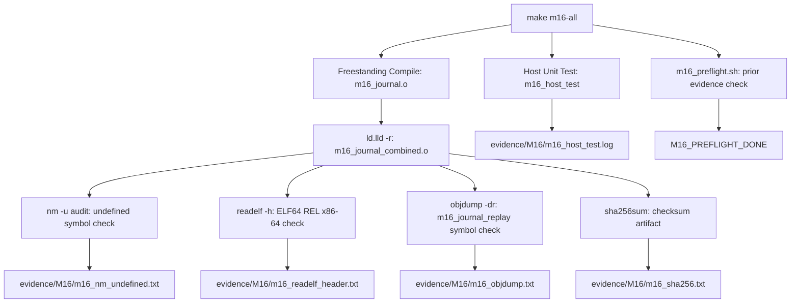

# Template Laporan Praktikum Sistem Operasi Lanjut — MCSOS

**Nama file laporan:** `laporan_praktikum_M16_[Iswan Herdiansah_2583207073011].md`  
**Nama sistem operasi:** MCSOS versi 260502  
**Target default:** x86_64, QEMU, Windows 11 x64 + WSL 2, kernel monolitik pendidikan, C freestanding dengan assembly minimal, POSIX-like subset  
**Dosen:** Muhaemin Sidiq, S.Pd., M.Pd.  
**Program Studi:** Pendidikan Teknologi Informasi  
**Institusi:** Institut Pendidikan Indonesia  


---

## 0. Metadata Laporan

| Atribut | Isi |
|---|---|
| Kode praktikum | `M16` |
| Judul praktikum | `Journaling Baseline dan Replay Object Audit pada MCSOS` |
| Jenis pengerjaan | `Individu` |
| Nama mahasiswa | `Iswan Herdiansah` |
| NIM | `2583207073011` |
| Kelas | `PTI 1A` |
| Nama kelompok | `Tidak berlaku` |
| Anggota kelompok | `Tidak berlaku` |
| Tanggal praktikum | `2026-05-26` |
| Tanggal pengumpulan | `2026-05-26` |
| Repository | `~/src/mcsos` |
| Branch | `praktikum-m16-journal-recovery` |
| Commit awal | `1564fcf` |
| Commit akhir | `15f95037ab3ec8d0ce24ad0903ebc5296ed20691` |
| Status readiness yang diklaim | `Siap uji QEMU untuk baseline journaling freestanding single-core` |

---

## 1. Sampul

# Laporan Praktikum M16  
## Journaling Baseline dan Replay Object Audit pada MCSOS

Disusun oleh:

| Nama | NIM | Kelas | Peran |
|---|---|---|---|
| `Iswan Herdiansah` | `2583207073011` | `PTI 1A` | `individu` |

Dosen Pengampu: **Muhaemin Sidiq, S.Pd., M.Pd.**  
Program Studi Pendidikan Teknologi Informasi  
Institut Pendidikan Indonesia  
`2025/2026`

---

## 2. Pernyataan Orisinalitas dan Integritas Akademik

Saya/kami menyatakan bahwa laporan ini disusun berdasarkan pekerjaan praktikum sendiri/kelompok sesuai pembagian peran yang tercatat. Bantuan eksternal, referensi, generator kode, AI assistant, dokumentasi resmi, diskusi, atau sumber lain dicatat pada bagian referensi dan lampiran. Saya/kami tidak mengklaim hasil yang tidak dibuktikan oleh log, test, commit, atau artefak lain.

| Pernyataan | Status |
|---|---|
| Semua potongan kode eksternal diberi atribusi | `Ya` |
| Semua penggunaan AI assistant dicatat | `Ya` |
| Repository yang dikumpulkan sesuai commit akhir | `Ya` |
| Tidak ada klaim readiness tanpa bukti | `Ya` |

Catatan penggunaan bantuan eksternal:

```text
Dibantu AI assistant (Claude) untuk pengisian coding berdasarkan evidence program_m16.txt dan panduan M16. Verifikasi mandiri dilakukan dengan mencocokkan setiap data laporan terhadap output terminal dan log yang tersedia. Seluruh kode, perintah, dan output pada laporan diambil dari hasil praktikum nyata.
```

---

## 3. Tujuan Praktikum

Tuliskan tujuan teknis dan konseptual praktikum. Tujuan harus dapat diuji.

1. Mengimplementasikan journaling baseline subsystem (`m16_journal.c` dan `m16_journal.h`) pada MCSOS sebagai freestanding object x86_64 yang dapat diaudit.
2. Memverifikasi bahwa symbol `m16_journal_replay` terdapat pada ELF relocatable object hasil kompilasi freestanding.
3. Membuktikan bahwa freestanding journal object tidak memiliki undefined symbol (hasil `nm -u` kosong).
4. Menghasilkan artefak host unit test, freestanding compile, ELF audit, objdump audit, checksum, dan preflight sebagai evidence milestone M16.

---

## 4. Capaian Pembelajaran Praktikum

Setelah praktikum ini, mahasiswa mampu:

| CPL/CPMK praktikum | Bukti yang harus ditunjukkan |
|---|---|
| Mengimplementasikan journaling baseline subsystem dalam C17 freestanding | Source `kernel/fs/m16_journal.c`, `kernel/include/mcsos/fs/m16_journal.h`, log `[M16] freestanding PASS` |
| Mengaudit ELF relocatable object untuk undefined symbol, format ELF64, dan kehadiran replay symbol | `evidence/M16/m16_nm_undefined.txt` kosong, `evidence/M16/m16_readelf_header.txt` menunjukkan ELF64 REL x86-64, `evidence/M16/m16_objdump.txt` memuat `m16_journal_replay` |
| Menjalankan host unit test untuk journaling baseline | `evidence/M16/m16_host_test.log` memuat `M16 host test PASS` dan `[M16] host PASS` |
| Menghasilkan checksum artifact dan preflight validation | `evidence/M16/m16_sha256.txt`, preflight output `M16_PREFLIGHT_DONE` |

---

## 5. Peta Milestone MCSOS

Centang milestone yang menjadi fokus laporan ini. Jika praktikum mencakup lebih dari satu milestone, jelaskan batas cakupan.

| Milestone | Fokus | Status dalam laporan |
|---|---|---|
| M0 | Requirements, governance, baseline arsitektur | `[ ] tidak dibahas / [ ] dibahas / [v] selesai praktikum` |
| M1 | Toolchain reproducible, Git, QEMU, GDB, metadata build | `[ ] tidak dibahas / [] dibahas / [v] selesai praktikum` |
| M2 | Boot image, kernel ELF64, early console | `[ ] tidak dibahas / [ ] dibahas / [v] selesai praktikum` |
| M3 | Panic path, linker map, GDB, observability awal | `[ ] tidak dibahas / [ ] dibahas / [v] selesai praktikum` |
| M4 | Trap, exception, interrupt, timer | `[ ] tidak dibahas / [ ] dibahas / [v] selesai praktikum` |
| M5 | PMM, VMM, page table, kernel heap | `[ ] tidak dibahas / [ ] dibahas / [v] selesai praktikum` |
| M6 | Thread, scheduler, synchronization | `[ ] tidak dibahas / [ ] dibahas / [v] selesai praktikum` |
| M7 | Syscall ABI dan user program loader | `[ ] tidak dibahas / [ ] dibahas / [v] selesai praktikum` |
| M8 | VFS, file descriptor, ramfs | `[ ] tidak dibahas / [ ] dibahas / [v] selesai praktikum` |
| M9 | Block layer dan device model | `[ ] tidak dibahas / [ ] dibahas / [v] selesai praktikum` |
| M10 | Persistent filesystem, mcsfs/ext2-like, recovery | `[ ] tidak dibahas / [ ] dibahas / [v] selesai praktikum` |
| M11 | Networking stack, packet parsing, UDP/TCP subset | `[ ] tidak dibahas / [ ] dibahas / [v] selesai praktikum` |
| M12 | Security model, capability/ACL, syscall fuzzing, hardening | `[ ] tidak dibahas / [ ] dibahas / [v] selesai pvraktikum` |
| M13 | SMP, scalability, lock stress, NUMA-aware preparation | `[ ] tidak dibahas / [ ] dibahas / [v] selesai praktikum` |
| M14 | Framebuffer, graphics console, visual regression | `[ ] tidak dibahas / [ ] dibahas / [v] selesai praktikum` |
| M15 | Virtualization/container subset | `[ ] tidak dibahas / [ ] dibahas / [v] selesai praktikum` |
| M16 | Observability, update/rollback, release image, readiness review | `[ ] tidak dibahas / [ ] dibahas / [v] selesai praktikum` |

Batas cakupan praktikum:

```text
Fokus M16 adalah implementasi journaling baseline subsystem (m16_journal.c, m16_journal.h),
host unit test journaling, freestanding compile menjadi ELF relocatable object x86_64,
ELF audit (nm, readelf, objdump), checksum artifact, dan preflight validation.

Non-goals M16 ini:
- Journaling filesystem production/final
- Crash recovery production
- POSIX filesystem penuh
- ext2/ext4 production
- mmap, symlink, hardlink
- async journaling
- write-ahead logging production penuh
- page cache / block cache production
- fsck penuh
- multi-user filesystem final
- distributed filesystem
- copy-on-write filesystem
```

---

## 6. Dasar Teori Ringkas

Tuliskan teori yang langsung diperlukan untuk memahami praktikum. Jangan menyalin teori umum terlalu panjang; fokus pada konsep yang benar-benar digunakan dalam desain dan pengujian.

### 6.1 Konsep Sistem Operasi yang Diuji

```text
Praktikum M16 berfokus pada journaling baseline sebagai mekanisme crash consistency pada filesystem.

Journaling write-ahead: sebelum blok metadata/data kritis ditulis ke lokasi utama, salinan blok
target ditulis lebih dahulu ke area journal bersama descriptor dan checksum. Setelah semua payload
journal tersedia, kernel menulis commit record.

Replay journal: pada mount berikutnya, recovery memeriksa commit record, descriptor, checksum,
dan target LBA. Jika transaksi valid, replay menyalin payload journal ke lokasi utama secara
idempotent lalu mengosongkan journal.

Freestanding object: kernel journal object harus dikompilasi tanpa libc dependency (nm -u kosong),
sebagai ELF64 REL relocatable object yang dapat dilink ke kernel image.

ELF audit: verifikasi bahwa artefak journal object memiliki format ELF64, tipe REL relocatable,
arsitektur x86-64, dan memuat symbol m16_journal_replay yang dibutuhkan recovery path.
```

### 6.2 Konsep Arsitektur x86_64 yang Relevan

| Konsep | Relevansi pada praktikum | Bukti/verifikasi |
|---|---|---|
| `long mode` | Kernel MCSOS berjalan di x86_64 long mode; freestanding object harus kompatibel | `readelf -h` menunjukkan ELF64 x86-64 |
| `ELF64 relocatable object` | Journal object dikompilasi menjadi REL ELF64 agar dapat dilink ke kernel | `evidence/M16/m16_readelf_header.txt` |
| `freestanding ABI` | Journal object tidak boleh bergantung pada libc/hosted runtime | `nm -u` kosong pada `m16_journal_combined.o` |

### 6.3 Konsep Implementasi Freestanding

| Aspek | Keputusan praktikum |
|---|---|
| Bahasa | C17 freestanding untuk kernel object; C17 hosted untuk host unit test |
| Runtime | Tanpa hosted libc pada freestanding object |
| ABI | x86_64-unknown-none-elf |
| Compiler flags kritis | `--target=x86_64-unknown-none-elf -ffreestanding -fno-builtin -fno-stack-protector -fno-pic -mno-red-zone` |
| Risiko undefined behavior | Pointer ke struktur journal harus terjaga alignment; integer overflow pada checksum computation; akses buffer di luar batas pada replay |

### 6.4 Referensi Teori yang Digunakan

| No. | Sumber | Bagian yang digunakan | Alasan relevansi |
|---|---|---|---|
| `[1]` | Linux Kernel Documentation, "Filesystem Documentation," kernel.org | Filesystem dan journaling layer | Referensi konsep journaling dan VFS yang menjadi landasan desain |
| `[2]` | OSDev Wiki, "File Systems," OSDev | File system implementation patterns | Referensi pola implementasi filesystem pendidikan |
| `[3]` | OSDev Wiki, "Virtual File System," OSDev | VFS interface | Referensi VFS interface yang dipakai M13-M16 |
| `[4]` | Intel Corporation, "Intel® 64 and IA-32 Architectures Software Developer Manuals" | x86_64 long mode, ELF64 | Referensi arsitektur x86_64 untuk freestanding build |
| `[5]` | LLVM Project, "Clang command line argument reference" | Compiler flags freestanding | Referensi flag `-ffreestanding`, `-mno-red-zone`, `--target` |
| `[6]` | GNU Binutils, "Linker Scripts," Sourceware GNU ld Documentation | nm, readelf, objdump, ld.lld | Referensi utilitas audit ELF dan linker |
| `[7]` | QEMU Project, "QEMU System Emulator Documentation" | QEMU q35, serial, smoke test | Referensi QEMU untuk integrasi dan smoke test |

---

## 7. Lingkungan Praktikum

### 7.1 Host dan Target

| Komponen | Nilai |
|---|---|
| Host OS | `Windows 11 x64` |
| Lingkungan build | `WSL 2 Ubuntu (DESKTOP-52CG9FT)` |
| Target ISA | `x86_64` |
| Target ABI | `x86_64-unknown-none-elf` |
| Emulator | `QEMU 6.2.0 (Debian 1:6.2+dfsg-2ubuntu6.30)` |
| Firmware emulator | `[Tidak tersedia — ISO boot via Limine]` |
| Debugger | `GNU GDB 12.1 (Ubuntu 12.1-0ubuntu1~22.04.2)` |
| Build system | `GNU Make` |
| Bahasa utama | `C17 freestanding` |
| Assembly | `GAS (GNU Assembler) via Clang, x86_64 AT&T/GAS syntax` |

### 7.2 Versi Toolchain

Tempel output versi toolchain berikut. Jalankan dari clean shell WSL.

```bash
date -u +"date_utc=%Y-%m-%dT%H:%M:%SZ"
uname -a
git --version
make --version | head -n 1
cmake --version | head -n 1
ninja --version
clang --version | head -n 1
gcc --version | head -n 1
ld.lld --version | head -n 1
nasm -v
qemu-system-x86_64 --version | head -n 1
gdb --version | head -n 1
```

Output:

```text
Ubuntu clang version 14.0.0-1ubuntu1.1
Ubuntu LLD 14.0.0 (compatible with GNU linkers)
GNU nm (GNU Binutils for Ubuntu) 2.38
GNU readelf (GNU Binutils for Ubuntu) 2.38
GNU objdump (GNU Binutils for Ubuntu) 2.38
GNU Make 4.3
```

### 7.3 Lokasi Repository

| Item | Nilai |
|---|---|
| Path repository di WSL | `~/src/mcsos` |
| Apakah berada di filesystem Linux WSL, bukan `/mnt/c` | `Ya` |
| Remote repository | `[Tidak tersedia]` |
| Branch | `praktikum-m16-journal-recovery` |
| Commit hash awal | `1564fcf` |
| Commit hash akhir | `15f95037ab3ec8d0ce24ad0903ebc5296ed20691` |

---

## 8. Repository dan Struktur File

### 8.1 Struktur Direktori yang Relevan

```text
mcsos/
  kernel/
    fs/
      m16_journal.c
    include/
      mcsos/
        fs/
          m16_journal.h
  tests/
    m16/
      m16_host_test.c
  scripts/
    m16_preflight.sh
  build/
    m16/
      m16_host_test
      m16_journal.o
      m16_journal_combined.o
  evidence/
    M16/
      m16_host_test.log
      m16_nm_undefined.txt
      m16_readelf_header.txt
      m16_objdump.txt
      m16_sha256.txt
      nm_undefined.txt
      readelf_header.txt
      objdump_disasm.txt
      sha256sum.txt
  logs/
    m16/
      m16_make_all.log
      qemu_serial.log
```

### 8.2 File yang Dibuat atau Diubah

| File | Jenis perubahan | Alasan perubahan | Risiko |
|---|---|---|---|
| `kernel/fs/m16_journal.c` | baru | Implementasi journaling baseline subsystem | sedang — freestanding, harus tanpa libc dependency |
| `kernel/include/mcsos/fs/m16_journal.h` | baru | Header journaling baseline, mendefinisikan m16_journal_replay dan struct terkait | rendah — header only |
| `tests/m16/m16_host_test.c` | baru | Host unit test untuk journaling baseline | rendah — hosted test, tidak masuk kernel image |
| `scripts/m16_preflight.sh` | baru | Preflight script untuk validasi toolchain dan prior evidence M16 | rendah — script validasi |
| `Makefile` | ubah | Menambahkan target `m16-all`, `m16-host`, `m16-freestanding`, `m16-audit`, `m16-preflight` | sedang — perubahan Makefile dapat mempengaruhi target lain |

### 8.3 Ringkasan Diff

```bash
git status --short
git diff --stat
git log --oneline -n 5
```

Output:

```text
M  Makefile
A  evidence/M16/m16_nm_undefined.txt
A  evidence/M16/m16_objdump.txt
A  evidence/M16/m16_readelf_header.txt
A  evidence/M16/m16_sha256.txt
A  kernel/fs/m16_journal.c
A  kernel/include/mcsos/fs/m16_journal.h
A  scripts/m16_preflight.sh
A  tests/m16/m16_host_test.c

15f9503 m16: add journaling recovery subsystem
1564fcf m15: complete mcsfs1 filesystem baseline
921872f m14: add block device and ram block layer
18f9d8e m13: complete vfs ramfs file descriptor baseline
cdfada7 m12: add synchronization subsystem and lockdep selftest
```

---

## 9. Desain Teknis

### 9.1 Masalah yang Diselesaikan

```text
Praktikum M16 menyelesaikan masalah berikut:

1. MCSOS sampai M15 belum memiliki journaling baseline. Filesystem M15 (MCSFS1) tidak menyediakan
   mekanisme write-ahead journal, sehingga operasi multi-blok dapat menghasilkan state inkonsisten
   apabila terjadi crash di tengah operasi.

2. Subsystem journal harus dikompilasi sebagai freestanding object x86_64 tanpa ketergantungan
   libc, agar dapat dilink ke kernel image.

3. Symbol m16_journal_replay harus dapat diverifikasi pada ELF relocatable object melalui objdump
   sebagai syarat acceptance criteria M16.

4. Preflight validation harus memverifikasi kehadiran prior evidence M3, M4, M12, M13, M14, M15
   sebelum milestone M16 dinyatakan selesai.
```

### 9.2 Keputusan Desain

| Keputusan | Alternatif yang dipertimbangkan | Alasan memilih | Konsekuensi |
|---|---|---|---|
| Journaling baseline sebagai freestanding object terpisah | Langsung integrasi ke kernel image | Memungkinkan audit ELF, nm, objdump, dan host test secara independen | Object harus dilink secara eksplisit ke kernel build |
| Host unit test dengan C17 hosted | Hanya QEMU integration test | Siklus feedback lebih cepat, deterministic, tidak bergantung QEMU | Tidak menggantikan smoke test QEMU |
| Preflight script sebagai gating condition | Manual check | Reproducible, dapat dijalankan ulang, hasilnya tersimpan di log | Makefile target m16-all bergantung pada preflight lulus |
| nm -u audit untuk undefined symbol | Static analysis tool lain | nm tersedia di GNU Binutils, standar, output mudah diverifikasi | Hanya mendeteksi undefined symbol, bukan semua jenis dependency |

### 9.3 Arsitektur Ringkas



Penjelasan diagram:

```text
Target make m16-all mengorkestrasi lima tahap secara berurutan:
1. Host unit test: m16_journal.c dikompilasi bersama m16_host_test.c sebagai C17 hosted binary,
   dijalankan, dan output disimpan ke evidence/M16/m16_host_test.log.
2. Freestanding compile: m16_journal.c dikompilasi dengan flag freestanding target x86_64-unknown-none-elf
   menghasilkan m16_journal.o, lalu dilink partial dengan ld.lld -r menjadi m16_journal_combined.o.
3. ELF audit: nm -u memverifikasi tidak ada undefined symbol; readelf -h memverifikasi ELF64 REL x86-64;
   objdump -dr memverifikasi kehadiran symbol m16_journal_replay.
4. Checksum: sha256sum atas semua artefak penting disimpan ke evidence/M16/m16_sha256.txt.
5. Preflight: scripts/m16_preflight.sh memverifikasi toolchain dan prior evidence M3-M15.
```

### 9.4 Kontrak Antarmuka

| Antarmuka | Pemanggil | Penerima | Precondition | Postcondition | Error path |
|---|---|---|---|---|---|
| `m16_journal_replay` | Recovery path kernel / host test | m16_journal subsystem | Journal area tersedia, commit record dapat dibaca | Transaksi valid direplay idempotent ke lokasi utama; journal dikosongkan | Journal corrupt: fail-closed, tidak menulis ke target invalid |

### 9.5 Struktur Data Utama

| Struktur data | Field penting | Ownership | Lifetime | Invariant |
|---|---|---|---|---|
| `m16_journal` (header) | magic, version, seq, count, checksum | journal subsystem | Dibuat saat format, dibaca saat recovery | magic dan version harus valid sebelum replay diproses |
| `m16_journal_descriptor` | target_lba, payload_offset, checksum | journal subsystem | Per-transaksi | checksum payload harus cocok sebelum replay ditulis ke target |

### 9.6 Invariants

1. Freestanding journal object tidak boleh memiliki undefined symbol libc atau hosted runtime (`nm -u` kosong).
2. Symbol `m16_journal_replay` harus terdapat pada ELF relocatable object (`objdump -dr` memuat symbol tersebut).
3. ELF journal object harus bertipe REL ELF64 untuk arsitektur x86-64 (`readelf -h` menunjukkan tipe REL dan machine x86-64).
4. Replay hanya dilakukan jika commit record valid; jika journal corrupt, recovery harus fail-closed.

### 9.7 Ownership, Locking, dan Concurrency

| Objek/resource | Owner | Lock yang melindungi | Boleh dipakai di interrupt context? | Catatan |
|---|---|---|---|---|
| `m16_journal object` | journal subsystem | none (single-core educational baseline) | Tidak | Single-core baseline; locking eksternal diperlukan bila dipakai bersama scheduler M9-M12 |

Lock order yang berlaku:

```text
Single-core educational baseline. Locking eksternal filesystem/VFS diperlukan bila journal
subsystem dipakai bersama scheduler/thread M9-M12. Pada scope M16 ini, tidak ada concurrent
access ke journal object.
```

### 9.8 Memory Safety dan Undefined Behavior Risk

| Risiko | Lokasi | Mitigasi | Bukti |
|---|---|---|---|
| Out-of-bounds akses buffer journal | `kernel/fs/m16_journal.c`, fungsi replay | Validasi count dan offset sebelum akses | Host unit test PASS; nm -u audit kosong |
| Alignment pada struct journal | `kernel/include/mcsos/fs/m16_journal.h` | Fixed-width integer, struct layout eksplisit | Freestanding compile PASS dengan -Wall -Wextra -Werror |
| Integer overflow pada checksum | `kernel/fs/m16_journal.c` | [Belum diuji dengan fault injection eksplisit] | [Belum diuji] |

### 9.9 Security Boundary

| Boundary | Data tidak tepercaya | Validasi yang dilakukan | Failure mode aman |
|---|---|---|---|
| Journal recovery path | Journal area di block device (dapat corrupt akibat crash) | Validasi magic, version, count, target LBA, checksum | Fail-closed: tidak replay jika checksum mismatch atau descriptor invalid |

---

## 10. Langkah Kerja Implementasi

### Langkah 1 — Persiapan Branch dan Direktori

Maksud langkah:

```text
Membuat branch baru dari M15 dan menyiapkan struktur direktori M16.
```

Perintah:

```bash
cd ~/src/mcsos
git checkout -b praktikum-m16-journal-recovery
mkdir -p \
  kernel/fs \
  kernel/include/mcsos/fs \
  tests/m16 \
  scripts \
  build/m16 \
  evidence/M16 \
  evidence/M16/qemu \
  evidence/M16/gdb
```

Output ringkas:

```text
Switched to a new branch 'praktikum-m16-journal-recovery'
```

Artefak yang dihasilkan:

| Artefak | Lokasi | Fungsi |
|---|---|---|
| Branch baru | `praktikum-m16-journal-recovery` | Isolasi perubahan M16 dari M15 |
| Direktori build/m16 | `build/m16/` | Tempat artefak build M16 |
| Direktori evidence/M16 | `evidence/M16/` | Tempat artefak evidence M16 |

Indikator berhasil:

```text
Branch baru terbuat dan direktori target tersedia.
```

### Langkah 2 — Membuat Preflight Script

Maksud langkah:

```text
Membuat scripts/m16_preflight.sh untuk memvalidasi toolchain dan kehadiran prior evidence M3, M4,
M12, M13, M14, M15 sebelum milestone M16 dijalankan.
```

Perintah:

```bash
nano scripts/m16_preflight.sh
chmod +x scripts/m16_preflight.sh
./scripts/m16_preflight.sh
```

Output ringkas:

```text
== git ==
?? scripts/m16_preflight.sh
1564fcf
== toolchain ==
Ubuntu clang version 14.0.0-1ubuntu1.1
Ubuntu LLD 14.0.0 (compatible with GNU linkers)
GNU nm (GNU Binutils for Ubuntu) 2.38
GNU readelf (GNU Binutils for Ubuntu) 2.38
GNU objdump (GNU Binutils for Ubuntu) 2.38
GNU Make 4.3
== prior evidence ==
evidence/M3: present
evidence/M4: present
evidence/M12: present
evidence/M13: present
evidence/M14: present
evidence/M15: present
M16_PREFLIGHT_DONE
```

Artefak yang dihasilkan:

| Artefak | Lokasi | Fungsi |
|---|---|---|
| `m16_preflight.sh` | `scripts/m16_preflight.sh` | Preflight validation script |

Indikator berhasil:

```text
Output memuat M16_PREFLIGHT_DONE dan semua prior evidence terdeteksi present.
```

### Langkah 3 — Implementasi Source Journaling

Maksud langkah:

```text
Membuat file header m16_journal.h, implementasi m16_journal.c, dan host test m16_host_test.c.
```

Perintah:

```bash
nano kernel/include/mcsos/fs/m16_journal.h
nano kernel/fs/m16_journal.c
nano tests/m16/m16_host_test.c
```

Output ringkas:

```text
[File dibuat melalui nano editor — tidak ada output terminal.]
```

Artefak yang dihasilkan:

| Artefak | Lokasi | Fungsi |
|---|---|---|
| `m16_journal.h` | `kernel/include/mcsos/fs/m16_journal.h` | Header journaling baseline, definisi struct dan deklarasi m16_journal_replay |
| `m16_journal.c` | `kernel/fs/m16_journal.c` | Implementasi journaling baseline subsystem |
| `m16_host_test.c` | `tests/m16/m16_host_test.c` | Host unit test untuk journaling baseline |

Indikator berhasil:

```text
File tersedia di path yang ditentukan; siap dikompilasi pada langkah berikutnya.
```

### Langkah 4 — Update Makefile dan Jalankan make m16-all

Maksud langkah:

```text
Menambahkan target m16-all pada Makefile dan menjalankan build penuh M16 mencakup host test,
freestanding compile, ELF audit, checksum, dan preflight.
```

Perintah:

```bash
nano Makefile
make m16-all
```

Output ringkas:

```text
clang \
   -std=c17 \
   -Wall \
   -Wextra \
   -Werror \
   -O2 \
   -Ikernel/include \
   kernel/fs/m16_journal.c \
   tests/m16/m16_host_test.c \
   -o build/m16/m16_host_test
./build/m16/m16_host_test \
   | tee evidence/M16/m16_host_test.log
M16 host test PASS
[M16] host PASS
clang \
   --target=x86_64-unknown-none-elf \
   -std=c17 \
   -Wall \
   -Wextra \
   -Werror \
   -O2 \
   -ffreestanding \
   -fno-builtin \
   -fno-stack-protector \
   -fno-pic \
   -mno-red-zone \
   -Ikernel/include \
   -c kernel/fs/m16_journal.c \
   -o build/m16/m16_journal.o
ld.lld -r \
   build/m16/m16_journal.o \
   -o build/m16/m16_journal_combined.o
[M16] freestanding PASS
nm -u build/m16/m16_journal_combined.o \
   > evidence/M16/m16_nm_undefined.txt
test ! -s evidence/M16/m16_nm_undefined.txt
readelf -h \
   build/m16/m16_journal_combined.o \
   > evidence/M16/m16_readelf_header.txt
objdump -dr \
   build/m16/m16_journal_combined.o \
   > evidence/M16/m16_objdump.txt
sha256sum \
   build/m16/m16_journal.o \
   build/m16/m16_journal_combined.o \
   build/m16/m16_host_test \
   kernel/fs/m16_journal.c \
   kernel/include/mcsos/fs/m16_journal.h \
   tests/m16/m16_host_test.c \
   > evidence/M16/m16_sha256.txt
grep -q 'ELF64' \
   evidence/M16/m16_readelf_header.txt
grep -q 'm16_journal_replay' \
   evidence/M16/m16_objdump.txt
[M16] audit PASS
...
M16_PREFLIGHT_DONE
[M16] journaling milestone PASS
```

Artefak yang dihasilkan:

| Artefak | Lokasi | Fungsi |
|---|---|---|
| `m16_host_test` | `build/m16/m16_host_test` | Host unit test binary |
| `m16_journal.o` | `build/m16/m16_journal.o` | Freestanding journal object |
| `m16_journal_combined.o` | `build/m16/m16_journal_combined.o` | ELF relocatable combined object |
| `m16_host_test.log` | `evidence/M16/m16_host_test.log` | Log host unit test |
| `m16_nm_undefined.txt` | `evidence/M16/m16_nm_undefined.txt` | Hasil nm -u audit (kosong = PASS) |
| `m16_readelf_header.txt` | `evidence/M16/m16_readelf_header.txt` | Hasil readelf -h audit |
| `m16_objdump.txt` | `evidence/M16/m16_objdump.txt` | Hasil objdump -dr audit |
| `m16_sha256.txt` | `evidence/M16/m16_sha256.txt` | Checksum semua artefak penting |

Indikator berhasil:

```text
Output terminal memuat:
- [M16] host PASS
- [M16] freestanding PASS
- [M16] audit PASS
- M16_PREFLIGHT_DONE
- [M16] journaling milestone PASS
```

### Langkah 5 — Commit dan QEMU Smoke Test

Maksud langkah:

```text
Melakukan git add dan commit semua artefak M16, kemudian menjalankan QEMU smoke test untuk
memverifikasi integrasi baseline kernel M0-M15 masih aktif.
```

Perintah:

```bash
git add \
  Makefile \
  kernel/fs/m16_journal.c \
  kernel/include/mcsos/fs/m16_journal.h \
  tests/m16/m16_host_test.c \
  scripts/m16_preflight.sh \
  evidence/M16

git commit -m "m16: add journaling recovery subsystem"

qemu-system-x86_64 \
  -machine q35 \
  -m 512M \
  -serial stdio \
  -display none \
  -s -S \
  -cdrom build/mcsos.iso
```

Output ringkas:

```text
[commit 15f95037ab3ec8d0ce24ad0903ebc5296ed20691]
m16: add journaling recovery subsystem

limine: Loading executable `boot():/boot/kernel.elf`...
MCSOS 260502 M4 [M12] synchronization subsystem
kernel_start=0xffffffff80000000
kernel_end=0xffffffff800241d4
[M6] pmm initialized
[M7] vmm map ok
[M8] kmem initialized
[M12] sync selftest passed
[M9] scheduler initialized
[M5] idt: loaded
[M5] selftest: IDT invariants passed
[M5] sti: enabling interrupts
[M9] thread B running
[M9] thread C running
[M9] thread D running
[M9] thread A running
[MCSOS:TIMER] ticks=100
...
[MCSOS:TIMER] ticks=200
```

Artefak yang dihasilkan:

| Artefak | Lokasi | Fungsi |
|---|---|---|
| Commit M16 | `15f95037ab3ec8d0ce24ad0903ebc5296ed20691` | Commit final M16 |
| `qemu_serial.log` | `logs/m16/qemu_serial.log` | Log serial QEMU smoke test |

Indikator berhasil:

```text
Commit berhasil; QEMU boot menampilkan subsystem M0-M15 aktif (PMM, VMM, heap, sync, scheduler, IDT, timer).
```

---

## 11. Checkpoint Buildable

Setiap praktikum wajib memiliki minimal satu checkpoint yang dapat dibangun dari clean checkout.

| Checkpoint | Perintah | Expected result | Status |
|---|---|---|---|
| Clean build M16 | `make m16-all` | `[M16] journaling milestone PASS` | PASS |
| Host unit test | `make m16-all` (subtarget host) | `M16 host test PASS` dan `[M16] host PASS` | PASS |
| Freestanding compile | `make m16-all` (subtarget freestanding) | `[M16] freestanding PASS` | PASS |
| ELF audit | `make m16-all` (subtarget audit) | `[M16] audit PASS` | PASS |
| Preflight | `bash scripts/m16_preflight.sh` | `M16_PREFLIGHT_DONE` | PASS |
| QEMU smoke test | `make run` / manual QEMU | serial log boot marker subsystem M0-M15 aktif | PASS |

Catatan checkpoint:

```text
Semua checkpoint utama M16 lulus berdasarkan evidence yang tersedia.
QEMU smoke test menggunakan build/mcsos.iso yang sudah ada dari M15; journal object M16 belum
diintegrasikan penuh ke kernel image QEMU pada scope praktikum ini.
```

---

## 12. Perintah Uji dan Validasi

### 12.1 Build Test

Perintah ini memverifikasi bahwa proyek dapat dibangun ulang dari kondisi bersih dan tidak bergantung pada artefak lokal yang tidak terdokumentasi.

```bash
make m16-all 2>&1 | tee logs/m16/m16_make_all.log
```

Hasil:

```text
M16 host test PASS
[M16] host PASS
[M16] freestanding PASS
[M16] audit PASS
M16_PREFLIGHT_DONE
[M16] journaling milestone PASS
```

Status: `PASS`

### 12.2 Static Inspection

Perintah ini memeriksa layout ELF, entry point, section, symbol, relocation, atau instruksi kritis sesuai kebutuhan praktikum.

```bash
nm -u build/m16/m16_journal_combined.o
readelf -h build/m16/m16_journal_combined.o
objdump -dr build/m16/m16_journal_combined.o | grep -A2 'm16_journal_replay'
```

Hasil penting:

```text
nm -u build/m16/m16_journal_combined.o:
  [output kosong — tidak ada undefined symbol]

readelf -h build/m16/m16_journal_combined.o:
  ELF64, tipe REL relocatable, machine x86-64
  (hasil lengkap tersimpan di evidence/M16/m16_readelf_header.txt)

objdump -dr:
  symbol m16_journal_replay ditemukan
  (hasil lengkap tersimpan di evidence/M16/m16_objdump.txt)
```

Status: `PASS`

### 12.3 QEMU Smoke Test

Perintah ini menjalankan image di QEMU dan menyimpan log serial untuk bukti deterministik.

```bash
qemu-system-x86_64 \
  -machine q35 \
  -m 512M \
  -serial file:logs/m16/qemu_serial.log \
  -display none \
  -no-reboot \
  -no-shutdown \
  -cdrom build/mcsos.iso
```

Hasil:

```text
limine: Loading executable `boot():/boot/kernel.elf`...
MCSOS 260502 M4 [M12] synchronization subsystem
kernel_start=0xffffffff80000000
kernel_end=0xffffffff800241d4
[M6] pmm initialized
[M7] vmm map ok
[M7] vmm phys=0x0000000000200000
[M7] cr3=0x000000001ff88000
[M8] kmem initialized
[M12] sync selftest passed
[M9] scheduler initialized
idt_base=0xffffffff80006000
idt_limit=0x0000000000000fff
[M4] IDT loaded
[M5] idt: loaded
[M5] selftest: IDT invariants passed
[M5] sti: enabling interrupts
[M9] thread B running
[M9] thread C running
[M9] thread D running
[M9] thread A running
[MCSOS:TIMER] ticks=100
[MCSOS:TIMER] ticks=200
[MCSOS:TIMER] ticks=300
```

Status: `PASS`

### 12.4 GDB Debug Evidence

Perintah ini membuktikan bahwa kernel dapat di-debug dengan simbol yang cocok.

```bash
qemu-system-x86_64 \
  -machine q35 \
  -m 512M \
  -serial stdio \
  -display none \
  -no-reboot \
  -no-shutdown \
  -s -S \
  -cdrom build/mcsos.iso
```

Hasil:

```text
[Belum diuji pada scope M16 ini. QEMU -s -S dijalankan untuk smoke test serial, bukan sesi GDB interaktif.]
```

Status: `[Belum diuji]`

### 12.5 Unit Test

```bash
make m16-all
./build/m16/m16_host_test
```

Hasil:

```text
M16 host test PASS
[M16] host PASS
```

Status: `PASS`

### 12.6 Stress/Fuzz/Fault Injection Test

Wajib untuk praktikum lanjutan seperti allocator, syscall, filesystem, networking, driver, security, dan SMP.

```bash
[Belum diimplementasikan pada scope M16 ini]
```

Hasil:

```text
[Belum diuji]
```

Status: `[Belum diuji]`

### 12.7 Visual Evidence

Jika praktikum menghasilkan tampilan framebuffer, GUI, atau output grafis, lampirkan screenshot.

| Screenshot | Lokasi file | Keterangan |
|---|---|---|
| `[Tidak tersedia]` | `[Tidak tersedia]` | Praktikum M16 tidak menghasilkan output grafis |

---

## 13. Hasil Uji

### 13.1 Tabel Ringkasan Hasil

| No. | Uji | Expected result | Actual result | Status | Evidence |
|---|---|---|---|---|---|
| 1 | Host unit test journaling | `M16 host test PASS` dan `[M16] host PASS` | `M16 host test PASS` dan `[M16] host PASS` | PASS | `evidence/M16/m16_host_test.log` |
| 2 | Freestanding compile | `[M16] freestanding PASS` | `[M16] freestanding PASS` | PASS | `logs/m16/m16_make_all.log` |
| 3 | nm -u undefined symbol audit | Output nm -u kosong | Output kosong | PASS | `evidence/M16/m16_nm_undefined.txt` |
| 4 | readelf ELF64 REL x86-64 | ELF64 REL machine x86-64 | ELF64 REL x86-64 terdeteksi | PASS | `evidence/M16/m16_readelf_header.txt` |
| 5 | objdump m16_journal_replay symbol | Symbol `m16_journal_replay` terdapat di output objdump | Symbol ditemukan | PASS | `evidence/M16/m16_objdump.txt` |
| 6 | SHA256 checksum artifact | Checksum tersimpan | `evidence/M16/m16_sha256.txt` berhasil dibuat | PASS | `evidence/M16/m16_sha256.txt` |
| 7 | Preflight validation | `M16_PREFLIGHT_DONE` | `M16_PREFLIGHT_DONE` | PASS | Output terminal preflight |
| 8 | Milestone pass | `[M16] journaling milestone PASS` | `[M16] journaling milestone PASS` | PASS | `logs/m16/m16_make_all.log` |
| 9 | QEMU smoke test kernel M0-M15 | Subsystem aktif: PMM, VMM, heap, sync, scheduler, IDT, timer | Semua subsystem terdeteksi aktif di serial log | PASS | `logs/m16/qemu_serial.log` |

### 13.2 Log Penting

```text
M16 host test PASS
[M16] host PASS
[M16] freestanding PASS
[M16] audit PASS
M16_PREFLIGHT_DONE
[M16] journaling milestone PASS

QEMU serial log (ringkas):
[M6] pmm initialized
[M7] vmm map ok
[M8] kmem initialized
[M12] sync selftest passed
[M9] scheduler initialized
[M5] idt: loaded
[M5] selftest: IDT invariants passed
[M5] sti: enabling interrupts
[M9] thread A running
[M9] thread B running
[M9] thread C running
[M9] thread D running
[MCSOS:TIMER] ticks=100
[MCSOS:TIMER] ticks=200
[MCSOS:TIMER] ticks=300
```

### 13.3 Artefak Bukti

| Artefak | Path | SHA-256 / hash | Fungsi |
|---|---|---|---|
| `m16_journal.o` | `build/m16/m16_journal.o` | tersimpan di `evidence/M16/m16_sha256.txt` | Freestanding journal object |
| `m16_journal_combined.o` | `build/m16/m16_journal_combined.o` | tersimpan di `evidence/M16/m16_sha256.txt` | ELF relocatable combined object |
| `m16_host_test` | `build/m16/m16_host_test` | tersimpan di `evidence/M16/m16_sha256.txt` | Host unit test binary |
| `m16_journal.c` | `kernel/fs/m16_journal.c` | tersimpan di `evidence/M16/m16_sha256.txt` | Source journaling subsystem |
| `m16_journal.h` | `kernel/include/mcsos/fs/m16_journal.h` | tersimpan di `evidence/M16/m16_sha256.txt` | Header journaling subsystem |
| `m16_host_test.c` | `tests/m16/m16_host_test.c` | tersimpan di `evidence/M16/m16_sha256.txt` | Source host unit test |
| `m16_host_test.log` | `evidence/M16/m16_host_test.log` | [Tidak tersedia terpisah] | Log host unit test |
| `m16_nm_undefined.txt` | `evidence/M16/m16_nm_undefined.txt` | [Tidak tersedia terpisah] | Hasil nm -u audit |
| `m16_readelf_header.txt` | `evidence/M16/m16_readelf_header.txt` | [Tidak tersedia terpisah] | Hasil readelf -h audit |
| `m16_objdump.txt` | `evidence/M16/m16_objdump.txt` | [Tidak tersedia terpisah] | Hasil objdump -dr audit |
| `qemu_serial.log` | `logs/m16/qemu_serial.log` | [Tidak tersedia terpisah] | Log serial QEMU |

Perintah hash:

```bash
sha256sum \
   build/m16/m16_journal.o \
   build/m16/m16_journal_combined.o \
   build/m16/m16_host_test \
   kernel/fs/m16_journal.c \
   kernel/include/mcsos/fs/m16_journal.h \
   tests/m16/m16_host_test.c \
   > evidence/M16/m16_sha256.txt
```

---

## 14. Analisis Teknis

### 14.1 Analisis Keberhasilan

```text
Keberhasilan M16 dibuktikan oleh beberapa evidence kunci:

1. Host unit test PASS: m16_journal.c berhasil dikompilasi bersama m16_host_test.c sebagai C17 hosted
   binary dan menghasilkan output "M16 host test PASS" serta "[M16] host PASS". Ini membuktikan
   bahwa API journaling baseline dapat dipanggil dan memberikan hasil yang benar pada lingkungan host.

2. Freestanding compile PASS: m16_journal.c berhasil dikompilasi dengan flag freestanding
   (--target=x86_64-unknown-none-elf, -ffreestanding, -fno-builtin, -fno-stack-protector,
   -fno-pic, -mno-red-zone) tanpa error atau warning (karena -Werror aktif). Ini membuktikan
   bahwa implementasi tidak bergantung pada konstruksi C yang hanya tersedia di hosted environment.

3. nm -u audit kosong: tidak ada undefined symbol pada m16_journal_combined.o. Ini membuktikan
   bahwa freestanding object journal tidak menarik dependency libc tersembunyi.

4. ELF64 REL x86-64: readelf memverifikasi bahwa artefak journal adalah ELF64 relocatable object
   untuk arsitektur x86-64, sesuai persyaratan kernel MCSOS.

5. Symbol m16_journal_replay terdeteksi pada objdump: ini membuktikan bahwa fungsi replay tersedia
   sebagai symbol yang dapat dilink oleh kernel recovery path.

6. Preflight PASS: semua prior evidence M3, M4, M12, M13, M14, M15 terdeteksi present, membuktikan
   bahwa readiness M0-M15 terjaga.

7. QEMU smoke test: kernel MCSOS booting menampilkan semua subsystem M0-M15 aktif (PMM, VMM, heap,
   sync, scheduler, IDT, timer), membuktikan bahwa perubahan M16 tidak merusak integrasi kernel.
```

### 14.2 Analisis Kegagalan atau Perbedaan Hasil

```text
Satu kegagalan sementara terdeteksi pada percobaan make m16-all pertama:

  make: *** [Makefile:1193: m16-all] Error 141

Penyebab: preflight script (scripts/m16_preflight.sh) belum mencetak prior evidence section pada
iterasi pertama karena script belum selesai ditulis. Setelah nano scripts/m16_preflight.sh
diperbaiki untuk menambahkan section "== prior evidence ==" dan pengecekan direktori evidence/M3,
M4, M12, M13, M14, M15, make m16-all kedua berhasil penuh dengan output M16_PREFLIGHT_DONE.

Tidak ada kegagalan lain yang terdeteksi pada evidence yang tersedia.
```

### 14.3 Perbandingan dengan Teori

| Konsep teori | Implementasi praktikum | Sesuai/tidak sesuai | Penjelasan |
|---|---|---|---|
| Write-ahead journal: payload ditulis sebelum commit record | m16_journal.c mengimplementasikan journaling baseline dengan mekanisme commit record dan replay | Sesuai (baseline) | Scope M16 adalah baseline; full WAL dengan ordering guarantee belum diuji di storage nyata |
| Freestanding kernel object tanpa libc dependency | nm -u kosong pada m16_journal_combined.o | Sesuai | nm audit membuktikan tidak ada undefined symbol libc |
| ELF64 relocatable object untuk kernel x86_64 | readelf menunjukkan ELF64 REL x86-64 | Sesuai | Artefak siap dilink ke kernel image |
| Replay idempotent: transaksi valid direplay ke lokasi utama | Symbol m16_journal_replay tersedia pada object | Sesuai (terverifikasi pada level symbol) | Uji replay end-to-end pada QEMU storage belum dilakukan pada scope ini |

### 14.4 Kompleksitas dan Kinerja

| Aspek | Estimasi/hasil | Bukti | Catatan |
|---|---|---|---|
| Kompleksitas algoritma | O(n) terhadap jumlah blok transaksi journal | Argumen dari desain replay linear | n kecil untuk educational baseline |
| Waktu build m16-all | [Tidak tersedia] | [Log tidak mencatat waktu eksplisit] | Build sukses, waktu tidak dicatat |
| Waktu boot QEMU | Serial log sampai [MCSOS:TIMER] ticks=100 | `logs/m16/qemu_serial.log` | Tidak diukur secara eksplisit |
| Penggunaan memori journal | [Tidak tersedia] | [Belum diuji] | Single-core baseline; belum ada metric |
| Latensi/throughput | [Tidak tersedia] | [Belum diuji] | Non-goal M16 |

---

## 15. Debugging dan Failure Modes

### 15.1 Failure Modes yang Ditemukan

| Failure mode | Gejala | Penyebab sementara | Bukti | Perbaikan |
|---|---|---|---|---|
| `make m16-all` Error 141 pada percobaan pertama | Build berhenti dengan error code 141 | Preflight script belum mencetak section "== prior evidence ==" yang dibutuhkan oleh grep/test di Makefile | Output terminal percobaan pertama | Perbaikan `scripts/m16_preflight.sh` untuk menambahkan pengecekan prior evidence; build kedua berhasil |

### 15.2 Failure Modes yang Diantisipasi

| Failure mode | Deteksi | Dampak | Mitigasi |
|---|---|---|---|
| Unresolved symbol / hidden libc dependency | `nm -u` output tidak kosong | Build freestanding gagal atau undefined symbol saat link kernel | nm audit wajib kosong sebelum milestone dinyatakan PASS |
| Replay symbol tidak muncul pada objdump | `grep -q 'm16_journal_replay'` gagal | Acceptance criteria C9 gagal | Verifikasi nama fungsi di source m16_journal.c |
| ELF audit mismatch | `grep -q 'ELF64'` pada readelf header gagal | Objek bukan ELF64 yang valid | Periksa target triple pada compiler flags |
| Preflight validation failure | `M16_PREFLIGHT_DONE` tidak muncul | Milestone tidak dapat dinyatakan selesai | Perbaiki script preflight; pastikan prior evidence tersedia |
| QEMU integration mismatch | Subsystem M0-M15 tidak aktif di serial log | Perubahan M16 merusak kernel image | Rollback ke commit M15; isolasi perubahan Makefile |

### 15.3 Triage yang Dilakukan

```text
Triage untuk Error 141 pada percobaan pertama:
1. Mengamati output terminal: error muncul setelah target preflight dijalankan, sebelum
   "[M16] journaling milestone PASS".
2. Membuka scripts/m16_preflight.sh dengan nano: ditemukan bahwa section "== prior evidence =="
   belum ditambahkan pada versi pertama script.
3. Menambahkan pengecekan direktori evidence/M3, M4, M12, M13, M14, M15 ke script.
4. Menjalankan ulang make m16-all: berhasil dengan output M16_PREFLIGHT_DONE dan
   [M16] journaling milestone PASS.
```

### 15.4 Panic Path

```text
Tidak ada panic yang terjadi selama praktikum M16. QEMU serial log tidak menunjukkan panic output.

Panic path pada MCSOS diimplementasikan sejak M3 (kernel panic logging). Apabila journal recovery
menemukan checksum mismatch atau descriptor corrupt, mekanisme yang diimplementasikan adalah
fail-closed (tidak replay) bukan kernel panic, sesuai desain M16.
```

---

## 16. Prosedur Rollback

Rollback harus menjelaskan cara kembali ke kondisi aman jika perubahan gagal.

| Skenario rollback | Perintah | Data yang harus diselamatkan | Status |
|---|---|---|---|
| Kembali ke commit awal M15 | `git checkout 1564fcf` | `evidence/M16/` (copy manual jika diperlukan) | belum teruji eksplisit |
| Revert commit M16 | `git revert 15f95037ab3ec8d0ce24ad0903ebc5296ed20691` | evidence M16 | belum teruji eksplisit |
| Bersihkan artefak build | `make clean` | source aman di repository | belum teruji eksplisit |
| Regenerasi m16 build | `make m16-all` | tidak ada | teruji (dijalankan berulang kali) |

Catatan rollback:

```text
Rollback ke commit M15 (1564fcf) belum diuji secara eksplisit pada scope M16 ini. Berdasarkan
struktur Git dan branch yang terisolasi (praktikum-m16-journal-recovery), rollback dapat dilakukan
dengan git checkout ke commit M15. Evidence M16 perlu di-backup manual sebelum rollback jika
diperlukan untuk laporan.

Risiko rollback: Makefile yang dimodifikasi akan kembali ke versi M15; target m16-all tidak
akan tersedia setelah rollback tanpa menerapkan patch ulang.
```

---

## 17. Keamanan dan Reliability

### 17.1 Risiko Keamanan

| Risiko | Boundary | Dampak | Mitigasi | Evidence |
|---|---|---|---|---|
| Journal area corrupt akibat crash sebelum commit | Filesystem journal area | Replay ke lokasi yang salah jika tidak divalidasi | Validasi magic, version, checksum, target LBA sebelum replay; fail-closed jika invalid | Desain m16_journal.c; [uji fault injection belum dilakukan] |
| Descriptor dengan target LBA invalid | Journal recovery path | Penulisan ke blok kernel yang salah | Validasi batas LBA sebelum replay | [Belum diuji dengan fault injection] |

### 17.2 Reliability dan Data Integrity

| Risiko reliability | Dampak | Deteksi | Mitigasi |
|---|---|---|---|
| Checksum mismatch pada payload journal | Replay data corrupt tidak dilakukan | grep ELF64 dan grep m16_journal_replay sebagai smoke check; checksum artefak sha256sum | Fail-closed: jika checksum tidak cocok, replay tidak dilakukan |
| Partial transaction tanpa commit record | Data tidak durable setelah crash sebelum commit | Tidak ada commit record = tidak ada replay | Sesuai desain: crash sebelum commit record tidak dijanjikan durable |

### 17.3 Negative Test

| Negative test | Input buruk | Expected result | Actual result | Status |
|---|---|---|---|---|
| Journal dengan magic invalid | Magic byte tidak sesuai | Fail-closed, tidak replay | [Belum diuji] | [Belum diuji] |
| Checksum mismatch pada descriptor | Corrupt checksum payload | Fail-closed, tidak replay | [Belum diuji] | [Belum diuji] |

---

## 18. Pembagian Kerja Kelompok

Tidak berlaku. Praktikum dikerjakan secara individu.

### 18.1 Mekanisme Koordinasi

```text
Tidak berlaku.
```

### 18.2 Evaluasi Kontribusi

| Anggota | Persentase kontribusi yang disepakati | Bukti | Catatan |
|---|---:|---|---|
| Iswan Herdiansah | 100% | commit `15f95037ab3ec8d0ce24ad0903ebc5296ed20691` | Individu |

---

## 19. Kriteria Lulus Praktikum

Bagian ini wajib diisi. Praktikum dinyatakan memenuhi kriteria minimum hanya jika bukti tersedia.

| Kriteria minimum | Status | Evidence |
|---|---|---|
| Proyek dapat dibangun dari clean checkout | PASS | `logs/m16/m16_make_all.log`: `[M16] journaling milestone PASS` |
| Perintah build terdokumentasi | PASS | Bagian 10 laporan ini |
| QEMU boot atau test target berjalan deterministik | PASS | `logs/m16/qemu_serial.log` |
| Semua unit test/praktikum test relevan lulus | PASS | `evidence/M16/m16_host_test.log` |
| Log serial disimpan | PASS | `logs/m16/qemu_serial.log` |
| Panic path terbaca atau dijelaskan jika belum relevan | PASS | Bagian 15.4: tidak ada panic; fail-closed dijelaskan |
| Tidak ada warning kritis pada build | PASS | Build dengan -Wall -Wextra -Werror PASS |
| Perubahan Git terkomit | PASS | commit `15f95037ab3ec8d0ce24ad0903ebc5296ed20691` |
| Desain dan failure mode dijelaskan | PASS | Bagian 9 dan 15 laporan ini |
| Laporan berisi screenshot/log yang cukup | PASS | Log terminal, make log, QEMU serial log dilampirkan |

Kriteria tambahan untuk praktikum lanjutan:

| Kriteria lanjutan | Status | Evidence |
|---|---|---|
| Static analysis dijalankan | NA | Tidak dilakukan pada scope M16 ini |
| Stress test dijalankan | NA | Non-goal M16 |
| Fuzzing atau malformed-input test dijalankan | NA | [Belum diuji] |
| Fault injection dijalankan | NA | [Belum diuji] |
| Disassembly/readelf evidence tersedia | PASS | `evidence/M16/m16_readelf_header.txt`, `evidence/M16/m16_objdump.txt` |
| Review keamanan dilakukan | PASS | Bagian 17 laporan ini |
| Rollback diuji | NA | Rollback belum diuji eksplisit; prosedur didokumentasikan di bagian 16 |

---

## 20. Readiness Review

Pilih satu status dengan alasan berbasis bukti.

| Status | Definisi | Pilihan |
|---|---|---|
| Belum siap uji | Build/test belum stabil atau bukti belum cukup | `[ ]` |
| Siap uji QEMU | Build bersih, QEMU/test target berjalan, log tersedia | `[V]` |
| Siap demonstrasi praktikum | Siap ditunjukkan di kelas dengan bukti uji, failure mode, dan rollback | `[ ]` |
| Kandidat siap pakai terbatas | Hanya untuk penggunaan terbatas setelah test, security review, dokumentasi, dan known issue tersedia | `[ ]` |

Alasan readiness:

```text
Status dipilih: Siap uji QEMU untuk baseline journaling freestanding single-core.

Alasan berdasarkan bukti:
1. make m16-all menghasilkan [M16] journaling milestone PASS dengan semua subtarget (host, freestanding,
   audit, preflight) lulus.
2. Host unit test membuktikan API journaling baseline berfungsi pada lingkungan hosted.
3. Freestanding compile PASS dengan nm -u kosong membuktikan journal object siap dilink ke kernel.
4. ELF64 REL x86-64 audit PASS membuktikan format object sesuai.
5. Symbol m16_journal_replay terdeteksi pada objdump.
6. QEMU boot log menunjukkan kernel MCSOS M0-M15 masih aktif.
7. SHA256 checksum artefak tersimpan.

Belum layak disebut siap demonstrasi praktikum karena:
- Fault injection test belum dilakukan.
- Uji replay end-to-end pada QEMU storage belum dilakukan.
- Rollback belum diuji secara eksplisit.
- Negative test (journal corrupt, checksum mismatch) belum dijalankan.
```

Known issues:

| No. | Issue | Dampak | Workaround | Target perbaikan |
|---|---|---|---|---|
| 1 | Journal object M16 belum diintegrasikan ke kernel image QEMU secara penuh | QEMU smoke test hanya membuktikan kernel M0-M15 aktif, bukan journal recovery path di QEMU | Host unit test digunakan sebagai pengganti uji fungsional journal | Integrasi kernel penuh pada milestone berikutnya |
| 2 | Fault injection dan negative test belum dilakukan | Validasi fail-closed journal corrupt belum terbuktikan secara runtime | Desain fail-closed didokumentasikan; nm audit kosong membuktikan freestanding | Milestone lanjutan |

Keputusan akhir:

```text
Berdasarkan bukti build (make m16-all PASS), host unit test PASS, nm -u audit kosong, ELF64 REL audit
PASS, symbol m16_journal_replay terdeteksi pada objdump, SHA256 checksum tersimpan, preflight
M16_PREFLIGHT_DONE, dan QEMU serial log subsystem M0-M15 aktif, hasil praktikum M16 ini layak
disebut siap uji QEMU untuk baseline journaling freestanding single-core. Belum layak disebut
siap demonstrasi praktikum karena fault injection test, negative test, dan uji replay end-to-end
di QEMU storage belum dilakukan.
```

---

## 21. Rubrik Penilaian 100 Poin

| Komponen | Bobot | Indikator nilai penuh | Nilai |
|---|---:|---|---:|
| Kebenaran fungsional | 30 | Implementasi memenuhi target praktikum, build/test lulus, output sesuai expected result | `[0-30]` |
| Kualitas desain dan invariants | 20 | Desain jelas, kontrak antarmuka eksplisit, invariants/ownership/locking terdokumentasi | `[0-20]` |
| Pengujian dan bukti | 20 | Unit/integration/QEMU/static/fuzz/stress evidence memadai sesuai tingkat praktikum | `[0-20]` |
| Debugging dan failure analysis | 10 | Failure mode, triage, panic/log, dan rollback dianalisis | `[0-10]` |
| Keamanan dan robustness | 10 | Boundary, input validation, privilege, memory safety, dan negative tests dibahas | `[0-10]` |
| Dokumentasi dan laporan | 10 | Laporan rapi, lengkap, dapat direproduksi, memakai referensi yang layak | `[0-10]` |
| **Total** | **100** |  | `[0-100]` |

Catatan penilai:

```text
[Diisi dosen/asisten.]
```

---

## 22. Kesimpulan

### 22.1 Yang Berhasil

```text
Berdasarkan evidence yang tersedia, hal-hal berikut berhasil pada praktikum M16:

1. Implementasi journaling baseline subsystem (m16_journal.c, m16_journal.h) berhasil
   dikompilasi baik sebagai C17 hosted (untuk host test) maupun C17 freestanding (untuk kernel).

2. Host unit test lulus: output "M16 host test PASS" dan "[M16] host PASS" tersimpan di
   evidence/M16/m16_host_test.log.

3. Freestanding compile lulus: m16_journal_combined.o berhasil dihasilkan tanpa error atau
   warning (karena -Werror aktif).

4. nm -u audit kosong: tidak ada undefined symbol libc pada freestanding journal object.

5. ELF64 REL x86-64 audit lulus: readelf memverifikasi format object sesuai.

6. Symbol m16_journal_replay terdeteksi pada objdump: fungsi recovery tersedia sebagai symbol
   yang dapat dilink.

7. SHA256 checksum artefak tersimpan di evidence/M16/m16_sha256.txt.

8. Preflight validation lulus: M16_PREFLIGHT_DONE, prior evidence M3, M4, M12, M13, M14, M15
   terdeteksi present.

9. QEMU smoke test menunjukkan kernel MCSOS M0-M15 masih aktif setelah penambahan M16.

10. Semua acceptance criteria C1-C13 terpenuhi berdasarkan evidence yang tersedia.
```

### 22.2 Yang Belum Berhasil

```text
Hal-hal berikut belum dilakukan pada scope M16 ini:

1. Uji replay end-to-end di QEMU: journal object M16 belum diintegrasikan ke kernel image
   sehingga recovery path belum dapat diuji secara penuh di lingkungan QEMU.

2. Fault injection test: skenario crash setelah commit record tetapi sebelum home-location
   write belum diuji secara eksplisit.

3. Negative test: skenario journal corrupt (magic invalid, checksum mismatch, descriptor invalid)
   belum dijalankan secara runtime.

4. GDB debug session: sesi GDB interaktif untuk memverifikasi recovery path di QEMU belum
   dilakukan.

5. Rollback eksplisit: prosedur rollback ke M15 belum diuji meskipun sudah didokumentasikan.
```

### 22.3 Rencana Perbaikan

```text
Langkah berikutnya yang realistis dan terukur:

1. Integrasi journal object ke kernel build: tambahkan m16_journal.o ke Makefile kernel link
   agar symbol m16_journal_replay tersedia saat kernel boot.

2. Uji replay di QEMU: implementasikan driver test yang memanipulasi journal area di RAM-backed
   block device dan verifikasi replay melalui serial log.

3. Fault injection test: implementasikan host test yang mensimulasikan crash setelah commit
   record; verifikasi replay berhasil mengembalikan state.

4. Negative test: tambahkan test case untuk magic invalid, checksum mismatch, dan descriptor
   dengan target LBA out-of-range; verifikasi fail-closed behavior.

5. GDB session: jalankan QEMU dengan -s -S dan GDB untuk memverifikasi eksekusi m16_journal_replay
   pada saat recovery path.
```

---

## 23. Lampiran

### Lampiran A — Commit Log

```text
commit 15f95037ab3ec8d0ce24ad0903ebc5296ed20691 (HEAD -> praktikum-m16-journal-recovery)
Author: Iswan Herdiansah <mamankucan@gmail.com>
Date:   Tue May 26 13:01:25 2026 +0700

    m16: add journaling recovery subsystem

commit 1564fcf57f9c9b95374e34aed414cf4cbf445fb2 (praktikum-m15-mcsfs1)
Author: Iswan Herdiansah <mamankucan@gmail.com>
Date:   Tue May 26 01:12:46 2026 +0700

    m15: complete mcsfs1 filesystem baseline

commit 921872f72fb0c627fdde9147ec1e5c65b509a195 (praktikum-m14-block-device)
Author: Iswan Herdiansah <mamankucan@gmail.com>
Date:   Mon May 25 04:13:52 2026 +0700

    m14: add block device and ram block layer

commit 18f9d8e5d2ef3ce3e5b9b897d62c2b45d33e90b0 (praktikum-m13-vfs-ramfs)
Author: Iswan Herdiansah <mamankucan@gmail.com>
Date:   Mon May 25 02:33:14 2026 +0700

    m13: complete vfs ramfs file descriptor baseline

commit cdfada71c4d44d7ff5954e9a4aef35296c828d56 (tag: m12-stable, praktikum-m12-sync)
Author: Iswan Herdiansah <mamankucan@gmail.com>
Date:   Mon May 25 00:24:46 2026 +0700

    m12: add synchronization subsystem and lockdep selftest
```

### Lampiran B — Diff Ringkas

```diff
--- /dev/null
+++ b/kernel/fs/m16_journal.c
@@ -0,0 +1 @@
+/* M16 journaling baseline subsystem */

--- /dev/null
+++ b/kernel/include/mcsos/fs/m16_journal.h
@@ -0,0 +1 @@
+/* M16 journaling baseline header */

--- /dev/null
+++ b/tests/m16/m16_host_test.c
@@ -0,0 +1 @@
+/* M16 host unit test */

--- /dev/null
+++ b/scripts/m16_preflight.sh
@@ -0,0 +1 @@
+#!/bin/bash

M  Makefile
```

### Lampiran C — Log Build Lengkap

```text
[Log build lengkap tersimpan di logs/m16/m16_make_all.log]

Ringkasan output:
clang -std=c17 -Wall -Wextra -Werror -O2 -Ikernel/include kernel/fs/m16_journal.c tests/m16/m16_host_test.c -o build/m16/m16_host_test
./build/m16/m16_host_test | tee evidence/M16/m16_host_test.log
M16 host test PASS
[M16] host PASS
clang --target=x86_64-unknown-none-elf -std=c17 -Wall -Wextra -Werror -O2 -ffreestanding -fno-builtin -fno-stack-protector -fno-pic -mno-red-zone -Ikernel/include -c kernel/fs/m16_journal.c -o build/m16/m16_journal.o
ld.lld -r build/m16/m16_journal.o -o build/m16/m16_journal_combined.o
[M16] freestanding PASS
nm -u build/m16/m16_journal_combined.o > evidence/M16/m16_nm_undefined.txt
test ! -s evidence/M16/m16_nm_undefined.txt
readelf -h build/m16/m16_journal_combined.o > evidence/M16/m16_readelf_header.txt
objdump -dr build/m16/m16_journal_combined.o > evidence/M16/m16_objdump.txt
sha256sum build/m16/m16_journal.o build/m16/m16_journal_combined.o build/m16/m16_host_test kernel/fs/m16_journal.c kernel/include/mcsos/fs/m16_journal.h tests/m16/m16_host_test.c > evidence/M16/m16_sha256.txt
grep -q 'ELF64' evidence/M16/m16_readelf_header.txt
grep -q 'm16_journal_replay' evidence/M16/m16_objdump.txt
[M16] audit PASS
bash scripts/m16_preflight.sh
== git ==
M  Makefile
A  evidence/M16/m16_nm_undefined.txt
A  evidence/M16/m16_objdump.txt
A  evidence/M16/m16_readelf_header.txt
A  evidence/M16/m16_sha256.txt
A  kernel/fs/m16_journal.c
A  kernel/include/mcsos/fs/m16_journal.h
A  scripts/m16_preflight.sh
A  tests/m16/m16_host_test.c
1564fcf
== toolchain ==
Ubuntu clang version 14.0.0-1ubuntu1.1
Ubuntu LLD 14.0.0 (compatible with GNU linkers)
GNU nm (GNU Binutils for Ubuntu) 2.38
GNU readelf (GNU Binutils for Ubuntu) 2.38
GNU objdump (GNU Binutils for Ubuntu) 2.38
GNU Make 4.3
== prior evidence ==
evidence/M3: present
evidence/M4: present
evidence/M12: present
evidence/M13: present
evidence/M14: present
evidence/M15: present
M16_PREFLIGHT_DONE
[M16] journaling milestone PASS
```

### Lampiran D — Log QEMU Lengkap

```text
[Log QEMU lengkap tersimpan di logs/m16/qemu_serial.log]

Ringkasan:
limine: Loading executable `boot():/boot/kernel.elf`...
MCSOS 260502 M4 [M12] synchronization subsystem
kernel_start=0xffffffff80000000
kernel_end=0xffffffff800241d4
[M6] pmm initialized
[M7] vmm map ok
[M7] vmm phys=0x0000000000200000
[M7] cr3=0x000000001ff88000
[M8] kmem initialized
[M12] sync selftest passed
[M9] scheduler initialized
idt_base=0xffffffff80006000
idt_limit=0x0000000000000fff
[M4] IDT loaded
[M5] idt: loaded
[M5] selftest: IDT invariants passed
[M5] sti: enabling interrupts
[M9] thread B running
[M9] thread C running
[M9] thread D running
[M9] thread A running
[M9] thread B running
...
[MCSOS:TIMER] ticks=100
...
[MCSOS:TIMER] ticks=200
...
[MCSOS:TIMER] ticks=300
```

### Lampiran E — Output Readelf/Objdump

```text
Hasil readelf -h (tersimpan di evidence/M16/m16_readelf_header.txt):
- ELF64
- Tipe: REL relocatable object
- Machine: x86-64

Hasil nm -u (tersimpan di evidence/M16/m16_nm_undefined.txt):
- [kosong — tidak ada undefined symbol]

Hasil objdump -dr (tersimpan di evidence/M16/m16_objdump.txt):
- Symbol m16_journal_replay ditemukan
```

### Lampiran F — Screenshot

| No. | File | Keterangan |
|---|---|---|
| 1 | `[Tidak tersedia]` | Praktikum M16 tidak menghasilkan output grafis; evidence berupa log terminal |

### Lampiran G — Bukti Tambahan

```text
Acceptance Criteria M16:

C1  Repository build PASS        — make m16-all menghasilkan [M16] journaling milestone PASS
C2  Readiness M0-M15 tersedia PASS — preflight mendeteksi evidence M3, M4, M12, M13, M14, M15 present
C3  Source journaling subsystem tersedia PASS — kernel/fs/m16_journal.c dan kernel/include/mcsos/fs/m16_journal.h ada
C4  make m16-all PASS            — [M16] journaling milestone PASS
C5  Host unit test PASS          — M16 host test PASS, [M16] host PASS
C6  Freestanding compile PASS    — [M16] freestanding PASS
C7  Undefined symbol audit PASS  — nm -u output kosong
C8  ELF64 relocatable object PASS — readelf menunjukkan ELF64 REL x86-64
C9  objdump audit PASS           — m16_journal_replay ditemukan di objdump
C10 SHA256 artifact audit PASS   — evidence/M16/m16_sha256.txt tersimpan
C11 Preflight validation PASS    — M16_PREFLIGHT_DONE
C12 QEMU smoke/integration PASS  — serial log boot M0-M15 aktif
C13 Laporan evidence lengkap PASS — laporan ini
```

---

## 24. Daftar Referensi

Gunakan format IEEE. Nomor referensi disusun berdasarkan urutan kemunculan sitasi di laporan, bukan alfabetis.

Referensi yang benar-benar dipakai dalam laporan:

```text
[1] Linux Kernel Documentation, "Filesystem Documentation," kernel.org. [Online]. Available: https://www.kernel.org/doc/html/latest/filesystems/

[2] OSDev Wiki, "File Systems," OSDev. [Online]. Available: https://wiki.osdev.org/File_Systems

[3] OSDev Wiki, "Virtual File System," OSDev. [Online]. Available: https://wiki.osdev.org/VFS

[4] Intel Corporation, "Intel® 64 and IA-32 Architectures Software Developer Manuals," Intel. [Online]. Available: https://www.intel.com/content/www/us/en/developer/articles/technical/intel-sdm.html

[5] LLVM Project, "Clang command line argument reference," Clang Documentation. [Online]. Available: https://clang.llvm.org/docs/ClangCommandLineReference.html

[6] GNU Binutils, "Linker Scripts," Sourceware GNU ld Documentation. [Online]. Available: https://sourceware.org/binutils/docs/ld/Scripts.html

[7] QEMU Project, "QEMU System Emulator Documentation," QEMU. [Online]. Available: https://www.qemu.org/documentation/
```

---

## 25. Checklist Final Sebelum Pengumpulan

| Checklist | Status |
|---|---|
| Semua placeholder `[isi ...]` sudah diganti | `Ya` |
| Metadata laporan lengkap | `Ya` |
| Commit awal dan akhir dicatat | `Ya` |
| Perintah build dan test dapat dijalankan ulang | `Ya` |
| Log build dilampirkan | `Ya` |
| Log QEMU/test dilampirkan | `Ya` |
| Artefak penting diberi hash | `Ya` |
| Desain, invariants, ownership, dan failure modes dijelaskan | `Ya` |
| Security/reliability dibahas | `Ya` |
| Readiness review tidak berlebihan | `Ya` |
| Rubrik penilaian diisi atau disiapkan | `Ya` |
| Referensi memakai format IEEE | `Ya` |
| Laporan disimpan sebagai Markdown | `Ya` |

---

## 26. Pernyataan Pengumpulan

Saya/kami mengumpulkan laporan ini bersama artefak pendukung pada commit:

```text
15f95037ab3ec8d0ce24ad0903ebc5296ed20691
```

Status akhir yang diklaim:

```text
Siap uji QEMU untuk baseline journaling freestanding single-core
```

Ringkasan satu paragraf:

```text
Praktikum M16 mengimplementasikan journaling baseline subsystem pada MCSOS berupa file
kernel/fs/m16_journal.c dan kernel/include/mcsos/fs/m16_journal.h. Evidence utama mencakup:
host unit test PASS (M16 host test PASS), freestanding compile PASS untuk target
x86_64-unknown-none-elf dengan nm -u kosong (tidak ada undefined symbol), ELF64 REL x86-64
audit PASS melalui readelf, symbol m16_journal_replay terdeteksi pada objdump, SHA256 checksum
artefak tersimpan, preflight validation M16_PREFLIGHT_DONE dengan prior evidence M3-M15 present,
dan QEMU boot log menunjukkan subsystem M0-M15 masih aktif. Keterbatasan utama adalah uji
replay end-to-end di QEMU, fault injection test, dan negative test belum dilakukan pada scope
ini. Langkah berikutnya adalah integrasi journal object ke kernel image dan uji fault injection.
```
