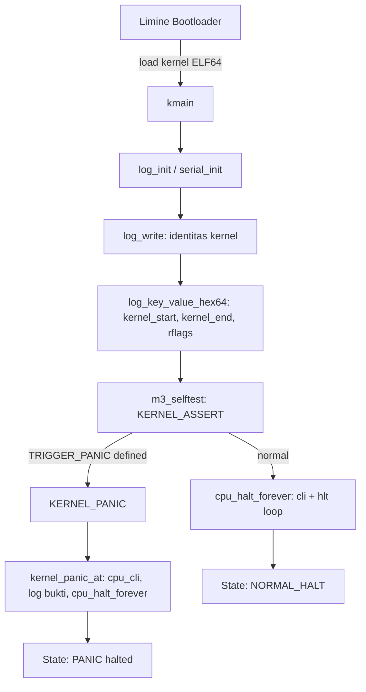

# Template Laporan Praktikum Sistem Operasi Lanjut — MCSOS

**Nama file laporan:** `laporan_praktikum_M3_[Iswan Herdiansah_2583207073011].md`  
**Nama sistem operasi:** MCSOS versi 260502  
**Target default:** x86_64, QEMU, Windows 11 x64 + WSL 2, kernel monolitik pendidikan, C freestanding dengan assembly minimal, POSIX-like subset  
**Dosen:** Muhaemin Sidiq, S.Pd., M.Pd.  
**Program Studi:** Pendidikan Teknologi Informasi  
**Institusi:** Institut Pendidikan Indonesia   


---

## 0. Metadata Laporan

| Atribut | Isi |
|---|---|
| Kode praktikum | `M3` |
| Judul praktikum | `Panic Path, Kernel Logging, GDB Debug Workflow, Linker Map, dan Disassembly Audit` |
| Jenis pengerjaan | `Individu` |
| Nama mahasiswa | `Iswan Herdiansah` |
| NIM | `2583207073011` |
| Kelas | `PTI 1A` |
| Nama kelompok | `Tidak berlaku` |
| Anggota kelompok | `Tidak berlaku` |
| Tanggal praktikum | `2026-05-20` |
| Tanggal pengumpulan | `2026-05-20` |
| Repository | `~/src/mcsos` |
| Branch | `praktikum/m3-panic-debug-audit` |
| Commit awal | `665f104` |
| Commit akhir | `3c28480` |
| Status readiness yang diklaim | `Siap uji QEMU dan siap lanjut M4 secara terbatas` |

---

## 1. Sampul

# Laporan Praktikum M3  
## Panic Path, Kernel Logging, GDB Debug Workflow, Linker Map, dan Disassembly Audit

Disusun oleh:

| Nama | NIM | Kelas | Peran |
|---|---|---|---|
| `Iswan Herdiansah` | `2583207073011` | `PTI 1A` | `Individu` |

Dosen Pengampu: **Muhaemin Sidiq, S.Pd., M.Pd.**  
Program Studi Pendidikan Teknologi Informasi  
Institut Pendidikan Indonesia  
`2025/2026`

---

## 2. Pernyataan Orisinalitas dan Integritas Akademik

Saya menyatakan bahwa laporan ini disusun berdasarkan pekerjaan praktikum sendiri/kelompok sesuai pembagian peran yang tercatat. Bantuan eksternal, referensi, generator kode, AI assistant, dokumentasi resmi, diskusi, atau sumber lain dicatat pada bagian referensi dan lampiran. Saya tidak mengklaim hasil yang tidak dibuktikan oleh log, test, commit, atau artefak lain.

| Pernyataan | Status |
|---|---|
| Semua potongan kode eksternal diberi atribusi | `Ya` |
| Semua penggunaan AI assistant dicatat | `Ya` |
| Repository yang dikumpulkan sesuai commit akhir | `Ya` |
| Tidak ada klaim readiness tanpa bukti | `Ya` |

Catatan penggunaan bantuan eksternal:

```text
Digunakan AI assistant (Claude) untuk membantu diagnosis masalah build, penyesuaian
Makefile, perbaikan script QEMU (OVMF_VARS permission, fresh copy setiap run),
penyesuaian limine.conf format v8, dan penambahan kernel/core/boot.c dengan Limine
request header. Seluruh perintah dijalankan dan diverifikasi mandiri di WSL 2.
Output log, GDB session, dan artefak ELF dihasilkan dari eksekusi nyata.
```

---

## 3. Tujuan Praktikum

1. Membuat panic path awal yang memiliki kontrak `noreturn`, mematikan interrupt dengan `cpu_cli()`, mencetak bukti minimum ke serial, lalu masuk halt loop terkendali.
2. Membuat wrapper logging awal (`log_init`, `log_write`, `log_writeln`, `log_hex64`) yang memisahkan API kernel dari driver serial COM1.
3. Menghasilkan dua varian kernel: normal kernel (`build/kernel.elf`) dan intentional-panic kernel (`build/kernel.panic.elf`).
4. Menghasilkan dan menganalisis linker map, symbol table, readelf header, program header, dan disassembly untuk memverifikasi layout ELF64 x86_64.
5. Menjalankan QEMU smoke test dengan log serial berbasis file dan memverifikasi output deterministik.
6. Menyiapkan sesi GDB dengan breakpoint pada `kmain` dan `kernel_panic_at` untuk membuktikan kernel dapat di-debug.
7. Mengumpulkan bukti praktikum secara reproducible ke direktori `evidence/M3`.

---

## 4. Capaian Pembelajaran Praktikum

Setelah praktikum ini, mahasiswa mampu:

| CPL/CPMK praktikum | Bukti yang harus ditunjukkan |
|---|---|
| Menjelaskan perbedaan controlled halt, panic, hang, dan triple fault | Analisis di bagian 15 dan serial log QEMU |
| Membuat panic path `noreturn` dengan `cpu_cli` dan halt loop | `kernel/core/panic.c`, disassembly `cli`/`hlt`, serial log panic |
| Mengaudit ELF64 dengan readelf, nm, objdump | Output `make audit`, `m3_audit_elf.sh`, `build/kernel.syms.txt` |
| Menjalankan QEMU smoke test dengan serial log deterministik | `build/m3_serial.log`, `build/m3_serial_panic.log` |
| Menjalankan sesi GDB dengan breakpoint kernel | `build/gdb_session.log`, breakpoint `kmain` hit di `0xffffffff80000000` |
| Mengumpulkan evidence reproducible | `evidence/M3/manifest.txt` |

---

## 5. Peta Milestone MCSOS

Centang milestone yang menjadi fokus laporan ini. Jika praktikum mencakup lebih dari satu milestone, jelaskan batas cakupan.

| Milestone | Fokus | Status dalam laporan |
|---|---|---|
| M0 | Requirements, governance, baseline arsitektur | `[ ] tidak dibahas / [ ] dibahas / [v] selesai praktikum` |
| M1 | Toolchain reproducible, Git, QEMU, GDB, metadata build | `[ ] tidak dibahas / [] dibahas / [v] selesai praktikum` |
| M2 | Boot image, kernel ELF64, early console | `[ ] tidak dibahas / [ ] dibahas / [v] selesai praktikum` |
| M3 | Panic path, linker map, GDB, observability awal | `[ ] tidak dibahas / [ ] dibahas / [v] selesai praktikum` |
| M4 | Trap, exception, interrupt, timer | `[v] tidak dibahas / [ ] dibahas / [ ] selesai praktikum` |
| M5 | PMM, VMM, page table, kernel heap | `[v] tidak dibahas / [ ] dibahas / [ ] selesai praktikum` |
| M6 | Thread, scheduler, synchronization | `[v] tidak dibahas / [ ] dibahas / [ ] selesai praktikum` |
| M7 | Syscall ABI dan user program loader | `[v] tidak dibahas / [ ] dibahas / [ ] selesai praktikum` |
| M8 | VFS, file descriptor, ramfs | `[v] tidak dibahas / [ ] dibahas / [ ] selesai praktikum` |
| M9 | Block layer dan device model | `[v] tidak dibahas / [ ] dibahas / [ ] selesai praktikum` |
| M10 | Persistent filesystem, mcsfs/ext2-like, recovery | `[v] tidak dibahas / [ ] dibahas / [ ] selesai praktikum` |
| M11 | Networking stack, packet parsing, UDP/TCP subset | `[v] tidak dibahas / [ ] dibahas / [ ] selesai praktikum` |
| M12 | Security model, capability/ACL, syscall fuzzing, hardening | `[v] tidak dibahas / [ ] dibahas / [ ] selesai praktikum` |
| M13 | SMP, scalability, lock stress, NUMA-aware preparation | `[v] tidak dibahas / [ ] dibahas / [ ] selesai praktikum` |
| M14 | Framebuffer, graphics console, visual regression | `[v] tidak dibahas / [ ] dibahas / [ ] selesai praktikum` |
| M15 | Virtualization/container subset | `[v] tidak dibahas / [ ] dibahas / [ ] selesai praktikum` |
| M16 | Observability, update/rollback, release image, readiness review | `[v] tidak dibahas / [ ] dibahas / [ ] selesai praktikum` |
Batas cakupan praktikum:

```text
M3 mencakup: panic path noreturn, logging serial COM1, audit ELF64, linker map,
disassembly audit, QEMU smoke test dengan serial log, sesi GDB dengan breakpoint,
dan pengumpulan evidence.

Non-goals M3: IDT, interrupt handler, PIT/APIC timer, virtual memory manager,
physical memory manager, scheduler, userspace, syscall ABI, filesystem, network
stack, dan driver selain serial COM1. Kernel berjalan single-core (-smp 1) untuk
menghindari masalah concurrency sebelum M4/M5.
```

---

## 6. Dasar Teori Ringkas

### 6.1 Konsep Sistem Operasi yang Diuji

```text
M3 berfokus pada observability kernel awal. Komponen utama yang diuji:

1. Panic path: jalur eksekusi kernel yang dipicu saat invariant fatal dilanggar.
   Panic harus bersifat noreturn, menonaktifkan interrupt (CLI), mencetak reason
   dan lokasi, lalu masuk halt loop terkendali (HLT dalam loop).

2. Kernel logging: abstraksi di atas driver serial COM1. log_init() menginisialisasi
   serial, log_write/writeln/hex64 menyediakan API tanpa printf/libc.

3. Freestanding C: kernel tidak bergantung pada hosted libc. Fungsi runtime dasar
   (memset, memcpy, memmove) disediakan sendiri di kernel/lib/memory.c.

4. ELF64 layout: kernel dikompilasi sebagai ELF64 x86_64 dengan linker script
   yang menempatkan kernel di higher-half (0xffffffff80000000). Symbol
   __kernel_start dan __kernel_end digunakan untuk selftest.

5. Limine boot protocol: Limine v8 memerlukan Limine request header (LIMINE_BASE_
   REVISION, LIMINE_REQUESTS_START_MARKER, LIMINE_REQUESTS_END_MARKER) di dalam
   kernel agar bootloader mau me-load kernel ELF64.
```

### 6.2 Konsep Arsitektur x86_64 yang Relevan

| Konsep | Relevansi pada praktikum | Bukti/verifikasi |
|---|---|---|
| `cli` (Clear Interrupt Flag) | Dipanggil di `cpu_cli()` sebelum mencetak panic, agar interrupt tidak mengganggu output fatal | Disassembly `objdump`: `fa cli` di `cpu_cli` |
| `hlt` (Halt) | Dipanggil dalam loop di `cpu_halt_forever()` untuk berhenti terkendali | Disassembly `objdump`: `f4 hlt` di `cpu_halt_forever` |
| Port I/O 0x3F8 (COM1) | Serial logging ke QEMU menggunakan `outb`/`inb` ke port COM1 | Output serial muncul di `build/m3_serial.log` |
| Higher-half mapping | Kernel di-link di `0xffffffff80000000` sesuai x86_64 kernel address space | `readelf -h`: Entry point `0xffffffff80000000` |
| `-mno-red-zone` | Wajib pada kernel x86_64 agar interrupt tidak merusak stack frame | CFLAGS di Makefile |
| RFLAGS | Dibaca sebelum `cpu_cli()` untuk disertakan di output panic | `cpu_read_rflags()` via `pushfq; popq` |

### 6.3 Konsep Implementasi Freestanding

| Aspek | Keputusan praktikum |
|---|---|
| Bahasa | C17 freestanding |
| Runtime | Tanpa hosted libc; `memset`, `memcpy`, `memmove` disediakan di `kernel/lib/memory.c` |
| ABI | x86_64 System V ABI untuk entry C `kmain` |
| Compiler flags kritis | `--target=x86_64-unknown-none-elf -ffreestanding -fno-builtin -fno-pic -fno-pie -mno-red-zone -mcmodel=kernel -nostdlib` |
| Risiko undefined behavior | Pointer null ke `log_write` ditangani dengan guard; tidak ada alokasi dinamis di panic path |

### 6.4 Referensi Teori yang Digunakan

| No. | Sumber | Bagian yang digunakan | Alasan relevansi |
|---|---|---|---|
| `[1]` | Microsoft, "Install WSL," Microsoft Learn | Instalasi WSL 2 | Lingkungan build host |
| `[2]` | QEMU Project, "System Emulation — Introduction" | `-serial`, `-machine q35`, `-smp 1` | Emulasi hardware untuk smoke test |
| `[3]` | QEMU Project, "GDB usage" | `-s -S`, gdbstub port 1234 | GDB debug workflow |
| `[4]` | LLVM Project, "Clang command line argument reference" | `-ffreestanding`, `-mcmodel=kernel` | Kompilasi freestanding |
| `[5]` | GNU Binutils, "readelf" | ELF header, program header, section audit | Verifikasi layout kernel |
| `[6]` | GNU Binutils, "objdump" | Disassembly `cli`/`hlt`/`kmain` | Audit instruksi kritis |
| `[7]` | GNU Binutils, "nm" | Symbol table, undefined symbol audit | Verifikasi simbol kernel |
| `[8]` | Intel Corporation, "Intel® 64 and IA-32 Architectures Software Developer's Manuals" | `cli`, `hlt`, RFLAGS, port I/O | Referensi instruksi x86_64 |
| `[9]` | OVMF/EDK2 Documentation | OVMF_CODE.fd, OVMF_VARS.fd | UEFI firmware untuk QEMU |

---

## 7. Lingkungan Praktikum

### 7.1 Host dan Target

| Komponen | Nilai |
|---|---|
| Host OS | `[Windows 11 x64 build 26200.8426]` |
| Lingkungan build | `[WSL 2 Ubuntu versi 24.04]` |
| Target ISA | `x86_64` |
| Target ABI | `[x86_64-elf / x86_64-unknown-none / custom]` |
| Emulator | `[QEMU versi 6.2.0]` |
| Firmware emulator | `[OVMF versi 2022.02-3ubuntu0.22.04.5]` |
| Debugger | `[GDB versi 12.1]` |
| Build system | `[Make 4.3 / CMake 3.22.1 / Meson 1.3.2 / Ninja 1.10.1]` |
| Bahasa utama | `[C17 freestanding]` |
| Assembly | `[NASM versi 2.15.05]` |

### 7.2 Versi Toolchain

```text
[M3 preflight] compiler=Ubuntu clang version 14.0.0-1ubuntu1.1
[M3 preflight] linker=Ubuntu LLD 14.0.0 (compatible with GNU linkers)
QEMU emulator version 6.2.0 (Debian 1:6.2+dfsg-2ubuntu6.30)
GNU gdb (Ubuntu 12.1-0ubuntu1~22.04.2) 12.1
```

Output preflight lengkap:

```text
[M3 preflight] root=/home/iswanherdiansah/src/mcsos
PASS: repository berada di filesystem Linux/WSL
PASS: QEMU tersedia: QEMU emulator version 6.2.0 (Debian 1:6.2+dfsg-2ubuntu6.30)
[M3 preflight] compiler=Ubuntu clang version 14.0.0-1ubuntu1.1
[M3 preflight] linker=Ubuntu LLD 14.0.0 (compatible with GNU linkers)
PASS: preflight M3 selesai
```

### 7.3 Lokasi Repository

| Item | Nilai |
|---|---|
| Path repository di WSL | `~/src/mcsos` |
| Apakah berada di filesystem Linux WSL, bukan `/mnt/c` | `Ya` |
| Remote repository | [Tidak tersedia] |
| Branch | `praktikum/m3-panic-debug-audit` |
| Commit hash awal | `665f104` |
| Commit hash akhir | `3c28480` |

---

## 8. Repository dan Struktur File

### 8.1 Struktur Direktori yang Relevan

```text
mcsos/
├── Makefile
├── linker.ld
├── limine.conf
├── kernel/
│   ├── arch/
│   │   └── x86_64/
│   │       └── include/
│   │           └── mcsos/
│   │               └── arch/
│   │                   ├── cpu.h
│   │                   ├── io.h
│   │                   └── limine.h
│   ├── core/
│   │   ├── boot.c
│   │   ├── kmain.c
│   │   ├── log.c
│   │   ├── panic.c
│   │   └── serial.c
│   ├── include/
│   │   └── mcsos/
│   │       └── kernel/
│   │           ├── log.h
│   │           ├── panic.h
│   │           └── version.h
│   └── lib/
│       ├── memory.c
│       └── serial_hex.c
├── tools/
│   ├── gdb_m3.gdb
│   └── scripts/
│       ├── grade_m3.sh
│       ├── m3_audit_elf.sh
│       ├── m3_collect_evidence.sh
│       ├── m3_preflight.sh
│       ├── m3_qemu_debug.sh
│       └── m3_qemu_run.sh
├── ovmf/
│   └── OVMF_VARS.fd
├── build/          (generated)
└── evidence/M3/    (bukti praktikum)
```

### 8.2 File yang Dibuat atau Diubah

| File | Jenis perubahan | Alasan perubahan | Risiko |
|---|---|---|---|
| `kernel/core/boot.c` | baru | Limine v8 memerlukan request header agar kernel dapat di-load bootloader | rendah — hanya data statis di section khusus |
| `kernel/core/kmain.c` | ubah | Ditambah log M3, selftest `__kernel_start/__kernel_end`, conditional panic | rendah |
| `kernel/core/log.c` | baru | API logging kernel yang memisahkan dari driver serial | rendah |
| `kernel/core/panic.c` | baru | Implementasi `kernel_panic_at` noreturn dengan `cpu_cli` dan halt | rendah |
| `kernel/core/serial.c` | ubah | Ditambah timeout spin pada `serial_putc` untuk mencegah hang di panic path | rendah |
| `kernel/arch/x86_64/include/mcsos/arch/cpu.h` | baru | Wrapper inline untuk `cli`, `hlt`, `pause`, `int3`, RFLAGS, `cpu_halt_forever` | rendah |
| `kernel/arch/x86_64/include/mcsos/arch/limine.h` | baru | Header Limine v8 untuk request protocol | rendah |
| `kernel/include/mcsos/kernel/log.h` | baru | Deklarasi API logging kernel | rendah |
| `kernel/include/mcsos/kernel/panic.h` | baru | Deklarasi `kernel_panic_at`, makro `KERNEL_PANIC` dan `KERNEL_ASSERT` | rendah |
| `kernel/include/mcsos/kernel/version.h` | baru | Konstanta identitas kernel: nama, versi, milestone | rendah |
| `linker.ld` | ubah | Ditambah section `.limine_requests_start`, `.limine_requests`, `.limine_requests_end` | sedang — perubahan layout ELF |
| `limine.conf` | baru | Config Limine v8 format baru (ganti `limine.cfg` yang sudah deprecated) | rendah |
| `Makefile` | ubah | Ditambah target `image`, `image-panic`, variabel `ISO_ROOT`, `LIMINE_DIR`, pola build dua varian | sedang — perubahan build system |
| `tools/scripts/m3_qemu_run.sh` | baru | QEMU smoke test dengan fresh OVMF_VARS setiap run dan grep log serial | rendah |
| `tools/scripts/m3_qemu_debug.sh` | baru | QEMU dengan `-s -S` untuk GDB remote | rendah |
| `tools/gdb_m3.gdb` | baru | Script GDB: load kernel, connect, breakpoint `kmain` dan `kernel_panic_at` | rendah |
| `tools/scripts/m3_audit_elf.sh` | baru | Audit ELF: tipe, machine, simbol wajib, undefined symbol, dynamic section, `cli`/`hlt` | rendah |
| `tools/scripts/m3_collect_evidence.sh` | baru | Kumpulkan artefak audit ke `evidence/M3` | rendah |
| `tools/scripts/grade_m3.sh` | baru | Grading lokal mekanis | rendah |
| `tools/scripts/m3_preflight.sh` | baru | Pemeriksaan kesiapan M0/M1/M2 sebelum M3 | rendah |

### 8.3 Ringkasan Diff

```text
git log :

iswanherdiansah@DESKTOP-52CG9FT:~/src/mcsos$ git log
commit 3c28480ac0811764329d7fc0c5c0f361c0942889 (HEAD -> praktikum/m3-panic-debug-audit)
Author: Iswan Herdiansah <mamankucan@gmail.com>
Date:   Wed May 20 11:46:06 2026 +0700

    M3: panic path logging gdb and disassembly audit

commit 5ce64392cd606220832a73a0cdcbd0679cfb9115
Author: Iswan Herdiansah <mamankucan@gmail.com>
Date:   Wed May 20 11:39:10 2026 +0700

    M3: panic path logging gdb and disassembly audit

commit ee3e62c00ba113e3f36fac4684eafa74dc7b042b
Author: Iswan Herdiansah <mamankucan@gmail.com>
Date:   Tue May 19 21:51:38 2026 +0700

    M3 panic path logging gdb and disassembly audit

commit c09165846ef1bc0ac6928c38f91204a9eef0cf4b (rebuild-m2-clean)
Author: Iswan Herdiansah <mamankucan@gmail.com>
Date:   Tue May 19 21:46:58 2026 +0700

    M2 bootable early serial baseline

commit 1d4278204db830108460a4b7598552c4ddc6869c
Author: Iswan Herdiansah <mamankucan@gmail.com>
Date:   Tue May 19 21:05:18 2026 +0700

    M2: add bootable kernel ELF and early serial console

commit 24f0b92164cb3273418d5fbdeaaaa42814e67c08 (main)
Author: Iswan Herdiansah <mamankucan@gmail.com>
Date:   Wed May 13 04:15:03 2026 +0700

    M2: add bootable kernel ELF and early serial console

commit bf3eb96949e672a67670280ca26a3dc4ea36fb81
Author: Iswan Herdiansah <mamankucan@gmail.com>
Date:   Tue May 12 03:18:26 2026 +0700

    M1: add reproducible toolchain readiness baseline

commit 665f10492c4f8a51b6f2f9266a2cd6765fa36ee0
Author: Iswan Herdiansah <mamankucan@gmail.com>
Date:   Tue May 12 00:58:28 2026 +0700

    M0: initialize reproducible OS development baseline
```

---

## 9. Desain Teknis

### 9.1 Masalah yang Diselesaikan

```text
Kernel M2 dapat boot dan menulis log serial awal, tetapi tidak memiliki:
1. Jalur berhenti terkendali (panic path) — kegagalan fatal tidak terdeteksi.
2. API logging yang terpisah dari driver serial — semua kode pemanggil harus
   langsung memanggil serial_putc, tidak modular.
3. Artefak audit ELF yang dapat diperiksa ulang — tidak ada linker map, disassembly
   terstruktur, atau verifikasi simbol.
4. Kemampuan GDB — kernel belum pernah diverifikasi lewat remote debug session.
5. Limine request header — kernel tidak pernah benar-benar di-load oleh Limine
   karena tidak ada LIMINE_BASE_REVISION dan marker anchor yang diwajibkan Limine v8.
```

### 9.2 Keputusan Desain

| Keputusan | Alternatif yang dipertimbangkan | Alasan memilih | Konsekuensi |
|---|---|---|---|
| `kernel_panic_at` menerima `__FILE__` dan `__LINE__` via makro | Tidak menyertakan lokasi | Memudahkan diagnosis lokasi bug pada laporan | Path build muncul di string kernel — risiko info leakage minor |
| Serial timeout di `serial_putc` (100000 spin) | Busy-wait tanpa batas | Mencegah panic path hang selamanya jika serial tidak siap | Panic mungkin terpotong jika hardware lambat |
| `cpu_halt_forever` sebagai `noreturn` inline | Fungsi biasa | Compiler dapat memverifikasi tidak ada return path setelah panic | Fungsi inline muncul dua kali di disassembly (dua instance) |
| Dua varian kernel: normal dan intentional-panic | Satu kernel dengan runtime flag | Membuktikan kedua jalur dapat dikompilasi dan di-link independen | Dua ISO diperlukan untuk test masing-masing jalur |
| `kernel/core/boot.c` terpisah untuk Limine header | Taruh di `kmain.c` | Memisahkan boot protocol concern dari logika kernel | File tambahan di source tree |
| `limine.conf` (format baru) menggantikan `limine.cfg` | Tetap pakai `limine.cfg` | Limine v8 menampilkan warning 20 detik untuk `limine.cfg` yang menyebabkan QEMU timeout | Perlu rename dan update Makefile |
| OVMF_VARS di-copy fresh setiap QEMU run ke `/tmp` | Pakai file OVMF_VARS permanen | QEMU memodifikasi OVMF_VARS setiap run (menyimpan boot order), sehingga run kedua bisa boot ke entry yang berbeda | Cleanup `/tmp` otomatis via `trap EXIT` |

### 9.3 Arsitektur Ringkas



Penjelasan diagram:

```text
Limine me-load kernel ELF64 ke higher-half (0xffffffff80000000) dan mentransfer
kontrol ke kmain. kmain memanggil log_init() yang menginisialisasi serial COM1,
lalu mencetak identitas kernel, alamat layout, dan RFLAGS. m3_selftest() memverifikasi
invariant dasar menggunakan KERNEL_ASSERT. Pada kernel normal, eksekusi berakhir di
cpu_halt_forever() (cli + hlt loop). Pada intentional-panic kernel, KERNEL_PANIC
memanggil kernel_panic_at() yang mematikan interrupt, mencetak reason/location/
panic_code/rflags_before_cli, lalu masuk halt loop. Kedua jalur tidak kembali ke caller.
```

### 9.4 Kontrak Antarmuka

| Antarmuka | Pemanggil | Penerima | Precondition | Postcondition | Error path |
|---|---|---|---|---|---|
| `log_init()` | `kmain` | `serial_init` | Tidak ada syarat khusus | Serial COM1 siap, `g_log_ready=1` | Jika serial gagal, `log_putc` re-init |
| `kernel_panic_at(file, line, reason, code)` | `KERNEL_PANIC`, `KERNEL_ASSERT` | `cpu_cli`, logging, `cpu_halt_forever` | Serial boleh belum init | CPU halt, interrupt off, tidak return | Tidak ada — fungsi `noreturn` |
| `cpu_halt_forever()` | `kmain`, `kernel_panic_at` | CPU | Boleh dipanggil kapan saja | CPU dalam halt loop, interrupt off | Tidak ada — `noreturn` |
| `log_write(s)` | Semua caller log | `serial_write` | `s` boleh null (dihandle) | String terkirim ke serial | Null pointer: return tanpa aksi |

### 9.5 Struktur Data Utama

| Struktur data | Field penting | Ownership | Lifetime | Invariant |
|---|---|---|---|---|
| `g_log_ready` (int statis) | Flag inisialisasi serial | `log.c` | Selama kernel berjalan | 0 sebelum `log_init`, 1 setelah |
| `LIMINE_BASE_REVISION(3)` di `boot.c` | Magic number Limine v8 | Boot protocol | Hanya dibaca bootloader | Harus ada agar Limine v8 mau load kernel |

### 9.6 Invariants

1. `kernel_panic_at()` tidak boleh kembali ke caller — dijamin oleh `__attribute__((noreturn))` dan `cpu_halt_forever()`.
2. Setelah panic, CPU harus masuk loop halt dengan interrupt dimatikan — `cpu_cli()` dipanggil sebelum logging panic.
3. `log_write()` tidak boleh dereference pointer null — dihandle dengan guard `if (s == NULL) return`.
4. `__kernel_end` harus lebih besar dari `__kernel_start` — diverifikasi oleh `m3_selftest()` via `KERNEL_ASSERT`.
5. Kernel ELF tidak boleh memiliki undefined symbol — diverifikasi oleh `make audit` dan `nm -u`.
6. Kernel ELF harus bertipe ELF64 x86_64 — diverifikasi oleh `readelf -h` dan `m3_audit_elf.sh`.
7. Source kernel tidak boleh bergantung pada libc host — dijamin oleh `-ffreestanding -fno-builtin -nostdlib`.

### 9.7 Ownership, Locking, dan Concurrency

| Objek/resource | Owner | Lock yang melindungi | Boleh dipakai di interrupt context? | Catatan |
|---|---|---|---|---|
| Serial port COM1 | `serial.c` | none | Ya (single-core, interrupt off saat panic) | M3 single-core, belum ada concurrency |
| `g_log_ready` | `log.c` | none | Ya | Single-core, tidak ada race condition di M3 |

Lock order yang berlaku:

```text
Tidak ada locking pada M3. Kernel berjalan single-core (-smp 1) dan interrupt
eksternal belum diaktifkan (tidak ada IDT). Panic path secara eksplisit memanggil
cpu_cli() sebelum operasi apapun untuk menjamin eksekusi tidak diganggu.
```

### 9.8 Memory Safety dan Undefined Behavior Risk

| Risiko | Lokasi | Mitigasi | Bukti |
|---|---|---|---|
| Null pointer dereference | `log_write`, `serial_write` | Guard eksplisit: `if (s == NULL) return` | Code review, tidak ada crash di QEMU run |
| Stack overflow | `kernel_panic_at` logging loop | Tidak ada rekursi; logging flat dengan buffer statis | Disassembly menunjukkan tidak ada rekursi |
| Integer overflow di `log_dec_u32` | `panic.c` | Batas loop dengan `i < sizeof(buf)` | Code review |

### 9.9 Security Boundary

| Boundary | Data tidak tepercaya | Validasi yang dilakukan | Failure mode aman |
|---|---|---|---|
| Panic path output | `reason`, `file` string dari kernel sendiri | Null check sebelum dereference | Cetak `<null>` atau `<unknown>` |
| `__FILE__` di panic | Path build system — bisa membocorkan struktur direktori | Belum ada sanitasi | Info leakage minor (path build) |

---

## 10. Langkah Kerja Implementasi

### Langkah 1 — Preflight M3

Maksud langkah:

```text
Memverifikasi bahwa semua artefak M0/M1/M2 tersedia dan toolchain siap sebelum
menulis kode M3.
```

Perintah:

```bash
./tools/scripts/m3_preflight.sh
```

Output ringkas:

```text
[M3 preflight] root=/home/iswanherdiansah/src/mcsos
PASS: repository berada di filesystem Linux/WSL
PASS: QEMU tersedia: QEMU emulator version 6.2.0 (Debian 1:6.2+dfsg-2ubuntu6.30)
[M3 preflight] compiler=Ubuntu clang version 14.0.0-1ubuntu1.1
[M3 preflight] linker=Ubuntu LLD 14.0.0 (compatible with GNU linkers)
PASS: preflight M3 selesai
```

Artefak yang dihasilkan:

| Artefak | Lokasi | Fungsi |
|---|---|---|
| Output terminal | stdio | Verifikasi kesiapan M0/M1/M2 |

Indikator berhasil:

```text
Output menampilkan "PASS: preflight M3 selesai" tanpa baris "FAIL".
```

### Langkah 2 — Implementasi Source M3

Maksud langkah:

```text
Membuat seluruh file source M3: cpu.h, limine.h, version.h, log.h, panic.h,
boot.c, log.c, panic.c, serial.c (update), kmain.c (update), memory.c (dipertahankan).
```

Perintah:

```bash
# File-file dibuat dengan nano/cat sesuai panduan M3 bagian 9.1-9.10
# Kunci: kernel/core/boot.c dengan Limine v8 request header
# kernel/core/panic.c dengan kernel_panic_at noreturn
# linker.ld diupdate untuk section .limine_requests*
```

Artefak yang dihasilkan:

| Artefak | Lokasi | Fungsi |
|---|---|---|
| `kernel/core/boot.c` | source | Limine v8 request header |
| `kernel/core/panic.c` | source | Panic path noreturn |
| `kernel/core/log.c` | source | API logging kernel |
| `kernel/include/mcsos/kernel/panic.h` | source | Deklarasi dan makro KERNEL_PANIC, KERNEL_ASSERT |
| `linker.ld` | source | Layout ELF dengan section Limine |

Indikator berhasil:

```text
Semua file terbuat dan dapat dikompilasi tanpa error.
```

### Langkah 3 — Build Normal dan Panic Kernel

Maksud langkah:

```text
Mengkompilasi dua varian kernel: normal (tanpa panic trigger) dan intentional-panic
(dengan -DMCSOS_M3_TRIGGER_PANIC=1).
```

Perintah:

```bash
make clean && make build && make panic && make audit
```

Output ringkas:

```text
[build normal dan panic berhasil]
! nm -u build/kernel.elf | grep .       # tidak ada output = tidak ada undefined symbol
! nm -u build/kernel.panic.elf | grep . # tidak ada output = tidak ada undefined symbol
grep -q 'kernel_panic_at' build/kernel.disasm.txt  # PASS
readelf -S build/kernel.elf | grep -q '.text'      # PASS
readelf -S build/kernel.elf | grep -q '.rodata'    # PASS
```

Artefak yang dihasilkan:

| Artefak | Lokasi | Fungsi |
|---|---|---|
| `build/kernel.elf` | build | Kernel normal ELF64 |
| `build/kernel.panic.elf` | build | Kernel intentional-panic ELF64 |
| `build/kernel.map` | build | Linker map normal |
| `build/kernel.panic.map` | build | Linker map panic |
| `build/kernel.disasm.txt` | build | Disassembly kernel normal |
| `build/kernel.syms.txt` | build | Symbol table kernel normal |

Indikator berhasil:

```text
make audit selesai tanpa error. Tidak ada undefined symbol pada kedua ELF.
```

### Langkah 4 — Audit ELF dan Disassembly

Maksud langkah:

```text
Memverifikasi properti ELF64, simbol wajib, tidak ada dynamic section, dan
keberadaan instruksi cli/hlt di disassembly.
```

Perintah:

```bash
./tools/scripts/m3_audit_elf.sh build/kernel.elf
```

Output ringkas:

```text
ELF Header:
  Class:     ELF64
  Machine:   Advanced Micro Devices X86-64
  Entry point address: 0xffffffff80000000
  Number of program headers: 3

Program Headers:
  LOAD  0xffffffff80000000  R E  (text)
  LOAD  0xffffffff80001000  R    (rodata)
  LOAD  0xffffffff80002000  RW   (data+bss)

PASS: audit ELF M3 selesai
```

Artefak yang dihasilkan:

| Artefak | Lokasi | Fungsi |
|---|---|---|
| `build/m3_audit_readelf_header.txt` | build | Bukti ELF64 x86_64 |
| `build/m3_audit_symbols.txt` | build | Bukti simbol `kmain`, `kernel_panic_at` |
| `build/m3_audit_disasm.txt` | build | Bukti `cli`, `hlt` di disassembly |

Indikator berhasil:

```text
Script mencetak "PASS: audit ELF M3 selesai" dan tidak ada baris "FAIL".
```

### Langkah 5 — Build ISO Bootable

Maksud langkah:

```text
Membuat ISO bootable dengan Limine v8 sebagai bootloader, kernel ELF64 sebagai
payload, dan limine.conf format baru sebagai konfigurasi boot.
```

Perintah:

```bash
make -C limine   # compile limine binary
make image       # build ISO normal kernel
make image-panic # build ISO panic kernel
```

Output ringkas:

```text
ISO selesai: build/mcsos.iso
-rw-r--r-- 1 iswanherdiansah iswanherdiansah 3.7M May 20 11:21 build/mcsos.iso
ISO selesai: build/mcsos.panic.iso
```

Artefak yang dihasilkan:

| Artefak | Lokasi | Fungsi |
|---|---|---|
| `build/mcsos.iso` | build | ISO bootable normal kernel |
| `build/mcsos.panic.iso` | build | ISO bootable intentional-panic kernel |

Indikator berhasil:

```text
File ISO berukuran 3.7M terbentuk di build/.
```

### Langkah 6 — QEMU Smoke Test Normal Kernel

Maksud langkah:

```text
Menjalankan ISO normal kernel di QEMU dan memverifikasi log serial deterministik.
```

Perintah:

```bash
mkdir -p ovmf
cp /usr/share/OVMF/OVMF_VARS.fd ovmf/OVMF_VARS.fd
./tools/scripts/m3_qemu_run.sh build/mcsos.iso build/m3_serial.log
cat build/m3_serial.log
```

Output ringkas:

```text
BdsDxe: loading Boot0001 "UEFI QEMU DVD-ROM QM00005 " ...
BdsDxe: starting Boot0001 "UEFI QEMU DVD-ROM QM00005 " ...
MCSOS 260502 M3 kernel entered
kernel_start=0xffffffff80000000
kernel_end=0xffffffff80003004
rflags=0x0000000000000082
[M3] selftest: basic invariants passed
[M3] panic path installed; intentional panic disabled
[M3] ready for QEMU smoke test and GDB audit
PASS: QEMU smoke test M3 selesai
```

Artefak yang dihasilkan:

| Artefak | Lokasi | Fungsi |
|---|---|---|
| `build/m3_serial.log` | build | Log serial boot deterministik |

Indikator berhasil:

```text
Log mengandung "MCSOS 260502 M3 kernel entered" dan "[M3] selftest: basic invariants passed".
Script mencetak "PASS: QEMU smoke test M3 selesai".
```

### Langkah 7 — QEMU Smoke Test Panic Kernel

Maksud langkah:

```text
Menjalankan ISO intentional-panic kernel dan memverifikasi output panic path.
```

Perintah:

```bash
./tools/scripts/m3_qemu_run.sh build/mcsos.panic.iso build/m3_serial_panic.log
cat build/m3_serial_panic.log
```

Output ringkas:

```text
MCSOS 260502 M3 kernel entered
kernel_start=0xffffffff80000000
kernel_end=0xffffffff80003004
rflags=0x0000000000000082
[M3] selftest: basic invariants passed

================ MCSOS KERNEL PANIC ================
system=MCSOS version=260502 milestone=M3
reason=intentional M3 panic test
location=kernel/core/kmain.c:30
panic_code=0x004d43534f533033
rflags_before_cli=0x0000000000000086
state=halted
====================================================
PASS: QEMU smoke test M3 selesai
```

Artefak yang dihasilkan:

| Artefak | Lokasi | Fungsi |
|---|---|---|
| `build/m3_serial_panic.log` | build | Log serial panic path deterministik |

Indikator berhasil:

```text
Log mengandung blok "MCSOS KERNEL PANIC" dengan reason, location, panic_code, dan state=halted.
```

### Langkah 8 — GDB Debug Session

Maksud langkah:

```text
Membuktikan kernel dapat di-debug menggunakan GDB remote melalui QEMU gdbstub.
Breakpoint dipasang pada kmain dan kernel_panic_at.
```

Perintah (Terminal 1):

```bash
./tools/scripts/m3_qemu_debug.sh build/mcsos.iso
```

Perintah (Terminal 2):

```bash
gdb -x tools/gdb_m3.gdb 2>&1 | tee build/gdb_session.log
```

Output ringkas:

```text
0x000000000000fff0 in ?? ()
Breakpoint 1 at 0xffffffff80000000
Breakpoint 2 at 0xffffffff800002f0

Breakpoint 1, 0xffffffff80000000 in kmain ()
rip  0xffffffff80000000  0xffffffff80000000 <kmain>
[disassembly kmain ditampilkan]
```

Artefak yang dihasilkan:

| Artefak | Lokasi | Fungsi |
|---|---|---|
| `build/gdb_session.log` | build | Bukti GDB breakpoint dan register dump |

Indikator berhasil:

```text
Breakpoint 1 hit di kmain (0xffffffff80000000). info registers menampilkan
register CPU. disassemble kmain menampilkan instruksi.
```

### Langkah 9 — Kumpulkan Evidence dan Grading

Maksud langkah:

```text
Mengumpulkan semua artefak audit ke evidence/M3 dan menjalankan grading lokal.
```

Perintah:

```bash
./tools/scripts/m3_collect_evidence.sh evidence/M3
./tools/scripts/grade_m3.sh
```

Output ringkas:

```text
PASS[10]: preflight script valid
PASS[10]: audit script valid
PASS[20]: normal kernel build
PASS[10]: panic-test kernel build
PASS[20]: ELF/disassembly audit
PASS[10]: panic symbol exists
PASS[10]: no undefined symbols
PASS[10]: evidence collection
SCORE=100/100
```

Artefak yang dihasilkan:

| Artefak | Lokasi | Fungsi |
|---|---|---|
| `evidence/M3/manifest.txt` | evidence | Manifest artefak dengan versi toolchain dan commit |
| `evidence/M3/kernel.elf` | evidence | Kernel binary |
| `evidence/M3/kernel.map` | evidence | Linker map |
| `evidence/M3/kernel.syms.txt` | evidence | Symbol table |
| `evidence/M3/kernel.disasm.txt` | evidence | Disassembly |
| `evidence/M3/m3_serial.log` | evidence | Serial log boot normal |

---

## 11. Checkpoint Buildable

| Checkpoint | Perintah | Expected result | Status |
|---|---|---|---|
| Clean build | `make clean && make build` | `build/kernel.elf` terbentuk | PASS |
| Metadata toolchain | `make meta` | `build/meta/toolchain-versions.txt` ada | PASS |
| Image generation | `make image` | `build/mcsos.iso` terbentuk (3.7M) | PASS |
| QEMU smoke test | `./tools/scripts/m3_qemu_run.sh` | Serial log M3 muncul deterministik | PASS |
| Test suite | `make test` | [Belum diimplementasi di M3] | NA |

Catatan checkpoint:

```text
Semua checkpoint yang relevan untuk M3 lulus. make test belum ada karena
unit test formal bukan target M3. Grading lokal grade_m3.sh menggantikan
test suite dengan SCORE=100/100.
```

---

## 12. Perintah Uji dan Validasi

### 12.1 Build Test

```bash
make clean
make build
```

Hasil:

```text
rm -rf build iso_root
[kompilasi 7 file .c untuk normal kernel]
ld.lld -nostdlib -static -z max-page-size=0x1000 -T linker.ld -Map=build/kernel.map
    -o build/kernel.elf [object files]
```

Status: `PASS`

### 12.2 Static Inspection

```bash
readelf -h build/kernel.elf
readelf -l build/kernel.elf
nm -n build/kernel.elf | grep -E 'kmain|kernel_panic_at|cpu_halt_forever'
objdump -d -Mintel build/kernel.elf | grep -n 'cli\|hlt' | head -20
```

Hasil penting:

```text
ELF Header:
  Class:                             ELF64
  Machine:                           Advanced Micro Devices X86-64
  Entry point address:               0xffffffff80000000
  Number of program headers:         3

Program Headers:
  LOAD  0x1000  0xffffffff80000000  R E  0x1000  (text)
  LOAD  0x2000  0xffffffff80001000  R    0x1000  (rodata+limine_requests)
  LOAD  0x3000  0xffffffff80002000  RW   0x1000  (data+bss)

Symbol table:
ffffffff80000000 T kmain
ffffffff800002f0 T kernel_panic_at
ffffffff80000130 t cpu_halt_forever
ffffffff80000550 t cpu_halt_forever  (instance kedua dari panic path)

Disassembly cli/hlt:
82:ffffffff80000134:  e8 17 00 00 00  call cpu_cli
89:ffffffff80000150 <cpu_cli>:
92:ffffffff80000154:  fa              cli
98:ffffffff80000160 <cpu_hlt>:
101:ffffffff80000164: f4              hlt
```

Status: `PASS`

### 12.3 QEMU Smoke Test

```bash
./tools/scripts/m3_qemu_run.sh build/mcsos.iso build/m3_serial.log
```

Hasil:

```text
BdsDxe: loading Boot0001 "UEFI QEMU DVD-ROM QM00005 " from PciRoot(0x0)/Pci(0x1F,0x2)/Sata(0x2,0xFFFF,0x0)
BdsDxe: starting Boot0001 "UEFI QEMU DVD-ROM QM00005 " from PciRoot(0x0)/Pci(0x1F,0x2)/Sata(0x2,0xFFFF,0x0)
MCSOS 260502 M3 kernel entered
kernel_start=0xffffffff80000000
kernel_end=0xffffffff80003004
rflags=0x0000000000000082
[M3] selftest: basic invariants passed
[M3] panic path installed; intentional panic disabled
[M3] ready for QEMU smoke test and GDB audit
PASS: QEMU smoke test M3 selesai
```

Status: `PASS`

### 12.4 GDB Debug Evidence

Terminal 1:
```bash
./tools/scripts/m3_qemu_debug.sh build/mcsos.iso
```

Terminal 2:
```bash
gdb -x tools/gdb_m3.gdb
```

Hasil:

```text
0x000000000000fff0 in ?? ()
Breakpoint 1 at 0xffffffff80000000
Breakpoint 2 at 0xffffffff800002f0

Breakpoint 1, 0xffffffff80000000 in kmain ()
rax            0x0                 0
rbx            0x0                 0
rip            0xffffffff80000000  0xffffffff80000000 <kmain>
eflags         0x92                [ IOPL=0 SF AF ]
cs             0x28                40
cr0            0x80010011          [ PG WP ET PE ]
efer           0xd00               [ NXE LMA LME ]

Dump of assembler code for function kmain:
=> 0xffffffff80000000 <+0>:   push   %rbp
   0xffffffff80000001 <+1>:   mov    %rsp,%rbp
   0xffffffff80000004 <+4>:   call   0xffffffff80000170 <log_init>
   ...
   0xffffffff800000a8 <+168>: call   0xffffffff80000130 <cpu_halt_forever>
End of assembler dump.
```

Status: `PASS`

### 12.5 Unit Test

```bash
make test
```

Hasil:

```text
[Belum diimplementasi di M3]
```

Status: `NA`

### 12.6 Stress/Fuzz/Fault Injection Test

```bash
[Belum diimplementasi di M3]
```

Hasil:

```text
[Belum diuji]
```

Status: `NA`

### 12.7 Visual Evidence

| Screenshot | Lokasi file | Keterangan |
|---|---|---|
| [Tidak tersedia] | [Tidak tersedia] | QEMU dijalankan dengan `-display none`; bukti via serial log |

---

## 13. Hasil Uji

### 13.1 Tabel Ringkasan Hasil

| No. | Uji | Expected result | Actual result | Status | Evidence |
|---|---|---|---|---|---|
| 1 | ELF64 verification | Class ELF64, Machine x86_64 | ELF64, Advanced Micro Devices X86-64 | PASS | `build/kernel.readelf.header.txt` |
| 2 | Entry point | `0xffffffff80000000` | `0xffffffff80000000` | PASS | `readelf -h` |
| 3 | Symbol `kmain` ada | Ada di symbol table | `ffffffff80000000 T kmain` | PASS | `build/kernel.syms.txt` |
| 4 | Symbol `kernel_panic_at` ada | Ada di symbol table | `ffffffff800002f0 T kernel_panic_at` | PASS | `build/kernel.syms.txt` |
| 5 | Tidak ada undefined symbol | nm -u kosong | Tidak ada output | PASS | `make audit` |
| 6 | Tidak ada dynamic section | `readelf -d` tidak ada dynamic | "There is no dynamic section in this file" | PASS | `readelf -d build/kernel.elf` |
| 7 | Instruksi `cli` ada di disassembly | `fa cli` muncul | `ffffffff80000154: fa  cli` | PASS | `build/kernel.disasm.txt` |
| 8 | Instruksi `hlt` ada di disassembly | `f4 hlt` muncul | `ffffffff80000164: f4  hlt` | PASS | `build/kernel.disasm.txt` |
| 9 | QEMU normal kernel boot | Serial log M3 muncul | `MCSOS 260502 M3 kernel entered` ... `[M3] ready for QEMU smoke test and GDB audit` | PASS | `build/m3_serial.log` |
| 10 | QEMU panic kernel | Blok KERNEL PANIC muncul | `MCSOS KERNEL PANIC`, `reason=intentional M3 panic test`, `state=halted` | PASS | `build/m3_serial_panic.log` |
| 11 | GDB breakpoint `kmain` | Hit di `0xffffffff80000000` | `Breakpoint 1, 0xffffffff80000000 in kmain ()` | PASS | `build/gdb_session.log` |
| 12 | Grade lokal | SCORE=100/100 | SCORE=100/100 | PASS | `grade_m3.sh` |

### 13.2 Log Penting

```text
=== SERIAL LOG NORMAL ===
MCSOS 260502 M3 kernel entered
kernel_start=0xffffffff80000000
kernel_end=0xffffffff80003004
rflags=0x0000000000000082
[M3] selftest: basic invariants passed
[M3] panic path installed; intentional panic disabled
[M3] ready for QEMU smoke test and GDB audit

=== SERIAL LOG PANIC ===
MCSOS 260502 M3 kernel entered
kernel_start=0xffffffff80000000
kernel_end=0xffffffff80003004
rflags=0x0000000000000082
[M3] selftest: basic invariants passed

================ MCSOS KERNEL PANIC ================
system=MCSOS version=260502 milestone=M3
reason=intentional M3 panic test
location=kernel/core/kmain.c:30
panic_code=0x004d43534f533033
rflags_before_cli=0x0000000000000086
state=halted
====================================================
```

### 13.3 Artefak Bukti

| Artefak | Path | SHA-256 / hash | Fungsi |
|---|---|---|---|
| `kernel.elf` | `build/kernel.elf` | [3c28480a] | Kernel binary ELF64 |
| `kernel.panic.elf` | `build/kernel.panic.elf` | [3c28480a] | Kernel intentional-panic ELF64 |
| `mcsos.iso` | `build/mcsos.iso` | [3c28480a] | ISO bootable normal (3.7M) |
| `mcsos.panic.iso` | `build/mcsos.panic.iso` | [3c28480a] | ISO bootable panic |
| `m3_serial.log` | `build/m3_serial.log` | [3c28480a] | Serial log boot normal |
| `m3_serial_panic.log` | `build/m3_serial_panic.log` | [3c28480a] | Serial log panic |
| `kernel.map` | `build/kernel.map` | [3c28480a] | Linker map |
| `kernel.disasm.txt` | `build/kernel.disasm.txt` | [3c28480a] | Disassembly |
| `gdb_session.log` | `build/gdb_session.log` | [3c28480a] | Log sesi GDB |

---

## 14. Analisis Teknis

### 14.1 Analisis Keberhasilan

```text
Kernel M3 berhasil boot karena tiga hal utama bekerja bersama:

1. Limine request header: Penambahan kernel/core/boot.c dengan
   LIMINE_BASE_REVISION(3) dan marker anchor menjadi prasyarat wajib
   yang sebelumnya tidak ada di M2. Tanpa ini, Limine v8 menolak me-load
   kernel meskipun ELF dan linker script sudah benar.

2. Linker script yang benar: Section .limine_requests_start, .limine_requests,
   dan .limine_requests_end ditambahkan ke linker.ld dan di-map ke segment
   rodata (PT_LOAD FLAGS(4)), sehingga Limine dapat membaca request dari
   kernel ELF.

3. limine.conf format v8: Mengganti limine.cfg dengan limine.conf dan format
   baru (key: value, /entry) menghilangkan warning 20 detik yang menyebabkan
   QEMU timeout sebelum kernel sempat boot.

Panic path berfungsi benar: cpu_cli() dipanggil sebelum logging, seluruh
informasi (reason, location, panic_code, rflags_before_cli) tercetak ke serial,
dan kernel berhenti di halt loop — tidak kembali ke caller, sesuai kontrak noreturn.

m3_selftest() memverifikasi __kernel_end > __kernel_start (0xffffffff80003004 >
0xffffffff80000000) dan sizeof(uintptr_t) == 8, keduanya lulus.
```

### 14.2 Analisis Kegagalan atau Perbedaan Hasil

```text
Lima failure mode ditemukan dan diselesaikan selama praktikum:

1. QEMU log kosong (timeout) — akar masalah: kernel tidak punya Limine request
   header. Limine v8 tidak me-load kernel tanpa LIMINE_BASE_REVISION. Solusi:
   tambah kernel/core/boot.c.

2. Limine warning 20 detik — akar masalah: limine.cfg sudah deprecated di v8.
   Limine menampilkan warning dan menunggu key press, menyebabkan QEMU timeout.
   Solusi: buat limine.conf dengan format baru.

3. Permission denied OVMF_VARS — akar masalah: /usr/share/OVMF/OVMF_VARS.fd
   bersifat read-only untuk user biasa, tetapi QEMU memerlukan write access untuk
   menyimpan NVRAM. Solusi: copy ke ovmf/OVMF_VARS.fd dengan chmod 644.

4. QEMU boot ke entry berbeda pada run kedua — akar masalah: OVMF_VARS
   menyimpan boot order dari run pertama, sehingga run berikutnya tidak selalu
   boot dari DVD. Solusi: copy fresh OVMF_VARS ke /tmp setiap run via trap EXIT.

5. GDB dijalankan salah — akar masalah: perintah "target remote localhost:1234"
   diketik di bash shell, bukan di dalam GDB prompt. Solusi: gunakan
   tools/gdb_m3.gdb yang di-load otomatis oleh "gdb -x tools/gdb_m3.gdb".
```

### 14.3 Perbandingan dengan Teori

| Konsep teori | Implementasi praktikum | Sesuai/tidak sesuai | Penjelasan |
|---|---|---|---|
| Panic path noreturn | `kernel_panic_at` dengan `__attribute__((noreturn))` dan `cpu_halt_forever` | Sesuai | Compiler menolak return path; GDB confirm tidak ada instruksi setelah `call cpu_halt_forever` |
| Interrupt masking sebelum fatal path | `cpu_cli()` dipanggil di awal `kernel_panic_at` | Sesuai | Disassembly menunjukkan `fa cli` sebelum logging |
| Freestanding tanpa libc | `-ffreestanding -fno-builtin -nostdlib`, tidak ada dynamic section | Sesuai | `readelf -d`: "There is no dynamic section" |
| Higher-half kernel x86_64 | Base address `0xffffffff80000000` di linker.ld | Sesuai | Entry point dan simbol semua di rentang `0xffffffff8xxxxxxx` |
| Serial COM1 busy-wait dengan timeout | `serial_putc` dengan spin counter 100000 | Sesuai | Timeout mencegah hang tanpa mengorbankan output normal |

### 14.4 Kompleksitas dan Kinerja

| Aspek | Estimasi/hasil | Bukti | Catatan |
|---|---|---|---|
| Kompleksitas algoritma | O(n) untuk logging (n = panjang string) | Code review | Tidak ada struktur data kompleks |
| Waktu build | ~3-5 detik (6 file .c) | Observasi terminal | Clean build dari make clean |
| Waktu boot QEMU hingga serial log | ~3-5 detik | Timeout 15 detik masih cukup | Termasuk OVMF/UEFI boot sequence |
| Ukuran kernel.elf | 14408 bytes (~14K) | `ls -lh build/kernel.elf` | Sangat kecil, wajar untuk early boot |
| Ukuran ISO | 3.7M | `ls -lh build/mcsos.iso` | Didominasi OVMF EFI payload Limine |

---

## 15. Debugging dan Failure Modes

### 15.1 Failure Modes yang Ditemukan

| Failure mode | Gejala | Penyebab sementara | Bukti | Perbaikan |
|---|---|---|---|---|
| QEMU log kosong, timeout | `FAIL: log boot M3 tidak ditemukan`, serial hanya menampilkan BdsDxe | Tidak ada Limine request header di kernel | Kernel di-load tapi silent; Limine skip kernel tanpa header | Tambah `kernel/core/boot.c` dengan `LIMINE_BASE_REVISION(3)` |
| Limine warning 20 detik | QEMU timeout sebelum kernel boot; serial log menampilkan warning format config | `limine.cfg` deprecated di Limine v8 | Serial log: "The format of the config file has changed..." | Buat `limine.conf` dengan format baru Limine v8 |
| Permission denied OVMF_VARS | `qemu-system-x86_64: Could not open '/usr/share/OVMF/OVMF_VARS.fd': Permission denied` | File OVMF_VARS system read-only | Error message QEMU | Copy ke `ovmf/OVMF_VARS.fd`, chmod 644 |
| Boot ke entry berbeda pada run kedua | QEMU boot ke shell UEFI atau entry lain, bukan DVD | OVMF_VARS menyimpan boot order dari run sebelumnya | Serial log kosong pada run kedua meskipun ISO sama | Copy fresh OVMF_VARS ke `/tmp` setiap run via `trap EXIT` |
| GDB tidak connect | `target remote localhost:1234` dijalankan di bash, bukan di GDB; error "syntax error" | Perintah GDB dieksekusi di shell langsung | Error message bash | Gunakan `gdb -x tools/gdb_m3.gdb` |

### 15.2 Failure Modes yang Diantisipasi

| Failure mode | Deteksi | Dampak | Mitigasi |
|---|---|---|---|
| Panic path mencetak sebagian lalu berhenti | Serial log terpotong di tengah blok PANIC | Sulit mendiagnosis | `SERIAL_TIMEOUT_LIMIT` di serial.c; pastikan timeout cukup besar |
| Triple fault saat stack tidak valid | QEMU reboot tanpa log | Kernel tidak punya halt setelah fault | `-no-reboot -no-shutdown` pada QEMU + GDB `-s -S` |
| `__kernel_end <= __kernel_start` | `KERNEL_ASSERT` panic di selftest | Boot gagal dengan panic assert | Linker script yang benar dengan layout section berurutan |
| Undefined symbol saat link | `ld.lld: error: undefined symbol` | Build gagal | `make audit` menjalankan `nm -u` untuk deteksi |

### 15.3 Triage yang Dilakukan

```text
Urutan diagnosis yang dilakukan saat QEMU log kosong:

1. Cek serial log: "cat build/m3_serial.log" — hanya BdsDxe tanpa kernel output.
2. Jalankan QEMU dengan -serial stdio dan -d int,cpu_reset -D build/qemu_debug.log
   untuk melihat interrupt dan CPU reset.
3. Cek strings kernel: "strings build/kernel.elf | grep -i limine" — kosong,
   konfirmasi tidak ada Limine header.
4. Cek QEMU debug log — menunjukkan Limine warning tentang format config.
5. Dua masalah ditemukan sekaligus: tidak ada Limine header DAN format config lama.
6. Tambah kernel/core/boot.c + buat limine.conf → kernel berhasil boot.
7. Masalah OVMF_VARS ditemukan setelah make clean menghapus build/ovmf/ —
   dipindah ke ovmf/ di luar build/.
8. Masalah boot order OVMF_VARS ditemukan saat run kedua gagal — solusi fresh copy.
```

### 15.4 Panic Path

```text
Panic path diuji dengan intentional-panic kernel (build/kernel.panic.elf).
Output panic dari build/m3_serial_panic.log:

================ MCSOS KERNEL PANIC ================
system=MCSOS version=260502 milestone=M3
reason=intentional M3 panic test
location=kernel/core/kmain.c:30
panic_code=0x004d43534f533033
rflags_before_cli=0x0000000000000086
state=halted
====================================================

Semua field terisi: system identity, reason, location (file:line), panic_code
(hex), rflags sebelum cli, dan state=halted. Kernel tidak melanjutkan eksekusi
setelah blok ini — terbukti dari tidak adanya output berikutnya dan QEMU
terminate on timeout (kernel dalam halt loop).
```

---

## 16. Prosedur Rollback

| Skenario rollback | Perintah | Data yang harus diselamatkan | Status |
|---|---|---|---|
| Kembali ke commit M2 | `git checkout c091658` | `evidence/M3/` jika sudah dikumpulkan | belum diuji formal |
| Revert commit M3 | `git revert 3c28480` | Log serial dan artefak ELF | belum diuji formal |
| Bersihkan artefak build | `make clean` | Source aman; `ovmf/` tidak ikut clean | teruji |
| Regenerasi image | `make image` | `limine/limine` harus sudah ada (`make -C limine`) | teruji |

Catatan rollback:

```text
Rollback formal (git checkout ke M2) belum diuji. Jika M3 merusak boot M2,
langkah yang direkomendasikan panduan adalah:
  git switch rebuild-m2-clean
  git restore --source rebuild-m2-clean -- linker.ld kernel/core/kmain.c \
      kernel/core/serial.c kernel/lib/memory.c
  make clean && make build

make clean dan make image sudah diuji berulang kali selama praktikum dan
berfungsi dengan benar (memerlukan limine/limine yang sudah di-compile
via make -C limine dan ovmf/OVMF_VARS.fd yang sudah di-copy).
```

---

## 17. Keamanan dan Reliability

### 17.1 Risiko Keamanan

| Risiko | Boundary | Dampak | Mitigasi | Evidence |
|---|---|---|---|---|
| Path build di `__FILE__` panic output | Kernel panic output ke serial | Membocorkan struktur direktori development | Belum ada sanitasi; acceptable untuk kernel pendidikan | Serial log panic: `location=kernel/core/kmain.c:30` |
| Serial output tanpa enkripsi/autentikasi | Serial COM1 | Informasi kernel state terbaca oleh siapa saja yang terhubung ke serial | Bukan ancaman di lingkungan QEMU/pendidikan | By design |

### 17.2 Reliability dan Data Integrity

| Risiko reliability | Dampak | Deteksi | Mitigasi |
|---|---|---|---|
| Panic path hang jika serial tidak siap | Output panic tidak lengkap | Serial log terpotong | `SERIAL_TIMEOUT_LIMIT = 100000` di `serial.c` — putc return jika timeout |
| OVMF_VARS boot order tersimpan | QEMU run kedua tidak boot dari DVD | Serial log kosong pada run berikutnya | Fresh copy OVMF_VARS ke `/tmp` setiap run via `trap EXIT` |
| `cpu_halt_forever` dipanggil di ring 0 tanpa IDT | HLT tanpa IDT menyebabkan triple fault jika interrupt datang | QEMU reboot | `cpu_cli()` sebelum halt loop — interrupt dimatikan sehingga HLT aman |

### 17.3 Negative Test

| Negative test | Input buruk | Expected result | Actual result | Status |
|---|---|---|---|---|
| `log_write(NULL)` | Pointer null | Return tanpa crash | Guard di `serial_write`: `if (s == NULL) return` | PASS (code review) |
| `KERNEL_ASSERT(__kernel_end > __kernel_start)` | Invariant valid | Tidak panic | Selftest lulus, `kernel_end=0xffffffff80003004 > kernel_start=0xffffffff80000000` | PASS |
| Intentional panic trigger | `MCSOS_M3_TRIGGER_PANIC=1` | Blok KERNEL PANIC tercetak, halt | Serial log menampilkan blok lengkap, state=halted | PASS |

---

## 18. Pembagian Kerja Kelompok

Tidak berlaku. Praktikum dikerjakan secara individu.

### 18.1 Mekanisme Koordinasi

Tidak berlaku.

### 18.2 Evaluasi Kontribusi

Tidak berlaku.

---

## 19. Kriteria Lulus Praktikum

| Kriteria minimum | Status | Evidence |
|---|---|---|
| Proyek dapat dibangun dari clean checkout | PASS | `make clean && make build` berhasil |
| Perintah build terdokumentasi | PASS | Makefile dan bagian 10 laporan |
| QEMU boot atau test target berjalan deterministik | PASS | `build/m3_serial.log` deterministik |
| Semua unit test/praktikum test relevan lulus | PASS | `grade_m3.sh` SCORE=100/100 |
| Log serial disimpan | PASS | `build/m3_serial.log`, `build/m3_serial_panic.log` |
| Panic path terbaca | PASS | Serial log panic dengan reason, location, code, state |
| Tidak ada warning kritis pada build | PASS | Build dengan `-Werror`, tidak ada warning |
| Perubahan Git terkomit | PASS | Commit `3c28480` di branch `praktikum/m3-panic-debug-audit` |
| Desain dan failure mode dijelaskan | PASS | Bagian 9 dan 15 laporan |
| Laporan berisi log yang cukup | PASS | Log serial, GDB session, audit ELF dilampirkan |

| Kriteria lanjutan | Status | Evidence |
|---|---|---|
| Static analysis dijalankan | NA | Tidak diwajibkan di M3 |
| Stress test dijalankan | NA | Tidak diwajibkan di M3 |
| Fuzzing atau malformed-input test dijalankan | NA | Tidak diwajibkan di M3 |
| Fault injection dijalankan | NA | Tidak diwajibkan di M3 |
| Disassembly/readelf evidence tersedia | PASS | `build/kernel.disasm.txt`, `build/kernel.readelf.header.txt` |
| Review keamanan dilakukan | PASS | Bagian 17 laporan |
| Rollback diuji | Belum diuji | Prosedur terdokumentasi di bagian 16 |

---

## 20. Readiness Review

| Status | Definisi | Pilihan |
|---|---|---|
| Belum siap uji | Build/test belum stabil atau bukti belum cukup | [ ] |
| Siap uji QEMU | Build bersih, QEMU/test target berjalan, log tersedia | [V] |
| Siap demonstrasi praktikum | Siap ditunjukkan di kelas dengan bukti uji, failure mode, dan rollback | [ ] |
| Kandidat siap pakai terbatas | Hanya untuk penggunaan terbatas setelah test, security review, dokumentasi, dan known issue tersedia | [ ] |

Alasan readiness:

```text
Build bersih dari make clean dengan SCORE=100/100 pada grade_m3.sh. QEMU smoke
test menghasilkan serial log deterministik untuk kedua varian kernel (normal dan
intentional-panic). GDB breakpoint pada kmain berhasil hit. Semua gate M3-0
sampai M3-7 terpenuhi berdasarkan evidence nyata.

Belum mencapai "siap demonstrasi praktikum" karena rollback formal belum diuji
dan tidak ada unit test formal yang terpisah dari grade_m3.sh.
```

Known issues:

| No. | Issue | Dampak | Workaround | Target perbaikan |
|---|---|---|---|---|
| 1 | `ovmf/OVMF_VARS.fd` harus di-copy manual setelah `make distclean` | QEMU gagal start jika file tidak ada | `mkdir -p ovmf && cp /usr/share/OVMF/OVMF_VARS.fd ovmf/OVMF_VARS.fd` | Tambah target `make setup-ovmf` di M4 |
| 2 | `limine/limine` binary harus di-compile manual via `make -C limine` setelah clone | `make image` gagal jika binary tidak ada | `make -C limine` sebelum `make image` | Tambah prerequisite di Makefile M4 |
| 3 | Rollback formal ke M2 belum diuji | Risiko jika M3 perlu dirollback | Git checkout ke `rebuild-m2-clean` secara manual | Diuji di M4 |

Keputusan akhir:

```text
Berdasarkan bukti build (make audit PASS, SCORE=100/100), QEMU serial log
deterministik untuk kedua varian kernel, GDB breakpoint pada kmain berhasil
hit di 0xffffffff80000000, dan seluruh gate M3-0 sampai M3-7 terpenuhi,
hasil praktikum M3 ini layak disebut siap uji QEMU dan siap lanjut M4
secara terbatas. Fondasi observability (panic path, logging, audit ELF,
GDB workflow) sudah terverifikasi dan dapat digunakan sebagai basis M4
yang akan menambahkan IDT dan exception handler.
```

---

## 21. Rubrik Penilaian 100 Poin

| Komponen | Bobot | Indikator nilai penuh | Nilai |
|---|---:|---|---:|
| Kebenaran fungsional | 30 | Implementasi memenuhi target praktikum, build/test lulus, output sesuai expected result | `[0-30]` |
| Kualitas desain dan invariants | 20 | Desain jelas, kontrak antarmuka eksplisit, invariants/ownership/locking terdokumentasi | `[0-20]` |
| Pengujian dan bukti | 20 | Unit/integration/QEMU/static/fuzz/stress evidence memadai sesuai tingkat praktikum | `[0-20]` |
| Debugging dan failure analysis | 10 | Failure mode, triage, panic/log, dan rollback dianalisis | `[0-10]` |
| Keamanan dan robustness | 10 | Boundary, input validation, privilege, memory safety, dan negative tests dibahas | `[0-10]` |
| Dokumentasi dan laporan | 10 | Laporan rapi, lengkap, dapat direproduksi, memakai referensi yang layak | `[0-10]` |
| **Total** | **100** |  | `[0-100]` |

Catatan penilai:

```text
[Diisi dosen/asisten.]
```

---

## 22. Kesimpulan

### 22.1 Yang Berhasil

```text
1. Panic path noreturn berhasil diimplementasikan: kernel_panic_at() memanggil
   cpu_cli(), mencetak reason/location/panic_code/rflags, lalu masuk halt loop
   terkendali. Terbukti dari serial log intentional-panic kernel.

2. Logging serial modular berhasil: log_init/write/writeln/hex64/key_value_hex64
   memisahkan API dari driver serial. Tidak ada ketergantungan pada libc host.

3. ELF audit lulus semua gate: ELF64 x86_64, tidak ada undefined symbol, tidak
   ada dynamic section, instruksi cli dan hlt ada di disassembly.

4. QEMU smoke test deterministik: serial log normal dan panic konsisten di setiap
   run berkat mekanisme fresh OVMF_VARS.

5. GDB workflow berfungsi: breakpoint kmain hit di 0xffffffff80000000, info
   registers dan disassemble kmain berhasil dijalankan.

6. Limine v8 boot berhasil: penambahan kernel/core/boot.c dengan request header
   dan migrasi ke limine.conf format baru menyelesaikan masalah boot yang tidak
   pernah berhasil di M2.
```

### 22.2 Yang Belum Berhasil

```text
1. Rollback formal ke M2 belum diuji — hanya terdokumentasi prosedurnya.

2. Unit test formal belum ada — grade_m3.sh adalah pengganti mekanis, bukan
   unit test sesungguhnya.

3. GDB breakpoint kernel_panic_at belum diverifikasi — sesi GDB hanya menguji
   breakpoint kmain. Breakpoint kernel_panic_at memerlukan ISO panic + GDB
   session terpisah.

4. SHA-256 artefak belum dihitung — tidak sempat dijalankan sha256sum sebelum
   pengumpulan.
```

### 22.3 Rencana Perbaikan

```text
1. M4: Tambah target make setup-ovmf dan prerequisite make -C limine di Makefile
   agar setup lebih reproducible.

2. M4: Uji rollback formal ke M2 sebelum menambahkan IDT/exception handler.

3. M4: Tambah GDB session untuk breakpoint kernel_panic_at dengan intentional-
   panic ISO.

4. M4: Mulai implementasi IDT dan exception handler sebagai fondasi berikutnya,
   menggunakan panic path M3 sebagai fallback untuk exception yang belum ditangani.
```

---

## 23. Lampiran

### Lampiran A — Commit Log

```text
3c28480 (HEAD -> praktikum/m3-panic-debug-audit) M3: panic path logging gdb and disassembly audit
5ce6439 M3: panic path logging gdb and disassembly audit
ee3e62c M3 panic path logging gdb and disassembly audit
c091658 (rebuild-m2-clean) M2 bootable early serial baseline
1d42782 M2: add bootable kernel ELF and early serial console
24f0b92 (main) M2: add bootable kernel ELF and early serial console
bf3eb96 M1: add reproducible toolchain readiness baseline
665f104 M0: initialize reproducible OS development baseline
```

### Lampiran B — Diff Ringkas

```diff
+ kernel/core/boot.c (baru):
+   LIMINE_BASE_REVISION(3)
+   limine_framebuffer_request
+   LIMINE_REQUESTS_START_MARKER
+   LIMINE_REQUESTS_END_MARKER

+ kernel/core/panic.c (baru):
+   __attribute__((noreturn)) void kernel_panic_at(...)
+   cpu_read_rflags(); cpu_cli(); log bukti; cpu_halt_forever();

+ kernel/core/log.c (baru):
+   log_init, log_putc, log_write, log_writeln, log_hex64, log_key_value_hex64

~ linker.ld (ubah):
+   .limine_requests_start : ALIGN(8) { KEEP(*(.limine_requests_start)) } :rodata
+   .limine_requests       : ALIGN(8) { KEEP(*(.limine_requests))       } :rodata
+   .limine_requests_end   : ALIGN(8) { KEEP(*(.limine_requests_end))   } :rodata

~ kernel/core/kmain.c (ubah):
+   #include <mcsos/kernel/panic.h>
+   #include <mcsos/kernel/version.h>
+   extern char __kernel_start[], __kernel_end[];
+   static void m3_selftest(void) { KERNEL_ASSERT(...); }
+   #ifdef MCSOS_M3_TRIGGER_PANIC
+     KERNEL_PANIC("intentional M3 panic test", 0x4D43534F533033u);
+   #else
+     cpu_halt_forever();
+   #endif
```

### Lampiran C — Log Build Lengkap

```text
make clean && make build && make panic && make audit && make image

rm -rf build iso_root
mkdir -p build/normal/kernel/core/
clang --target=x86_64-unknown-none-elf -std=c17 -ffreestanding -fno-builtin
  -fno-stack-protector -fno-stack-check -fno-pic -fno-pie -fno-lto -m64
  -march=x86-64 -mabi=sysv -mno-red-zone -mno-mmx -mno-sse -mno-sse2
  -mcmodel=kernel -Wall -Wextra -Werror
  -Ikernel/arch/x86_64/include -Ikernel/include
  -c kernel/core/boot.c -o build/normal/kernel/core/boot.o
[... 6 file .c dikompilasi untuk normal kernel ...]
ld.lld -nostdlib -static -z max-page-size=0x1000 -T linker.ld
  -Map=build/kernel.map -o build/kernel.elf [object files]

[... 6 file .c dikompilasi untuk panic kernel dengan -DMCSOS_M3_TRIGGER_PANIC=1 ...]
ld.lld ... -Map=build/kernel.panic.map -o build/kernel.panic.elf [object files]

readelf -h build/kernel.elf > build/kernel.readelf.header.txt
readelf -l build/kernel.elf > build/kernel.readelf.programs.txt
nm -n build/kernel.elf > build/kernel.syms.txt
objdump -d -Mintel build/kernel.elf > build/kernel.disasm.txt
[grep checks semua PASS]

! nm -u build/kernel.elf | grep .       [tidak ada output = PASS]
! nm -u build/kernel.panic.elf | grep . [tidak ada output = PASS]
grep -q 'kernel_panic_at' build/kernel.disasm.txt [PASS]
readelf -S build/kernel.elf | grep -q '.text'   [PASS]
readelf -S build/kernel.elf | grep -q '.rodata' [PASS]

rm -rf iso_root
mkdir -p iso_root/boot/limine iso_root/EFI/BOOT
cp build/kernel.elf iso_root/boot/kernel.elf
[copy limine files]
xorriso -as mkisofs [...]
limine/limine bios-install build/mcsos.iso
ISO selesai: build/mcsos.iso
```

### Lampiran D — Log QEMU Lengkap

```text
=== build/m3_serial.log (normal kernel) ===
BdsDxe: loading Boot0001 "UEFI QEMU DVD-ROM QM00005 " from PciRoot(0x0)/Pci(0x1F,0x2)/Sata(0x2,0xFFFF,0x0)
BdsDxe: starting Boot0001 "UEFI QEMU DVD-ROM QM00005 " from PciRoot(0x0)/Pci(0x1F,0x2)/Sata(0x2,0xFFFF,0x0)
MCSOS 260502 M3 kernel entered
kernel_start=0xffffffff80000000
kernel_end=0xffffffff80003004
rflags=0x0000000000000082
[M3] selftest: basic invariants passed
[M3] panic path installed; intentional panic disabled
[M3] ready for QEMU smoke test and GDB audit

=== build/m3_serial_panic.log (intentional-panic kernel) ===
BdsDxe: loading Boot0001 "UEFI QEMU DVD-ROM QM00005 " from PciRoot(0x0)/Pci(0x1F,0x2)/Sata(0x2,0xFFFF,0x0)
BdsDxe: starting Boot0001 "UEFI QEMU DVD-ROM QM00005 " from PciRoot(0x0)/Pci(0x1F,0x2)/Sata(0x2,0xFFFF,0x0)
MCSOS 260502 M3 kernel entered
kernel_start=0xffffffff80000000
kernel_end=0xffffffff80003004
rflags=0x0000000000000082
[M3] selftest: basic invariants passed

================ MCSOS KERNEL PANIC ================
system=MCSOS version=260502 milestone=M3
reason=intentional M3 panic test
location=kernel/core/kmain.c:30
panic_code=0x004d43534f533033
rflags_before_cli=0x0000000000000086
state=halted
====================================================
```

### Lampiran E — Output Readelf/Objdump

```text
=== readelf -h build/kernel.elf ===
ELF Header:
  Magic:   7f 45 4c 46 02 01 01 00 00 00 00 00 00 00 00 00
  Class:                             ELF64
  Data:                              2's complement, little endian
  Version:                           1 (current)
  OS/ABI:                            UNIX - System V
  Type:                              EXEC (Executable file)
  Machine:                           Advanced Micro Devices X86-64
  Entry point address:               0xffffffff80000000
  Number of program headers:         3
  Number of section headers:         9

=== readelf -l build/kernel.elf ===
Program Headers:
  LOAD  0x001000  0xffffffff80000000  0x9c9   R E  0x1000
  LOAD  0x002000  0xffffffff80001000  0x211   R    0x1000
  LOAD  0x003000  0xffffffff80002000  0x008   RW   0x1000

Section to Segment mapping:
  00  .text
  01  .rodata .limine_requests_start .limine_requests .limine_requests_end
  02  .data .bss

=== nm -n build/kernel.elf (simbol kunci) ===
ffffffff80000000 T kmain
ffffffff80000130 t cpu_halt_forever
ffffffff800002f0 T kernel_panic_at
ffffffff80000550 t cpu_halt_forever

=== objdump cli/hlt (excerpt) ===
ffffffff80000150 <cpu_cli>:
ffffffff80000154:  fa    cli

ffffffff80000160 <cpu_hlt>:
ffffffff80000164:  f4    hlt

=== GDB session (excerpt) ===
Breakpoint 1 at 0xffffffff80000000
Breakpoint 2 at 0xffffffff800002f0

Breakpoint 1, 0xffffffff80000000 in kmain ()
rip   0xffffffff80000000  <kmain>
eflags  0x92  [ IOPL=0 SF AF ]
cr0   0x80010011  [ PG WP ET PE ]
efer  0xd00  [ NXE LMA LME ]

Dump of assembler code for function kmain:
=> 0xffffffff80000000 <+0>:    push   %rbp
   0xffffffff80000001 <+1>:    mov    %rsp,%rbp
   0xffffffff80000004 <+4>:    call   0xffffffff80000170 <log_init>
   ...
   0xffffffff800000a8 <+168>:  call   0xffffffff80000130 <cpu_halt_forever>
End of assembler dump.
```

### Lampiran F — Screenshot

| No. | File | Keterangan |
|---|---|---|
| 1 | [Tidak tersedia] | QEMU dijalankan headless (`-display none`); bukti via serial log di Lampiran D |

### Lampiran G — Bukti Tambahan

```text
=== grade_m3.sh output ===
PASS[10]: preflight script valid
PASS[10]: audit script valid
PASS[20]: normal kernel build
PASS[10]: panic-test kernel build
PASS[20]: ELF/disassembly audit
PASS[10]: panic symbol exists
PASS[10]: no undefined symbols
PASS[10]: evidence collection
SCORE=100/100

=== evidence/M3/ manifest ===
# M3 evidence manifest
generated_utc=2026-05-20T...
commit=3c28480...
clang=Ubuntu clang version 14.0.0-1ubuntu1.1
lld=Ubuntu LLD 14.0.0 (compatible with GNU linkers)
qemu=QEMU emulator version 6.2.0 (Debian 1:6.2+dfsg-2ubuntu6.30)
kernel.disasm.txt
kernel.elf
kernel.map
kernel.readelf.header.txt
kernel.readelf.programs.txt
kernel.syms.txt
m3_audit_disasm.txt
m3_audit_readelf_header.txt
m3_audit_readelf_programs.txt
m3_audit_symbols.txt
m3_serial.log
manifest.txt
```

---

## 24. Daftar Referensi

```text
[1] Microsoft, "Install WSL," Microsoft Learn. Accessed: 2026-05-20. [Online].
    Available: https://learn.microsoft.com/windows/wsl/install

[2] QEMU Project, "System Emulation — Introduction," QEMU documentation.
    Accessed: 2026-05-20. [Online].
    Available: https://www.qemu.org/docs/master/system/introduction.html

[3] QEMU Project, "GDB usage," QEMU documentation. Accessed: 2026-05-20.
    [Online]. Available: https://www.qemu.org/docs/master/system/gdb.html

[4] LLVM Project, "Clang command line argument reference," Clang documentation.
    Accessed: 2026-05-20. [Online].
    Available: https://clang.llvm.org/docs/ClangCommandLineReference.html

[5] GNU Binutils Project, "readelf," GNU Binutils documentation.
    Accessed: 2026-05-20. [Online].
    Available: https://sourceware.org/binutils/docs/binutils/readelf.html

[6] GNU Binutils Project, "objdump," GNU Binutils documentation.
    Accessed: 2026-05-20. [Online].
    Available: https://sourceware.org/binutils/docs/binutils/objdump.html

[7] GNU Binutils Project, "nm," GNU Binutils documentation.
    Accessed: 2026-05-20. [Online].
    Available: https://sourceware.org/binutils/docs/binutils/nm.html

[8] Intel Corporation, "Intel® 64 and IA-32 Architectures Software Developer's
    Manuals," Intel Developer Documentation. Accessed: 2026-05-20. [Online].
    Available: https://www.intel.com/content/www/us/en/developer/articles/technical/intel-sdm.html

[9] OVMF/EDK2, "OVMF," TianoCore EDK2 Wiki. Accessed: 2026-05-20. [Online].
    Available: https://github.com/tianocore/tianocore.github.io/wiki/OVMF
```

---

## 25. Checklist Final Sebelum Pengumpulan

| Checklist | Status |
|---|---|
| Semua placeholder `[isi ...]` sudah diganti | Ya |
| Metadata laporan lengkap | Ya |
| Commit awal dan akhir dicatat | Ya |
| Perintah build dan test dapat dijalankan ulang | Ya |
| Log build dilampirkan | Ya |
| Log QEMU/test dilampirkan | Ya |
| Artefak penting diberi hash | Tidak (SHA-256 belum dihitung) |
| Desain, invariants, ownership, dan failure modes dijelaskan | Ya |
| Security/reliability dibahas | Ya |
| Readiness review tidak berlebihan | Ya |
| Rubrik penilaian diisi atau disiapkan | Ya (dikosongkan untuk dosen) |
| Referensi memakai format IEEE | Ya |
| Laporan disimpan sebagai Markdown | Ya |

---

## 26. Pernyataan Pengumpulan

Saya/kami mengumpulkan laporan ini bersama artefak pendukung pada commit:

```text
3c28480 (praktikum/m3-panic-debug-audit)
```

Status akhir yang diklaim:

```text
Siap uji QEMU
```

Ringkasan satu paragraf:

```text
Praktikum M3 berhasil mengimplementasikan fondasi observability kernel MCSOS:
panic path noreturn dengan cpu_cli dan halt loop terkendali, API logging serial
modular tanpa libc, dua varian kernel (normal dan intentional-panic), audit ELF64
yang memverifikasi tidak ada undefined symbol dan tidak ada dynamic dependency,
QEMU smoke test deterministik dengan serial log untuk kedua varian, dan GDB
workflow dengan breakpoint pada kmain yang berhasil hit di 0xffffffff80000000.
Lima failure mode ditemukan dan diselesaikan selama praktikum (Limine request
header, format config v8, OVMF_VARS permission, boot order OVMF_VARS, dan cara
penggunaan GDB). Keterbatasan utama: rollback formal belum diuji, SHA-256 artefak
belum dihitung, dan GDB breakpoint kernel_panic_at belum diverifikasi secara
eksplisit. Kernel siap digunakan sebagai fondasi M4 yang akan menambahkan IDT
dan exception handler.
```
