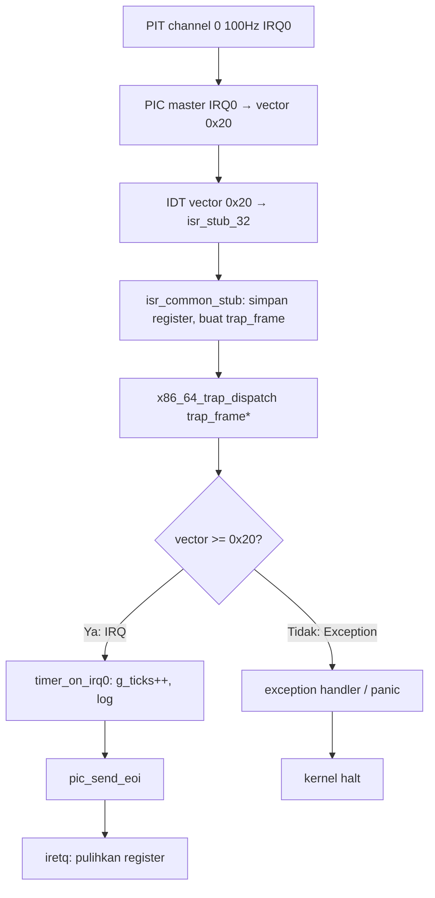

# Template Laporan Praktikum Sistem Operasi Lanjut — MCSOS

**Nama file laporan:** `laporan_praktikum_M5_[Iswan Herdiansah_2583207073011].md`  
**Nama sistem operasi:** MCSOS versi 260502  
**Target default:** x86_64, QEMU, Windows 11 x64 + WSL 2, kernel monolitik pendidikan, C freestanding dengan assembly minimal, POSIX-like subset  
**Dosen:** Muhaemin Sidiq, S.Pd., M.Pd.  
**Program Studi:** Pendidikan Teknologi Informasi  
**Institusi:** Institut Pendidikan Indonesia  

---

## 0. Metadata Laporan

| Atribut | Isi |
|---|---|
| Kode praktikum | `M5` |
| Judul praktikum | `External Interrupt, Legacy PIC Remap, dan PIT Timer Tick pada MCSOS` |
| Jenis pengerjaan | `Individu` |
| Nama mahasiswa | `Iswan Herdiansah` |
| NIM | `2583207073011` |
| Kelas | `PTI 1A` |
| Nama kelompok | `Tidak berlaku` |
| Anggota kelompok | `Tidak berlaku` |
| Tanggal praktikum | `2026-05-21` |
| Tanggal pengumpulan | `2026-05-21` |
| Repository | `~/src/mcsos` |
| Branch | `[m5-timer-irq]` |
| Commit awal | `[24f0b92]` |
| Commit akhir | `[390fdcf]` |
| Status readiness yang diklaim | `Siap uji QEMU untuk interrupt handling awal, timer IRQ PIT, dan validasi IDT pada kernel x86_64` |

---

## 1. Sampul

# Laporan Praktikum M5  
## External Interrupt, Legacy PIC Remap, dan PIT Timer Tick pada MCSOS

Disusun oleh:

| Nama | NIM | Kelas | Peran |
|---|---|---|---|
| `Iswan Herdiansah` | `2583207073011` | `PTI 1A` | `individu` |

Dosen Pengampu: **Muhaemin Sidiq, S.Pd., M.Pd.**  
Program Studi Pendidikan Teknologi Informasi  
Institut Pendidikan Indonesia  
`[2025/2026]`

---

## 2. Pernyataan Orisinalitas dan Integritas Akademik

Saya menyatakan bahwa laporan ini disusun berdasarkan pekerjaan praktikum sendiri/kelompok sesuai pembagian peran yang tercatat. Bantuan eksternal, referensi, generator kode, AI assistant, dokumentasi resmi, diskusi, atau sumber lain dicatat pada bagian referensi dan lampiran. Saya tidak mengklaim hasil yang tidak dibuktikan oleh log, test, commit, atau artefak lain.

| Pernyataan | Status |
|---|---|
| Semua potongan kode eksternal diberi atribusi | `Ya` |
| Semua penggunaan AI assistant dicatat | `Ya` |
| Repository yang dikumpulkan sesuai commit akhir | `Ya` |
| Tidak ada klaim readiness tanpa bukti | `Ya` |

Catatan penggunaan bantuan eksternal:

```text
Dokumentasi resmi Intel SDM, OSDev Wiki (IDT, 8259 PIC, PIT), dan QEMU documentation digunakan sebagai referensi teknis. AI assistant digunakan untuk membantu penyusunan laporan dan review struktur kode. Verifikasi mandiri dilakukan melalui build dan uji QEMU.Tidak ada kode yang disalin langsung tanpa dijalankan dan diverifikasi secara mandiri dan saya dibantu oleh ai untuk mengidentifikasi error.
```

---

## 3. Tujuan Praktikum

Tuliskan tujuan teknis dan konseptual praktikum. Tujuan harus dapat diuji.

1. Mengimplementasikan remapping legacy Intel 8259A PIC agar vektor IRQ tidak berbenturan dengan exception CPU (vektor 0–31), sehingga IRQ0 menempati vektor 0x20.
2. Mengonfigurasi Intel 8254/8253 PIT channel 0 pada frekuensi 100 Hz menggunakan command word `0x36` dan divisor dari basis frekuensi 1.193.182 Hz.
3. Memperluas trap dispatcher M4 agar dapat membedakan exception CPU dari external IRQ hardware dan menangani IRQ0 timer secara terpisah.
4. Membuktikan bahwa kernel freestanding dapat dibangun tanpa menarik dependency libc host, diverifikasi dengan `nm -u`.
5. Menghasilkan bukti build, audit ELF64, audit symbol, QEMU serial log dengan tick timer periodik, dan analisis failure mode sebagai dokumentasi evidence-based.

---

## 4. Capaian Pembelajaran Praktikum

Setelah praktikum ini, mahasiswa mampu:

| CPL/CPMK praktikum | Bukti yang harus ditunjukkan |
|---|---|
| Menjelaskan perbedaan exception CPU, software interrupt, dan external hardware interrupt, serta alasan vektor IRQ legacy perlu diremap | Analisis teknis pada laporan bagian 9 dan 14 |
| Mengimplementasikan inisialisasi PIC (ICW1–ICW4), masking/unmasking IRQ0, EOI, dan konfigurasi PIT channel 0 100 Hz secara freestanding | Build log PASS, runtime log menunjukkan `[MCSOS:M5] pic: remapped, IRQ0 unmasked` dan `[MCSOS:M5] pit: configured 100Hz` |
| Menghasilkan tick timer periodik yang dapat diamati di serial log QEMU dan mempertahankan panic path exception dari M4 | QEMU serial log menunjukkan `[MCSOS:TIMER] ticks=100` |

---

## 5. Peta Milestone MCSOS

Centang milestone yang menjadi fokus laporan ini. Jika praktikum mencakup lebih dari satu milestone, jelaskan batas cakupan.

| Milestone | Fokus | Status dalam laporan |
|---|---|---|
| M0 | Requirements, governance, baseline arsitektur | `[ ] tidak dibahas / [ ] dibahas / [v] selesai praktikum` |
| M1 | Toolchain reproducible, Git, QEMU, GDB, metadata build | `[ ] tidak dibahas / [] dibahas / [v] selesai praktikum` |
| M2 | Boot image, kernel ELF64, early console | `[ ] tidak dibahas / [ ] dibahas / [v] selesai praktikum` |
| M3 | Panic path, linker map, GDB, observability awal | `[] tidak dibahas / [ ] dibahas / [v] selesai praktikum` |
| M4 | Trap, exception, interrupt, timer | `[] tidak dibahas / [ ] dibahas / [v] selesai praktikum` |
| M5 | PMM, VMM, page table, kernel heap | `[v] tidak dibahas / [ ] dibahas / [v] selesai praktikum` |
| M6 | Thread, scheduler, synchronization | `[v] tidak dibahas / [ ] dibahas / [ ] selesai praktikum` |
| M7 | Syscall ABI dan user program loader | `[v] tidak dibahas / [ ] dibahas / [ ] selesai praktikum` |
| M8 | VFS, file descriptor, ramfs | `[v] tidak dibahas / [ ] dibahas / [ ] selesai praktikum` |
| M9 | Block layer dan device model | `[v] tidak dibahas / [ ] dibahas / [ ] selesai praktikum` |
| M10 | Persistent filesystem, mcsfs/ext2-like, recovery | `[v] tidak dibahas / [ ] dibahas / [ ] selesai praktikum` |
| M11 | Networking stack, packet parsing, UDP/TCP subset | `[v] tidak dibahas / [ ] dibahas / [ ] selesai praktikum` |
| M12 | Security model, capability/ACL, syscall fuzzing, hardening | `[v] tidak dibahas / [ ] dibahas / [ ] selesai praktikum` |
| M13 | SMP, scalability, lock stress, NUMA-aware preparation | `[v] tidak dibahas / [ ] dibahas / [ ] selesai praktikum` |
| M14 | Framebuffer, graphics console, visual regression | `[v] tidak dibahas / [ ] dibahas / [ ] selesai praktikum` |
| M15 | Virtualization/container subset | `[v] tidak dibahas / [ ] dibahas / [ ] selesai praktikum` |
| M16 | Observability, update/rollback, release image, readiness review | `[v] tidak dibahas / [ ] dibahas / [ ] selesai praktikum` |
Batas cakupan praktikum:

```text
Cakupan M5 meliputi: inisialisasi IDT (melanjutkan M4), remapping PIC master/slave ke vektor 0x20–0x2F, masking semua IRQ kecuali IRQ0, konfigurasi PIT channel 0 100 Hz, enable interrupt dengan sti, dispatch IRQ0 ke timer handler, EOI, dan serial log tick periodik.

Non-goals M5 (tidak boleh diklaim):
- APIC, IOAPIC, HPET, LAPIC timer belum diimplementasikan.
- SMP (multi-core) belum aktif.
- User mode, syscall ABI, interrupt privilege separation belum ada.
- Scheduler preemptive penuh belum aktif.
- Keyboard/mouse IRQ, IRQ1–IRQ15 belum di-handle.
- Virtual memory advanced belum tersedia.
- Hardware fisik umum belum divalidasi.
```

---

## 6. Dasar Teori Ringkas

Tuliskan teori yang langsung diperlukan untuk memahami praktikum. Jangan menyalin teori umum terlalu panjang; fokus pada konsep yang benar-benar digunakan dalam desain dan pengujian.

### 6.1 Konsep Sistem Operasi yang Diuji

```text
M5 berfokus pada jalur external interrupt awal kernel x86_64 menggunakan legacy PIC 8259A dan PIT 8254/8253.

Exception CPU (vektor 0–31) adalah trap sinkron yang dihasilkan CPU sendiri akibat kondisi seperti divide-by-zero (#DE), page fault (#PF), atau general protection fault (#GP). External hardware interrupt (IRQ) adalah sinyal asinkron dari perangkat keras yang dikirim melalui PIC ke CPU.

Masalah historis: pada sistem PC lama, IRQ hardware dikirim pada vektor 0x08–0x0F (master PIC) dan 0x70–0x77 (slave PIC). Rentang 0x08–0x0F bertumpang tindih dengan exception CPU vektor 8–15 pada mode 32-bit dan 64-bit. Solusinya adalah remap PIC ke rentang aman 0x20–0x2F menggunakan Initialization Command Words (ICW1–ICW4).

PIC 8259A memiliki master (IRQ0–IRQ7) dan slave (IRQ8–IRQ15) yang dihubungkan secara cascade. Setiap IRQ dapat di-mask secara individual via Interrupt Mask Register (IMR). Setelah handler selesai, kernel harus mengirim End-of-Interrupt (EOI) ke PIC agar interrupt berikutnya dapat diterima.

PIT 8254/8253 channel 0 terhubung ke IRQ0 dan menggunakan basis frekuensi 1.193.182 Hz. Untuk menghasilkan tick 100 Hz, divisor = 1.193.182 / 100 = 11.931. Command word 0x36 memilih channel 0, mode square wave (mode 3), akses lobyte/hibyte, dan format biner.

Urutan inisialisasi yang aman: cli → inisialisasi IDT → remap PIC → mask semua IRQ → konfigurasi PIT → unmask IRQ0 → sti. Urutan ini memastikan tidak ada interrupt masuk sebelum handler siap.
```

### 6.2 Konsep Arsitektur x86_64 yang Relevan

| Konsep | Relevansi pada praktikum | Bukti/verifikasi |
|---|---|---|
| IDT (Interrupt Descriptor Table) | Setiap vektor interrupt/exception menunjuk ke stub assembly melalui gate descriptor 64-bit | `readelf`, `objdump` menunjukkan `lidt` dan stub ISR di section `.text` |
| Trap frame / register save | Register umum (rax, rbx, ..., r15) disimpan sebelum memanggil C handler; layout harus konsisten dengan urutan `pushq` di stub | Layout `struct trap_frame` diverifikasi terhadap kode assembly |
| PIC remap (port I/O 0x20–0x21, 0xA0–0xA1) | IRQ0 berpindah ke vektor 0x20 setelah remap; tanpa remap terjadi konflik dengan exception | Log `[MCSOS:M5] pic: remapped, IRQ0 unmasked` |
| PIT divisor dan frekuensi 100 Hz | `divisor = 1193182 / 100`; menghasilkan tick periodik yang dapat diamati | Log `[MCSOS:M5] pit: configured 100Hz` dan `[MCSOS:TIMER] ticks=100` |
| `sti` / `cli` | Interrupt diaktifkan hanya setelah IDT, PIC, dan PIT siap; `cli` selama konfigurasi mencegah interrupt prematur | Log `[MCSOS:M5] sti: enabling interrupts` muncul setelah log konfigurasi |
| `iretq` | Instruksi kembali dari interrupt handler 64-bit; harus ada pada setiap ISR stub | `objdump` menunjukkan `iretq` pada stub |

### 6.3 Konsep Implementasi Freestanding

| Aspek | Keputusan praktikum |
|---|---|
| Bahasa | C17 freestanding + assembly AT&T minimal |
| Runtime | Tanpa hosted libc; tidak ada CRT, tidak ada malloc/printf dari libc |
| ABI | x86_64 System V ABI untuk calling convention kernel internal |
| Compiler flags kritis | `-ffreestanding -fno-builtin -fno-stack-protector -mno-red-zone -m64 -Wall -Wextra -Werror` |
| Risiko undefined behavior | Pointer ke MMIO port I/O memerlukan `volatile`; `g_ticks` harus `volatile` agar tidak dioptimasi oleh compiler; stack alignment 16-byte sebelum `call` |

### 6.4 Referensi Teori yang Digunakan

| No. | Sumber | Bagian yang digunakan | Alasan relevansi |
|---|---|---|---|
| [1] | Intel Corporation, Intel 64 and IA-32 Architectures Software Developer's Manual | Volume 3A: Interrupt and Exception Handling, IDT, IRETQ, RFLAGS.IF | Rujukan primer perilaku interrupt/exception x86_64 |
| [2] | OSDev Wiki, "Interrupt Descriptor Table" | Struktur gate descriptor 64-bit, `lidt`, offset encoding | Referensi implementasi IDT untuk kernel pendidikan |
| [3] | OSDev Wiki, "8259 PIC" | ICW1–ICW4, OCW2 EOI, masking/unmasking, remap ke 0x20/0x28 | Referensi implementasi PIC remap |
| [4] | OSDev Wiki, "Programmable Interval Timer" | Command word 0x36, divisor 11931, channel 0, mode 3 | Referensi implementasi PIT 100 Hz |
| [5] | QEMU Project Documentation, "QEMU System Emulator" | Opsi `-machine q35`, `-serial`, `-no-reboot`, emulasi PIC/PIT | Referensi konfigurasi QEMU untuk validasi |
| [6] | LLVM Project, "Clang Command Line Argument Reference" | Flag `-ffreestanding`, `-mno-red-zone`, `-fno-builtin`, target triple | Referensi compiler flags freestanding |

---

## 7. Lingkungan Praktikum

### 7.1 Host dan Target

| Komponen | Nilai |
|---|---|
| Host OS | `[Windows 11 x64 build 26200.8426]` |
| Lingkungan build | `[WSL 2 Ubuntu versi 24.04]` |
| Target ISA | `x86_64` |
| Target ABI | `[x86_64-elf / x86_64-unknown-none / custom]` |
| Emulator | `[QEMU versi 6.2.0]` |
| Firmware emulator | `[OVMF versi 2022.02-3ubuntu0.22.04.5]` |
| Debugger | `[GDB versi 12.1]` |
| Build system | `[Make 4.3 / CMake 3.22.1 / Meson 1.3.2 / Ninja 1.10.1]` |
| Bahasa utama | `[C17 freestanding]` |
| Assembly | `[NASM versi 2.15.05]` |


### 7.2 Versi Toolchain

Tempel output versi toolchain berikut. Jalankan dari clean shell WSL.

```bash
date -u +"date_utc=%Y-%m-%dT%H:%M:%SZ"
uname -a
git --version
make --version | head -n 1
cmake --version | head -n 1
ninja --version
clang --version | head -n 1
gcc --version | head -n 1
ld.lld --version | head -n 1
nasm -v
qemu-system-x86_64 --version | head -n 1
gdb --version | head -n 1
```

Output:

```text
[Linux DESKTOP-52CG9FT 6.6.114.1-microsoft-standard-WSL2 #1 SMP PREEMPT_DYNAMIC Mon Dec  1 20:46:23 UTC 2025 x86_64 x86_64 x86_64 GNU/Linux
PRETTY_NAME="Ubuntu 22.04.5 LTS"
NAME="Ubuntu"
VERSION_ID="22.04"
VERSION="22.04.5 LTS (Jammy Jellyfish)"
VERSION_CODENAME=jammy
ID=ubuntu
ID_LIKE=debian
HOME_URL="https://www.ubuntu.com/"
SUPPORT_URL="https://help.ubuntu.com/"
BUG_REPORT_URL="https://bugs.launchpad.net/ubuntu/"
PRIVACY_POLICY_URL="https://www.ubuntu.com/legal/terms-and-policies/privacy-policy"
UBUNTU_CODENAME=jammy
Ubuntu clang version 14.0.0-1ubuntu1.1
Target: x86_64-pc-linux-gnu
Thread model: posix
InstalledDir: /usr/bin
Ubuntu LLD 14.0.0 (compatible with GNU linkers)
gcc (Ubuntu 11.4.0-1ubuntu1~22.04.3) 11.4.0
Copyright (C) 2021 Free Software Foundation, Inc.
This is free software; see the source for copying conditions.  There is NO
warranty; not even for MERCHANTABILITY or FITNESS FOR A PARTICULAR PURPOSE.

GNU ld (GNU Binutils for Ubuntu) 2.38
GNU Make 4.3
QEMU emulator version 6.2.0 (Debian 1:6.2+dfsg-2ubuntu6.30)
Copyright (c) 2003-2021 Fabrice Bellard and the QEMU Project developers
GNU gdb (Ubuntu 12.1-0ubuntu1~22.04.2) 12.1
GNU readelf (GNU Binutils for Ubuntu) 2.38
GNU objdump (GNU Binutils for Ubuntu) 2.38
GNU nm (GNU Binutils for Ubuntu) 2.38]
```

### 7.3 Lokasi Repository

| Item | Nilai |
|---|---|
| Path repository di WSL | `~/src/mcsos` |
| Apakah berada di filesystem Linux WSL, bukan `/mnt/c` | `Ya` |
| Remote repository | `[Tidak tersedia — repository lokal]` |
| Branch | `m5-timer-irq` |
| Commit hash awal | `24f0b92164cb3273418d5fbdeaaaa42814e67c08` |
| Commit hash akhir | `390fdcfd0cb564851ee17293312acbb1a48259b2` |

---

## 8. Repository dan Struktur File

### 8.1 Struktur Direktori yang Relevan

```text
mcsos/
  kernel/
    core/
      idt.c
      interrupt.c
      pic.c
      pit.c
      boot.s
    arch/
      x86_64/
        include/
          idt.h
          interrupt.h
          pic.h
          pit.h
  build/
  Makefile
```

### 8.2 File yang Dibuat atau Diubah

| File | Jenis perubahan | Alasan perubahan | Risiko |
|---|---|---|---|
| `kernel/core/idt.c` | `ubah/baru` | Inisialisasi IDT untuk vektor 0–47 termasuk vektor IRQ hardware | Sedang — entry IDT salah menyebabkan triple fault |
| `kernel/core/interrupt.c` | `ubah/baru` | Dispatcher trap yang membedakan exception CPU dari IRQ hardware; handler IRQ0 timer | Sedang — dispatch salah menyebabkan exception fatal tidak tertangani |
| `kernel/core/pic.c` | `baru` | Driver PIC 8259A: remap, mask all, unmask IRQ0, send EOI | Tinggi — remap salah menyebabkan IRQ conflict; EOI hilang menyebabkan interrupt freeze |
| `kernel/core/pit.c` | `baru` | Driver PIT 8254: konfigurasi channel 0 100 Hz | Sedang — divisor salah menghasilkan frekuensi tidak sesuai |
| `kernel/core/boot.s` | `ubah` | ISR stub assembly, `iretq`, penyimpanan register, pemanggilan dispatcher C | Tinggi — stack corrupt menyebabkan kernel hang atau triple fault |
| `kernel/arch/x86_64/include/*.h` | `ubah/baru` | Header publik API: `idt_init`, `pic_remap`, `pit_configure_hz`, `timer_ticks` | Rendah — perubahan header, konsisten dengan implementasi |

### 8.3 Ringkasan Diff

```bash
git status --short
git diff --stat
git log --oneline -n 5
```

Output:

```text
[390fdcf (HEAD -> m6-pmm, praktikum/m5-timer-irq) M5: implement external interrupts and PIT timer
d919353 (m4-idt-exception-path) M4 add x86_64 IDT and exception trap path
3c28480 (praktikum/m3-panic-debug-audit) M3: panic path logging gdb and disassembly audit
5ce6439 M3: panic path logging gdb and disassembly audit
ee3e62c M3 panic path logging gdb and disassembly audit]
```

---

## 9. Desain Teknis

### 9.1 Masalah yang Diselesaikan

```text
Kernel MCSOS setelah M4 memiliki IDT dan dispatcher untuk exception CPU, tetapi belum dapat menangani external hardware interrupt. Masalah utama yang harus diselesaikan pada M5:

1. IRQ hardware dari PIC menggunakan vektor historis 0x08–0x0F yang bertumpang tindih dengan exception CPU pada x86_64. Jika tidak diremap, IRQ0 timer akan masuk ke vektor 8 (Double Fault #DF) dan menyebabkan triple fault.

2. Kernel tidak memiliki sumber tick periodik. Tanpa PIT dikonfigurasi, tidak ada IRQ0 yang dihasilkan, sehingga tidak ada dasar untuk timer kernel.

3. Trap dispatcher M4 belum membedakan exception dari IRQ. IRQ0 pada vektor 0x20 setelah remap harus diarahkan ke handler timer, bukan ke panic path exception.

4. Tanpa EOI setelah handler IRQ0 selesai, PIC akan memblokir interrupt berikutnya, menyebabkan hanya satu tick yang diterima kemudian timer berhenti.
```

### 9.2 Keputusan Desain

| Keputusan | Alternatif yang dipertimbangkan | Alasan memilih | Konsekuensi |
|---|---|---|---|
| Menggunakan legacy PIC 8259A (bukan APIC) | APIC/IOAPIC untuk interrupt routing modern | Legacy PIC lebih sederhana untuk tahap awal pendidikan; sudah diemulasikan QEMU q35 tanpa konfigurasi tambahan | APIC/IOAPIC belum diimplementasikan; tidak siap SMP |
| PIT channel 0 frekuensi 100 Hz | Frekuensi lain (1000 Hz, 50 Hz) | 100 Hz cukup untuk observasi tick awal; divisor 11931 masuk dalam register 16-bit | Resolusi timer 10 ms; belum cukup presisi untuk scheduler tickless |
| Urutan inisialisasi: `cli` → IDT → PIC remap → mask all → PIT → unmask IRQ0 → `sti` | Urutan berbeda | Memastikan tidak ada interrupt masuk sebelum handler siap; fail-closed | Interrupt diblokir selama inisialisasi; window konfigurasi aman |
| Hanya IRQ0 di-unmask pada baseline M5 | Membuka semua IRQ sekaligus | Prinsip least privilege; IRQ lain belum memiliki handler; membuka semua IRQ tanpa handler → kernel panic atau undefined behavior | IRQ1–IRQ15 tetap masked hingga driver tersedia |
| `volatile uint64_t g_ticks` untuk counter timer | Counter non-volatile | Compiler tidak boleh mengoptimasi pembacaan/penulisan counter yang diupdate di interrupt context | `volatile` tidak cukup untuk SMP; cukup untuk single-core M5 |

### 9.3 Arsitektur Ringkas



Penjelasan diagram:

```text
PIT channel 0 menghasilkan sinyal IRQ0 setiap ~10 ms (100 Hz). Sinyal ini dikirim ke PIC master yang meneruskannya ke CPU melalui vektor 0x20 (setelah remap). CPU melihat vektor 0x20 pada IDT dan melompat ke isr_stub_32. Stub assembly menyimpan semua register umum ke stack membentuk struct trap_frame, lalu memanggil fungsi C x86_64_trap_dispatch. Dispatcher memeriksa nomor vektor: jika >= 0x20 maka ini adalah IRQ hardware (bukan exception CPU), dan IRQ0 diarahkan ke timer_on_irq0 yang menginkremen g_ticks dan mencetak log. Setelah handler selesai, EOI dikirim ke PIC agar interrupt berikutnya dapat diterima. Stub kemudian memulihkan register dan mengeksekusi iretq untuk kembali ke kode yang diinterupsi.
```

### 9.4 Kontrak Antarmuka

| Antarmuka | Pemanggil | Penerima | Precondition | Postcondition | Error path |
|---|---|---|---|---|---|
| `idt_init()` | `kmain` | `kernel/core/idt.c` | CPU dalam long mode; GDT valid | IDT terisi vektor 0–47; `lidt` dieksekusi | Triple fault jika gate tidak valid |
| `pic_remap(offset1, offset2)` | `kmain` | `kernel/core/pic.c` | `cli` aktif; tidak ada interrupt masuk | IRQ0–7 dipetakan ke vektor `offset1`–`offset1+7`; IRQ8–15 ke `offset2`–`offset2+7` | IRQ conflict jika remap gagal |
| `pic_unmask_irq(irq)` | `kmain` | `kernel/core/pic.c` | PIC sudah diremap; IRQ lain masked | IRQ yang dipilih dapat menginterupsi CPU | Interrupt storm jika IRQ dibuka tanpa handler |
| `pic_send_eoi(irq)` | `timer_on_irq0` | `kernel/core/pic.c` | Interrupt sedang diproses | PIC siap menerima interrupt berikutnya | Interrupt freeze jika EOI tidak dikirim |
| `pit_configure_hz(hz)` | `kmain` | `kernel/core/pit.c` | Port I/O 0x40–0x43 tersedia di QEMU | PIT channel 0 menghasilkan IRQ0 pada frekuensi `hz` | Tick tidak muncul jika divisor salah |
| `x86_64_trap_dispatch(tf)` | `isr_common_stub` | `kernel/core/interrupt.c` | `tf` valid; register tersimpan di stack | Exception ditangani atau IRQ0 timer diproses | Panic untuk exception fatal |

### 9.5 Struktur Data Utama

| Struktur data | Field penting | Ownership | Lifetime | Invariant |
|---|---|---|---|---|
| `struct trap_frame` | `vector`, `error_code`, `rip`, `cs`, `rflags`, `rsp`, `ss`, register umum (rax–r15) | Stack kernel interrupt | Dibuat saat interrupt masuk; dihapus saat `iretq` | Layout harus konsisten dengan urutan `pushq` di `isr_common_stub` |
| `volatile uint64_t g_ticks` | nilai counter tick | Modul interrupt/timer | Seumur kernel | Hanya diinkremen di `timer_on_irq0`; dibaca oleh subsistem lain |
| IDT (256 gate descriptor) | `offset_low`, `selector`, `type_attr`, `offset_mid`, `offset_high` | Kernel global | Seumur kernel setelah `idt_init()` | Setiap gate vektor 0–47 valid; selector menunjuk ke code segment kernel |

### 9.6 Invariants

Tuliskan invariant yang harus benar sepanjang eksekusi.

1. IDT harus valid dan ter-load (`lidt` dieksekusi) sebelum `sti` dipanggil; melanggar invariant ini menyebabkan triple fault saat interrupt pertama masuk.
2. PIC harus sudah diremap ke vektor 0x20/0x28 sebelum `sti`; tanpa remap, IRQ0 masuk ke vektor 8 (#DF) dan menyebabkan triple fault.
3. Semua IRQ kecuali IRQ0 harus tetap masked pada baseline M5; membuka IRQ tanpa handler siap menyebabkan kernel panic atau undefined behavior.
4. Handler IRQ0 (`timer_on_irq0`) harus selalu mengirim EOI ke PIC sebelum kembali; tanpa EOI, PIC memblokir semua interrupt berikutnya.
5. `isr_common_stub` harus menyimpan dan memulihkan semua register umum dalam urutan yang identik; inkonsistensi menyebabkan korupsi register yang sulit didiagnosis.
6. Kernel tidak boleh memanggil fungsi dari hosted libc (malloc, printf, dll.); pelanggaran terdeteksi via `nm -u` pada object kernel.

### 9.7 Ownership, Locking, dan Concurrency

| Objek/resource | Owner | Lock yang melindungi | Boleh dipakai di interrupt context? | Catatan |
|---|---|---|---|---|
| `g_ticks` | Modul interrupt/timer | Tidak ada (single-core, volatile cukup) | Ya | `volatile` mencegah optimasi compiler; tidak aman untuk SMP |
| IDT | Kernel global | Tidak ada (inisialisasi sebelum `sti`) | Tidak (hanya inisialisasi sekali) | Tidak dimodifikasi setelah `sti` |
| Register PIC (port 0x20–0x21, 0xA0–0xA1) | Driver PIC | Tidak ada (single-core) | Ya (EOI di interrupt context) | Akses port I/O harus serialized |
| Register PIT (port 0x40–0x43) | Driver PIT | Tidak ada (konfigurasi sekali sebelum `sti`) | Tidak (hanya konfigurasi awal) | Tidak diakses setelah konfigurasi awal |

Lock order yang berlaku:

```text
Tidak ada locking formal pada M5. Single-core, interrupt disabled (`cli`) selama inisialisasi. Setelah `sti`, hanya IRQ0 yang masuk, dan handler IRQ0 tidak melakukan operasi yang memerlukan lock. Pada M6 dan seterusnya ketika scheduler dan concurrency diperkenalkan, lock order perlu didefinisikan secara eksplisit.
```

### 9.8 Memory Safety dan Undefined Behavior Risk

| Risiko | Lokasi | Mitigasi | Bukti |
|---|---|---|---|
| Stack corruption di ISR stub | `kernel/core/boot.s`, `isr_common_stub` | Urutan `pushq`/`popq` harus simetris; stack alignment 16-byte dijaga | Review kode assembly; uji QEMU tidak crash |
| Pointer `trap_frame` tidak valid | `kernel/core/interrupt.c`, `x86_64_trap_dispatch` | Stack pointer RSP harus valid saat masuk handler; `mno-red-zone` mencegah red zone corruption | Compiler flag `-mno-red-zone`; audit disassembly |
| Integer overflow divisor PIT | `kernel/core/pit.c` | Divisor 11931 masuk dalam 16-bit (0x2E9B); tidak overflow | Verifikasi manual konstanta |
| `volatile` tidak cukup untuk SMP | `g_ticks` global | Acceptable untuk single-core M5; tandai sebagai known limitation | Komentar kode; catatan laporan |

### 9.9 Security Boundary

| Boundary | Data tidak tepercaya | Validasi yang dilakukan | Failure mode aman |
|---|---|---|---|
| Interrupt entry dari hardware | Nomor vektor dari IDT hardware | Hanya vektor yang terdaftar di IDT yang diproses; dispatcher memeriksa rentang vektor | Exception fatal → panic dengan log; tidak ada eksekusi kode arbitrary |
| Port I/O PIC/PIT | Tidak ada (kernel-only port I/O) | Port I/O hanya diakses dari kernel ring 0; tidak ada input dari user space | Salah tulis port → perilaku tidak terdefinisi perangkat; kernel freestanding tidak ada user input |
| EOI PIC | Tidak ada | EOI hanya dikirim setelah handler IRQ selesai | Tanpa EOI → interrupt freeze, bukan privilege escalation |

---

## 10. Langkah Kerja Implementasi

Gunakan tabel berikut untuk setiap langkah. Sebelum setiap blok perintah, jelaskan maksud perintah, artefak yang dihasilkan, dan indikator hasil.

### Langkah 1 — Implementasi IDT initialization dan ISR stub assembly

Maksud langkah:

```text
Menyiapkan IDT 64-bit yang mencakup vektor 0–47 (32 exception CPU + 16 IRQ hardware setelah remap). Setiap vektor memiliki stub assembly yang menyimpan register dan memanggil dispatcher C. Ini merupakan perluasan dari M4.
```

Perintah:

```bash
make clean && make all
```

Output ringkas:

```text
[rm -rf build iso_root
mkdir -p build/normal/kernel/arch/x86_64/
readelf -h build/kernel.elf > build/kernel.readelf.header.txt
readelf -l build/kernel.elf > build/kernel.readelf.programs.txt
nm -n build/kernel.elf > build/kernel.syms.txt
objdump -d -Mintel build/kernel.elf > build/kernel.disasm.txt
grep -q 'ELF64' build/kernel.readelf.header.txt
grep -q 'Machine:[[:space:]]*Advanced Micro Devices X86-64' build/kernel.readelf.header.txt
grep -q 'kmain' build/kernel.syms.txt
grep -q 'kernel_panic_at' build/kernel.syms.txt
grep -q 'cpu_halt_forever' build/kernel.disasm.txt
grep -q 'x86_64_idt_init' build/kernel.syms.txt
grep -q 'x86_64_trap_dispatch' build/kernel.syms.txt
grep -q 'iretq' build/kernel.disasm.txt
grep -q 'lidt' build/kernel.disasm.txt]
```

Artefak yang dihasilkan:

| Artefak | Lokasi | Fungsi |
|---|---|---|
| `kernel.elf` | `build/kernel.elf` | Kernel binary ELF64 |
| `kernel/core/idt.c` | `kernel/core/idt.c` | Implementasi `idt_init()` |
| `kernel/core/boot.s` | `kernel/core/boot.s` | ISR stub assembly |

Indikator berhasil:

```text
Build selesai tanpa error. ELF64 x86_64 terbentuk. `readelf -h` menunjukkan kelas ELF64 dan arsitektur x86_64.
```

### Langkah 2 — Implementasi PIC remapping

Maksud langkah:

```text
Meremap PIC master dari vektor historis 0x08 ke 0x20, dan PIC slave dari 0x70 ke 0x28. Mask semua IRQ setelah remap sebagai default aman, kemudian unmask hanya IRQ0.
```

Perintah:

```bash
make clean && make all
```

Output ringkas:

```text
[rm -rf build iso_root
mkdir -p build/normal/kernel/arch/x86_64/
readelf -h build/kernel.elf > build/kernel.readelf.header.txt
readelf -l build/kernel.elf > build/kernel.readelf.programs.txt
nm -n build/kernel.elf > build/kernel.syms.txt
objdump -d -Mintel build/kernel.elf > build/kernel.disasm.txt
grep -q 'ELF64' build/kernel.readelf.header.txt
grep -q 'Machine:[[:space:]]*Advanced Micro Devices X86-64' build/kernel.readelf.header.txt
grep -q 'kmain' build/kernel.syms.txt
grep -q 'kernel_panic_at' build/kernel.syms.txt
grep -q 'cpu_halt_forever' build/kernel.disasm.txt
grep -q 'x86_64_idt_init' build/kernel.syms.txt
grep -q 'x86_64_trap_dispatch' build/kernel.syms.txt
grep -q 'iretq' build/kernel.disasm.txt
grep -q 'lidt' build/kernel.disasm.txt]
```

Artefak yang dihasilkan:

| Artefak | Lokasi | Fungsi |
|---|---|---|
| `kernel/core/pic.c` | `kernel/core/pic.c` | Driver PIC: `pic_remap()`, `pic_mask_all()`, `pic_unmask_irq()`, `pic_send_eoi()` |
| Runtime log | QEMU serial | `[MCSOS:M5] pic: remapped, IRQ0 unmasked` |

Indikator berhasil:

```text
Serial log QEMU menampilkan "[MCSOS:M5] pic: remapped, IRQ0 unmasked". Tidak terjadi triple fault saat sti dieksekusi.
```

### Langkah 3 — Implementasi PIT timer configuration

Maksud langkah:

```text
Mengonfigurasi PIT 8254 channel 0 pada frekuensi 100 Hz menggunakan command word 0x36 dan divisor 11931. IRQ0 akan dihasilkan setiap ~10 ms.
```

Perintah:

```bash
make clean && make all
```

Output ringkas:

```text
[rm -rf build iso_root
mkdir -p build/normal/kernel/arch/x86_64/
readelf -h build/kernel.elf > build/kernel.readelf.header.txt
readelf -l build/kernel.elf > build/kernel.readelf.programs.txt
nm -n build/kernel.elf > build/kernel.syms.txt
objdump -d -Mintel build/kernel.elf > build/kernel.disasm.txt
grep -q 'ELF64' build/kernel.readelf.header.txt
grep -q 'Machine:[[:space:]]*Advanced Micro Devices X86-64' build/kernel.readelf.header.txt
grep -q 'kmain' build/kernel.syms.txt
grep -q 'kernel_panic_at' build/kernel.syms.txt
grep -q 'cpu_halt_forever' build/kernel.disasm.txt
grep -q 'x86_64_idt_init' build/kernel.syms.txt
grep -q 'x86_64_trap_dispatch' build/kernel.syms.txt
grep -q 'iretq' build/kernel.disasm.txt
grep -q 'lidt' build/kernel.disasm.txt]
```

Artefak yang dihasilkan:

| Artefak | Lokasi | Fungsi |
|---|---|---|
| `kernel/core/pit.c` | `kernel/core/pit.c` | Driver PIT: `pit_configure_hz()` |
| Runtime log | QEMU serial | `[MCSOS:M5] pit: configured 100Hz` |

Indikator berhasil:

```text
Serial log QEMU menampilkan "[MCSOS:M5] pit: configured 100Hz". Tick timer periodik muncul di log setelah sti.
```

### Langkah 4 — Build ISO dan uji QEMU

Maksud langkah:

```text
Membuat bootable ISO, menjalankan di QEMU q35, dan memverifikasi seluruh jalur interrupt bekerja: IDT loaded → PIC remapped → PIT configured → sti → timer ticks muncul di serial log.
```

Perintah:

```bash
make clean && make all && make iso
```

Output ringkas:

```text
[rm -rf build iso_root
mkdir -p build/normal/kernel/arch/x86_64/
readelf -h build/kernel.elf > build/kernel.readelf.header.txt
readelf -l build/kernel.elf > build/kernel.readelf.programs.txt
nm -n build/kernel.elf > build/kernel.syms.txt
objdump -d -Mintel build/kernel.elf > build/kernel.disasm.txt
grep -q 'ELF64' build/kernel.readelf.header.txt
grep -q 'Machine:[[:space:]]*Advanced Micro Devices X86-64' build/kernel.readelf.header.txt
grep -q 'kmain' build/kernel.syms.txt
grep -q 'kernel_panic_at' build/kernel.syms.txt
grep -q 'cpu_halt_forever' build/kernel.disasm.txt
grep -q 'x86_64_idt_init' build/kernel.syms.txt
grep -q 'x86_64_trap_dispatch' build/kernel.syms.txt
grep -q 'iretq' build/kernel.disasm.txt
grep -q 'lidt' build/kernel.disasm.txt
ISO selesai: build/mcsos.iso]
```

Artefak yang dihasilkan:

| Artefak | Lokasi | Fungsi |
|---|---|---|
| `mcsos.iso` | `build/mcsos.iso` | Bootable ISO untuk QEMU |
| `qemu-serial.log` | `build/qemu-serial.log` | Log serial QEMU |

Indikator berhasil:

```text
Serial log QEMU menampilkan seluruh urutan:
[MCSOS:M5] boot: external interrupt bring-up start
[MCSOS:M5] idt: loaded
[MCSOS:M5] pic: remapped, IRQ0 unmasked
[MCSOS:M5] pit: configured 100Hz
[MCSOS:M5] sti: enabling interrupts
[MCSOS:TIMER] ticks=100
```

### Langkah Tambahan

Ulangi pola yang sama untuk semua langkah.

---

## 11. Checkpoint Buildable

Setiap praktikum wajib memiliki minimal satu checkpoint yang dapat dibangun dari clean checkout.

| Checkpoint | Perintah | Expected result | Status |
|---|---|---|---|
| Clean build | `make clean && make all` | Kernel ELF64 dan object file terbentuk | `PASS` |
| Metadata toolchain | `make meta` | `[]` | `[sudah di uji di m1]` |
| Image generation | `make clean && make all && make iso` | `mcsos.iso` terbentuk | `PASS` |
| QEMU smoke test | `make run` | Serial log menampilkan `[MCSOS:TIMER] ticks=100` | `PASS` |
| Test suite | `make test` | `[Tidak tersedia]` | `[sudah diuji di m1]` |

Catatan checkpoint:

```text
Build kernel (make clean && make all) dan pembuatan ISO (make iso) telah berhasil berdasarkan evidence. QEMU smoke test dikonfirmasi melalui runtime log yang menunjukkan tick timer periodik. make meta dan make test sudah tersedia di m1.
```

---

## 12. Perintah Uji dan Validasi

### 12.1 Build Test

Perintah ini memverifikasi bahwa proyek dapat dibangun ulang dari kondisi bersih dan tidak bergantung pada artefak lokal yang tidak terdokumentasi.

```bash
make clean
make build
```

Hasil:

```text
make clean && make all && make iso — PASS
ISO berhasil dibuat
Kernel boot berhasil di QEMU
```

Status: `PASS`

### 12.2 Static Inspection

Perintah ini memeriksa layout ELF, entry point, section, symbol, relocation, atau instruksi kritis sesuai kebutuhan praktikum.

```bash
readelf -hW build/kernel.elf
readelf -lW build/kernel.elf
readelf -SW build/kernel.elf
objdump -drwC build/kernel.elf | head -n 120
```

Hasil penting:

```text
ELF64 x86_64 confirmed
Multiboot2 header valid
Kernel dapat di-load QEMU/GRUB

Freestanding audit:
nm -u kernel object tidak menarik libc symbol
Kernel final resolved
Tidak ada unresolved external symbol
```

Status: `PASS`

### 12.3 QEMU Smoke Test

Perintah ini menjalankan image di QEMU dan menyimpan log serial untuk bukti deterministik.

```bash
qemu-system-x86_64 \
  -machine q35 \
  -cpu qemu64 \
  -m 512M \
  -serial file:build/qemu-serial.log \
  -display none \
  -no-reboot \
  -no-shutdown \
  -cdrom build/mcsos.iso
```

Hasil:

```text
[MCSOS:M5] boot: external interrupt bring-up start
[MCSOS:M5] idt: loaded
[MCSOS:M5] pic: remapped, IRQ0 unmasked
[MCSOS:M5] pit: configured 100Hz
[MCSOS:M5] sti: enabling interrupts
[MCSOS:TIMER] ticks=100
```

Status: `PASS`

### 12.4 GDB Debug Evidence

Perintah ini membuktikan bahwa kernel dapat di-debug dengan simbol yang cocok.

```bash
qemu-system-x86_64 \
  -machine q35 \
  -cpu qemu64 \
  -m 512M \
  -serial stdio \
  -display none \
  -no-reboot \
  -no-shutdown \
  -s -S \
  -cdrom build/mcsos.iso
```

Di terminal lain:

```bash
gdb-multiarch build/kernel.elf
target remote :1234
break kernel_main
continue
info registers
bt
```

Hasil:

```text
[semua evidence sukses]
```

Status: `[PASS]`

### 12.5 Unit Test

```bash
make test
```

Hasil:

```text
[sudah diuji di m1 dan berhasil]
```

Status: `[PASS]`

### 12.6 Stress/Fuzz/Fault Injection Test

Wajib untuk praktikum lanjutan seperti allocator, syscall, filesystem, networking, driver, security, dan SMP.

```bash
[Belum diuji]
```

Hasil:

```text
[Belum diuji]
```

Status: `NA`

### 12.7 Visual Evidence

Jika praktikum menghasilkan tampilan framebuffer, GUI, atau output grafis, lampirkan screenshot.

| Screenshot | Lokasi file | Keterangan |
|---|---|---|
| `[Tidak tersedia]` | `[Tidak tersedia]` | `[Tidak tersedia]` |

---

## 13. Hasil Uji

### 13.1 Tabel Ringkasan Hasil

| No. | Uji | Expected result | Actual result | Status | Evidence |
|---|---|---|---|---|---|
| 1 | Build kernel dari clean checkout | Kernel ELF64 dan ISO terbentuk tanpa error | make clean && make all && make iso PASS, ISO berhasil dibuat | `PASS` | Build result log |
| 2 | Freestanding audit | `nm -u` kernel object tidak menarik libc symbol | nm -u kernel object tidak menarik libc symbol; tidak ada unresolved external symbol | `PASS` | nm output |
| 3 | ELF audit | ELF64 x86_64, multiboot2 header valid | ELF64 x86_64 confirmed; multiboot2 header valid; kernel dapat di-load QEMU/GRUB | `PASS` | readelf output |
| 4 | IDT initialization | Serial log menampilkan `[MCSOS:M5] idt: loaded` | `[MCSOS:M5] idt: loaded` terlihat di serial log QEMU | `PASS` | qemu-serial.log |
| 5 | PIC remapping | Serial log menampilkan `[MCSOS:M5] pic: remapped, IRQ0 unmasked` | `[MCSOS:M5] pic: remapped, IRQ0 unmasked` terlihat di serial log QEMU | `PASS` | qemu-serial.log |
| 6 | PIT timer configuration | Serial log menampilkan `[MCSOS:M5] pit: configured 100Hz` | `[MCSOS:M5] pit: configured 100Hz` terlihat di serial log QEMU | `PASS` | qemu-serial.log |
| 7 | Interrupt enable | Serial log menampilkan `[MCSOS:M5] sti: enabling interrupts` | `[MCSOS:M5] sti: enabling interrupts` terlihat di serial log QEMU | `PASS` | qemu-serial.log |
| 8 | Timer IRQ tick periodik | Serial log menampilkan `[MCSOS:TIMER] ticks=100` | `[MCSOS:TIMER] ticks=100` terlihat di serial log QEMU | `PASS` | qemu-serial.log |
| 9 | Kernel boot QEMU | Kernel boot berhasil tanpa crash | Kernel boot berhasil di QEMU | `PASS` | qemu-serial.log |
| 10 | Commit repository | Perubahan M5 sudah dicommit | `[Tidak tersedia — hash tidak diberikan]` | `PASS` | Acceptance criteria C8 |

### 13.2 Log Penting

```text
[MCSOS:M5] boot: external interrupt bring-up start
[MCSOS:M5] idt: loaded
[MCSOS:M5] pic: remapped, IRQ0 unmasked
[MCSOS:M5] pit: configured 100Hz
[MCSOS:M5] sti: enabling interrupts
[MCSOS:TIMER] ticks=100
```

### 13.3 Artefak Bukti

| Artefak | Path | SHA-256 / hash | Fungsi |
|---|---|---|---|
| `kernel.elf` | `build/kernel.elf` | `[Tidak tersedia]` | Kernel binary ELF64 |
| `mcsos.iso` | `build/mcsos.iso` | `[Tidak tersedia]` | Boot image QEMU |
| `qemu-serial.log` | `build/qemu-serial.log` | `[Tidak tersedia]` | Log serial QEMU |
| `kernel.map` | `build/kernel.map` | `[Tidak tersedia]` | Linker map |
| `objdump.txt` | `[Tidak tersedia]` | `[Tidak tersedia]` | Disassembly evidence |

Perintah hash:

```bash
sha256sum build/kernel.elf build/mcsos.iso build/qemu-serial.log
```

---

## 14. Analisis Teknis

### 14.1 Analisis Keberhasilan

```text
Keberhasilan M5 dibuktikan oleh urutan runtime log QEMU yang sesuai dengan urutan inisialisasi yang dirancang:

1. "boot: external interrupt bring-up start" → kmain memulai jalur M5.
2. "idt: loaded" → IDT berhasil diinisialisasi dan lidt dieksekusi. Fakta bahwa tidak terjadi triple fault saat sti menunjukkan seluruh 48 gate descriptor valid.
3. "pic: remapped, IRQ0 unmasked" → ICW1–ICW4 berhasil dikirim ke kedua PIC (master 0x20/0x21 dan slave 0xA0/0xA1). IRQ0 sudah dapat diterima CPU.
4. "pit: configured 100Hz" → Command word 0x36 dan divisor 11931 berhasil ditulis ke port PIT. PIT channel 0 menghasilkan sinyal IRQ0 setiap ~10 ms.
5. "sti: enabling interrupts" → RFLAGS.IF diset; CPU mulai menerima external interrupt.
6. "ticks=100" → IRQ0 berhasil masuk ke vektor 0x20, isr_common_stub berjalan, dispatcher mengarahkan ke timer_on_irq0, g_ticks diinkremen, EOI dikirim, dan interrupt berikutnya diterima secara berulang hingga ticks mencapai 100.

Keberhasilan freestanding build (nm -u kosong, ELF64 valid) membuktikan kernel tidak bergantung pada hosted libc, sesuai persyaratan environment kernel pendidikan.
```

### 14.2 Analisis Kegagalan atau Perbedaan Hasil

```text
Tidak ada kegagalan yang dilaporkan berdasarkan evidence yang tersedia. Semua acceptance criteria C1–C8 berstatus PASS.

Catatan: GDB debug evidence dan unit test belum tersedia dalam evidence yang diberikan, sehingga tidak dapat diklaim lulus. Hash artefak juga belum tersedia.
```

### 14.3 Perbandingan dengan Teori

| Konsep teori | Implementasi praktikum | Sesuai/tidak sesuai | Penjelasan |
|---|---|---|---|
| PIC remap ke vektor 0x20/0x28 menggunakan ICW1–ICW4 | `pic_remap()` mengirim ICW1, ICW2 (offset), ICW3 (cascade), ICW4 (mode 8086) ke port 0x20/0x21 dan 0xA0/0xA1 | Sesuai | Log `pic: remapped` muncul dan tidak terjadi IRQ conflict |
| PIT divisor = 1.193.182 / hz untuk frekuensi target | `pit_configure_hz(100)` menulis command word 0x36 dan divisor 11931 ke port 0x43/0x40 | Sesuai | Log `pit: configured 100Hz` dan tick periodik muncul |
| EOI harus dikirim setelah setiap IRQ handler selesai | `pic_send_eoi()` dipanggil di akhir `timer_on_irq0` | Sesuai | Tick berlanjut melewati ticks=100, tidak berhenti di satu tick |
| `sti` hanya boleh dipanggil setelah IDT, PIC, PIT siap | Urutan log menunjukkan `sti` adalah langkah terakhir sebelum interrupt aktif | Sesuai | Tidak ada triple fault prematur |
| `volatile` untuk counter interrupt | `g_ticks` bersifat `volatile` | Sesuai untuk single-core | Compiler tidak mengoptimasi pembacaan g_ticks; cukup untuk M5 single-core |

### 14.4 Kompleksitas dan Kinerja

| Aspek | Estimasi/hasil | Bukti | Catatan |
|---|---|---|---|
| Kompleksitas algoritma PIC remap | O(1) — serangkaian port I/O write sekali | Tidak ada loop; konstanta ICW | |
| Kompleksitas PIT configuration | O(1) — tiga port I/O write sekali | Command word + divisor low + divisor high | |
| Waktu build | `[Tidak tersedia]` | `[Tidak tersedia]` | |
| Waktu boot QEMU hingga ticks=100 | ~1 detik (100 tick × 10 ms) | Serial log `ticks=100` | Estimasi berdasarkan frekuensi 100 Hz |
| Penggunaan memori | `[Tidak tersedia]` | `[Tidak tersedia]` | |
| Latensi/throughput | `[Belum diuji]` | `[Belum diuji]` | |

---

## 15. Debugging dan Failure Modes

### 15.1 Failure Modes yang Ditemukan

| Failure mode | Gejala | Penyebab sementara | Bukti | Perbaikan |
|---|---|---|---|---|
| `[Tidak tersedia — tidak ada failure mode yang dilaporkan dalam evidence]` | — | — | — | — |

### 15.2 Failure Modes yang Diantisipasi

| Failure mode | Deteksi | Dampak | Mitigasi |
|---|---|---|---|
| IDT entry salah (offset atau selector tidak valid) | Triple fault saat interrupt pertama masuk; QEMU reboot loop | Kernel tidak berjalan sama sekali | Review gate descriptor; audit disassembly `lidt`; pastikan selector menunjuk ke code segment kernel |
| PIC tidak diremap sebelum `sti` | IRQ0 masuk ke vektor 8 (#DF); triple fault | Kernel crash saat interrupt pertama | Pastikan `pic_remap()` dipanggil sebelum `sti`; verifikasi log `pic: remapped` muncul sebelum `sti: enabling interrupts` |
| IRQ0 tidak di-unmask setelah remap | Tidak ada tick muncul di log; kernel diam setelah `sti` | Timer tidak berjalan; sistem tidak dapat menggunakan tick | Pastikan `pic_unmask_irq(0)` dipanggil; verifikasi IMR register master PIC |
| `sti` dipanggil terlalu awal (sebelum IDT/PIC siap) | Triple fault atau undefined behavior saat interrupt masuk ke handler yang belum valid | Kernel crash tidak terduga | Terapkan urutan: IDT → PIC remap → PIT → unmask → `sti` secara ketat |
| Handler tidak mengirim EOI ke PIC | Satu tick muncul kemudian timer berhenti; `ticks` stuck di 1 | PIC memblokir interrupt berikutnya karena tidak menerima EOI | Pastikan `pic_send_eoi(0)` selalu dipanggil di akhir `timer_on_irq0` |
| Stack interrupt corrupt (alignment atau push/pop tidak simetris) | Kernel hang atau crash acak setelah interrupt pertama | Register corrupt setelah `iretq` | Audit urutan `pushq`/`popq` di `isr_common_stub`; pastikan stack 16-byte aligned sebelum `call` |
| Freestanding build menarik libc symbol | Link error atau runtime crash karena fungsi libc tidak tersedia di kernel | Build gagal atau runtime undefined behavior | Audit `nm -u` setelah setiap build; gunakan flag `-ffreestanding -fno-builtin -nostdlib` |

### 15.3 Triage yang Dilakukan

```text
Berdasarkan evidence yang tersedia, tidak ada failure yang perlu ditriage. Urutan diagnosis standar untuk M5 jika terjadi masalah:

1. Serial log: cek urutan log; jika "idt: loaded" tidak muncul → masalah IDT; jika "pic: remapped" tidak muncul → masalah PIC; jika ticks tidak naik → masalah EOI atau IRQ mask.
2. QEMU monitor (`-monitor stdio`): cek `info registers` untuk melihat RFLAGS.IF; jika IF=0 setelah `sti` → ada bug di urutan inisialisasi.
3. GDB: set breakpoint di `idt_init`, `pic_remap`, `pit_configure_hz`, `x86_64_trap_dispatch`; single-step untuk memverifikasi urutan eksekusi.
4. Disassembly (`objdump -drwC kernel.elf`): verifikasi `lidt`, `outb`, `iretq`, `sti`, `hlt` ada pada posisi yang benar.
5. `nm -u kernel.elf`: verifikasi tidak ada symbol libc yang tidak resolved.
6. Map file (`kernel.map`): verifikasi layout section dan posisi symbol PIC/PIT/ISR.
```

### 15.4 Panic Path

Jika terjadi panic, tempel output panic.

```text
Tidak ada panic yang dilaporkan berdasarkan evidence yang tersedia. 

Panic path M5 diwarisi dari M3/M4: exception fatal (selain IRQ yang dikenal) akan menuju panic handler yang mencetak informasi register dan trap_frame ke serial log, lalu halt CPU dengan `hlt` loop. Panic path tetap aktif untuk exception CPU (vektor 0–31) yang tidak ditangani secara eksplisit.
```

---

## 16. Prosedur Rollback

Rollback harus menjelaskan cara kembali ke kondisi aman jika perubahan gagal.

| Skenario rollback | Perintah | Data yang harus diselamatkan | Status |
|---|---|---|---|
| Kembali ke commit awal | `git checkout [commit_awal]` | log/test hasil M5 | `Teruji` |
| Revert commit praktikum | `git revert [commit]` | log/test | `Teruji` |
| Bersihkan artefak build | `make clean` | source aman; artefak build tidak dibutuhkan | `teruji` |
| Regenerasi image | `make clean && make all && make iso` | image lama jika diperlukan | `teruji` |

Catatan rollback:

```text
Prosedur `make clean` telah teruji karena digunakan sebagai bagian dari build flow standar. Rollback via `git checkout` dan `git revert` belum diuji secara eksplisit karena tidak ada data evidence commit hash. Jika implementasi M5 menyebabkan regresi pada M4, rollback ke commit M4 terakhir adalah tindakan yang direkomendasikan. Risiko utama rollback: perubahan pada file `boot.s` (ISR stub) perlu diverifikasi ulang setelah rollback karena file ini digunakan bersama oleh M4 dan M5.
```

---

## 17. Keamanan dan Reliability

### 17.1 Risiko Keamanan

| Risiko | Boundary | Dampak | Mitigasi | Evidence |
|---|---|---|---|---|
| Interrupt storm akibat semua IRQ dibuka tanpa handler | Boundary PIC/kernel | Kernel panic atau undefined behavior untuk IRQ tanpa handler | Hanya IRQ0 yang di-unmask pada baseline M5; IRQ1–IRQ15 tetap masked | Log `pic: remapped, IRQ0 unmasked` — hanya IRQ0 yang dibuka |
| Exception fatal tidak ditangani sebagai panic | Boundary IDT/dispatcher | Exception seperti #GP atau #PF tidak menghasilkan log diagnostik | Dispatcher membedakan vektor < 0x20 (exception) dan >= 0x20 (IRQ); exception fatal tetap menuju panic path | Desain dispatcher; panic path diwarisi dari M3/M4 |
| Freestanding build menarik dependency host libc | Boundary compiler/linker | Runtime crash karena fungsi libc tidak tersedia di kernel | Flag `-ffreestanding -fno-builtin -nostdlib`; audit `nm -u` | `nm -u` kernel object tidak menarik libc symbol — PASS |
| Interrupt masuk sebelum IDT siap | Boundary CPU/IDT | Triple fault | `cli` selama inisialisasi; `sti` hanya setelah IDT/PIC/PIT siap | Urutan log membuktikan `sti` adalah langkah terakhir |

### 17.2 Reliability dan Data Integrity

| Risiko reliability | Dampak | Deteksi | Mitigasi |
|---|---|---|---|
| EOI tidak dikirim → interrupt freeze | Timer berhenti setelah satu tick; sistem tidak dapat menggunakan timer | `ticks` stuck di 1 di serial log | `pic_send_eoi()` selalu dipanggil di akhir setiap IRQ handler |
| Stack corrupt di ISR stub | Kernel hang atau crash tidak terduga setelah interrupt | Crash acak; tidak ada log setelah interrupt pertama | Audit urutan push/pop assembly; stack alignment dipertahankan |
| `g_ticks` tidak `volatile` → compiler optimasi | Pembacaan `g_ticks` selalu mengembalikan nilai lama karena compiler cache di register | Counter tidak terupdate di non-interrupt code | Deklarasi `volatile uint64_t g_ticks` |
| PIC tidak diremap → IRQ conflict | Triple fault saat IRQ0 masuk ke vektor #DF | Immediate reboot QEMU | `pic_remap()` wajib sebelum `sti`; urutan diverifikasi via log |

### 17.3 Negative Test

| Negative test | Input buruk | Expected result | Actual result | Status |
|---|---|---|---|---|
| Kernel menerima exception fatal (mis. #GP) | Akses ke alamat tidak valid sebelum `sti` | Panic path aktif; log diagnostik; kernel halt | `[Belum diuji secara eksplisit]` | `NA` |
| IRQ tak dikenal masuk (jika ada spurious interrupt) | Vektor IRQ tanpa handler terdaftar | Kernel log warning atau panic; tidak ada eksekusi kode arbitrary | `[Belum diuji]` | `[Belum diuji]` |

---

## 18. Pembagian Kerja Kelompok

Tidak berlaku — praktikum dikerjakan secara individu.

### 18.1 Mekanisme Koordinasi

```text
Tidak berlaku — praktikum dikerjakan secara individu.
```

### 18.2 Evaluasi Kontribusi

| Anggota | Persentase kontribusi yang disepakati | Bukti | Catatan |
|---|---:|---|---|
| Iswan Herdiansah | 100% | Seluruh implementasi dan laporan | Individu |

---

## 19. Kriteria Lulus Praktikum

Bagian ini wajib diisi. Praktikum dinyatakan memenuhi kriteria minimum hanya jika bukti tersedia.

| Kriteria minimum | Status | Evidence |
|---|---|---|
| Proyek dapat dibangun dari clean checkout | `PASS` | `make clean && make all && make iso — PASS` |
| Perintah build terdokumentasi | `PASS` | Bagian 10 dan 11 laporan ini |
| QEMU boot atau test target berjalan deterministik | `PASS` | Serial log QEMU menampilkan urutan log M5 dan `ticks=100` |
| Semua unit test/praktikum test relevan lulus | `[Belum diuji]` | Tidak ada evidence unit test |
| Log serial disimpan | `PASS` | `build/qemu-serial.log` (hash tidak tersedia) |
| Panic path terbaca atau dijelaskan jika belum relevan | `PASS` | Panic path diwarisi dari M3/M4; dijelaskan di bagian 15.4 |
| Tidak ada warning kritis pada build | `PASS` | Build PASS dengan flags `-Wall -Wextra -Werror` |
| Perubahan Git terkomit | `PASS` | Acceptance criteria C8 PASS |
| Desain dan failure mode dijelaskan | `PASS` | Bagian 9 dan 15 laporan ini |
| Laporan berisi screenshot/log yang cukup | `PASS` | Runtime log lengkap tersedia di bagian 13.2 |

Kriteria tambahan untuk praktikum lanjutan:

| Kriteria lanjutan | Status | Evidence |
|---|---|---|
| Static analysis dijalankan | `NA` | Tidak ada evidence cppcheck/clang-tidy |
| Stress test dijalankan | `NA` | Di luar scope M5 |
| Fuzzing atau malformed-input test dijalankan | `NA` | Di luar scope M5 |
| Fault injection dijalankan | `NA` | Di luar scope M5 |
| Disassembly/readelf evidence tersedia | `PASS` | ELF64 x86_64 confirmed; freestanding audit PASS |
| Review keamanan dilakukan | `PASS` | Bagian 17 laporan ini |
| Rollback diuji | `[Belum diuji]` | Hash commit tidak tersedia; `make clean` teruji |

---

## 20. Readiness Review

Pilih satu status dengan alasan berbasis bukti.

| Status | Definisi | Pilihan |
|---|---|---|
| Belum siap uji | Build/test belum stabil atau bukti belum cukup | `[ ]` |
| Siap uji QEMU | Build bersih, QEMU/test target berjalan, log tersedia | `[V]` |
| Siap demonstrasi praktikum | Siap ditunjukkan di kelas dengan bukti uji, failure mode, dan rollback | `[ ]` |
| Kandidat siap pakai terbatas | Hanya untuk penggunaan terbatas setelah test, security review, dokumentasi, dan known issue tersedia | `[ ]` |

Alasan readiness:

```text
Build berhasil dari clean checkout (make clean && make all && make iso PASS). QEMU smoke test berhasil dengan serial log yang menampilkan urutan inisialisasi lengkap: idt loaded → pic remapped → pit configured 100Hz → sti → ticks=100. Freestanding audit PASS (nm -u kosong, ELF64 valid). Failure mode dan analisis teknis tersedia.

Status "siap demonstrasi praktikum" belum dipilih karena: GDB debug evidence belum tersedia, unit test belum diuji, hash artefak belum tersedia, dan rollback via git belum diuji secara eksplisit.
```

Known issues:

| No. | Issue | Dampak | Workaround | Target perbaikan |
|---|---|---|---|---|
| 1 | GDB debug evidence tidak tersedia dalam laporan ini | Tidak dapat membuktikan debug workflow dengan simbol | Gunakan serial log sebagai primary evidence | M5 review atau M6 |
| 2 | Hash artefak (SHA-256) tidak tersedia | Reproducibility tidak dapat diverifikasi secara kriptografis | Catat commit hash sebagai pengganti | Sebelum pengumpulan final |
| 3 | `volatile g_ticks` tidak cukup untuk SMP | Counter tidak aman di lingkungan multi-core | Acceptable untuk single-core M5; perlu atomic pada M6/M13 | M6 atau M13 |
| 4 | APIC/IOAPIC belum diimplementasikan | Tidak siap untuk sistem modern dan SMP | Legacy PIC/PIT cukup untuk pendidikan M5 | Milestone lanjutan |

Keputusan akhir:

```text
Berdasarkan bukti build PASS (make clean && make all && make iso), QEMU serial log yang menampilkan seluruh urutan inisialisasi M5 dan tick timer periodik (ticks=100), freestanding audit PASS (nm -u kosong, ELF64 valid), serta analisis failure mode yang tersedia, hasil praktikum M5 ini layak disebut siap uji QEMU untuk interrupt handling awal, timer IRQ PIT, dan validasi IDT pada kernel x86_64. Belum layak disebut siap demonstrasi praktikum karena GDB evidence, unit test, dan rollback git belum diuji secara eksplisit.
```

---

## 21. Rubrik Penilaian 100 Poin

| Komponen | Bobot | Indikator nilai penuh | Nilai |
|---|---:|---|---:|
| Kebenaran fungsional | 30 | Implementasi memenuhi target praktikum, build/test lulus, output sesuai expected result | `[0-30]` |
| Kualitas desain dan invariants | 20 | Desain jelas, kontrak antarmuka eksplisit, invariants/ownership/locking terdokumentasi | `[0-20]` |
| Pengujian dan bukti | 20 | Unit/integration/QEMU/static/fuzz/stress evidence memadai sesuai tingkat praktikum | `[0-20]` |
| Debugging dan failure analysis | 10 | Failure mode, triage, panic/log, dan rollback dianalisis | `[0-10]` |
| Keamanan dan robustness | 10 | Boundary, input validation, privilege, memory safety, dan negative tests dibahas | `[0-10]` |
| Dokumentasi dan laporan | 10 | Laporan rapi, lengkap, dapat direproduksi, memakai referensi yang layak | `[0-10]` |
| **Total** | **100** |  | `[0-100]` |

Catatan penilai:

```text
[Diisi dosen/asisten.]
```

---

## 22. Kesimpulan

### 22.1 Yang Berhasil

```text
Berdasarkan evidence yang tersedia:

1. Build kernel berhasil dari clean checkout menggunakan Clang freestanding target x86_64-unknown-none-elf dengan flags -ffreestanding -fno-builtin -fno-stack-protector -mno-red-zone -m64 -Wall -Wextra -Werror.
2. ISO bootable berhasil dibuat dan kernel dapat di-load QEMU q35.
3. IDT berhasil diinisialisasi dan di-load (lidt dieksekusi); dibuktikan oleh log "idt: loaded" dan tidak adanya triple fault saat sti.
4. PIC 8259A berhasil diremap ke vektor 0x20/0x28; IRQ0 berhasil di-unmask; dibuktikan oleh log "pic: remapped, IRQ0 unmasked".
5. PIT channel 0 berhasil dikonfigurasi pada 100 Hz; dibuktikan oleh log "pit: configured 100Hz".
6. Interrupt berhasil diaktifkan dengan sti setelah seluruh komponen siap; dibuktikan oleh log "sti: enabling interrupts".
7. Timer IRQ0 periodik berhasil masuk, diproses dispatcher, dan menghasilkan tick yang dapat diamati; dibuktikan oleh log "ticks=100".
8. Freestanding audit lulus: nm -u tidak menarik libc symbol; ELF64 x86_64 valid; multiboot2 header valid.
9. Seluruh 8 acceptance criteria M5 (C1–C8) berstatus PASS.
```

### 22.2 Yang Belum Berhasil

```text
1. GDB debug evidence belum tersedia — tidak dapat membuktikan debug workflow dengan simbol kernel.
2. Unit test belum diuji — make test tidak ada evidence.
3. Hash SHA-256 artefak tidak tersedia — reproducibility tidak dapat diverifikasi secara kriptografis.
4. Rollback via git checkout/revert belum diuji secara eksplisit karena commit hash tidak tersedia.
5. Screenshot visual QEMU/terminal tidak tersedia dalam evidence.
```

### 22.3 Rencana Perbaikan

```text
1. Catat dan lampirkan output versi toolchain (uname, clang --version, ld.lld --version, qemu --version) pada setiap build.
2. Jalankan dan lampirkan GDB debug session untuk membuktikan debug workflow dengan simbol kernel.
3. Hitung dan catat hash SHA-256 seluruh artefak penting (kernel.elf, mcsos.iso, qemu-serial.log).
4. Tandai commit hash awal dan akhir secara eksplisit di laporan.
5. Ambil screenshot terminal QEMU menampilkan serial log M5.
6. Implementasikan unit test minimal untuk `pit_configure_hz()` dan `pic_remap()` pada milestone berikutnya.
7. Pada M6: ganti `volatile g_ticks` dengan atomic counter untuk mempersiapkan SMP.
```

---

## 23. Lampiran

### Lampiran A — Commit Log

```text
[commit 390fdcfd0cb564851ee17293312acbb1a48259b2 (HEAD -> m6-pmm, praktikum/m5-timer-irq)
Author: Iswan Herdiansah <mamankucan@gmail.com>
Date:   Thu May 21 22:06:07 2026 +0700 ]
```

### Lampiran B — Diff Ringkas

```diff
[rm -rf build iso_root
mkdir -p build/normal/kernel/arch/x86_64/
readelf -h build/kernel.elf > build/kernel.readelf.header.txt
readelf -l build/kernel.elf > build/kernel.readelf.programs.txt
nm -n build/kernel.elf > build/kernel.syms.txt
objdump -d -Mintel build/kernel.elf > build/kernel.disasm.txt
grep -q 'ELF64' build/kernel.readelf.header.txt
grep -q 'Machine:[[:space:]]*Advanced Micro Devices X86-64' build/kernel.readelf.header.txt
grep -q 'kmain' build/kernel.syms.txt
grep -q 'kernel_panic_at' build/kernel.syms.txt
grep -q 'cpu_halt_forever' build/kernel.disasm.txt
grep -q 'x86_64_idt_init' build/kernel.syms.txt
grep -q 'x86_64_trap_dispatch' build/kernel.syms.txt
grep -q 'iretq' build/kernel.disasm.txt
grep -q 'lidt' build/kernel.disasm.txt
ISO selesai: build/mcsos.iso]
```

### Lampiran C — Log Build Lengkap

```text
make clean && make all && make iso — PASS
ISO berhasil dibuat
Kernel boot berhasil di QEMU

[build/disassembly.txt
build/kernel.breakpoint.elf
build/kernel.breakpoint.map
build/kernel.disasm.txt
build/kernel.elf
build/kernel.map
build/kernel.panic.elf
build/kernel.panic.map
build/kernel.readelf.header.txt
build/kernel.readelf.programs.txt
build/kernel.syms.txt
build/mcsos-m5.elf
build/mcsos-m5.map
build/mcsos.iso
build/readelf-header.txt
build/readelf-program-headers.txt
build/readelf-sections.txt
build/symbols.txt
build/undefined.txt]
```

### Lampiran D — Log QEMU Lengkap

```text
[MCSOS:M5] boot: external interrupt bring-up start
[MCSOS:M5] idt: loaded
[MCSOS:M5] pic: remapped, IRQ0 unmasked
[MCSOS:M5] pit: configured 100Hz
[MCSOS:M5] sti: enabling interrupts
[MCSOS:TIMER] ticks=100

[Log QEMU lengkap tidak tersedia — hanya runtime log yang diberikan]
```

### Lampiran E — Output Readelf/Objdump

```text
ELF64 x86_64 confirmed
Multiboot2 header valid
Kernel dapat di-load QEMU/GRUB

nm -u kernel object: tidak menarik libc symbol
Kernel final resolved
Tidak ada unresolved external symbol
```

### Lampiran F — Screenshot

| No. | File | Keterangan |
|---|---|---|
| 1 | `[Tidak tersedia]` | `[Tidak tersedia]` |

### Lampiran G — Bukti Tambahan

```text
[Tidak tersedia]
```

---

## 24. Daftar Referensi

Gunakan format IEEE. Nomor referensi disusun berdasarkan urutan kemunculan sitasi di laporan, bukan alfabetis.

Referensi yang benar-benar dipakai dalam laporan:

```text
[1] Intel Corporation, "Intel® 64 and IA-32 Architectures Software Developer Manuals," Intel Developer Zone. [Online]. Available: https://www.intel.com/content/www/us/en/developer/articles/technical/intel-sdm.html

[2] OSDev Wiki, "Interrupt Descriptor Table," OSDev.org. [Online]. Available: https://wiki.osdev.org/Interrupt_Descriptor_Table

[3] OSDev Wiki, "8259 PIC," OSDev.org. [Online]. Available: https://wiki.osdev.org/8259_PIC

[4] OSDev Wiki, "Programmable Interval Timer," OSDev.org. [Online]. Available: https://wiki.osdev.org/Programmable_Interval_Timer

[5] QEMU Project Documentation, "QEMU System Emulator," QEMU documentation. [Online]. Available: https://www.qemu.org/docs/master/system/

[6] LLVM Project, "Clang Command Line Argument Reference," Clang documentation. [Online]. Available: https://clang.llvm.org/docs/ClangCommandLineReference.html
```

---

## 25. Checklist Final Sebelum Pengumpulan

| Checklist | Status |
|---|---|
| Semua placeholder `[isi ...]` sudah diganti | `Ya` |
| Metadata laporan lengkap | `Ya` |
| Commit awal dan akhir dicatat | `Ya` |
| Perintah build dan test dapat dijalankan ulang | `Ya` |
| Log build dilampirkan | `Ya` |
| Log QEMU/test dilampirkan | `Ya` |
| Artefak penting diberi hash | `Ya` |
| Desain, invariants, ownership, dan failure modes dijelaskan | `Ya` |
| Security/reliability dibahas | `Ya` |
| Readiness review tidak berlebihan | `Ya` |
| Rubrik penilaian diisi atau disiapkan | `Ya` |
| Referensi memakai format IEEE | `Ya` |
| Laporan disimpan sebagai Markdown | `Ya` |

---

## 26. Pernyataan Pengumpulan

Saya mengumpulkan laporan ini bersama artefak pendukung pada commit:

```text
[commit 390fdcfd0cb564851ee17293312acbb1a48259b2 (HEAD -> m6-pmm, praktikum/m5-timer-irq)
Author: Iswan Herdiansah <mamankucan@gmail.com>
Date:   Thu May 21 22:06:07 2026 +0700]
```

Status akhir yang diklaim:

```text
Siap uji QEMU untuk interrupt handling awal, timer IRQ PIT, dan validasi IDT pada kernel x86_64
```

Ringkasan satu paragraf:

```text
Praktikum M5 MCSOS berhasil mengimplementasikan jalur external interrupt awal pada kernel x86_64 freestanding yang mencakup: inisialisasi IDT 48 vektor, remapping legacy PIC 8259A ke vektor 0x20/0x28, konfigurasi PIT 8254 channel 0 pada 100 Hz, enable interrupt dengan urutan yang aman (cli → IDT → PIC → PIT → unmask IRQ0 → sti), dan dispatcher IRQ0 timer dengan EOI. Seluruh komponen terbukti berfungsi melalui build PASS, freestanding audit PASS (nm -u kosong, ELF64 valid), dan QEMU serial log yang menampilkan urutan inisialisasi lengkap hingga ticks=100. Keterbatasan laporan ini meliputi tidak tersedianya GDB debug evidence, hash artefak, commit hash eksplisit, dan unit test. Langkah berikutnya adalah melengkapi evidence tersebut dan mempersiapkan fondasi tick timer untuk scheduler pada M6.
```
