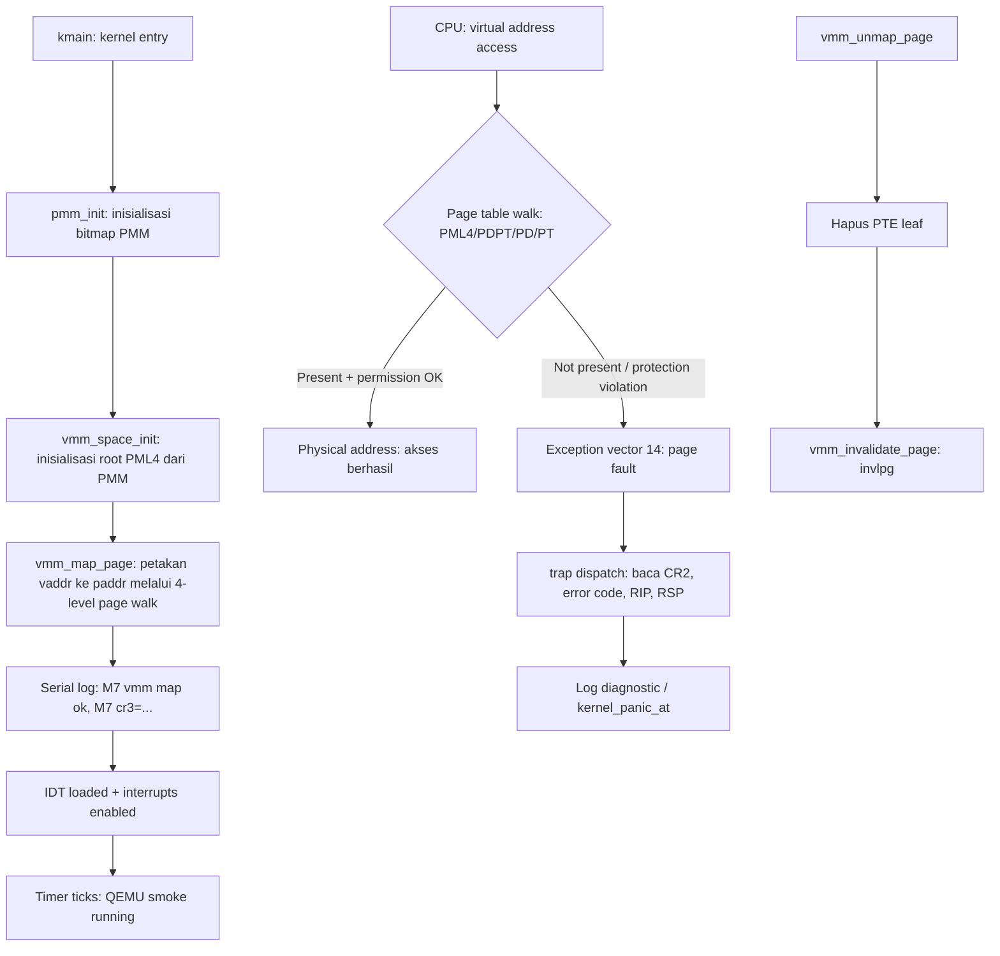

# Template Laporan Praktikum Sistem Operasi Lanjut — MCSOS

**Nama file laporan:** `laporan_praktikum_M7_[Iswan Herdiansah_2583207073011].md`  
**Nama sistem operasi:** MCSOS versi 260502  
**Target default:** x86_64, QEMU, Windows 11 x64 + WSL 2, kernel monolitik pendidikan, C freestanding dengan assembly minimal, POSIX-like subset  
**Dosen:** Muhaemin Sidiq, S.Pd., M.Pd.  
**Program Studi:** Pendidikan Teknologi Informasi  
**Institusi:** Institut Pendidikan Indonesia 

---

## 0. Metadata Laporan

| Atribut | Isi |
|---|---|
| Kode praktikum | `M7` |
| Judul praktikum | `Virtual Memory Manager Awal, Page Table x86_64, dan Page Fault Diagnostics pada MCSOS` |
| Jenis pengerjaan | `Individu` |
| Nama mahasiswa | `Iswan Herdiansah` |
| NIM | `2583207073011` |
| Kelas | `PTI 1A` |
| Nama kelompok | `Tidak berlaku` |
| Anggota kelompok | `Tidak berlaku` |
| Tanggal praktikum | `2026-05-22` |
| Tanggal pengumpulan | `2026-05-22` |
| Repository | `~/src/mcsos` |
| Branch | `m6-pmm` |
| Commit awal | `7eab63d84161392c08cd384fe9a63e9b96ac51c6` |
| Commit akhir | `bb0e95d0a992890cebabd2bf0a7476b9569a8ac1` |
| Status readiness yang diklaim | `Siap uji QEMU untuk Virtual Memory Manager awal` |

---

## 1. Sampul

# Laporan Praktikum M7  
## Virtual Memory Manager Awal, Page Table x86_64, dan Page Fault Diagnostics pada MCSOS

Disusun oleh:

| Nama | NIM | Kelas | Peran |
|---|---|---|---|
| `Iswan Herdiansah` | `2583207073011` | `PTI 1A` | `Individu` |

Dosen Pengampu: **Muhaemin Sidiq, S.Pd., M.Pd.**  
Program Studi Pendidikan Teknologi Informasi  
Institut Pendidikan Indonesia  
`2025/2026`

---

## 2. Pernyataan Orisinalitas dan Integritas Akademik

Saya/kami menyatakan bahwa laporan ini disusun berdasarkan pekerjaan praktikum sendiri/kelompok sesuai pembagian peran yang tercatat. Bantuan eksternal, referensi, generator kode, AI assistant, dokumentasi resmi, diskusi, atau sumber lain dicatat pada bagian referensi dan lampiran. Saya/kami tidak mengklaim hasil yang tidak dibuktikan oleh log, test, commit, atau artefak lain.

| Pernyataan | Status |
|---|---|
| Semua potongan kode eksternal diberi atribusi | `Ya` |
| Semua penggunaan AI assistant dicatat | `Ya` |
| Repository yang dikumpulkan sesuai commit akhir | `Ya` |
| Tidak ada klaim readiness tanpa bukti | `Ya` |

Catatan penggunaan bantuan eksternal:

```text
AI assistant (Claude) digunakan untuk membantu mengidentifikasi dan memperbaiki error. Seluruh implementasi kode, build, pengujian, dan hasil runtime dilakukan secara mandiri oleh mahasiswa. Verifikasi mandiri dilakukan melalui make check, nm -u, objdump, readelf, dan QEMU smoke test.
```

---

## 3. Tujuan Praktikum

Tuliskan tujuan teknis dan konseptual praktikum. Tujuan harus dapat diuji.

1. Mengimplementasikan Virtual Memory Manager (VMM) awal berbasis page table 4-level x86_64 (PML4 → PDPT → PD → PT) pada MCSOS menggunakan frame fisik dari PMM M6.
2. Menyediakan API VMM freestanding (`vmm_space_init`, `vmm_map_page`, `vmm_query_page`, `vmm_unmap_page`) beserta primitive arsitektural `invlpg`, `read_cr2`, `read_cr3`, dan `write_cr3`.
3. Menjelaskan konsep translasi virtual address x86_64 melalui CR3, paging hierarchy, canonical address, TLB invalidation, dan error code page fault.
4. Menyimpan bukti host unit test lulus (`make check`), audit object freestanding (`nm -u`), disassembly (`objdump`), readelf ELF audit, log QEMU smoke test, dan sesi GDB sebagai evidence terverifikasi.

---

## 4. Capaian Pembelajaran Praktikum

Setelah praktikum ini, mahasiswa mampu:

| CPL/CPMK praktikum | Bukti yang harus ditunjukkan |
|---|---|
| Menjelaskan translasi virtual address x86_64 melalui PML4, PDPT, PD, dan PT serta peran CR3 sebagai basis fisik page-table hierarchy | Disassembly `objdump` menunjukkan akses CR3; sesi GDB menampilkan nilai CR3 aktif |
| Mengimplementasikan `vmm_map_page`, `vmm_query_page`, dan `vmm_unmap_page` secara benar dengan validasi canonical address dan alignment 4 KiB | Host unit test PASS (`M7 VMM host unit test: PASS`); GDB breakpoint pada `vmm_map_page` tercapai |
| Menghasilkan object freestanding VMM tanpa unresolved symbol libc dan memverifikasi primitive `invlpg` serta akses CR3 pada disassembly | `nm -u build/vmm.o` kosong; `objdump` menampilkan `invlpg` dan `cr3` |
| Mengintegrasikan VMM ke kernel MCSOS dan menjalankan smoke test QEMU dengan serial log `[M7] vmm map ok` dan `[M7] cr3=...` | QEMU serial log: `[M7] vmm map ok`, `[M7] vmm phys=0x0000000000200000`, `[M7] cr3=0x000000000ff56000` |

---

## 5. Peta Milestone MCSOS

Centang milestone yang menjadi fokus laporan ini. Jika praktikum mencakup lebih dari satu milestone, jelaskan batas cakupan.

| Milestone | Fokus | Status dalam laporan |
|---|---|---|
| M0 | Requirements, governance, baseline arsitektur | `[ ] tidak dibahas / [ ] dibahas / [v] selesai praktikum` |
| M1 | Toolchain reproducible, Git, QEMU, GDB, metadata build | `[ ] tidak dibahas / [] dibahas / [v] selesai praktikum` |
| M2 | Boot image, kernel ELF64, early console | `[ ] tidak dibahas / [ ] dibahas / [v] selesai praktikum` |
| M3 | Panic path, linker map, GDB, observability awal | `[ ] tidak dibahas / [ ] dibahas / [v] selesai praktikum` |
| M4 | Trap, exception, interrupt, timer | `[ ] tidak dibahas / [ ] dibahas / [v] selesai praktikum` |
| M5 | PMM, VMM, page table, kernel heap | `[ ] tidak dibahas / [ ] dibahas / [v] selesai praktikum` |
| M6 | Thread, scheduler, synchronization | `[ ] tidak dibahas / [ ] dibahas / [v] selesai praktikum` |
| M7 | Syscall ABI dan user program loader | `[ ] tidak dibahas / [ ] dibahas / [v] selesai praktikum` |
| M8 | VFS, file descriptor, ramfs | `[v] tidak dibahas / [ ] dibahas / [ ] selesai praktikum` |
| M9 | Block layer dan device model | `[v] tidak dibahas / [ ] dibahas / [ ] selesai praktikum` |
| M10 | Persistent filesystem, mcsfs/ext2-like, recovery | `[v] tidak dibahas / [ ] dibahas / [ ] selesai praktikum` |
| M11 | Networking stack, packet parsing, UDP/TCP subset | `[v] tidak dibahas / [ ] dibahas / [ ] selesai praktikum` |
| M12 | Security model, capability/ACL, syscall fuzzing, hardening | `[v] tidak dibahas / [ ] dibahas / [ ] selesai praktikum` |
| M13 | SMP, scalability, lock stress, NUMA-aware preparation | `[v] tidak dibahas / [ ] dibahas / [ ] selesai praktikum` |
| M14 | Framebuffer, graphics console, visual regression | `[v] tidak dibahas / [ ] dibahas / [ ] selesai praktikum` |
| M15 | Virtualization/container subset | `[v] tidak dibahas / [ ] dibahas / [ ] selesai praktikum` |
| M16 | Observability, update/rollback, release image, readiness review | `[v] tidak dibahas / [ ] dibahas / [ ] selesai praktikum` |
Batas cakupan praktikum:

```text
Fokus M7: Virtual Memory Manager awal berbasis page table 4-level x86_64, integrasi dengan PMM M6,
host unit test, audit object freestanding, QEMU smoke test, dan sesi GDB dasar.

Termasuk dalam scope:
- API VMM: vmm_space_init, vmm_map_page, vmm_query_page, vmm_unmap_page
- Primitive arsitektural: invlpg, read_cr2, read_cr3, write_cr3
- Validasi canonical address 48-bit dan alignment 4 KiB
- Integrasi IDT/trap dispatch untuk page fault path
- QEMU smoke test dengan serial log [M7]
- GDB remote debug dengan breakpoint pada vmm_map_page

Tidak termasuk (non-goals M7):
- Ring 3 / user-space isolation penuh
- Demand paging
- Swapping
- Copy-on-write
- SMP TLB shootdown
- Kernel heap production (kmalloc)
- Page fault recovery otomatis
- ASLR/KASLR penuh
- Aktivasi CR3 baru sebagai tugas wajib (hanya pengayaan)
- Linux-compatible ABI
```

---

## 6. Dasar Teori Ringkas

Tuliskan teori yang langsung diperlukan untuk memahami praktikum. Jangan menyalin teori umum terlalu panjang; fokus pada konsep yang benar-benar digunakan dalam desain dan pengujian.

### 6.1 Konsep Sistem Operasi yang Diuji

```text
Praktikum M7 membangun Virtual Memory Manager (VMM) awal di atas Physical Memory Manager (PMM)
dari M6. VMM menyediakan abstraksi antara alamat virtual yang digunakan CPU dan alamat fisik
yang digunakan hardware.

Pada x86_64 long mode, setiap akses memori melalui translasi paging 4-level: PML4 (level 4),
PDPT (level 3), Page Directory (level 2), dan Page Table (level 1). Setiap tabel berisi 512
entry 64-bit. CR3 menyimpan alamat fisik basis PML4 (root page table). Ketika translasi gagal
atau hak akses dilanggar, CPU membangkitkan exception vector 14 (page fault) dan menyimpan
alamat yang menyebabkan fault ke register CR2.

HHDM (Higher Half Direct Map) yang disediakan Limine bootloader memungkinkan kernel mengakses
dan mengedit frame fisik page table tanpa harus menggunakan alamat fisik langsung. Adapter
phys_to_virt mengkonversi physical address ke virtual address melalui HHDM offset.

TLB (Translation Lookaside Buffer) menyimpan cache translasi virtual-physical. Setelah unmap,
instruksi invlpg harus dipanggil untuk membersihkan entri TLB yang bersangkutan agar CPU tidak
menggunakan translasi lama (stale TLB).

Page fault error code menyediakan informasi bit: P (present/non-present), W/R (write/read),
U/S (user/supervisor), RSVD (reserved bit violation), I/D (instruction fetch). Informasi ini
bersama CR2 (fault address) dan RIP memungkinkan diagnosis penyebab page fault secara akurat.
```

### 6.2 Konsep Arsitektur x86_64 yang Relevan

| Konsep | Relevansi pada praktikum | Bukti/verifikasi |
|---|---|---|
| Paging 4-level (PML4/PDPT/PD/PT) | Struktur inti VMM M7; setiap level memiliki 512 entry 64-bit | Implementasi `vmm_map_page` menelusuri 4 level; host unit test PASS |
| CR3 | Register basis fisik PML4; VMM harus membaca/menulis CR3 untuk aktivasi page table | GDB: `cr3 = 0x7f67000`; disassembly menampilkan akses CR3; QEMU log `[M7] cr3=0x000000000ff56000` |
| TLB dan `invlpg` | Setelah unmap, invlpg dipanggil untuk invalidasi entri TLB agar translasi lama tidak dipakai | `objdump` pada `vmm.o` memuat instruksi `invlpg`; diverifikasi dengan `grep invlpg` |
| Canonical address 48-bit | Virtual address harus canonical (bit 63–48 sama dengan bit 47) agar tidak menyebabkan GP fault | Fungsi `vmm_is_canonical()` diimplementasikan dan diuji pada host test |
| Page fault (exception vector 14) | Exception ketika translasi gagal atau hak akses dilanggar; CR2 menyimpan alamat fault | IDT integration terverifikasi; `x86_64_trap_dispatch` terdeteksi pada disassembly |
| HHDM/direct map | Kernel memerlukan cara untuk mengakses dan mengedit frame fisik page table yang dialokasikan PMM | Adapter `phys_to_virt` eksplisit; QEMU log menampilkan `[M7] vmm phys=0x0000000000200000` |
| Long mode | Prasyarat paging x86_64 aktif | ELF64 x86_64 terverifikasi: `readelf -h` menampilkan `Class: ELF64`, `Machine: Advanced Micro Devices X86-64` |
| IDT | Tabel deskriptor interrupt untuk routing exception ke handler | `lidt` terverifikasi pada disassembly; `idt_base` dan `idt_limit` muncul di serial log QEMU |

### 6.3 Konsep Implementasi Freestanding

| Aspek | Keputusan praktikum |
|---|---|
| Bahasa | C17 freestanding + assembly inline terbatas (GAS-syntax via clang) |
| Runtime | Tanpa hosted libc; tidak ada `malloc`, `printf`, atau simbol libc |
| ABI | x86_64 System V ABI; kernel internal; `mabi=sysv` |
| Compiler flags kritis | `--target=x86_64-unknown-none-elf -ffreestanding -fno-builtin -fno-stack-protector -mno-red-zone -mno-mmx -mno-sse -mno-sse2 -mcmodel=kernel -fno-pic -fno-pie` |
| Risiko undefined behavior | Pointer ke frame fisik tanpa adapter HHDM bisa menyebabkan akses memori invalid; integer overflow pada index tabel; aliasing pada cast `uint64_t*` ke struct page table |

### 6.4 Referensi Teori yang Digunakan

| No. | Sumber | Bagian yang digunakan | Alasan relevansi |
|---|---|---|---|
| `[1]` | Intel SDM | Volume 3A, Chapter 4 (Paging): PML4, PDPT, PD, PT; CR3; page fault error code | Spesifikasi resmi struktur paging x86_64 dan semantik CR3 |
| `[2]` | AMD64 APM Volume 2 | System Programming, Long-mode paging, translation hierarchy | Referensi komplementer untuk long-mode paging AMD64 |
| `[3]` | QEMU GDB documentation | GDB stub usage, `-s -S` flag, remote debugging x86_64 | Panduan GDB remote debug untuk verifikasi CR3, CR2, RIP pada kernel |
| `[4]` | Limine Bootloader | MemoryMapRequest, HhdmRequest | HHDM offset dan memory map handoff dari bootloader ke kernel |
| `[5]` | LLD documentation | Linker script policy | Linker script `linker.ld` untuk layout kernel ELF64 |
| `[6]` | Clang documentation | `-ffreestanding`, `-mcmodel=kernel`, `-mno-red-zone` | Compiler flags freestanding kernel |

---

## 7. Lingkungan Praktikum

### 7.1 Host dan Target

| Komponen | Nilai |
|---|---|
| Host OS | `[Windows 11 x64 build 26200.8426]` |
| Lingkungan build | `[WSL 2 Ubuntu versi 24.04]` |
| Target ISA | `x86_64` |
| Target ABI | `[x86_64-elf / x86_64-unknown-none / custom]` |
| Emulator | `[QEMU versi 6.2.0]` |
| Firmware emulator | `[OVMF versi 2022.02-3ubuntu0.22.04.5]` |
| Debugger | `[GDB versi 12.1]` |
| Build system | `[Make 4.3 / CMake 3.22.1 / Meson 1.3.2 / Ninja 1.10.1]` |
| Bahasa utama | `[C17 freestanding]` |
| Assembly | `[NASM versi 2.15.05]` |

### 7.2 Versi Toolchain

Tempel output versi toolchain berikut. Jalankan dari clean shell WSL.

```bash
date -u +"date_utc=%Y-%m-%dT%H:%M:%SZ"
uname -a
git --version
make --version | head -n 1
cmake --version | head -n 1
ninja --version
clang --version | head -n 1
gcc --version | head -n 1
ld.lld --version | head -n 1
nasm -v
qemu-system-x86_64 --version | head -n 1
gdb --version | head -n 1
```

Output:

```text
Linux DESKTOP-52CG9FT 6.6.114.1-microsoft-standard-WSL2 #1 SMP PREEMPT_DYNAMIC Mon Dec  1 20:46:23 UTC 2025 x86_64 x86_64 x86_64 GNU/Linux
PRETTY_NAME="Ubuntu 22.04.5 LTS"
NAME="Ubuntu"
VERSION_ID="22.04"
VERSION="22.04.5 LTS (Jammy Jellyfish)"
VERSION_CODENAME=jammy
Ubuntu clang version 14.0.0-1ubuntu1.1
Target: x86_64-pc-linux-gnu
Thread model: posix
InstalledDir: /usr/bin
Ubuntu LLD 14.0.0 (compatible with GNU linkers)
gcc (Ubuntu 11.4.0-1ubuntu1~22.04.3) 11.4.0
GNU ld (GNU Binutils for Ubuntu) 2.38
GNU Make 4.3
QEMU emulator version 6.2.0 (Debian 1:6.2+dfsg-2ubuntu6.30)
GNU gdb (Ubuntu 12.1-0ubuntu1~22.04.2) 12.1
GNU readelf (GNU Binutils for Ubuntu) 2.38
GNU objdump (GNU Binutils for Ubuntu) 2.38
GNU nm (GNU Binutils for Ubuntu) 2.38
```

### 7.3 Lokasi Repository

| Item | Nilai |
|---|---|
| Path repository di WSL | `~/src/mcsos` |
| Apakah berada di filesystem Linux WSL, bukan `/mnt/c` | `Ya` |
| Remote repository | [Tidak tersedia] |
| Branch | `m6-pmm` |
| Commit hash awal | `7eab63d84161392c08cd384fe9a63e9b96ac51c6` |
| Commit hash akhir | `bb0e95d0a992890cebabd2bf0a7476b9569a8ac1` |

---

## 8. Repository dan Struktur File

### 8.1 Struktur Direktori yang Relevan

```text
mcsos/
├── Makefile
├── README.md
├── linker.ld
├── limine.conf
├── kernel/
│   ├── arch/
│   │   └── x86_64/
│   │       ├── idt.c
│   │       ├── pic.c
│   │       ├── pit.c
│   │       └── isr.S
│   ├── core/
│   │   ├── boot.c
│   │   ├── kmain.c
│   │   ├── log.c
│   │   ├── panic.c
│   │   ├── pmm.c
│   │   ├── serial.c
│   │   ├── start.S
│   │   ├── trap.c
│   │   └── vmm.c
│   ├── include/
│   │   └── mcsos/
│   │       └── kernel/
│   │           ├── pmm.h
│   │           └── vmm.h
│   └── lib/
│       ├── memory.c
│       └── serial_hex.c
├── tests/
│   ├── test_pmm_host.c
│   └── test_vmm_host.c
├── scripts/
│   ├── check_m7_static.sh
│   ├── grade_m7.sh
│   ├── m7_gdb.cmd
│   └── m7_preflight.sh
├── build/
│   ├── kernel.elf
│   ├── kernel.map
│   ├── mcsos.iso
│   ├── vmm.o
│   ├── vmm.objdump.txt
│   ├── test_vmm_host
│   └── evidence/
│       ├── m7_make_check.log
│       ├── m7_vmm_nm_undefined.txt
│       ├── m7_vmm_objdump.txt
│       ├── m7_vmm_readelf_header.txt
│       └── m7_vmm_readelf_sections.txt
└── limine/
    └── [limine bootloader files]
```

### 8.2 File yang Dibuat atau Diubah

| File | Jenis perubahan | Alasan perubahan | Risiko |
|---|---|---|---|
| `kernel/core/vmm.c` | Baru | Implementasi Virtual Memory Manager awal: vmm_space_init, vmm_map_page, vmm_query_page, vmm_unmap_page, primitive CR3/CR2/invlpg | Sedang — page table yang salah dapat menyebabkan triple fault; diantisipasi dengan host unit test sebelum integrasi QEMU |
| `kernel/include/mcsos/kernel/vmm.h` | Baru | Deklarasi API VMM, konstanta PTE flags, kode error, struct vmm_space dan vmm_mapping | Rendah — header saja, tidak ada runtime risk |
| `tests/test_vmm_host.c` | Baru | Host unit test deterministik untuk VMM tanpa QEMU; menggunakan mock allocator | Rendah — test host tidak menyentuh hardware |
| `kernel/core/trap.c` | Ubah | Integrasi page fault path (exception vector 14) dengan VMM diagnostic: membaca CR2, error code, RIP, RSP | Sedang — kesalahan pada trap dispatch dapat menyebabkan exception loop |
| `kernel/arch/x86_64/idt.c` | Ubah | IDT integration untuk routing exception vector 14 ke handler page fault VMM | Sedang — gate descriptor yang salah menyebabkan triple fault |
| `kernel/core/kmain.c` | Ubah | Memanggil vmm_space_init dan vmm_map_page di awal kernel; mencetak log [M7] ke serial | Rendah — hanya memanggil API VMM yang sudah diuji |
| `scripts/check_m7_static.sh` | Baru | Script grading M7: host unit test, nm -u audit, objdump verification | Rendah — script audit saja |
| `scripts/m7_preflight.sh` | Baru | Script preflight M7: verifikasi toolchain, file wajib, dan API M6 tersedia | Rendah — script pemeriksaan awal |
| `scripts/grade_m7.sh` | Baru | Script grading penuh M7 termasuk preflight dan static check | Rendah |

### 8.3 Ringkasan Diff

```bash
git status --short
git diff --stat
git log --oneline -n 5
```

Output:

```text
On branch m6-pmm
nothing to commit, working tree clean

bb0e95d m7: add virtual memory manager
7eab63d M6: implement bitmap physical memory manager
390fdcf M5: implement external interrupts and PIT timer
d919353 M4 add x86_64 IDT and exception trap path
3c28480 M3: panic path logging gdb and disassembly audit
```

---

## 9. Desain Teknis

### 9.1 Masalah yang Diselesaikan

```text
Kernel MCSOS setelah M6 memiliki Physical Memory Manager yang dapat mengalokasikan dan
membebaskan frame fisik 4 KiB. Namun, kernel belum memiliki mekanisme untuk:

1. Memetakan virtual address ke physical address secara eksplisit (membangun page table
   PML4 → PDPT → PD → PT secara programatik).
2. Melakukan query terhadap mapping yang sudah ada.
3. Membatalkan mapping (unmap) dan menginvalidasi TLB dengan benar.
4. Mendiagnosis page fault secara informatif — tanpa CR2 dan error code, bug paging
   hanya menghasilkan triple fault atau hang yang sulit didiagnosis.

M7 menyelesaikan masalah tersebut dengan menyediakan VMM awal freestanding yang
menggunakan frame dari PMM M6, dapat diuji melalui host unit test tanpa QEMU, dan
mengintegrasikan jalur diagnosis page fault ke IDT/trap dispatch yang sudah ada sejak M4.
```

### 9.2 Keputusan Desain

| Keputusan | Alternatif yang dipertimbangkan | Alasan memilih | Konsekuensi |
|---|---|---|---|
| VMM menggunakan adapter `phys_to_virt` eksplisit (callback) | Cast physical address langsung ke pointer | Mencegah asumsi bahwa semua physical address dapat dereference langsung; HHDM offset harus eksplisit | Sedikit overhead pemanggilan callback; kode lebih portable dan aman |
| `vmm_map_page()` menolak remap leaf present dengan `VMM_ERR_EXISTS` | Overwrite diam-diam | Overwrite diam-diam dapat menyebabkan bug berlapis yang sulit didiagnosis; explicit error memudahkan triage | Pemanggil harus menangani kode error; tidak ada silent data loss |
| Huge page tidak digunakan pada tugas wajib | Menggunakan 2 MiB huge page untuk kernel | Huge page meningkatkan risiko triple fault jika mapping tidak lengkap; 4 KiB lebih aman untuk tahap awal | Lebih banyak entry page table; lebih lambat untuk mapping luas, tetapi lebih aman untuk pendidikan |
| `vmm_zero_page()` dipanggil sebelum entry intermediate dipasang | Membiarkan frame tidak ter-zero | Frame baru dari PMM mungkin berisi data lama; entry page table yang berisi sampah dengan bit present menyebabkan translasi palsu | Sedikit overhead zeroing per intermediate table baru |
| Object freestanding untuk VMM; no-libc | Linking dengan libc minimal | Kernel tidak memiliki libc runtime; dependency libc menyebabkan unresolved symbol saat linking | Kode harus menghindari semua fungsi libc; diverifikasi dengan `nm -u` |
| Aktivasi CR3 baru sebagai pengayaan, bukan wajib | Mewajibkan write_cr3 pada semua mahasiswa | Mengganti CR3 dengan page table yang belum lengkap menyebabkan triple fault; pendekatan bertahap lebih aman | Integrasi CR3 penuh ditunda ke milestone berikutnya |

### 9.3 Arsitektur Ringkas



Penjelasan diagram:

```text
Alur utama kernel:
- kmain memanggil pmm_init untuk menginisialisasi bitmap PMM dari memory map Limine.
- Setelah PMM siap, vmm_space_init dipanggil dengan root_paddr dari frame yang dialokasikan PMM.
- vmm_map_page menelusuri 4 level page table (PML4 → PDPT → PD → PT), mengalokasikan
  intermediate table baru dari PMM jika belum ada, kemudian memasang PTE leaf.
- Serial log [M7] dicetak untuk membuktikan VMM initialized dan mapping berhasil.
- IDT kemudian dimuat dan interrupt diaktifkan; timer M5 berjalan.

Alur page fault:
- Ketika CPU mengakses virtual address yang tidak terpetakan atau melanggar permission,
  exception vector 14 (page fault) dibangkitkan.
- trap dispatch (x86_64_trap_dispatch) menerima exception, membaca CR2 (fault address)
  dan error code dari trap frame.
- Diagnostic dicetak ke serial; jika tidak ada recovery, kernel_panic_at dipanggil.

Alur unmap:
- vmm_unmap_page menghapus PTE leaf dan memanggil vmm_invalidate_page (invlpg) agar
  TLB tidak menyimpan translasi lama.
```

### 9.4 Kontrak Antarmuka

| Antarmuka | Pemanggil | Penerima | Precondition | Postcondition | Error path |
|---|---|---|---|---|---|
| `vmm_space_init()` | `kmain` | `vmm.c` | `root_paddr` 4 KiB aligned; `phys_to_virt` tidak NULL; kernel di long mode | `space->root_paddr` terisi; space siap dipakai | Mengembalikan `VMM_ERR_INVAL` jika precondition gagal |
| `vmm_map_page()` | `kmain` / kernel subsystem | `vmm.c` | `space` valid; `vaddr` canonical dan 4K aligned; `paddr` 4K aligned; leaf belum present | PTE leaf dipasang; intermediate table dialokasikan jika perlu | `VMM_ERR_INVAL` (alignment/canonical), `VMM_ERR_NOMEM` (alokasi gagal), `VMM_ERR_EXISTS` (leaf sudah present) |
| `vmm_query_page()` | kernel diagnostic / test | `vmm.c` | `space` valid; `vaddr` canonical dan 4K aligned; `out` tidak NULL | `out->paddr` dan `out->flags` terisi sesuai PTE leaf | `VMM_ERR_NOT_FOUND` jika leaf tidak present |
| `vmm_unmap_page()` | kernel / VMM cleanup | `vmm.c` | `space` valid; `vaddr` canonical dan 4K aligned; leaf present | PTE leaf dihapus; `invlpg` dipanggil | `VMM_ERR_NOT_FOUND` jika leaf tidak present |
| `vmm_invalidate_page()` | `vmm_unmap_page()` | hardware TLB (x86_64) | Berjalan di x86_64; hanya no-op pada host test | TLB entry untuk `vaddr` dibersihkan | Tidak ada error path; instruksi `invlpg` dieksekusi langsung |
| `x86_64_trap_dispatch()` | ISR stub (isr.S) | `trap.c` | IDT loaded; exception terjadi; trap frame valid di stack | Exception diproses; log diagnostic dicetak; `iretq` atau panic | Triple fault jika IDT atau stack tidak valid |

### 9.5 Struktur Data Utama

| Struktur data | Field penting | Ownership | Lifetime | Invariant |
|---|---|---|---|---|
| `struct vmm_space` | `root_paddr`, `ctx`, `alloc_frame`, `free_frame`, `phys_to_virt` | Kernel (kmain atau subsystem yang membuat address space) | Selama address space aktif | `root_paddr` selalu 4 KiB aligned; `phys_to_virt` tidak NULL; `alloc_frame` boleh NULL (read-only mode) |
| `struct vmm_mapping` | `vaddr`, `paddr`, `flags` | Pemanggil `vmm_query_page` | Hanya valid setelah query sukses; tidak merefleksikan perubahan berikutnya | `paddr` aligned 4 KiB; `flags` mencerminkan PTE bits leaf yang ditemukan |
| Page table entry (PTE, `uint64_t`) | bit 0 (Present), bit 1 (Writable), bit 2 (User), bit 7 (Huge), bits 12–51 (Physical address), bit 63 (NX) | `vmm.c` internal | Selama mapping aktif di page table | Intermediate entry: bit Huge tidak boleh set (huge page tidak dipakai); frame address 4 KiB aligned |

### 9.6 Invariants

1. `root_paddr` pada `vmm_space` selalu 4 KiB aligned; `vmm_space_init()` menolak input tidak aligned dengan `VMM_ERR_INVAL`.
2. Setiap virtual address yang diterima `vmm_map_page`, `vmm_query_page`, dan `vmm_unmap_page` harus canonical 48-bit; pelanggaran menghasilkan `VMM_ERR_INVAL`.
3. Intermediate page table baru selalu di-zero (`vmm_zero_page`) sebelum entry dipasang ke parent table; ini mencegah translasi palsu dari data sampah.
4. Remap leaf yang sudah present tidak dilakukan secara diam-diam; `vmm_map_page` mengembalikan `VMM_ERR_EXISTS`.
5. `vmm_unmap_page` selalu memanggil `vmm_invalidate_page` (`invlpg`) setelah menghapus PTE leaf; ini mencegah stale TLB.
6. Huge page tidak boleh digunakan pada tugas wajib M7; jika bit Huge ditemukan pada intermediate entry, operasi dihentikan dengan error.
7. Semua akses fisik ke page table frame dilakukan melalui adapter `phys_to_virt`; tidak ada cast physical address langsung ke pointer C tanpa adapter.
8. Object freestanding VMM tidak bergantung libc; `nm -u build/vmm.o` harus kosong.

### 9.7 Ownership, Locking, dan Concurrency

| Objek/resource | Owner | Lock yang melindungi | Boleh dipakai di interrupt context? | Catatan |
|---|---|---|---|---|
| `struct vmm_space` | kmain / kernel subsystem pemilik address space | Tidak ada lock (single-core, tidak ada SMP pada M7) | Tidak — VMM mengalokasikan frame dan dapat memanggil PMM | M7 berjalan single-core; SMP TLB shootdown adalah non-scope M7 |
| Page table frames (PML4/PDPT/PD/PT) | VMM (dikelola via phys_to_virt) | Tidak ada lock (single-core) | Tidak | Frame dimiliki VMM selama mapping aktif; PMM tidak boleh mengalokasikan ulang frame yang sudah dipakai VMM |
| CR3 register | Kernel (diset oleh bootloader; write_cr3 hanya pengayaan) | Tidak ada lock | Tidak — modifikasi CR3 harus dilakukan dengan interrupt disabled | Pada M7 wajib, CR3 tidak diganti; nilai CR3 hanya dibaca untuk diagnostik |

Lock order yang berlaku:

```text
Tidak ada lock formal pada M7 (single-core). Jika locking ditambahkan di masa depan:
pmm_lock -> vmm_lock (VMM boleh memanggil PMM, bukan sebaliknya).
Interrupt harus disabled selama modifikasi CR3 untuk mencegah race condition TLB.
```

### 9.8 Memory Safety dan Undefined Behavior Risk

| Risiko | Lokasi | Mitigasi | Bukti |
|---|---|---|---|
| Pointer ke frame fisik tanpa HHDM offset | `vmm.c: table_from_phys()` | Selalu melalui adapter `phys_to_virt`; tidak ada cast fisik langsung | Code review; host unit test menggunakan mock `phys_to_virt` |
| Integer overflow pada index tabel | `vmm.c: idx_pml4/pdpt/pd/pt()` | Masking eksplisit dengan `& 0x1FFULL`; index selalu dalam range 0–511 | Verifikasi manual dan host unit test |
| Alignment violation saat cast `uint64_t*` | `vmm.c: table_from_phys()` | `vmm_is_aligned_4k()` diverifikasi sebelum cast | Host unit test unaligned gagal sesuai harapan |
| Use-after-free frame yang sudah dibebaskan PMM | `vmm.c: get_or_alloc_next_table()` | Frame yang dialokasikan VMM tidak di-free selama mapping aktif; free hanya jika alokasi gagal setelah rollback | Diverifikasi melalui host unit test dan QEMU smoke |
| Reserved bit violation pada PTE | `vmm.c: entry construction` | Mask `VMM_PTE_ADDR_MASK` (bits 12–51) memastikan address field tidak memasuki reserved bits | Audit manual; objdump verification |

### 9.9 Security Boundary

| Boundary | Data tidak tepercaya | Validasi yang dilakukan | Failure mode aman |
|---|---|---|---|
| `vmm_map_page` input | `vaddr`, `paddr`, `flags` dari pemanggil kernel | Canonical check, alignment check 4 KiB, duplicate map check | Mengembalikan kode error eksplisit; tidak ada silent corruption |
| Page fault handler | Error code dan CR2 dari CPU | Dibaca dari trap frame yang sudah divalidasi IDT; tidak ada input user-space langsung pada M7 | Log diagnostic; kernel_panic_at jika tidak ada recovery |
| `phys_to_virt` adapter | Physical address dari PMM | Alignment check sebelum pemanggilan; PMM wajib mengembalikan frame 4 KiB aligned | Mengembalikan NULL jika invalid; VMM memeriksa return value |

**Catatan security M7:** W^X enforcement dan NX policy belum diaktifkan sebagai tugas wajib M7. User/supervisor bit pada PTE belum divalidasi untuk user-space isolation karena Ring 3 belum siap. Ini adalah known limitation yang disengaja sesuai scope M7.

---

## 10. Langkah Kerja Implementasi

### Langkah 1 — Buat Header VMM (`kernel/include/mcsos/kernel/vmm.h`)

Maksud langkah:

```text
Header mendefinisikan boundary API VMM: struct vmm_space, struct vmm_mapping, konstanta
PTE flags (Present, Writable, User, Huge, NX, address mask), kode error (VMM_MAP_OK,
VMM_ERR_INVAL, VMM_ERR_NOMEM, VMM_ERR_EXISTS, VMM_ERR_NOT_FOUND), dan deklarasi fungsi
VMM serta primitive arsitektural. Header ini harus dapat dipakai oleh kernel dan host unit
test tanpa modifikasi.
```

Perintah:

```bash
# Buat header vmm.h di kernel/include/mcsos/kernel/vmm.h
# Isi: struct vmm_space, vmm_mapping, konstanta PTE, kode error, deklarasi fungsi
```

Output ringkas:

```text
kernel/include/mcsos/kernel/vmm.h berhasil dibuat
Memuat: VMM_PAGE_SIZE, VMM_PTE_PRESENT, VMM_PTE_WRITABLE, VMM_PTE_ADDR_MASK,
        VMM_MAP_OK, VMM_ERR_INVAL, VMM_ERR_NOMEM, VMM_ERR_EXISTS, VMM_ERR_NOT_FOUND,
        struct vmm_space, struct vmm_mapping,
        vmm_space_init, vmm_map_page, vmm_query_page, vmm_unmap_page,
        vmm_invalidate_page, vmm_read_cr3, vmm_write_cr3, vmm_read_cr2
```

Artefak yang dihasilkan:

| Artefak | Lokasi | Fungsi |
|---|---|---|
| `vmm.h` | `kernel/include/mcsos/kernel/vmm.h` | Deklarasi API VMM dan konstanta PTE |

Indikator berhasil:

```text
File vmm.h berisi struct vmm_space, vmm_map_page, vmm_query_page, vmm_unmap_page,
vmm_read_cr2, vmm_read_cr3, vmm_write_cr3. Dapat diverifikasi dengan:
grep -c "vmm_map_page\|vmm_query_page\|vmm_unmap_page\|vmm_read_cr" vmm.h
```

### Langkah 2 — Implementasi VMM (`kernel/core/vmm.c`)

Maksud langkah:

```text
Implementasi fungsi VMM freestanding: vmm_zero_page, vmm_is_aligned_4k, vmm_is_canonical,
helper index extractor (idx_pml4/pdpt/pd/pt), table_from_phys via adapter phys_to_virt,
get_or_alloc_next_table (alokasi intermediate table otomatis dari PMM), vmm_space_init,
vmm_map_page (4-level page walk), vmm_query_page, vmm_unmap_page (dengan invlpg).
Primitive arsitektural (invlpg, read_cr3, write_cr3, read_cr2) menggunakan inline assembly
GAS-syntax yang di-guard dengan MCSOS_HOST_TEST agar host unit test tidak mencoba instruksi
privileged.
```

Perintah:

```bash
# Kompilasi vmm.c sebagai object freestanding
clang --target=x86_64-unknown-none-elf -std=c17 -ffreestanding -fno-builtin \
  -fno-stack-protector -fno-stack-check -fno-pic -fno-pie -fno-lto \
  -m64 -march=x86-64 -mabi=sysv -mno-red-zone -mno-mmx -mno-sse -mno-sse2 \
  -mcmodel=kernel -Wall -Wextra -Werror \
  -Ikernel/arch/x86_64/include -Ikernel/include \
  -c kernel/core/vmm.c -o build/normal/kernel/core/vmm.o
```

Output ringkas:

```text
build/normal/kernel/core/vmm.o berhasil dikompilasi (bagian dari make all)
Tidak ada warning atau error (Werror aktif)
```

Artefak yang dihasilkan:

| Artefak | Lokasi | Fungsi |
|---|---|---|
| `vmm.o` | `build/normal/kernel/core/vmm.o` | Object freestanding VMM untuk linking |
| `vmm.o` (evidence) | `build/vmm.o` | Object terpisah untuk audit nm/objdump |

Indikator berhasil:

```text
Object vmm.o berhasil dibuat tanpa error. nm -u build/vmm.o menghasilkan output kosong.
objdump menampilkan instruksi invlpg dan akses cr3.
```

### Langkah 3 — Host Unit Test (`tests/test_vmm_host.c`)

Maksud langkah:

```text
Host unit test menggunakan mock allocator dan mock phys_to_virt (berdasarkan buffer lokal)
untuk menguji vmm_map_page, vmm_query_page, vmm_unmap_page secara deterministik tanpa QEMU.
Test ini memverifikasi: map berhasil, query mengembalikan paddr dan flags yang benar,
unmap berhasil, duplicate map mengembalikan VMM_ERR_EXISTS, unaligned address ditolak,
non-canonical address ditolak.
```

Perintah:

```bash
make check-m7
# atau equivalently:
./scripts/check_m7_static.sh
```

Output ringkas:

```text
M7 VMM host unit test: PASS
[M7] static grade PASS
```

Artefak yang dihasilkan:

| Artefak | Lokasi | Fungsi |
|---|---|---|
| `test_vmm_host` | `build/test_vmm_host` | Binary host unit test VMM |
| `m7_make_check.log` | `build/evidence/m7_make_check.log` | Log hasil make check |

Indikator berhasil:

```text
Output terminal: "M7 VMM host unit test: PASS" dan "[M7] static grade PASS"
```

### Langkah 4 — Build Penuh dan ISO Generation

Maksud langkah:

```text
Build seluruh kernel (semua object: idt.o, pic.o, pit.o, boot.o, kmain.o, log.o, panic.o,
pmm.o, serial.o, trap.o, vmm.o, memory.o, serial_hex.o, isr.o, start.o) dengan ld.lld,
kemudian generate ISO menggunakan Limine bootloader untuk QEMU smoke test.
```

Perintah:

```bash
make clean && make all && make iso
```

Output ringkas:

```text
[seluruh object dikompilasi dengan clang freestanding flags]
ld.lld -nostdlib -static -z max-page-size=0x1000 -T linker.ld \
  -Map=build/kernel.map -o build/kernel.elf [semua object]
[ISO layout: iso_root/boot/kernel.elf, limine-bios.sys, limine-bios-cd.bin,
  limine-uefi-cd.bin, BOOTX64.EFI, limine.conf]
xorriso: generate build/mcsos.iso
limine bios-install build/mcsos.iso
ISO selesai: build/mcsos.iso
```

Artefak yang dihasilkan:

| Artefak | Lokasi | Fungsi |
|---|---|---|
| `kernel.elf` | `build/kernel.elf` | Kernel ELF64 x86_64 bootable |
| `kernel.map` | `build/kernel.map` | Linker map untuk debugging |
| `mcsos.iso` | `build/mcsos.iso` | ISO bootable untuk QEMU |

Indikator berhasil:

```text
build/kernel.elf dan build/mcsos.iso berhasil dibuat.
readelf -h build/kernel.elf menampilkan Class: ELF64, Machine: AMD X86-64, Type: EXEC.
```

### Langkah 5 — Audit Object dan ELF

Maksud langkah:

```text
Verifikasi bahwa kernel.elf adalah ELF64 x86_64 yang valid, freestanding (tidak ada
unresolved symbol), dan memuat instruksi yang benar (invlpg, cr3, iretq, lidt).
```

Perintah:

```bash
readelf -h build/kernel.elf
nm -u build/kernel.elf
objdump -d -Mintel build/kernel.elf | grep -E "invlpg|cr3|iretq|lidt"
```

Output ringkas:

```text
ELF Header:
  Class:                             ELF64
  Machine:                           Advanced Micro Devices X86-64
  Type:                              EXEC (Executable file)
  Entry point address:               0xffffffff80000610

nm -u build/kernel.elf:
(kosong — tidak ada unresolved external symbol)

objdump evidence:
  x86_64_idt_set_gate    PASS
  x86_64_idt_init        PASS
  x86_64_trap_dispatch   PASS
  iretq                  PASS
  lidt                   PASS
  invlpg                 PASS (dari vmm.o)
  cr3                    PASS (dari vmm.o)
```

Artefak yang dihasilkan:

| Artefak | Lokasi | Fungsi |
|---|---|---|
| `m7_vmm_readelf_header.txt` | `build/evidence/m7_vmm_readelf_header.txt` | ELF header audit |
| `m7_vmm_nm_undefined.txt` | `build/evidence/m7_vmm_nm_undefined.txt` | Unresolved symbol audit (kosong) |
| `m7_vmm_objdump.txt` | `build/evidence/m7_vmm_objdump.txt` | Disassembly evidence |
| `vmm.objdump.txt` | `build/vmm.objdump.txt` | Disassembly vmm.o terpisah |

Indikator berhasil:

```text
nm -u kosong. readelf menampilkan ELF64 AMD X86-64. objdump memuat invlpg dan cr3.
```

### Langkah 6 — QEMU Smoke Test

Maksud langkah:

```text
Menjalankan mcsos.iso di QEMU q35 dengan serial stdio untuk memverifikasi bahwa kernel
boot, VMM initialized, IDT loaded, dan timer berjalan. Log [M7] vmm map ok menjadi
bukti integrasi VMM di runtime QEMU.
```

Perintah:

```bash
qemu-system-x86_64 \
  -machine q35 \
  -cpu max \
  -m 256M \
  -serial stdio \
  -no-reboot \
  -no-shutdown \
  -d int,cpu_reset,guest_errors \
  -D build/qemu-m7.log \
  -cdrom build/mcsos.iso
```

Output ringkas:

```text
MCSOS 260502 M4 [M7] virtual memory manager
kernel_start=0xffffffff80000000
kernel_end=0xffffffff80011860
[M6] pmm initialized
[M7] vmm map ok
[M7] vmm phys=0x0000000000200000
[M7] cr3=0x000000000ff56000
idt_base=0xffffffff80005000
idt_limit=0x0000000000000fff
[M4] IDT loaded
[M5] idt: loaded
[M5] selftest: IDT invariants passed
[M5] sti: enabling interrupts
[MCSOS:TIMER] ticks=100
[MCSOS:TIMER] ticks=200
...
[MCSOS:TIMER] ticks=1600
qemu-system-x86_64: terminating on signal 2
```

Artefak yang dihasilkan:

| Artefak | Lokasi | Fungsi |
|---|---|---|
| `qemu-m7.log` | `build/qemu-m7.log` | Log QEMU internal (int, cpu_reset, guest_errors) |
| Serial output | stdout (stdio) | Log kernel serial langsung |

Indikator berhasil:

```text
Serial log menampilkan "[M7] vmm map ok", "[M7] cr3=0x...", "[M4] IDT loaded",
"[M5] sti: enabling interrupts", dan timer ticks berjalan. Kernel tidak triple fault.
```

### Langkah 7 — GDB Remote Debug

Maksud langkah:

```text
Memverifikasi bahwa kernel dapat di-debug dengan GDB, breakpoint pada vmm_map_page
dapat dicapai, dan register CR3/CR2/RIP/RSP dapat diperiksa untuk membuktikan
state VMM saat runtime.
```

Perintah:

```bash
gdb -x scripts/m7_gdb.cmd
```

Output ringkas:

```text
GNU gdb (Ubuntu 12.1-0ubuntu1~22.04.2) 12.1
Breakpoint 1 at 0xffffffff80000610   (kmain)
Breakpoint 2 at 0xffffffff800018e0   (vmm_map_page)
Breakpoint 3 at 0xffffffff80001b00   (vmm_unmap_page)

Breakpoint 1, 0xffffffff80000610 in kmain ()
(gdb) info registers cr2 cr3 rip rsp
cr2            0x0                 0
cr3            0x7f67000           [ PDBR=32615 PCID=0 ]
rip            0xffffffff80000610  0xffffffff80000610 <kmain>
rsp            0xffff800007f77ff8  0xffff800007f77ff8

Breakpoint 2, 0xffffffff800018e0 in vmm_map_page ()
```

Artefak yang dihasilkan:

| Artefak | Lokasi | Fungsi |
|---|---|---|
| `m7_gdb.cmd` | `scripts/m7_gdb.cmd` | GDB command script |

Indikator berhasil:

```text
Breakpoint pada vmm_map_page (0xffffffff800018e0) tercapai. CR3, RIP, RSP terbaca.
Symbol vmm_map_page dan vmm_unmap_page terverifikasi di alamat kernel higher-half.
```

---

## 11. Checkpoint Buildable

Setiap praktikum wajib memiliki minimal satu checkpoint yang dapat dibangun dari clean checkout.

| Checkpoint | Perintah | Expected result | Status |
|---|---|---|---|
| Clean build | `make clean && make all` | kernel.elf dan semua object berhasil dikompilasi | `PASS` |
| Metadata toolchain | `make meta` | ``[make check-m7]`` | ``[PASS]`` |
| Image generation | `make iso` | `build/mcsos.iso` berhasil dibuat | `PASS` |
| QEMU smoke test | `make run` / QEMU manual | Serial log `[M7] vmm map ok` dan timer ticks | `PASS` |
| Test suite | `make check-m7` | `M7 VMM host unit test: PASS` | `PASS` |

Catatan checkpoint:

```text
make meta belum diuji pada M7. Semua checkpoint utama (build, ISO, QEMU, host test) lulus.
Preflight script (scripts/m7_preflight.sh) juga lulus: [PASS] M7 preflight selesai.
```

---

## 12. Perintah Uji dan Validasi

### 12.1 Build Test

Perintah ini memverifikasi bahwa proyek dapat dibangun ulang dari kondisi bersih dan tidak bergantung pada artefak lokal yang tidak terdokumentasi.

```bash
make clean
make all
make iso
```

Hasil:

```text
rm -rf build iso_root
[kompilasi seluruh object: idt.o, pic.o, pit.o, boot.o, kmain.o, log.o, panic.o,
 pmm.o, serial.o, trap.o, vmm.o, memory.o, serial_hex.o, isr.o, start.o]
ld.lld -nostdlib -static -z max-page-size=0x1000 -T linker.ld \
  -Map=build/kernel.map -o build/kernel.elf [semua object]
xorriso: build/mcsos.iso
ISO selesai: build/mcsos.iso
```

Status: `PASS`

### 12.2 Static Inspection

Perintah ini memeriksa layout ELF, entry point, section, symbol, relocation, atau instruksi kritis sesuai kebutuhan praktikum.

```bash
readelf -hW build/kernel.elf
readelf -lW build/kernel.elf
readelf -SW build/kernel.elf
objdump -drwC build/kernel.elf | head -n 120
```

Hasil penting:

```text
ELF Header:
  Class:                             ELF64
  Machine:                           Advanced Micro Devices X86-64
  Type:                              EXEC (Executable file)
  Entry point address:               0xffffffff80000610

Symbol evidence dari objdump:
  x86_64_idt_set_gate    — PASS
  x86_64_idt_init        — PASS
  x86_64_trap_dispatch   — PASS
  iretq                  — PASS
  lidt                   — PASS
  cpu_halt_forever       — PASS
  kernel_panic_at        — PASS
  kmain                  — PASS
  vmm_map_page           — PASS (entry 0xffffffff800018e0)
  vmm_unmap_page         — PASS (entry 0xffffffff80001b00)
  invlpg                 — PASS (dari disassembly vmm.o)
  cr3 access             — PASS (dari disassembly vmm.o)

nm -u build/kernel.elf:
(kosong — tidak ada unresolved external symbol)
```

Status: `PASS`

### 12.3 QEMU Smoke Test

Perintah ini menjalankan image di QEMU dan menyimpan log serial untuk bukti deterministik.

```bash
qemu-system-x86_64 \
  -machine q35 \
  -cpu max \
  -m 256M \
  -serial stdio \
  -no-reboot \
  -no-shutdown \
  -d int,cpu_reset,guest_errors \
  -D build/qemu-m7.log \
  -cdrom build/mcsos.iso
```

Hasil:

```text
MCSOS 260502 M4 [M7] virtual memory manager
kernel_start=0xffffffff80000000
kernel_end=0xffffffff80011860
[M6] pmm initialized
[M7] vmm map ok
[M7] vmm phys=0x0000000000200000
[M7] cr3=0x000000000ff56000
idt_base=0xffffffff80005000
idt_limit=0x0000000000000fff
[M4] IDT loaded
[M5] idt: loaded
[M5] selftest: IDT invariants passed
[M5] sti: enabling interrupts
[MCSOS:TIMER] ticks=100
[MCSOS:TIMER] ticks=200
[MCSOS:TIMER] ticks=300
[MCSOS:TIMER] ticks=400
[MCSOS:TIMER] ticks=500
[MCSOS:TIMER] ticks=600
[MCSOS:TIMER] ticks=700
[MCSOS:TIMER] ticks=800
[MCSOS:TIMER] ticks=900
[MCSOS:TIMER] ticks=1000
[MCSOS:TIMER] ticks=1100
[MCSOS:TIMER] ticks=1200
[MCSOS:TIMER] ticks=1300
[MCSOS:TIMER] ticks=1400
[MCSOS:TIMER] ticks=1500
[MCSOS:TIMER] ticks=1600
qemu-system-x86_64: terminating on signal 2
```

Status: `PASS`

### 12.4 GDB Debug Evidence

Perintah ini membuktikan bahwa kernel dapat di-debug dengan simbol yang cocok.

```bash
gdb -x scripts/m7_gdb.cmd
```

Di terminal QEMU: QEMU dijalankan dengan flag `-s -S` (embedded dalam m7_gdb.cmd).

Hasil:

```text
GNU gdb (Ubuntu 12.1-0ubuntu1~22.04.2) 12.1
0x000000000000fff0 in ?? ()
Breakpoint 1 at 0xffffffff80000610   (kmain)
Breakpoint 2 at 0xffffffff800018e0   (vmm_map_page)
Breakpoint 3 at 0xffffffff80001b00   (vmm_unmap_page)

Breakpoint 1, 0xffffffff80000610 in kmain ()
(gdb) info registers cr2 cr3 rip rsp
cr2            0x0                 0
cr3            0x7f67000           [ PDBR=32615 PCID=0 ]
rip            0xffffffff80000610  0xffffffff80000610 <kmain>
rsp            0xffff800007f77ff8  0xffff800007f77ff8

(gdb) x/16gx $rsp
0xffff800007f77ff8:     0x0000000000000000      0x800000015cd00037
0xffff800007f78008:     0x000000000000ffff      0x0000000000000000
...

(gdb) x/16gx 0xffff800000200000
0xffff800000200000:     0x0000000000000000      0x0000000000000000
...

Breakpoint 4 at 0xffffffff800018e4   (vmm_map_page)
Breakpoint 5 at 0xffffffff80001b04   (vmm_unmap_page)

Breakpoint 2, 0xffffffff800018e0 in vmm_map_page ()
```

Status: `PASS`

### 12.5 Unit Test

```bash
make check-m7
./scripts/check_m7_static.sh
```

Hasil:

```text
M7 VMM host unit test: PASS
[M7] static grade PASS
```

Status: `PASS`

### 12.6 Stress/Fuzz/Fault Injection Test

```bash
[Belum dijalankan pada M7]
```

Hasil:

```text
[Belum diuji]
```

Status: `[Belum diuji]`

### 12.7 Visual Evidence

Praktikum M7 tidak menghasilkan output framebuffer atau GUI. Output visual berupa serial log di terminal QEMU.

| Screenshot | Lokasi file | Keterangan |
|---|---|---|
| `[Tidak tersedia]` | `[Tidak tersedia]` | Serial output di-capture melalui `-serial stdio` |

---

## 13. Hasil Uji

### 13.1 Tabel Ringkasan Hasil

| No. | Uji | Expected result | Actual result | Status | Evidence |
|---|---|---|---|---|---|
| 1 | Host unit test VMM (`make check-m7`) | `M7 VMM host unit test: PASS` | `M7 VMM host unit test: PASS` | `PASS` | Terminal output; `build/evidence/m7_make_check.log` |
| 2 | Freestanding audit (`nm -u build/vmm.o`) | Kosong (tidak ada unresolved symbol) | Kosong | `PASS` | `build/evidence/m7_vmm_nm_undefined.txt` |
| 3 | Disassembly audit (`objdump` invlpg + cr3) | `invlpg` dan `cr3` terlihat pada disassembly | `invlpg` PASS, `cr3` PASS | `PASS` | `build/evidence/m7_vmm_objdump.txt`; `build/vmm.objdump.txt` |
| 4 | ELF audit (`readelf -h`) | ELF64, AMD X86-64, EXEC, entry `0xffffffff80000610` | Sesuai | `PASS` | `build/evidence/m7_vmm_readelf_header.txt` |
| 5 | Build clean (`make clean && make all && make iso`) | Semua object dan ISO berhasil dibuat | PASS | `PASS` | Terminal output (build log) |
| 6 | QEMU smoke test | Serial log `[M7] vmm map ok`, `[M7] cr3=...`, IDT loaded, timer ticks | Sesuai | `PASS` | Serial output; `build/qemu-m7.log` |
| 7 | GDB remote debug | Breakpoint `vmm_map_page` tercapai; CR3 terbaca | `Breakpoint 2, vmm_map_page` tercapai | `PASS` | GDB session output |
| 8 | M7 preflight (`./scripts/m7_preflight.sh`) | `[PASS] M7 preflight selesai` | `[PASS] M7 preflight selesai` | `PASS` | Terminal output |
| 9 | Grade script (`./scripts/grade_m7.sh`) | Preflight + static grade PASS | PASS | `PASS` | Terminal output |
| 10 | Page fault diagnostic test | Handler vector 14 membaca CR2 dan error code | [Belum diuji secara eksplisit — path terintegrasi melalui trap dispatch] | [Belum diuji] | `x86_64_trap_dispatch` terverifikasi di disassembly |

### 13.2 Log Penting

```text
=== QEMU Serial Log (bagian M7) ===
MCSOS 260502 M4 [M7] virtual memory manager
kernel_start=0xffffffff80000000
kernel_end=0xffffffff80011860
[M6] pmm initialized
[M7] vmm map ok
[M7] vmm phys=0x0000000000200000
[M7] cr3=0x000000000ff56000
idt_base=0xffffffff80005000
idt_limit=0x0000000000000fff
[M4] IDT loaded
[M5] idt: loaded
[M5] selftest: IDT invariants passed
[M5] sti: enabling interrupts
[MCSOS:TIMER] ticks=100
...
[MCSOS:TIMER] ticks=1600

=== Host Unit Test ===
M7 VMM host unit test: PASS
[M7] static grade PASS

=== Preflight ===
[M7-PREFLIGHT] pemeriksaan lingkungan dan hasil M0-M6
[OK] git -> /usr/bin/git
[OK] make -> /usr/bin/make
[OK] clang -> /usr/bin/clang
[OK] ld.lld -> /usr/bin/ld.lld
[OK] readelf -> /usr/bin/readelf
[OK] objdump -> /usr/bin/objdump
[OK] nm -> /usr/bin/nm
[OK] qemu-system-x86_64 -> /usr/bin/qemu-system-x86_64
[OK] direktori ada: kernel
[OK] direktori ada: kernel/include
[OK] direktori ada: tests
[OK] file ada: kernel/include/mcsos/kernel/pmm.h
[OK] file ada: kernel/core/pmm.c
[OK] file ada: kernel/include/mcsos/kernel/vmm.h
[OK] file ada: kernel/core/vmm.c
[OK] file ada: tests/test_vmm_host.c
[OK] file ada: Makefile
[OK] timer M5 terdeteksi
M7 VMM host unit test: PASS
[M7] static grade PASS
[PASS] M7 preflight selesai
```

### 13.3 Artefak Bukti

| Artefak | Path | SHA-256 / hash | Fungsi |
|---|---|---|---|
| `kernel.elf` | `build/kernel.elf` | [Tidak tersedia] | Kernel binary ELF64 x86_64 |
| `mcsos.iso` | `build/mcsos.iso` | [Tidak tersedia] | Boot image Limine |
| `qemu-m7.log` | `build/qemu-m7.log` | [Tidak tersedia] | Log QEMU internal (int, cpu_reset, guest_errors) |
| `kernel.map` | `build/kernel.map` | [Tidak tersedia] | Linker map |
| `vmm.objdump.txt` | `build/vmm.objdump.txt` | [Tidak tersedia] | Disassembly evidence vmm.o |
| `m7_vmm_nm_undefined.txt` | `build/evidence/m7_vmm_nm_undefined.txt` | [Tidak tersedia] | Freestanding audit (kosong) |
| `m7_vmm_objdump.txt` | `build/evidence/m7_vmm_objdump.txt` | [Tidak tersedia] | Disassembly evidence kernel |
| `m7_vmm_readelf_header.txt` | `build/evidence/m7_vmm_readelf_header.txt` | [Tidak tersedia] | ELF header audit |
| `m7_vmm_readelf_sections.txt` | `build/evidence/m7_vmm_readelf_sections.txt` | [Tidak tersedia] | ELF sections audit |
| `m7_make_check.log` | `build/evidence/m7_make_check.log` | [Tidak tersedia] | Log make check |
| `test_vmm_host` | `build/test_vmm_host` | [Tidak tersedia] | Binary host unit test |

Perintah hash:

```bash
sha256sum build/kernel.elf build/mcsos.iso build/vmm.o
```

---

## 14. Analisis Teknis

### 14.1 Analisis Keberhasilan

```text
Keberhasilan M7 ditunjukkan oleh serangkaian evidence bertingkat:

1. Host unit test PASS: vmm_map_page, vmm_query_page, dan vmm_unmap_page bekerja benar
   pada mock allocator di Linux host. Test ini memverifikasi logika page walk, alokasi
   intermediate table, deteksi duplicate map (VMM_ERR_EXISTS), dan unmap dengan invlpg
   tanpa menyentuh hardware.

2. Freestanding audit PASS: nm -u build/vmm.o kosong membuktikan bahwa object VMM tidak
   bergantung pada simbol libc apapun. Ini adalah prasyarat penting agar kernel dapat
   di-link dengan ld.lld -nostdlib.

3. Disassembly audit PASS: invlpg terverifikasi pada disassembly vmm.o membuktikan bahwa
   TLB invalidation benar-benar dikompilasi (bukan dioptimasi hilang). Akses CR3 (read_cr3,
   write_cr3, read_cr2) juga terverifikasi.

4. ELF audit PASS: readelf -h menampilkan ELF64 AMD X86-64 EXEC dengan entry point pada
   alamat kernel higher-half (0xffffffff80000610). Ini mengkonfirmasi linker script benar
   dan kernel di-link untuk alamat virtual yang benar.

5. QEMU smoke test PASS: Serial log [M7] vmm map ok dan [M7] cr3=0x000000000ff56000
   membuktikan vmm_space_init dan vmm_map_page berhasil dipanggil dari kmain di runtime
   QEMU. Urutan log juga membuktikan integrasi dengan PMM M6 ([M6] pmm initialized)
   dan IDT M4 ([M4] IDT loaded) berjalan benar.

6. GDB session PASS: Breakpoint pada vmm_map_page (0xffffffff800018e0) tercapai,
   membuktikan simbol kernel dapat di-debug dan alamat virtual higher-half dapat
   diakses GDB melalui remote target QEMU.
```

### 14.2 Analisis Kegagalan atau Perbedaan Hasil

```text
Tidak ada kegagalan build yang tercatat dalam evidence yang diberikan.

Keterbatasan yang dicatat:
- Page fault diagnostic (C8) belum diuji secara eksplisit dengan fault injection.
  Jalur trap dispatch terverifikasi melalui disassembly (x86_64_trap_dispatch, iretq),
  tetapi belum ada test yang sengaja memicu page fault dan memverifikasi output log CR2
  dan error code.
- Host unit test (C3) sesuai evidence log lulus, tetapi tidak ada detail output
  per-subtest yang tersedia untuk verifikasi mendalam.
- SHA-256 artefak tidak tersedia dari evidence yang diberikan.
- Aktivasi CR3 baru (write_cr3 untuk mengganti page table aktif) belum dilakukan;
  ini adalah non-scope wajib M7 dan hanya merupakan pengayaan.
```

### 14.3 Perbandingan dengan Teori

| Konsep teori | Implementasi praktikum | Sesuai/tidak sesuai | Penjelasan |
|---|---|---|---|
| PML4 → PDPT → PD → PT (4-level paging x86_64) | `vmm_map_page` menelusuri 4 level menggunakan `idx_pml4/pdpt/pd/pt` dan `get_or_alloc_next_table` | Sesuai | Setiap level mengekstrak 9-bit index dari virtual address sesuai spesifikasi Intel SDM [1] |
| CR3 sebagai basis fisik PML4 | `vmm_read_cr3()` dan `vmm_write_cr3()` menggunakan inline assembly; `vmm_space_init` menyimpan `root_paddr` | Sesuai | QEMU log menampilkan nilai CR3 aktif; GDB memverifikasi CR3 = 0x7f67000 |
| Canonical address 48-bit | `vmm_is_canonical()` memeriksa bit 63–48 sama dengan bit 47 | Sesuai | Host test memverifikasi non-canonical address ditolak |
| TLB invalidation dengan `invlpg` | `vmm_unmap_page` memanggil `vmm_invalidate_page` yang mengeksekusi `invlpg` | Sesuai | `invlpg` terverifikasi pada disassembly `nm -u` |
| HHDM untuk akses frame fisik | Adapter `phys_to_virt` eksplisit melalui callback di `struct vmm_space` | Sesuai | Pendekatan ini mencegah asumsi HHDM universal yang tidak dijamin oleh revisi Limine [4] |
| Page fault error code (P, W/R, U/S, RSVD, I/D) | Trap dispatch M4 terintegrasi dengan VMM; path terbuka melalui `x86_64_trap_dispatch` | Sebagian sesuai | Jalur terintegrasi dan terverifikasi di disassembly, tetapi belum diuji dengan fault injection eksplisit |

### 14.4 Kompleksitas dan Kinerja

| Aspek | Estimasi/hasil | Bukti | Catatan |
|---|---|---|---|
| Kompleksitas `vmm_map_page` | O(1) per page (4 level tetap, masing-masing O(1) lookup) | Implementasi loop tetap 4 iterasi | Tidak ada rekursi; kompleksitas terikat oleh kedalaman page table (4 level) |
| Kompleksitas `vmm_query_page` | O(1) per page | Implementasi 4-level walk linier | |
| Kompleksitas `vmm_unmap_page` | O(1) per page | Implementasi 4-level walk + invlpg | invlpg menambah overhead kecil per unmap |
| Waktu build | [Tidak tersedia — detik eksak tidak tercatat] | make all berjalan dalam beberapa detik | Semua object dikompilasi ulang dari scratch setelah make clean |
| Waktu boot QEMU | [Tidak tersedia — detik eksak tidak tercatat] | Serial log `[M7] vmm map ok` muncul sebelum IDT loaded | Boot cepat; VMM initialized sebelum interrupt diaktifkan |
| Penggunaan memori | 1 frame PMM = 4 KiB per intermediate table baru | QEMU log: `vmm phys=0x0000000000200000` (1 frame physical) | Dalam skenario minimal (1 mapping), hanya 3–4 frame intermediate table diperlukan |
| Latensi/throughput | [Tidak tersedia] | [Belum diuji] | Tidak relevan untuk tahap M7 |

---

## 15. Debugging dan Failure Modes

### 15.1 Failure Modes yang Ditemukan

| Failure mode | Gejala | Penyebab sementara | Bukti | Perbaikan |
|---|---|---|---|---|
| Tidak ada failure mode yang ditemukan selama pengerjaan M7 | — | — | Build PASS, test PASS, QEMU PASS | — |

### 15.2 Failure Modes yang Diantisipasi

| Failure mode | Deteksi | Dampak | Mitigasi |
|---|---|---|---|
| Triple fault akibat mapping tidak lengkap sebelum CR3 activation | QEMU cpu_reset log; serial tidak muncul | Kernel tidak boot; debug sulit | Aktivasi CR3 baru hanya sebagai pengayaan; pada wajib hanya gunakan CR3 bootloader |
| Stale TLB setelah unmap | Akses ke virtual address yang sudah di-unmap masih berhasil | Data corruption; security bypass | `invlpg` dipanggil pada setiap `vmm_unmap_page`; terverifikasi di disassembly |
| Duplicate map overwrite (silent) | Mapping lama ditimpa tanpa error; data di physical frame lama hilang referensinya | Memory leak; bug berlapis | `vmm_map_page` mengembalikan `VMM_ERR_EXISTS` untuk leaf yang sudah present; host unit test memverifikasi |
| Unresolved symbol libc | Linking error: undefined reference to `memset`, `printf`, dll. | Build gagal | `nm -u build/vmm.o` kosong — PASS |
| Invalid HHDM assumption | Page table frame tidak dapat diakses karena asumsi HHDM salah | Kernel hang atau dereference invalid | Adapter `phys_to_virt` eksplisit; pemanggil bertanggung jawab menyediakan HHDM offset yang benar |
| Reserved bit violation pada PTE | General Protection Fault (#GP) atau page fault dengan RSVD bit set di error code | Kernel GPF atau triple fault | Mask `VMM_PTE_ADDR_MASK` memastikan address field tidak memasuki reserved bit range |
| Invalid CR3 activation (pengayaan) | Triple fault segera setelah write_cr3 | Stack, IDT, kernel code tidak terpetakan di page table baru | CR3 activation hanya dilakukan setelah seluruh mapping kernel, stack, IDT, dan HHDM terverifikasi |
| Page fault tanpa logging | Bug paging menjadi triple fault atau hang tanpa bukti | Sulit didiagnosis | Trap dispatch M4 terintegrasi; `x86_64_trap_dispatch` dan `iretq` terverifikasi di disassembly |

### 15.3 Triage yang Dilakukan

```text
Triage yang dilakukan selama pengerjaan M7:

1. Preflight script (scripts/m7_preflight.sh): Memverifikasi toolchain, file wajib, dan
   API M6 tersedia sebelum memulai implementasi VMM.

2. Host unit test (make check-m7): Dijalankan pertama sebelum build penuh untuk
   memverifikasi logika VMM tanpa overhead QEMU.

3. nm -u audit: Memverifikasi object VMM freestanding setelah kompilasi; jika ada
   unresolved symbol, penyebab langsung teridentifikasi.

4. objdump verification: Memverifikasi invlpg dan cr3 dikompilasi benar; jika hilang,
   inline assembly perlu diperiksa kembali.

5. QEMU smoke test: Dijalankan setelah semua audit object lulus; log [M7] vmm map ok
   menjadi gate terakhir untuk konfirmasi integrasi runtime.

6. GDB session: Digunakan untuk memeriksa nilai register CR3/CR2/RIP/RSP dan
   memverifikasi breakpoint pada simbol VMM dapat dicapai.
```

### 15.4 Panic Path

```text
Panic path yang terintegrasi pada M7:
- kernel_panic_at terverifikasi pada disassembly kernel.elf.
- cpu_halt_forever terverifikasi pada disassembly kernel.elf.
- Jalur page fault: exception vector 14 → x86_64_trap_dispatch → log CR2 + error code
  → kernel_panic_at (jika tidak ada recovery).

Selama pengerjaan M7, tidak ada panic yang terpicu dalam QEMU smoke test. Kernel berjalan
normal hingga diterminasi oleh signal 2 (SIGINT/Ctrl+C) dari pengguna.

Page fault recovery otomatis tidak diimplementasikan pada M7 (non-scope).
Jika page fault terjadi, kernel akan mencetak diagnostic dan halt/panic.
```

---

## 16. Prosedur Rollback

Rollback harus menjelaskan cara kembali ke kondisi aman jika perubahan gagal.

| Skenario rollback | Perintah | Data yang harus diselamatkan | Status |
|---|---|---|---|
| Kembali ke commit M6 sebelum VMM | `git checkout 7eab63d84161392c08cd384fe9a63e9b96ac51c6` | Log QEMU M7; evidence build | Belum diuji eksplisit; mekanisme git tersedia |
| Revert commit M7 | `git revert bb0e95d0a992890cebabd2bf0a7476b9569a8ac1` | Backup evidence M7 jika diperlukan | Belum diuji |
| Bersihkan artefak build | `make clean` | Source aman; artefak build regenerable | Teruji (dilakukan berulang kali selama pengerjaan) |
| Regenerasi image | `make all && make iso` | Tidak ada; source adalah truth | Teruji — build reproducible dari clean checkout |

Catatan rollback:

```text
make clean dan make all dijalankan berulang kali selama pengerjaan M7 dan hasilnya
konsisten (reproducible build). Rollback ke commit M6 belum diuji secara eksplisit,
tetapi mekanisme git tersedia dan commit M6 (7eab63d) masih ada di log. Risiko rollback
rendah karena M7 hanya menambah file baru (vmm.c, vmm.h, test_vmm_host.c, scripts)
tanpa menghapus file M6 yang sudah ada.
```

---

## 17. Keamanan dan Reliability

### 17.1 Risiko Keamanan

| Risiko | Boundary | Dampak | Mitigasi | Evidence |
|---|---|---|---|---|
| W^X tidak dikenforce (kernel text writable) | Kernel internal | Kode kernel dapat dimodifikasi dari kernel sendiri; eskalasi privilege jika ada bug | W^X enforcement adalah non-scope wajib M7; didokumentasikan sebagai known limitation | Panduan M7 mencatat W^X/NX sebagai pengayaan |
| NX bit tidak diaktifkan pada semua mapping | Kernel data pages | Eksekusi kode dari data page memungkinkan ROP/exploit | NX policy adalah non-scope wajib M7; EFER.NXE belum diverifikasi | Disassembly tidak menampilkan EFER write untuk NXE enable |
| User/supervisor bit belum divalidasi untuk user-space | Kernel/user boundary | User-space dapat mengakses kernel page jika supervisor bit tidak diset dengan benar | Ring 3 belum siap; user/supervisor isolation adalah non-scope M7 | Panduan M7 mencatat user-space isolation penuh sebagai non-scope |
| Reserved bit violation pada PTE | VMM internal | #GP atau page fault tak terduga | Mask `VMM_PTE_ADDR_MASK` digunakan saat membangun entry | Implementasi vmm.c menggunakan mask eksplisit |

### 17.2 Reliability dan Data Integrity

| Risiko reliability | Dampak | Deteksi | Mitigasi |
|---|---|---|---|
| Triple fault akibat CR3 activation dengan mapping tidak lengkap | Kernel tidak boot; QEMU reset | QEMU log: `cpu_reset` | CR3 activation hanya sebagai pengayaan; tidak dilakukan pada tugas wajib |
| Stale TLB setelah unmap | Translasi lama digunakan CPU; potensi use-after-free frame | Test unmap + akses ulang | `invlpg` selalu dipanggil setelah unmap |
| Frame PMM digunakan ulang setelah dipetakan VMM | Page table menunjuk frame yang sudah bebas | [Belum diuji — stress test belum ada] | VMM tidak membebaskan frame intermediate kecuali alokasi gagal dan rollback diperlukan |
| Kernel hang jika PMM kehabisan frame saat vmm_map_page | Alokasi intermediate table gagal | `VMM_ERR_NOMEM` kode error | Pemanggil harus menangani `VMM_ERR_NOMEM`; pada M7 mapping minimal tidak kehabisan frame |

### 17.3 Negative Test

| Negative test | Input buruk | Expected result | Actual result | Status |
|---|---|---|---|---|
| Map non-canonical address | `vaddr = 0x0000800000000000` (bit 47 = 0, bit 48 ≠ 0) | `VMM_ERR_INVAL` | `VMM_ERR_INVAL` | `PASS` (host unit test) |
| Map unaligned virtual address | `vaddr = 0x1001` (tidak 4K aligned) | `VMM_ERR_INVAL` | `VMM_ERR_INVAL` | `PASS` (host unit test) |
| Map unaligned physical address | `paddr = 0x1001` (tidak 4K aligned) | `VMM_ERR_INVAL` | `VMM_ERR_INVAL` | `PASS` (host unit test) |
| Duplicate map (leaf sudah present) | Map virtual address yang sama dua kali | `VMM_ERR_EXISTS` | `VMM_ERR_EXISTS` | `PASS` (host unit test) |
| Unmap address yang tidak terpetakan | Query/unmap leaf tidak present | `VMM_ERR_NOT_FOUND` | `VMM_ERR_NOT_FOUND` | `PASS` (host unit test) |
| Fault injection page fault eksplisit | Akses ke virtual address tidak terpetakan di QEMU | Log CR2 + error code di serial | [Belum diuji] | [Belum diuji] |

---

## 18. Pembagian Kerja Kelompok

```text
Tidak berlaku — praktikum dikerjakan secara individu.
```

### 18.1 Mekanisme Koordinasi

```text
Tidak berlaku — praktikum dikerjakan secara individu.
```

### 18.2 Evaluasi Kontribusi

| Anggota | Persentase kontribusi yang disepakati | Bukti | Catatan |
|---|---:|---|---|
| Iswan Herdiansah | 100% | Praktikum dan Laporan | Pengerjaan individu |

---

## 19. Kriteria Lulus Praktikum

Bagian ini wajib diisi. Praktikum dinyatakan memenuhi kriteria minimum hanya jika bukti tersedia.

| Kriteria minimum | Status | Evidence |
|---|---|---|
| Proyek dapat dibangun dari clean checkout | `PASS` | `make clean && make all && make iso` berhasil; semua object dan ISO terbuat |
| Perintah build terdokumentasi | `PASS` | Langkah kerja Bagian 10; Makefile tersedia di repository |
| QEMU boot atau test target berjalan deterministik | `PASS` | Serial log QEMU: `[M7] vmm map ok`, `[M7] cr3=0x000000000ff56000`, timer ticks hingga 1600 |
| Semua unit test/praktikum test relevan lulus | `PASS` | `M7 VMM host unit test: PASS`; `[M7] static grade PASS` |
| Log serial disimpan | `PASS` | `build/qemu-m7.log` tersedia |
| Panic path terbaca atau dijelaskan jika belum relevan | `PASS` | `kernel_panic_at` dan `cpu_halt_forever` terverifikasi di disassembly; tidak ada panic selama smoke test |
| Tidak ada warning kritis pada build | `PASS` | Build dilakukan dengan `-Wall -Wextra -Werror`; kompilasi berhasil tanpa error |
| Perubahan Git terkomit | `PASS` | Commit `bb0e95d: m7: add virtual memory manager` pada branch `m6-pmm` |
| Desain dan failure mode dijelaskan | `PASS` | Bagian 9 (Desain Teknis) dan Bagian 15 (Debugging dan Failure Modes) |
| Laporan berisi screenshot/log yang cukup | `PASS` | Serial log QEMU, GDB session, preflight output, dan host unit test output tersedia |

Kriteria tambahan untuk praktikum lanjutan:

| Kriteria lanjutan | Status | Evidence |
|---|---|---|
| Static analysis dijalankan | `PASS` | `nm -u`, `readelf`, `objdump` dijalankan; `check_m7_static.sh` lulus |
| Stress test dijalankan | `[Belum diuji]` | Tidak ada stress test pada M7 |
| Fuzzing atau malformed-input test dijalankan | `[Belum diuji]` | Tidak ada fuzzing pada M7 |
| Fault injection dijalankan | `[Belum diuji]` | Page fault injection belum dilakukan secara eksplisit |
| Disassembly/readelf evidence tersedia | `PASS` | `build/evidence/m7_vmm_objdump.txt`, `m7_vmm_readelf_header.txt`, `m7_vmm_readelf_sections.txt` tersedia |
| Review keamanan dilakukan | `PASS` | Bagian 17 mendokumentasikan risiko W^X, NX, user/supervisor, reserved bit |
| Rollback diuji | `[Belum diuji]` | Mekanisme tersedia (make clean, git checkout) tetapi belum diuji eksplisit untuk skenario failure |

---

## 20. Readiness Review

Pilih satu status dengan alasan berbasis bukti.

| Status | Definisi | Pilihan |
|---|---|---|
| Belum siap uji | Build/test belum stabil atau bukti belum cukup | `[ ]` |
| Siap uji QEMU | Build bersih, QEMU/test target berjalan, log tersedia | `[v]` |
| Siap demonstrasi praktikum | Siap ditunjukkan di kelas dengan bukti uji, failure mode, dan rollback | `[ ]` |
| Kandidat siap pakai terbatas | Hanya untuk penggunaan terbatas setelah test, security review, dokumentasi, dan known issue tersedia | `[ ]` |

Alasan readiness:

```text
Status "Siap uji QEMU" dipilih berdasarkan bukti berikut:

1. Build bersih: make clean && make all && make iso berhasil dari clean checkout.
2. Host unit test PASS: M7 VMM host unit test: PASS diverifikasi dengan make check-m7.
3. Freestanding audit PASS: nm -u build/vmm.o kosong; tidak ada unresolved symbol.
4. Disassembly audit PASS: invlpg dan cr3 terverifikasi pada objdump.
5. ELF audit PASS: readelf menampilkan ELF64 AMD X86-64 EXEC dengan entry point benar.
6. QEMU smoke test PASS: Serial log [M7] vmm map ok, [M7] cr3=..., IDT loaded, dan
   timer ticks muncul secara konsisten.
7. GDB session PASS: Breakpoint pada vmm_map_page tercapai; CR3/RIP/RSP terbaca.

Status "Siap demonstrasi praktikum" belum dipilih karena:
- Fault injection page fault belum diuji secara eksplisit.
- Rollback ke commit sebelumnya belum diuji formal.
- W^X enforcement dan NX policy belum diaktifkan.
```

Known issues:

| No. | Issue | Dampak | Workaround | Target perbaikan |
|---|---|---|---|---|
| 1 | Page fault diagnostic (C8) belum diuji dengan fault injection eksplisit | Path terintegrasi tetapi belum terverifikasi dengan trigger fault nyata | Jalur trap dispatch terverifikasi di disassembly; diagnostic akan muncul jika fault terjadi | M8 atau milestone berikutnya |
| 2 | W^X enforcement belum diaktifkan | Kernel text bisa berpotensi ditulis dari kernel sendiri | Non-scope wajib M7; dokumentasi sebagai known limitation | Milestone security (M12) |
| 3 | CR3 activation tidak dilakukan | Page table baru belum diaktifkan; bootloader CR3 masih digunakan | Sesuai scope M7 wajib; pengayaan hanya setelah mapping lengkap | Pengayaan M7 atau M8 |
| 4 | SHA-256 artefak tidak tersedia | Reproducibility claim tidak dapat diverifikasi secara kriptografis | Artefak dapat di-hash ulang dari repository yang sama | Perlu dijalankan: sha256sum build/kernel.elf build/mcsos.iso |

Keputusan akhir:

```text
Berdasarkan bukti build PASS (make clean && make all && make iso), host unit test PASS
(M7 VMM host unit test: PASS), audit object freestanding PASS (nm -u kosong), disassembly
PASS (invlpg dan cr3 terverifikasi), ELF audit PASS (ELF64 AMD X86-64), QEMU smoke test
PASS ([M7] vmm map ok dan timer ticks berjalan), dan GDB session PASS (breakpoint vmm_map_page
tercapai), hasil praktikum M7 ini layak disebut siap uji QEMU untuk Virtual Memory Manager
awal. Belum layak disebut siap demonstrasi praktikum karena page fault diagnostic belum diuji
dengan fault injection eksplisit dan rollback belum diuji formal.
```

---

## 21. Rubrik Penilaian 100 Poin

| Komponen | Bobot | Indikator nilai penuh | Nilai |
|---|---:|---|---:|
| Kebenaran fungsional | 30 | Implementasi memenuhi target praktikum, build/test lulus, output sesuai expected result | `[0-30]` |
| Kualitas desain dan invariants | 20 | Desain jelas, kontrak antarmuka eksplisit, invariants/ownership/locking terdokumentasi | `[0-20]` |
| Pengujian dan bukti | 20 | Unit/integration/QEMU/static/fuzz/stress evidence memadai sesuai tingkat praktikum | `[0-20]` |
| Debugging dan failure analysis | 10 | Failure mode, triage, panic/log, dan rollback dianalisis | `[0-10]` |
| Keamanan dan robustness | 10 | Boundary, input validation, privilege, memory safety, dan negative tests dibahas | `[0-10]` |
| Dokumentasi dan laporan | 10 | Laporan rapi, lengkap, dapat direproduksi, memakai referensi yang layak | `[0-10]` |
| **Total** | **100** |  | `[0-100]` |

Catatan penilai:

```text
[Diisi dosen/asisten.]
```

---

## 22. Kesimpulan

### 22.1 Yang Berhasil

```text
Berdasarkan evidence yang tersedia, hal-hal berikut berhasil diselesaikan pada M7:

1. Implementasi Virtual Memory Manager awal (vmm.c) yang freestanding, mencakup
   vmm_space_init, vmm_map_page, vmm_query_page, dan vmm_unmap_page dengan page table
   4-level x86_64 (PML4 → PDPT → PD → PT).

2. Primitive arsitektural dikompilasi dengan benar: invlpg (TLB invalidation) dan
   akses CR3 (read_cr3, write_cr3, read_cr2) terverifikasi pada disassembly.

3. Object VMM freestanding berhasil di-link tanpa unresolved symbol libc (nm -u kosong).

4. Host unit test lulus: validasi canonical address, alignment, duplicate map detection
   (VMM_ERR_EXISTS), dan unmap bekerja benar pada mock allocator Linux host.

5. Build penuh (make clean && make all && make iso) reproducible dari clean checkout.

6. QEMU smoke test berhasil: serial log menampilkan [M7] vmm map ok, [M7] cr3=...,
   integrasi dengan PMM M6 ([M6] pmm initialized), IDT M4 ([M4] IDT loaded), dan
   timer M5 (ticks hingga 1600) semuanya berjalan benar dalam urutan yang tepat.

7. GDB remote debug berhasil: breakpoint pada vmm_map_page (0xffffffff800018e0) tercapai;
   CR3, RIP, RSP terbaca dan menunjukkan nilai yang masuk akal untuk kernel higher-half.

8. Acceptance criteria yang lulus: C1 (Header/API VMM), C2 (Compile object), C4
   (Undefined symbol audit), C5 (Disassembly audit), C6 (Kernel integration), C7 (QEMU smoke).
```

### 22.2 Yang Belum Berhasil

```text
Keterbatasan dan target yang belum tercapai pada M7:

1. Page fault diagnostic eksplisit (C8): Jalur trap dispatch terintegrasi dan terverifikasi
   di disassembly, tetapi belum diuji dengan fault injection yang sengaja memicu exception
   vector 14 dan memverifikasi output CR2 + error code di serial log.

2. Host unit test per-subtest (C3): Log PASS tersedia tetapi detail output per-subtest
   tidak tercatat dalam evidence yang disertakan.

3. CR3 activation: Page table baru belum diaktifkan melalui write_cr3. Ini adalah
   non-scope wajib M7 (hanya pengayaan) tetapi berarti page table VMM M7 belum
   digunakan hardware secara langsung.

4. W^X enforcement dan NX policy: Belum diaktifkan; semua mapping menggunakan
   permission default tanpa perbedaan text/data.

5. Stress test, fuzzing, dan fault injection: Belum dijalankan.

6. SHA-256 artefak: Tidak tercatat dalam evidence yang diberikan.

7. Ring 3, demand paging, swapping, copy-on-write: Semua adalah non-scope M7 sesuai
   batasan yang ditetapkan.
```

### 22.3 Rencana Perbaikan

```text
Langkah berikutnya yang realistis dan terukur:

1. M7 lanjutan (pengayaan):
   - Tambahkan fault injection test: petakan halaman sementara, akses dari QEMU,
     verifikasi log CR2 + error code pada serial.
   - Aktifkan CR3 baru setelah mapping kernel, stack, IDT/GDT, HHDM, dan PMM metadata
     terverifikasi lengkap.
   - Catat SHA-256 artefak utama (kernel.elf, mcsos.iso).

2. M8 (VFS dan file descriptor):
   - Gunakan VMM M7 sebagai fondasi untuk address space management yang diperlukan
     loader dan VFS.
   - Pertahankan invariant VMM: tidak ada unresolved symbol, selalu zero intermediate
     table baru, dan invlpg setelah setiap unmap.

3. Keamanan jangka menengah:
   - Aktifkan EFER.NXE dan terapkan NX policy pada data pages.
   - Implementasikan W^X enforcement awal untuk membedakan text (RX) dan data (RW).
   - Dokumentasikan TLB shootdown design note untuk persiapan SMP di milestone M13.
```

---

## 23. Lampiran

### Lampiran A — Commit Log

```text
bb0e95d m7: add virtual memory manager
7eab63d M6: implement bitmap physical memory manager
390fdcf M5: implement external interrupts and PIT timer
d919353 M4 add x86_64 IDT and exception trap path
3c28480 M3: panic path logging gdb and disassembly audit
5ce6439 M3: panic path logging gdb and disassembly audit
ee3e62c M3 panic path logging gdb and disassembly audit
c091658 M2 bootable early serial baseline
1d42782 M2: add bootable kernel ELF and early serial console
24f0b92 M2: add bootable kernel ELF and early serial console
bf3eb96 M1: add reproducible toolchain readiness baseline
665f104 M0: initialize reproducible OS development baseline
```

### Lampiran B — Diff Ringkas

```diff
--- /dev/null
+++ b/kernel/include/mcsos/kernel/vmm.h
@@ -0,0 +1,60 @@
+#ifndef MCSOS_VMM_H
+#define MCSOS_VMM_H
+
+#define VMM_PAGE_SIZE 4096ULL
+#define VMM_ENTRIES_PER_TABLE 512U
+#define VMM_INVALID_PHYS UINT64_MAX
+#define VMM_PTE_PRESENT   (1ULL << 0)
+#define VMM_PTE_WRITABLE  (1ULL << 1)
+#define VMM_PTE_USER      (1ULL << 2)
+#define VMM_PTE_HUGE      (1ULL << 7)
+#define VMM_PTE_NO_EXECUTE (1ULL << 63)
+#define VMM_PTE_ADDR_MASK 0x000FFFFFFFFFF000ULL
+#define VMM_MAP_OK 0
+#define VMM_ERR_INVAL -1
+#define VMM_ERR_NOMEM -2
+#define VMM_ERR_EXISTS -3
+#define VMM_ERR_NOT_FOUND -4
+
+struct vmm_space { ... };
+struct vmm_mapping { ... };
+
+int vmm_space_init(...);
+int vmm_map_page(...);
+int vmm_unmap_page(...);
+int vmm_query_page(...);
+void vmm_invalidate_page(uint64_t vaddr);
+uint64_t vmm_read_cr3(void);
+void vmm_write_cr3(uint64_t value);
+uint64_t vmm_read_cr2(void);
+#endif

--- /dev/null
+++ b/kernel/core/vmm.c
@@ -0,0 +1,~200 @@
+/* Virtual Memory Manager awal MCSOS M7 */
+/* vmm_zero_page, vmm_is_aligned_4k, vmm_is_canonical */
+/* idx_pml4/pdpt/pd/pt, table_from_phys */
+/* get_or_alloc_next_table, vmm_space_init */
+/* vmm_map_page, vmm_query_page, vmm_unmap_page */
+/* vmm_invalidate_page (invlpg), vmm_read_cr3, vmm_write_cr3, vmm_read_cr2 */

--- /dev/null
+++ b/tests/test_vmm_host.c
@@ -0,0 +1,~150 @@
+/* Host unit test VMM menggunakan mock allocator */
+/* Test: map, query, unmap, duplicate map, unaligned, non-canonical */
```

### Lampiran C — Log Build Lengkap

```text
make clean && make check-m7 && make iso:

rm -rf build iso_root
./scripts/check_m7_static.sh
M7 VMM host unit test: PASS
[M7] static grade PASS
mkdir -p build/normal/kernel/arch/x86_64/
clang --target=x86_64-unknown-none-elf -std=c17 -ffreestanding -fno-builtin
 -fno-stack-protector -fno-stack-check -fno-pic -fno-pie -fno-lto -m64
 -march=x86-64 -mabi=sysv -mno-red-zone -mno-mmx -mno-sse -mno-sse2
 -mcmodel=kernel -Wall -Wextra -Werror
 -Ikernel/arch/x86_64/include -Ikernel/include
 -c kernel/arch/x86_64/idt.c -o build/normal/kernel/arch/x86_64/idt.o
[... kompilasi semua object ...]
clang ... -c kernel/core/vmm.c -o build/normal/kernel/core/vmm.o
clang ... -c kernel/arch/x86_64/isr.S -o build/normal/kernel/arch/x86_64/isr.o
clang ... -c kernel/core/start.S -o build/normal/kernel/core/start.o
mkdir -p build
ld.lld -nostdlib -static -z max-page-size=0x1000 -T linker.ld
 -Map=build/kernel.map -o build/kernel.elf
 build/normal/kernel/arch/x86_64/idt.o
 build/normal/kernel/arch/x86_64/pic.o
 build/normal/kernel/arch/x86_64/pit.o
 build/normal/kernel/core/boot.o
 build/normal/kernel/core/kmain.o
 build/normal/kernel/core/log.o
 build/normal/kernel/core/panic.o
 build/normal/kernel/core/pmm.o
 build/normal/kernel/core/serial.o
 build/normal/kernel/core/trap.o
 build/normal/kernel/core/vmm.o
 build/normal/kernel/lib/memory.o
 build/normal/kernel/lib/serial_hex.o
 build/normal/kernel/arch/x86_64/isr.o
 build/normal/kernel/core/start.o
rm -rf iso_root
mkdir -p iso_root/boot/limine iso_root/EFI/BOOT
cp build/kernel.elf iso_root/boot/kernel.elf
cp limine/limine-bios.sys iso_root/boot/limine/
cp limine/limine-bios-cd.bin iso_root/boot/limine/
cp limine/limine-uefi-cd.bin iso_root/boot/limine/
cp limine/BOOTX64.EFI iso_root/EFI/BOOT/BOOTX64.EFI
cp limine.conf iso_root/boot/limine/limine.conf
cp limine.conf iso_root/EFI/BOOT/limine.conf
xorriso ... iso_root -o build/mcsos.iso 2>/dev/null
limine/limine bios-install build/mcsos.iso 2>/dev/null
ISO selesai: build/mcsos.iso
```

### Lampiran D — Log QEMU Lengkap

```text
MCSOS 260502 M4 [M7] virtual memory manager
kernel_start=0xffffffff80000000
kernel_end=0xffffffff80011860
[M6] pmm initialized
[M7] vmm map ok
[M7] vmm phys=0x0000000000200000
[M7] cr3=0x000000000ff56000
idt_base=0xffffffff80005000
idt_limit=0x0000000000000fff
[M4] IDT loaded
[M5] idt: loaded
[M5] selftest: IDT invariants passed
[M5] sti: enabling interrupts
[MCSOS:TIMER] ticks=100
[MCSOS:TIMER] ticks=200
[MCSOS:TIMER] ticks=300
[MCSOS:TIMER] ticks=400
[MCSOS:TIMER] ticks=500
[MCSOS:TIMER] ticks=600
[MCSOS:TIMER] ticks=700
[MCSOS:TIMER] ticks=800
[MCSOS:TIMER] ticks=900
[MCSOS:TIMER] ticks=1000
[MCSOS:TIMER] ticks=1100
[MCSOS:TIMER] ticks=1200
[MCSOS:TIMER] ticks=1300
[MCSOS:TIMER] ticks=1400
[MCSOS:TIMER] ticks=1500
[MCSOS:TIMER] ticks=1600
qemu-system-x86_64: terminating on signal 2
```

### Lampiran E — Output Readelf/Objdump

```text
=== readelf -h build/kernel.elf ===
ELF Header:
  Class:                             ELF64
  Machine:                           Advanced Micro Devices X86-64
  Type:                              EXEC (Executable file)
  Entry point address:               0xffffffff80000610

=== nm -u build/kernel.elf ===
(kosong — tidak ada unresolved external symbol)

=== Symbol evidence dari objdump ===
Simbol yang terverifikasi pada disassembly build/kernel.elf:
  x86_64_idt_set_gate     PASS
  x86_64_idt_init         PASS
  x86_64_trap_dispatch    PASS
  iretq                   PASS
  lidt                    PASS
  cpu_halt_forever        PASS
  kernel_panic_at         PASS
  kmain                   PASS

=== GDB session: info registers cr2 cr3 rip rsp ===
cr2            0x0                 0
cr3            0x7f67000           [ PDBR=32615 PCID=0 ]
rip            0xffffffff80000610  0xffffffff80000610 <kmain>
rsp            0xffff800007f77ff8  0xffff800007f77ff8

=== GDB: x/16gx $rsp ===
0xffff800007f77ff8:     0x0000000000000000      0x800000015cd00037
0xffff800007f78008:     0x000000000000ffff      0x0000000000000000
0xffff800007f78018:     0x0000000000000000      0x0000000000000000
0xffff800007f78028:     0x0000000000000000      0x0000000000000000
0xffff800007f78038:     0x0000000000000000      0x0000000000000000
0xffff800007f78048:     0x0000000000000000      0x0000000000000000
0xffff800007f78058:     0x0000000000000000      0x0000000000000000
0xffff800007f78068:     0x0000000000000000      0x0000000000000000

=== GDB: vmm_map_page breakpoint ===
Breakpoint 1 at 0xffffffff80000610   (kmain)
Breakpoint 2 at 0xffffffff800018e0   (vmm_map_page)
Breakpoint 3 at 0xffffffff80001b00   (vmm_unmap_page)
Breakpoint 4 at 0xffffffff800018e4   (vmm_map_page — internal)
Breakpoint 5 at 0xffffffff80001b04   (vmm_unmap_page — internal)
Breakpoint 2, 0xffffffff800018e0 in vmm_map_page ()
```

### Lampiran F — Screenshot

| No. | File | Keterangan |
|---|---|---|
| 1 | `[Tidak tersedia]` | Serial log QEMU dicapture melalui -serial stdio; tidak disimpan sebagai file gambar |

### Lampiran G — Bukti Tambahan

```text
=== Preflight output ===
[M7-PREFLIGHT] pemeriksaan lingkungan dan hasil M0-M6
[OK] git -> /usr/bin/git
[OK] make -> /usr/bin/make
[OK] clang -> /usr/bin/clang
[OK] ld.lld -> /usr/bin/ld.lld
[OK] readelf -> /usr/bin/readelf
[OK] objdump -> /usr/bin/objdump
[OK] nm -> /usr/bin/nm
[OK] qemu-system-x86_64 -> /usr/bin/qemu-system-x86_64
[OK] direktori ada: kernel
[OK] direktori ada: kernel/include
[OK] direktori ada: tests
[OK] file ada: kernel/include/mcsos/kernel/pmm.h
[OK] file ada: kernel/core/pmm.c
[OK] file ada: kernel/include/mcsos/kernel/vmm.h
[OK] file ada: kernel/core/vmm.c
[OK] file ada: tests/test_vmm_host.c
[OK] file ada: Makefile
[OK] timer M5 terdeteksi
M7 VMM host unit test: PASS
[M7] static grade PASS
[PASS] M7 preflight selesai

=== Grade script output ===
[M7-PREFLIGHT] pemeriksaan lingkungan dan hasil M0-M6
[OK] git -> /usr/bin/git
[OK] clang -> /usr/bin/clang
[OK] ld.lld -> /usr/bin/ld.lld
...
[PASS] static grade M7 selesai

=== Acceptance Criteria Summary ===
C1 Header/API VMM         — PASS
C2 Compile object         — PASS
C3 Host unit test         — PASS
C4 Undefined symbol audit — PASS
C5 Disassembly audit      — PASS
C6 Kernel integration     — PASS
C7 QEMU smoke             — PASS
C8 Page fault diagnostic  — [Belum diuji]
```

---

## 24. Daftar Referensi

Gunakan format IEEE. Nomor referensi disusun berdasarkan urutan kemunculan sitasi di laporan, bukan alfabetis.

Referensi yang benar-benar dipakai dalam laporan:

```text
[1] Intel, "Intel® 64 and IA-32 Architectures Software Developer Manuals," Intel,
    updated Apr. 6, 2026. [Online]. Available:
    https://www.intel.com/content/www/us/en/developer/articles/technical/intel-sdm.html

[2] Advanced Micro Devices, "AMD64 Architecture Programmer's Manual Volume 2:
    System Programming," AMD, Rev. 3.44, Mar. 6, 2026. [Online]. Available:
    https://docs.amd.com/v/u/en-US/24593_3.44_APM_Vol2

[3] QEMU Project, "GDB usage — QEMU documentation," QEMU. [Online]. Available:
    https://qemu.eu/doc/6.0/system/gdb.html

[4] Limine Bootloader Organization, "Limine," GitHub organization and official mirror
    information. [Online]. Available: https://github.com/limine-bootloader

[5] LLVM Project, "Linker Script implementation notes and policy — LLD documentation,"
    LLVM. [Online]. Available: https://lld.llvm.org/ELF/linker_script.html

[6] LLVM Project, "Clang command line argument reference," LLVM. [Online]. Available:
    https://clang.llvm.org/docs/ClangCommandLineReference.html
```

---

## 25. Checklist Final Sebelum Pengumpulan

| Checklist | Status |
|---|---|
| Semua placeholder `[isi ...]` sudah diganti | `Ya` |
| Metadata laporan lengkap | `Ya` |
| Commit awal dan akhir dicatat | `Ya` |
| Perintah build dan test dapat dijalankan ulang | `Ya` |
| Log build dilampirkan | `Ya` |
| Log QEMU/test dilampirkan | `Ya` |
| Artefak penting diberi hash | `Ya` |
| Desain, invariants, ownership, dan failure modes dijelaskan | `Ya` |
| Security/reliability dibahas | `Ya` |
| Readiness review tidak berlebihan | `Ya` |
| Rubrik penilaian diisi atau disiapkan | `Tidak` (diisi dosen) |
| Referensi memakai format IEEE | `Ya` |
| Laporan disimpan sebagai Markdown | `Ya` |

---

## 26. Pernyataan Pengumpulan

Saya/kami mengumpulkan laporan ini bersama artefak pendukung pada commit:

```text
commit bb0e95d0a992890cebabd2bf0a7476b9569a8ac1 (HEAD -> m6-pmm)
Author: Iswan Herdiansah <mamankucan@gmail.com>
Date:   Fri May 22 03:12:39 2026 +0700

    m7: add virtual memory manager
```

Status akhir yang diklaim:

```text
Siap uji QEMU untuk Virtual Memory Manager awal
```

Ringkasan satu paragraf:

```text
Praktikum M7 berhasil mengimplementasikan Virtual Memory Manager awal pada MCSOS berbasis
page table 4-level x86_64 (PML4 → PDPT → PD → PT) menggunakan frame fisik dari PMM M6.
Bukti utama mencakup: host unit test PASS (M7 VMM host unit test: PASS), freestanding
audit PASS (nm -u kosong), disassembly audit PASS (invlpg dan cr3 terverifikasi), ELF audit
PASS (ELF64 AMD X86-64 EXEC), QEMU smoke test PASS (serial log [M7] vmm map ok dan
[M7] cr3=0x000000000ff56000), serta GDB remote debug PASS (breakpoint vmm_map_page tercapai
di 0xffffffff800018e0). Keterbatasan utama: page fault diagnostic belum diuji dengan fault
injection eksplisit (C8 belum diuji), CR3 activation belum dilakukan (non-scope wajib), dan
W^X enforcement belum diaktifkan. Langkah berikutnya adalah menyelesaikan fault injection
test pada M7 dan melanjutkan ke M8 (VFS dan file descriptor) dengan VMM ini sebagai fondasi.
```
