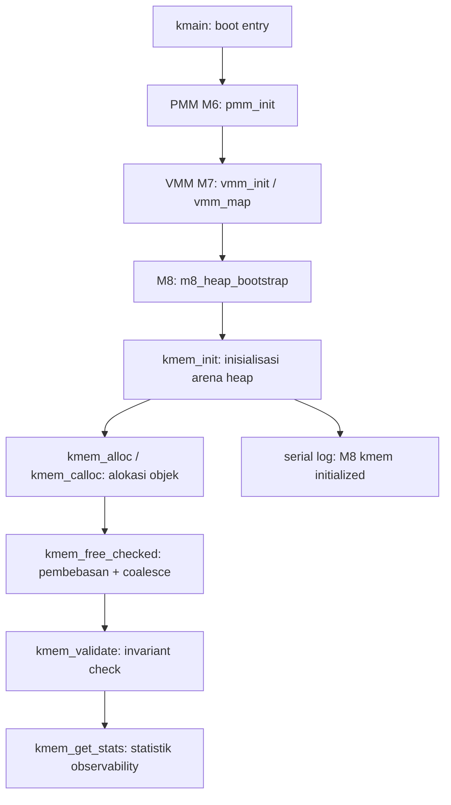

# Template Laporan Praktikum Sistem Operasi Lanjut — MCSOS

**Nama file laporan:** `laporan_praktikum_M8_[Iswan Herdiansah_2583207073011].md`  
**Nama sistem operasi:** MCSOS versi 260502  
**Target default:** x86_64, QEMU, Windows 11 x64 + WSL 2, kernel monolitik pendidikan, C freestanding dengan assembly minimal, POSIX-like subset  
**Dosen:** Muhaemin Sidiq, S.Pd., M.Pd.  
**Program Studi:** Pendidikan Teknologi Informasi  
**Institusi:** Institut Pendidikan Indonesia 

---

## 0. Metadata Laporan

| Atribut | Isi |
|---|---|
| Kode praktikum | `M8` |
| Judul praktikum | `Kernel Heap Awal, Allocator Dinamis, Validasi Invariant, dan Integrasi Bertahap dengan PMM/VMM pada MCSOS` |
| Jenis pengerjaan | `Individu` |
| Nama mahasiswa | `Iswan Herdiansah` |
| NIM | `2583207073011` |
| Kelas | `PTI 1A` |
| Nama kelompok | `Tidak berlaku` |
| Anggota kelompok | `Tidak berlaku` |
| Tanggal praktikum | `2026-05-22` |
| Tanggal pengumpulan | `2026-05-22` |
| Repository | `~/src/mcsos` |
| Branch | `praktikum-m8-kernel-heap` |
| Commit awal | `7eab63d84161392c08cd384fe9a63e9b96ac51c6` |
| Commit akhir | `4f030a4d7c5c1b776ea49272947934b5da2eb3c5` |
| Status readiness yang diklaim | `Siap uji QEMU untuk kernel heap awal` |

---

## 1. Sampul

# Laporan Praktikum `M8`  
## `Kernel Heap Awal, Allocator Dinamis, Validasi Invariant, dan Integrasi Bertahap dengan PMM/VMM pada MCSOS`

Disusun oleh:

| Nama | NIM | Kelas | Peran |
|---|---|---|---|
| `Iswan Herdiansah` | `2583207073011` | `PTI 1A` | `Individu` |

Dosen Pengampu: **Muhaemin Sidiq, S.Pd., M.Pd.**  
Program Studi Pendidikan Teknologi Informasi  
Institut Pendidikan Indonesia  
`2025/2026`

---

## 2. Pernyataan Orisinalitas dan Integritas Akademik

Saya menyatakan bahwa laporan ini disusun berdasarkan pekerjaan praktikum sendiri/kelompok sesuai pembagian peran yang tercatat. Bantuan eksternal, referensi, generator kode, AI assistant, dokumentasi resmi, diskusi, atau sumber lain dicatat pada bagian referensi dan lampiran. Saya tidak mengklaim hasil yang tidak dibuktikan oleh log, test, commit, atau artefak lain.

| Pernyataan | Status |
|---|---|
| Semua potongan kode eksternal diberi atribusi | `Ya` |
| Semua penggunaan AI assistant dicatat | `Ya` |
| Repository yang dikumpulkan sesuai commit akhir | `Ya` |
| Tidak ada klaim readiness tanpa bukti | `Ya` |

Catatan penggunaan bantuan eksternal:

```text
Panduan praktikum M8 (OS_panduan_M8.md) digunakan sebagai referensi utama implementasi.
Dokumentasi resmi: Intel SDM, AMD64 APM, Linux Kernel Documentation, GNU Make Manual,
GNU Binutils, QEMU GDB, dan Clang docs digunakan sebagai referensi teknis.
AI assistant digunakan untuk membantu penyusunan laporan; seluruh implementasi kode,
build, dan pengujian dijalankan secara mandiri di lingkungan WSL2 mahasiswa.
Verifikasi mandiri dilakukan melalui: make m8-kmem-host-test, make m8-audit,
scripts/check_m8_kmem.sh, QEMU smoke test, dan sesi GDB.
```

---

## 3. Tujuan Praktikum

Tuliskan tujuan teknis dan konseptual praktikum. Tujuan harus dapat diuji.

1. Mengimplementasikan kernel heap awal berbasis first-fit free-list allocator pada MCSOS untuk mendukung alokasi objek dinamis setelah boot, di atas arena yang sudah terpetakan oleh PMM dan VMM.
2. Menghasilkan object freestanding `kmem.freestanding.o` yang dapat dikompilasi dengan flag `-ffreestanding -fno-builtin` tanpa dependensi libc, dibuktikan oleh `nm -u` kosong.
3. Menjalankan dan meluluskan host unit test `make m8-kmem-host-test` yang menguji alokasi, pembebasan, alignment 16-byte, zeroing calloc, double-free rejection, dan coalescing.
4. Melakukan audit ELF freestanding dengan `readelf -h`, `nm -u`, dan `objdump -dr`, serta mengintegrasikan heap ke kernel dengan bukti log serial `[M8] kmem initialized` dari QEMU smoke test.

---

## 4. Capaian Pembelajaran Praktikum

Setelah praktikum ini, mahasiswa mampu:

| CPL/CPMK praktikum | Bukti yang harus ditunjukkan |
|---|---|
| Menjelaskan perbedaan PMM, VMM, dan kernel heap serta peran masing-masing lapisan | Tabel desain di section 9.1 dan diagram alir allocator |
| Mengimplementasikan first-fit free-list allocator dengan split, coalesce, alignment, dan invariant | Source `kernel/mm/kmem.c`, host unit test PASS, audit freestanding object |
| Melakukan audit freestanding object dengan `nm`, `readelf`, dan `objdump` | Output `nm -u` kosong, `readelf -h` ELF64 x86-64, `objdump -dr` symbol listing |
| Mengintegrasikan heap awal ke kernel MCSOS setelah PMM dan VMM initialized | Serial log `[M8] kmem initialized` dari QEMU smoke test |
| Mengidentifikasi dan menangani failure mode: double free, invalid pointer, overflow calloc, alignment violation | Host unit test mencakup skenario negatif; `kmem_validate()` dipanggil dalam test |
| Menyusun laporan dengan bukti build, test, log, audit object, failure analysis, rollback, dan readiness review | Laporan ini beserta lampiran evidence |

---

## 5. Peta Milestone MCSOS

Centang milestone yang menjadi fokus laporan ini. Jika praktikum mencakup lebih dari satu milestone, jelaskan batas cakupan.

| Milestone | Fokus | Status dalam laporan |
|---|---|---|
| M0 | Requirements, governance, baseline arsitektur | `[ ] tidak dibahas / [ ] dibahas / [v] selesai praktikum` |
| M1 | Toolchain reproducible, Git, QEMU, GDB, metadata build | `[ ] tidak dibahas / [] dibahas / [v] selesai praktikum` |
| M2 | Boot image, kernel ELF64, early console | `[ ] tidak dibahas / [ ] dibahas / [v] selesai praktikum` |
| M3 | Panic path, linker map, GDB, observability awal | `[ ] tidak dibahas / [ ] dibahas / [v] selesai praktikum` |
| M4 | Trap, exception, interrupt, timer | `[ ] tidak dibahas / [ ] dibahas / [v] selesai praktikum` |
| M5 | PMM, VMM, page table, kernel heap | `[ ] tidak dibahas / [ ] dibahas / [v] selesai praktikum` |
| M6 | Thread, scheduler, synchronization | `[ ] tidak dibahas / [ ] dibahas / [v] selesai praktikum` |
| M7 | Syscall ABI dan user program loader | `[ ] tidak dibahas / [ ] dibahas / [v] selesai praktikum` |
| M8 | VFS, file descriptor, ramfs | `[ ] tidak dibahas / [ ] dibahas / [v] selesai praktikum` |
| M9 | Block layer dan device model | `[v] tidak dibahas / [ ] dibahas / [ ] selesai praktikum` |
| M10 | Persistent filesystem, mcsfs/ext2-like, recovery | `[v] tidak dibahas / [ ] dibahas / [ ] selesai praktikum` |
| M11 | Networking stack, packet parsing, UDP/TCP subset | `[v] tidak dibahas / [ ] dibahas / [ ] selesai praktikum` |
| M12 | Security model, capability/ACL, syscall fuzzing, hardening | `[v] tidak dibahas / [ ] dibahas / [ ] selesai pvraktikum` |
| M13 | SMP, scalability, lock stress, NUMA-aware preparation | `[v] tidak dibahas / [ ] dibahas / [ ] selesai praktikum` |
| M14 | Framebuffer, graphics console, visual regression | `[v] tidak dibahas / [ ] dibahas / [ ] selesai praktikum` |
| M15 | Virtualization/container subset | `[v] tidak dibahas / [ ] dibahas / [ ] selesai praktikum` |
| M16 | Observability, update/rollback, release image, readiness review | `[v] tidak dibahas / [ ] dibahas / [ ] selesai praktikum` |
Batas cakupan praktikum:

```text
M8 mencakup: first-fit free-list allocator, split block, forward/backward coalesce,
alignment 16-byte payload, allocator invariant validation (kmem_validate), allocator
statistics (kmem_get_stats), double-free rejection, calloc overflow protection,
freestanding helper routines (kmem_memset), host unit test, audit freestanding object
(nm/readelf/objdump), integrasi heap ke kernel via m8_heap_bootstrap dan kmem_init,
QEMU smoke test dengan log [M8] kmem initialized, dan sesi GDB pada breakpoint
m8_heap_bootstrap dan kmem_init.

Non-goals M8: slab allocator penuh, SMP-safe allocator, vmalloc, userspace heap,
copy-on-write, swapping, NUMA allocator, allocator interrupt-safe, page-backed heap
growth otomatis, advanced heap hardening, dan production-grade memory isolation.
```

---

## 6. Dasar Teori Ringkas

### 6.1 Konsep Sistem Operasi yang Diuji

```text
Kernel heap adalah lapisan alokasi memori dinamis di atas PMM dan VMM. PMM mengelola
frame fisik 4 KiB; VMM mengelola pemetaan virtual ke physical melalui page table
x86_64 4-level. Kernel heap mengelola objek berukuran byte dalam arena virtual yang
sudah terpetakan.

First-fit free-list allocator memindai daftar block dari awal dan memilih block bebas
pertama yang cukup besar untuk memenuhi permintaan. Block yang terlalu besar dipecah
(split) menjadi dua: satu untuk payload yang diminta, satu sisanya tetap bebas. Saat
blok dibebaskan, tetangga bebas yang bersebelahan digabung (coalesce) untuk mengurangi
fragmentasi.

Setiap block memiliki header (kmem_block_t) berisi magic number, ukuran payload, flag
free/used, dan pointer prev/next untuk traversal doubly-linked list. Invariant wajib
dijaga sepanjang siklus hidup allocator: magic harus valid, pointer harus dalam batas
arena, payload harus aligned 16 byte, dan tidak ada dua block bebas bertetangga yang
belum dicoalesce.

Linux membedakan beberapa strategi alokasi: kmalloc untuk objek kecil, vmalloc untuk
virtual contigu, page allocator langsung, dan slab cache. MCSOS M8 mengimplementasikan
subset pendidikan yang lebih kecil, deterministik, dan mudah diaudit tanpa mengklaim
feature produksi.
```

### 6.2 Konsep Arsitektur x86_64 yang Relevan

| Konsep | Relevansi pada praktikum | Bukti/verifikasi |
|---|---|---|
| `long mode` | Kernel berjalan di mode 64-bit; pointer dan address space 64-bit; wajib untuk `mcmodel=kernel` | `readelf -h build/kernel.elf`: Class ELF64, Machine AMD X86-64 |
| `paging 4-level` | Arena heap berada di virtual address yang sudah dipetakan oleh VMM M7 sebelum `kmem_init` | Serial log `[M7] vmm map ok` dan `cr3=0x...` sebelum `[M8] kmem initialized` |
| `CR3` | Page table root; swap CR3 mempengaruhi akses ke arena heap | GDB: `cr3=0x1ff56000` saat breakpoint `m8_heap_bootstrap` |
| `alignment 16-byte` | ABI x86_64 System V mensyaratkan stack 16-byte aligned; heap payload juga dijaga 16-byte untuk konsistensi | `kmem_alloc` mengembalikan pointer aligned 16; diverifikasi di host unit test |
| `mno-red-zone` | Kernel tidak boleh menggunakan red zone karena interrupt dapat menimpa area di bawah RSP | Compiler flag `-mno-red-zone` dipakai di semua unit kernel |
| `mcmodel=kernel` | Kernel berada di upper half virtual address `0xffffffff80000000`; model kernel memastikan relokasi konsisten | `readelf -h build/kernel.elf`: Entry `0xffffffff80000610`; `m8_boot_heap` di `0xffffffff80011000` |

### 6.3 Konsep Implementasi Freestanding

| Aspek | Keputusan praktikum |
|---|---|
| Bahasa | C17 freestanding |
| Runtime | Tanpa hosted libc; tidak menggunakan `malloc`, `free`, `printf`, `memset` dari libc |
| ABI | x86_64 System V ABI kernel internal |
| Compiler flags kritis | `--target=x86_64-unknown-none-elf -ffreestanding -fno-builtin -fno-stack-protector -mno-red-zone -mno-mmx -mno-sse -mno-sse2 -mcmodel=kernel -fno-pic -fno-pie` |
| Risiko undefined behavior | Pointer arithmetic keluar arena, alignment violation pada payload, integer overflow pada calloc (count * size), aliasing antara header dan payload jika cast tidak hati-hati |

### 6.4 Referensi Teori yang Digunakan

| No. | Sumber | Bagian yang digunakan | Alasan relevansi |
|---|---|---|---|
| `[1]` | Intel SDM | System programming, long mode, paging, memory management | Dasar arsitektur x86_64 yang dipakai kernel |
| `[2]` | AMD64 APM Vol 2 | System programming, page translation, privileged resources | Referensi komplementer AMD64 untuk memory management |
| `[3]` | Linux Kernel Documentation — Memory Allocation Guide | Klasifikasi strategi alokasi kernel (kmalloc, vmalloc, page allocator) | Konteks arsitektur allocator produksi sebagai pembanding |
| `[4]` | Linux Kernel Documentation — Memory Management | Gambaran umum subsistem memori Linux | Referensi konsep lanjutan yang menjadi motivasi desain M8 |
| `[7]` | GNU Binutils — Linker Scripts | Layout section kernel di linker.ld | Kontrol penempatan `.bss` arena heap dan section kernel |
| `[8]` | GNU Make Manual | Target build `m8-kmem-host-test`, `m8-kmem-freestanding`, `m8-audit` | Makefile pipeline untuk host test dan audit freestanding |
| `[9]` | QEMU Project — GDB usage | GDB gdbstub via `-s -S`, breakpoint pada `m8_heap_bootstrap` dan `kmem_init` | Debugging kernel saat runtime QEMU |
| `[10]` | LLVM Project — Clang command line reference | Flag `-ffreestanding`, `-fno-builtin`, `-mcmodel=kernel`, `--target=x86_64-unknown-none-elf` | Dokumentasi flag compiler yang dipakai |

---

## 7. Lingkungan Praktikum

### 7.1 Host dan Target

| Komponen | Nilai |
|---|---|
| Host OS | `[Windows 11 x64 build 26200.8426]` |
| Lingkungan build | `[WSL 2 Ubuntu versi 24.04]` |
| Target ISA | `x86_64` |
| Target ABI | `[x86_64-elf / x86_64-unknown-none / custom]` |
| Emulator | `[QEMU versi 6.2.0]` |
| Firmware emulator | `[OVMF versi 2022.02-3ubuntu0.22.04.5]` |
| Debugger | `[GDB versi 12.1]` |
| Build system | `[Make 4.3 / CMake 3.22.1 / Meson 1.3.2 / Ninja 1.10.1]` |
| Bahasa utama | `[C17 freestanding]` |
| Assembly | `[NASM versi 2.15.05]` |


### 7.2 Versi Toolchain

```bash
uname -a
cat /etc/os-release
clang --version || true
ld.lld --version || true
gcc --version || true
ld --version | head -n 1 || true
make --version | head -n 1
qemu-system-x86_64 --version || true
gdb --version | head -n 1 || true
readelf --version | head -n 1
objdump --version | head -n 1
nm --version | head -n 1
```

Output:

```text
Linux DESKTOP-52CG9FT 6.6.114.1-microsoft-standard-WSL2 #1 SMP PREEMPT_DYNAMIC Mon Dec  1 20:46:23 UTC 2025 x86_64 x86_64 x86_64 GNU/Linux
PRETTY_NAME="Ubuntu 22.04.5 LTS"
NAME="Ubuntu"
VERSION_ID="22.04"
VERSION="22.04.5 LTS (Jammy Jellyfish)"
VERSION_CODENAME=jammy
ID=ubuntu
ID_LIKE=debian
HOME_URL="https://www.ubuntu.com/"
SUPPORT_URL="https://help.ubuntu.com/"
BUG_REPORT_URL="https://bugs.launchpad.net/ubuntu/"
PRIVACY_POLICY_URL="https://www.ubuntu.com/legal/terms-and-policies/privacy-policy"
UBUNTU_CODENAME=jammy
Ubuntu clang version 14.0.0-1ubuntu1.1
Target: x86_64-pc-linux-gnu
Thread model: posix
InstalledDir: /usr/bin
Ubuntu LLD 14.0.0 (compatible with GNU linkers)
gcc (Ubuntu 11.4.0-1ubuntu1~22.04.3) 11.4.0
GNU ld (GNU Binutils for Ubuntu) 2.38
GNU Make 4.3
QEMU emulator version 6.2.0 (Debian 1:6.2+dfsg-2ubuntu6.30)
GNU gdb (Ubuntu 12.1-0ubuntu1~22.04.2) 12.1
GNU readelf (GNU Binutils for Ubuntu) 2.38
GNU objdump (GNU Binutils for Ubuntu) 2.38
GNU nm (GNU Binutils for Ubuntu) 2.38
```

### 7.3 Lokasi Repository

| Item | Nilai |
|---|---|
| Path repository di WSL | `~/src/mcsos` |
| Apakah berada di filesystem Linux WSL, bukan `/mnt/c` | `Ya` |
| Remote repository | `[Tidak tersedia]` |
| Branch | `praktikum-m8-kernel-heap` |
| Commit hash awal | `7eab63d84161392c08cd384fe9a63e9b96ac51c6` |
| Commit hash akhir | `4f030a4d7c5c1b776ea49272947934b5da2eb3c5` |

---

## 8. Repository dan Struktur File

### 8.1 Struktur Direktori yang Relevan

```text
mcsos/
├── Makefile
├── kernel/
│   ├── arch/
│   │   └── x86_64/
│   │       ├── idt.c
│   │       ├── isr.S
│   │       ├── pic.c
│   │       └── pit.c
│   ├── core/
│   │   ├── boot.c
│   │   ├── kmain.c
│   │   ├── log.c
│   │   ├── panic.c
│   │   ├── pmm.c
│   │   ├── serial.c
│   │   ├── start.S
│   │   ├── trap.c
│   │   └── vmm.c
│   ├── include/
│   │   └── mcsos/
│   │       └── kernel/
│   │           ├── kmem.h       ← baru M8
│   │           └── vmm.h
│   ├── lib/
│   │   ├── memory.c
│   │   └── serial_hex.c
│   └── mm/
│       └── kmem.c               ← baru M8
├── scripts/
│   ├── check_m8_kmem.sh         ← baru M8
│   ├── check_m8_static.sh       ← baru M8
│   └── grade_m8.sh              ← baru M8
├── tests/
│   └── test_kmem.c              ← baru M8
└── build/
    ├── kernel.elf
    ├── kernel.map
    ├── mcsos.iso
    └── m8/
        ├── test_kmem            ← artefak host test
        ├── kmem.freestanding.o  ← artefak audit freestanding
        ├── nm_u.txt
        ├── readelf_h.txt
        ├── kmem.objdump.txt
        └── qemu_m8.log
```

### 8.2 File yang Dibuat atau Diubah

| File | Jenis perubahan | Alasan perubahan | Risiko |
|---|---|---|---|
| `kernel/include/mcsos/kernel/kmem.h` | baru | Header API publik allocator M8: `kmem_init`, `kmem_alloc`, `kmem_calloc`, `kmem_free_checked`, `kmem_get_stats`, `kmem_validate`, `kmem_stats_t` | Rendah — header-only, tidak ada logika runtime |
| `kernel/mm/kmem.c` | baru | Implementasi first-fit free-list allocator freestanding | Sedang — bug allocator dapat menyebabkan metadata corruption atau page fault |
| `tests/test_kmem.c` | baru | Host unit test untuk alokasi, free, alignment, zeroing, double-free, coalesce | Rendah — dijalankan di host, tidak masuk kernel image |
| `scripts/check_m8_kmem.sh` | baru | Script preflight M8: cek toolchain, freestanding object, host unit test | Rendah — hanya read-only audit |
| `scripts/check_m8_static.sh` | baru | Script audit statis M8 | Rendah |
| `scripts/grade_m8.sh` | baru | Script penilaian M8 | Rendah |
| `kernel/core/kmain.c` | ubah | Tambah panggilan `m8_heap_bootstrap()` dan `kmem_init()` setelah PMM/VMM init | Sedang — kesalahan include path atau ABI menyebabkan build error; sudah diperbaiki |
| `Makefile` | ubah | Tambah target `m8-kmem-host-test`, `m8-kmem-freestanding`, `m8-audit`, `m8-all`, `m8-clean`, dan target `run` M8 | Sedang — kesalahan Makefile dapat memutus build pipeline |
| `kernel/core/vmm.c` | baru | VMM M7 yang diintegrasikan bersamaan dengan commit M8 | Sedang — VMM harus benar sebelum heap dapat digunakan |
| `kernel/include/mcsos/kernel/vmm.h` | baru | Header VMM M7 | Rendah |

### 8.3 Ringkasan Diff

```bash
git status --short
git log --oneline -n 5
```

Output:

```text
[git status --short setelah commit akhir]
On branch praktikum-m8-kernel-heap
nothing to commit, working tree clean

[git log --oneline -n 5]
4f030a4 m8: add early kernel heap allocator
7eab63d M6: implement bitmap physical memory manager
390fdcf M5: implement external interrupts and PIT timer
d919353 M4 add x86_64 IDT and exception trap path
3c28480 M3: panic path logging gdb and disassembly audit

[git show --stat HEAD]
commit 4f030a4d7c5c1b776ea49272947934b5da2eb3c5
Author: Iswan Herdiansah <mamankucan@gmail.com>
Date:   Fri May 22 07:06:45 2026 +0700

    m8: add early kernel heap allocator

 15 files changed, 921 insertions(+), 52 deletions(-)
 create mode 100644 kernel/core/vmm.c
 create mode 100644 kernel/include/mcsos/kernel/kmem.h
 create mode 100644 kernel/include/mcsos/kernel/vmm.h
 create mode 100644 kernel/mm/kmem.c
 create mode 100755 scripts/check_m7_static.sh
 create mode 100755 scripts/check_m8_kmem.sh
 create mode 100755 scripts/check_m8_static.sh
 create mode 100755 scripts/grade_m7.sh
 create mode 100755 scripts/grade_m8.sh
 create mode 100644 scripts/m7_gdb.cmd
 create mode 100755 scripts/m7_preflight.sh
 create mode 100644 tests/test_kmem.c
 create mode 100644 tests/test_vmm_host.c
```

---

## 9. Desain Teknis

### 9.1 Masalah yang Diselesaikan

```text
Setelah boot awal, kernel MCSOS hanya memiliki alokasi statik. Struktur seperti daftar
proses, descriptor file, object VFS, buffer I/O, dan metadata driver membutuhkan
alokasi dinamis dengan kontrak kepemilikan yang jelas. M8 menambahkan kernel heap awal
berbasis first-fit free-list di atas arena yang sudah terpetakan oleh PMM (M6) dan VMM
(M7), sehingga kernel dapat mengalokasikan dan membebaskan objek kecil hingga sedang
secara deterministik dan dapat diaudit.

Masalah konkret yang diselesaikan:
1. Tidak ada mekanisme alokasi dinamis di kernel selain alokasi statik di .bss/.data.
2. Tidak ada validasi invariant alokator (double free, invalid pointer, overflow calloc).
3. Belum ada jalur integrasi heap ke inisialisasi kernel setelah PMM dan VMM siap.
```

### 9.2 Keputusan Desain

| Keputusan | Alternatif yang dipertimbangkan | Alasan memilih | Konsekuensi |
|---|---|---|---|
| First-fit free-list | Best-fit, buddy allocator, slab allocator | Paling mudah diimplementasikan, diaudit, dan diuji dalam konteks pendidikan; deterministik | Fragmentasi lebih tinggi dari best-fit; lebih lambat dari slab pada beban seragam; cocok untuk M8 |
| Arena statik `.bss` sebagai bootstrap heap | Page-backed heap dari PMM | Menghindari ketergantungan pada VMM map yang belum tentu stabil; lebih aman untuk bootstrap early kernel | Ukuran heap terbatas; tidak tumbuh otomatis |
| `kmem_free_checked` mengembalikan int error code | `kmem_free` void | Memungkinkan unit test membedakan free valid, double free, pointer invalid, dan corruption | API sedikit berbeda dari libc `free`; perlu adaptasi pemanggil |
| Alignment 16-byte untuk payload | 8-byte, 4-byte | Konsistensi dengan ABI x86_64 System V; menghindari alignment fault untuk tipe 128-bit | Sedikit waste untuk alokasi kecil (< 16 byte) |
| `KMEM_MIN_SPLIT 32` | Nilai lain | Mencegah pembuatan block yang terlalu kecil untuk digunakan; mengurangi fragmentasi mikro | Block terlalu kecil tidak dipecah; sedikit internal fragmentation |

### 9.3 Arsitektur Ringkas



Penjelasan diagram:

```text
Setelah kmain dipanggil oleh bootloader (via start.S), kernel menginisialisasi PMM M6
untuk mengelola frame fisik, kemudian VMM M7 untuk memetakan virtual address. Setelah
kedua lapisan bawah siap, m8_heap_bootstrap dipanggil untuk menyiapkan arena bootstrap
heap (array statik di .bss). kmem_init menerima pointer base dan ukuran arena, membuat
satu block free besar, dan mencetak log [M8] kmem initialized ke serial.

Selanjutnya kernel dapat memanggil kmem_alloc untuk alokasi byte-granular,
kmem_calloc untuk alokasi dengan zeroing (dengan proteksi overflow), dan
kmem_free_checked untuk pembebasan. Setelah setiap operasi kritis, kmem_validate
dapat dipanggil untuk memverifikasi semua invariant. kmem_get_stats menyediakan
statistik untuk observability (total_bytes, used_bytes, free_bytes, block_count,
largest_free).
```

### 9.4 Kontrak Antarmuka

| Antarmuka | Pemanggil | Penerima | Precondition | Postcondition | Error path |
|---|---|---|---|---|---|
| `kmem_init(base, bytes)` | `m8_heap_bootstrap` / `kmain` | `kmem.c` | `base` aligned 16, `bytes` cukup untuk minimal satu block header + payload, arena sudah terpetakan dan writable | Heap terinisialisasi, satu block free besar tersedia, `g_initialized = 1` | Mengembalikan `-1` jika base NULL atau bytes terlalu kecil |
| `kmem_alloc(bytes)` | Subsistem kernel | `kmem.c` | `g_initialized == 1`, tidak dipanggil dari IRQ context | Pointer payload aligned 16 atau NULL jika OOM | Mengembalikan NULL jika tidak ada block cukup besar |
| `kmem_calloc(count, bytes)` | Subsistem kernel | `kmem.c` | `g_initialized == 1`, `count * bytes` tidak overflow | Pointer payload berisi nol atau NULL jika OOM/overflow | Mengembalikan NULL jika overflow atau OOM |
| `kmem_free_checked(ptr)` | Subsistem kernel | `kmem.c` | `ptr` adalah NULL atau pointer valid dari `kmem_alloc`/`kmem_calloc` | Block dibebaskan, coalesce dilakukan, statistik diperbarui | Mengembalikan `-1` untuk double free, pointer di luar arena, atau magic korup |
| `kmem_validate()` | Test / debug path | `kmem.c` | `g_initialized == 1` | Semua invariant diperiksa | Mengembalikan `-1` jika ada invariant yang dilanggar |
| `kmem_get_stats(out)` | Kernel / debug | `kmem.c` | `out != NULL`, `g_initialized == 1` | Statistik heap ditulis ke `*out` | Jika `out == NULL` atau belum init, tidak ada efek |

### 9.5 Struktur Data Utama

| Struktur data | Field penting | Ownership | Lifetime | Invariant |
|---|---|---|---|---|
| `kmem_block_t` | `magic`, `size`, `free`, `prev`, `next` | `kmem.c` internal | Selama arena hidup (boot hingga shutdown) | `magic == KMEM_MAGIC`, `size > 0`, pointer dalam batas arena, `free` tepat 0 atau 1 |
| `kmem_stats_t` | `total_bytes`, `used_bytes`, `free_bytes`, `block_count`, `free_count`, `largest_free` | Pemanggil (read-only snapshot) | Sementara — valid saat `kmem_get_stats` selesai | Konsisten: `used_bytes + free_bytes == total_bytes` |
| `g_heap_base`, `g_heap_end` | Batas arena sebagai `unsigned char *` | `kmem.c` static | Setelah `kmem_init` | `g_heap_base < g_heap_end`, keduanya dalam rentang valid yang terpetakan |
| `g_head` | Pointer ke block pertama free-list | `kmem.c` static | Setelah `kmem_init` | Tidak NULL setelah init; block pertama selalu dalam arena |

### 9.6 Invariants

Tuliskan invariant yang harus benar sepanjang eksekusi.

1. Setiap `kmem_block_t` dalam arena memiliki `magic == KMEM_MAGIC`; magic yang korup menandakan heap corruption dan harus menyebabkan `kmem_validate()` mengembalikan -1.
2. Setiap payload yang dikembalikan `kmem_alloc` memenuhi `((uintptr_t)payload % 16) == 0`.
3. `block->size` menyatakan kapasitas payload saja, bukan ukuran total termasuk header.
4. Setiap block memiliki status tepat satu dari dua: `free == 1` atau `free == 0`; tidak ada state intermediate.
5. Tidak ada dua block bebas bertetangga yang belum dicoalesce setelah operasi `kmem_free_checked`.
6. `g_heap_base <= (unsigned char *)block < g_heap_end` untuk setiap block dalam list.
7. `kmem_free_checked(NULL)` adalah no-op yang mengembalikan 0.
8. Double free harus ditolak: `kmem_free_checked` pada block yang sudah `free == 1` mengembalikan -1.
9. Pointer di luar arena ditolak: `kmem_free_checked` pada pointer di luar `[g_heap_base, g_heap_end)` mengembalikan -1.
10. Tidak ada dependensi pada fungsi libc dari object kernel freestanding; dibuktikan oleh `nm -u` kosong.
11. Allocator M8 belum reentrant dan belum SMP-safe; pemanggilan dari interrupt handler dilarang.

### 9.7 Ownership, Locking, dan Concurrency

| Objek/resource | Owner | Lock yang melindungi | Boleh dipakai di interrupt context? | Catatan |
|---|---|---|---|---|
| Arena heap (`g_heap_base..g_heap_end`) | `kmem.c` | Tidak ada (single-core early kernel) | Tidak | Pemakaian dari IRQ tanpa lock dapat menyebabkan korupsi metadata; dilarang di M8 |
| `g_head` free-list | `kmem.c` | Tidak ada | Tidak | Single-core; preemption belum ada di M8 |
| `kmem_stats_t` snapshot | Pemanggil | Tidak ada | Tidak berlaku | Hanya baca setelah `kmem_get_stats`; tidak ada shared state |

Lock order yang berlaku:

```text
M8 berjalan pada single-core early kernel tanpa scheduler dan tanpa preemption.
Tidak ada locking eksplisit. Jika interrupt diaktifkan, pemanggilan kmem_alloc
atau kmem_free_checked dari IRQ handler harus dihindari karena dapat menyebabkan
korupsi doubly-linked list metadata. Solusi M8: larang alokasi dari IRQ context;
panic jika terdeteksi. Lock spinlock akan ditambahkan pada milestone SMP.
```

### 9.8 Memory Safety dan Undefined Behavior Risk

| Risiko | Lokasi | Mitigasi | Bukti |
|---|---|---|---|
| Out-of-bounds write ke arena | `kmem_alloc` saat split | Periksa `(unsigned char *)new_block + header + KMEM_MIN_SPLIT <= g_heap_end` sebelum split | Host unit test; `kmem_validate()` setelah setiap alokasi |
| Integer overflow pada `calloc` | `kmem_calloc(count, bytes)` | Periksa `count > 0 && bytes > 0 && count <= SIZE_MAX / bytes` sebelum perkalian | Host unit test skenario overflow |
| Use-after-free | Pemanggil setelah `kmem_free_checked` | `kmem_free_checked` tidak menghapus pointer pemanggil; tanggung jawab pemanggil untuk tidak mengakses setelah free | Scope design; tidak ada mitigasi runtime di M8 |
| Alignment violation | `kmem_alloc` payload | `kmem_align_up_ptr` memastikan payload aligned 16 | Host unit test alignment check; `kmem_validate` |
| Pointer ke non-arena | `kmem_free_checked` | `kmem_ptr_in_heap` memeriksa `ptr >= g_heap_base && ptr < g_heap_end` | Host unit test skenario pointer invalid |
| Magic corruption | Semua operasi | Periksa `block->magic == KMEM_MAGIC` sebelum akses; `kmem_validate` scan seluruh list | Host unit test; `kmem_validate` |

### 9.9 Security Boundary

| Boundary | Data tidak tepercaya | Validasi yang dilakukan | Failure mode aman |
|---|---|---|---|
| `kmem_alloc(bytes)` | `bytes` dari pemanggil kernel | Periksa `bytes > 0`; align up; periksa cukup ruang | NULL jika invalid atau OOM |
| `kmem_calloc(count, bytes)` | `count` dan `bytes` dari pemanggil | Overflow check `count * bytes`; periksa OOM | NULL jika overflow atau OOM |
| `kmem_free_checked(ptr)` | `ptr` dari pemanggil | `kmem_ptr_in_heap`, `magic == KMEM_MAGIC`, `free == 0` | Mengembalikan -1; tidak memodifikasi state |
| `kmem_init(base, bytes)` | `base` dan `bytes` dari bootstrap | `base != NULL`, `bytes >= minimum`, `base` aligned | Mengembalikan -1 jika invalid |

---

## 10. Langkah Kerja Implementasi

### Langkah 1 — Membuat branch kerja dan direktori M8

Maksud langkah:

```text
Memisahkan perubahan M8 dari modul sebelumnya agar rollback dapat dilakukan
tanpa menghapus hasil M6/M7.
```

Perintah:

```bash
git switch -c praktikum-m8-kernel-heap
mkdir -p kernel/mm tests scripts build/m8
```

Output ringkas:

```text
Branch praktikum-m8-kernel-heap dibuat dan aktif.
Direktori kernel/mm, tests, scripts, build/m8 tersedia.
```

Artefak yang dihasilkan:

| Artefak | Lokasi | Fungsi |
|---|---|---|
| Branch Git | `.git/refs/heads/praktikum-m8-kernel-heap` | Isolasi perubahan M8 |

Indikator berhasil:

```text
git branch --show-current menampilkan: praktikum-m8-kernel-heap
```

### Langkah 2 — Menambahkan header `kernel/include/mcsos/kernel/kmem.h`

Maksud langkah:

```text
Mendefinisikan API publik allocator M8: kmem_init, kmem_alloc, kmem_calloc,
kmem_free_checked, kmem_get_stats, kmem_validate, dan tipe kmem_stats_t.
```

Perintah:

```bash
nano kernel/include/mcsos/kernel/kmem.h
```

Output ringkas:

```text
Header kmem.h tersedia di kernel/include/mcsos/kernel/kmem.h
Mendefinisikan KMEM_ALIGN 16, KMEM_MAGIC, kmem_stats_t, dan 6 fungsi API.
```

Artefak yang dihasilkan:

| Artefak | Lokasi | Fungsi |
|---|---|---|
| `kmem.h` | `kernel/include/mcsos/kernel/kmem.h` | Header API publik allocator |

Indikator berhasil:

```text
File ada dan dapat di-include oleh kernel/mm/kmem.c dan tests/test_kmem.c
tanpa error.
```

### Langkah 3 — Mengimplementasikan `kernel/mm/kmem.c`

Maksud langkah:

```text
Mengimplementasikan first-fit free-list allocator dengan split, coalesce,
alignment 16-byte, validasi magic, statistik, dan freestanding helper (kmem_memset).
```

Perintah:

```bash
nano kernel/mm/kmem.c
```

Output ringkas:

```text
Implementasi selesai. Fungsi yang tersedia:
- kmem_init, kmem_alloc, kmem_calloc, kmem_free_checked,
  kmem_validate, kmem_get_stats
- Helper internal: kmem_align_up_size, kmem_align_up_ptr, kmem_memset,
  kmem_payload, kmem_header_from_payload, kmem_ptr_in_heap, kmem_split_if_useful
```

Artefak yang dihasilkan:

| Artefak | Lokasi | Fungsi |
|---|---|---|
| `kmem.c` | `kernel/mm/kmem.c` | Implementasi allocator |

Indikator berhasil:

```text
Kompilasi freestanding berhasil dan nm -u menghasilkan output kosong.
```

### Langkah 4 — Menambahkan host unit test `tests/test_kmem.c`

Maksud langkah:

```text
Membuat host unit test yang menguji alokasi, pembebasan, alignment,
zeroing calloc, double-free rejection, pointer invalid, dan coalescing
pada lingkungan host (bukan freestanding kernel).
```

Perintah:

```bash
nano tests/test_kmem.c
make m8-kmem-host-test
```

Output ringkas:

```text
cc -std=c17 -Wall -Wextra -Werror -Ikernel/include \
    tests/test_kmem.c kernel/mm/kmem.c -o build/m8/test_kmem
./build/m8/test_kmem | tee build/m8/test_kmem.log
M8 KMEM host unit test: PASS
```

Artefak yang dihasilkan:

| Artefak | Lokasi | Fungsi |
|---|---|---|
| `test_kmem` | `build/m8/test_kmem` | Binary host unit test |
| `test_kmem.log` | `build/m8/test_kmem.log` | Log hasil host unit test |

Indikator berhasil:

```text
Output baris terakhir: M8 KMEM host unit test: PASS
Exit code 0 dari ./build/m8/test_kmem
```

### Langkah 5 — Audit freestanding object

Maksud langkah:

```text
Memverifikasi bahwa kmem.c dapat dikompilasi sebagai C17 freestanding object
tanpa dependensi libc, menghasilkan ELF64 x86-64 relocatable object.
```

Perintah:

```bash
make m8-audit
```

Output ringkas:

```text
clang -std=c17 -Wall -Wextra -Werror -ffreestanding -fno-builtin \
    -fno-stack-protector -mno-red-zone -Ikernel/include \
    -c kernel/mm/kmem.c -o build/m8/kmem.freestanding.o
nm -u build/m8/kmem.freestanding.o | tee build/m8/nm_u.txt
test ! -s build/m8/nm_u.txt
readelf -h build/m8/kmem.freestanding.o > build/m8/readelf_h.txt
objdump -dr build/m8/kmem.freestanding.o > build/m8/kmem.objdump.txt
```

Artefak yang dihasilkan:

| Artefak | Lokasi | Fungsi |
|---|---|---|
| `kmem.freestanding.o` | `build/m8/kmem.freestanding.o` | Freestanding object ELF64 x86-64 |
| `nm_u.txt` | `build/m8/nm_u.txt` | Daftar unresolved symbol (harus kosong) |
| `readelf_h.txt` | `build/m8/readelf_h.txt` | ELF header freestanding object |
| `kmem.objdump.txt` | `build/m8/kmem.objdump.txt` | Disassembly dan relokasi |

Indikator berhasil:

```text
nm_u.txt kosong (test ! -s build/m8/nm_u.txt lulus)
readelf_h.txt menampilkan Class ELF64, Machine Advanced Micro Devices X86-64
```

### Langkah 6 — Menjalankan script preflight `check_m8_kmem.sh`

Maksud langkah:

```text
Script check_m8_kmem.sh melakukan pemeriksaan menyeluruh: baseline repo,
versi toolchain, freestanding object, dan host unit test.
```

Perintah:

```bash
make m8-clean
make m8-all
./scripts/check_m8_kmem.sh
git status --short
```

Output ringkas:

```text
[M8] checking repository baseline...
[M8] checking toolchain...
[M8] tool versions...
Ubuntu clang version 14.0.0-1ubuntu1.1
Ubuntu LLD 14.0.0 (compatible with GNU linkers)
GNU Make 4.3
[M8] freestanding object check...
[M8] host unit test...
M8 KMEM host unit test: PASS
[PASS] M8 preflight completed.
 M Makefile
 M kernel/core/kmain.c
?? kernel/include/mcsos/kernel/kmem.h
?? kernel/mm/
?? scripts/check_m8_kmem.sh
?? scripts/check_m8_static.sh
?? scripts/grade_m8.sh
?? tests/test_kmem.c
```

Artefak yang dihasilkan:

| Artefak | Lokasi | Fungsi |
|---|---|---|
| Log preflight | Terminal / stdout | Konfirmasi PASS semua gate M8 |

Indikator berhasil:

```text
[PASS] M8 preflight completed.
```

### Langkah 7 — Mengintegrasikan heap ke kernel (`kmain.c`) dan QEMU smoke test

Maksud langkah:

```text
Menambahkan panggilan m8_heap_bootstrap() dan kmem_init() ke kmain.c setelah
PMM dan VMM terinisialisasi, kemudian membangun kernel image dan menjalankan
QEMU smoke test untuk memverifikasi log [M8] kmem initialized.
```

Perintah:

```bash
nano kernel/core/kmain.c
make clean
make iso
qemu-system-x86_64 \
    -machine q35 \
    -cpu max \
    -m 256M \
    -serial stdio \
    -no-reboot \
    -no-shutdown \
    -d int,cpu_reset,guest_errors \
    -D build/m8/qemu_debug.log \
    -cdrom build/mcsos.iso | tee build/m8/qemu_m8.log
```

Output ringkas:

```text
[Potongan build log — semua file berhasil dikompilasi]
clang ... -c kernel/mm/kmem.c -o build/normal/kernel/mm/kmem.o
ld.lld -nostdlib -static -z max-page-size=0x1000 -T linker.ld \
    -Map=build/kernel.map -o build/kernel.elf ...
ISO selesai: build/mcsos.iso

[QEMU serial output]
MCSOS 260502 M4 [M8] kernel heap allocator
kernel_start=0xffffffff80000000
kernel_end=0xffffffff80023018
[M6] pmm initialized
[M7] vmm map ok
[M7] vmm phys=0x0000000000200000
[M7] cr3=0x000000000ff56000
[M8] kmem initialized
idt_base=0xffffffff80005000
idt_limit=0x0000000000000fff
[M4] IDT loaded
[M5] idt: loaded
[M5] selftest: IDT invariants passed
[M5] sti: enabling interrupts
[MCSOS:TIMER] ticks=100
[MCSOS:TIMER] ticks=200
...
```

Artefak yang dihasilkan:

| Artefak | Lokasi | Fungsi |
|---|---|---|
| `kernel.elf` | `build/kernel.elf` | Kernel binary ELF64 |
| `mcsos.iso` | `build/mcsos.iso` | Boot image ISO |
| `qemu_m8.log` | `build/m8/qemu_m8.log` | Log serial QEMU |

Indikator berhasil:

```text
Serial log memuat baris: [M8] kmem initialized
Timer ticks berlanjut setelah heap init tanpa panic.
```

### Langkah 8 — Sesi GDB: verifikasi breakpoint dan state heap

Maksud langkah:

```text
Memverifikasi bahwa m8_heap_bootstrap dan kmem_init dapat dihentikan di GDB,
register dalam keadaan valid (long mode aktif, CR3 benar), dan m8_boot_heap
zeroed di .bss.
```

Perintah:

```bash
# Terminal 1: jalankan QEMU dengan GDB stub
qemu-system-x86_64 -machine q35 -m 512M -serial stdio \
    -no-reboot -no-shutdown -s -S -cdrom build/mcsos.iso

# Terminal 2: GDB session
gdb build/kernel.elf
target remote localhost:1234
break m8_heap_bootstrap
break kmem_init
break kmalloc
continue
```

Output ringkas:

```text
Reading symbols from build/kernel.elf...
(No debugging symbols found in build/kernel.elf)
(gdb) target remote localhost:1234
Remote debugging using localhost:1234
0x000000000000fff0 in ?? ()
(gdb) break m8_heap_bootstrap
Breakpoint 1 at 0xffffffff80000880
(gdb) break kmem_init
Breakpoint 2 at 0xffffffff80001f00
(gdb) continue
Continuing.

Breakpoint 1, 0xffffffff80000880 in m8_heap_bootstrap ()
(gdb) info registers
rip            0xffffffff80000880  0xffffffff80000880 <m8_heap_bootstrap>
cr0            0x80010011          [ PG WP ET PE ]
cr3            0x1ff56000          [ PDBR=130902 PCID=0 ]
cr4            0x20                [ PAE ]
efer           0xd00               [ NXE LMA LME ]
cs             0x28                40
(gdb) x/32gx &m8_boot_heap
0xffffffff80011000 <m8_boot_heap>:      0x0000000000000000      0x0000000000000000
0xffffffff80011010 <m8_boot_heap+16>:   0x0000000000000000      0x0000000000000000
...
(gdb) bt
#0  0xffffffff80000880 in m8_heap_bootstrap ()
#1  0xffffffff8000080a in kmain ()
```

Artefak yang dihasilkan:

| Artefak | Lokasi | Fungsi |
|---|---|---|
| GDB session output | Terminal | Verifikasi breakpoint, register state, dan heap region |

Indikator berhasil:

```text
Breakpoint 1 di m8_heap_bootstrap tercapai.
CR0 menunjukkan PG (paging aktif) dan PE (protected mode).
EFER menunjukkan LMA dan LME (long mode aktif).
m8_boot_heap di 0xffffffff80011000 berisi nol (zeroed .bss).
```

### Langkah 9 — Commit akhir

Maksud langkah:

```text
Menyimpan semua perubahan M8 ke repository.
```

Perintah:

```bash
git add Makefile \
    kernel/core/kmain.c \
    kernel/include/mcsos/kernel/kmem.h \
    kernel/mm/kmem.c \
    tests/test_kmem.c \
    scripts/check_m8_kmem.sh \
    scripts/check_m8_static.sh \
    scripts/grade_m8.sh

git commit -m "m8: add early kernel heap allocator"
git commit --amend --no-edit
git status --short
```

Output ringkas:

```text
[pre-commit] running shellcheck
[pre-commit] OK
[praktikum-m8-kernel-heap 4f030a4] m8: add early kernel heap allocator
 Date: Fri May 22 07:06:45 2026 +0700
 15 files changed, 921 insertions(+), 52 deletions(-)

On branch praktikum-m8-kernel-heap
nothing to commit, working tree clean
```

Artefak yang dihasilkan:

| Artefak | Lokasi | Fungsi |
|---|---|---|
| Commit `4f030a4` | `.git` | Snapshot akhir M8 |

Indikator berhasil:

```text
git status: nothing to commit, working tree clean
Commit hash: 4f030a4d7c5c1b776ea49272947934b5da2eb3c5
```

---

## 11. Checkpoint Buildable

Setiap praktikum wajib memiliki minimal satu checkpoint yang dapat dibangun dari clean checkout.

| Checkpoint | Perintah | Expected result | Status |
|---|---|---|---|
| Clean build kernel | `make clean && make` | Kernel ELF dan ISO terbangun | `PASS` |
| Host unit test | `make m8-kmem-host-test` | `M8 KMEM host unit test: PASS` | `PASS` |
| Freestanding audit | `make m8-audit` | `nm_u.txt` kosong, object ELF64 | `PASS` |
| Preflight script | `./scripts/check_m8_kmem.sh` | `[PASS] M8 preflight completed.` | `PASS` |
| QEMU smoke test | `make run` | Serial log `[M8] kmem initialized` | `PASS` |
| Image generation | `make iso` | `build/mcsos.iso` ada | `PASS` |

Catatan checkpoint:

```text
Seluruh checkpoint utama lulus. QEMU smoke test dikonfirmasi dengan log serial
build/m8/qemu_m8.log yang memuat [M8] kmem initialized. Kernel berlanjut ke
inisialisasi IDT, PIT timer, dan menunjukkan tick counter tanpa panic.
```

---

## 12. Perintah Uji dan Validasi

### 12.1 Build Test

```bash
make clean
make
```

Hasil:

```text
rm -rf build iso_root
[kompilasi semua C source dengan clang --target=x86_64-unknown-none-elf ...]
clang ... -c kernel/mm/kmem.c -o build/normal/kernel/mm/kmem.o
ld.lld -nostdlib -static -z max-page-size=0x1000 -T linker.ld \
    -Map=build/kernel.map -o build/kernel.elf ...
readelf -h build/kernel.elf > build/kernel.readelf.header.txt
nm -n build/kernel.elf > build/kernel.syms.txt
objdump -d -Mintel build/kernel.elf > build/kernel.disasm.txt
ISO selesai: build/mcsos.iso
```

Status: `PASS`

### 12.2 Static Inspection

```bash
readelf -h build/m8/kmem.freestanding.o
nm -u build/m8/kmem.freestanding.o
```

Hasil penting:

```text
ELF Header:
  Magic:   7f 45 4c 46 02 01 01 00 00 00 00 00 00 00 00 00
  Class:                             ELF64
  Data:                              2's complement, little endian
  Version:                           1 (current)
  OS/ABI:                            UNIX - System V
  Type:                              REL (Relocatable file)
  Machine:                           Advanced Micro Devices X86-64

nm -u output: (kosong — tidak ada unresolved external symbol)

readelf -h build/kernel.elf:
  Class:                             ELF64
  Type:                              EXEC (Executable file)
  Machine:                           Advanced Micro Devices X86-64
  Entry point address:               0xffffffff80000610
```

Status: `PASS`

### 12.3 QEMU Smoke Test

```bash
qemu-system-x86_64 \
    -machine q35 \
    -cpu max \
    -m 256M \
    -serial stdio \
    -no-reboot \
    -no-shutdown \
    -d int,cpu_reset,guest_errors \
    -D build/m8/qemu_debug.log \
    -cdrom build/mcsos.iso | tee build/m8/qemu_m8.log
```

Hasil:

```text
MCSOS 260502 M4 [M8] kernel heap allocator
kernel_start=0xffffffff80000000
kernel_end=0xffffffff80023018
[M6] pmm initialized
[M7] vmm map ok
[M7] vmm phys=0x0000000000200000
[M7] cr3=0x000000000ff56000
[M8] kmem initialized
idt_base=0xffffffff80005000
idt_limit=0x0000000000000fff
[M4] IDT loaded
[M5] idt: loaded
[M5] selftest: IDT invariants passed
[M5] sti: enabling interrupts
[MCSOS:TIMER] ticks=100
[MCSOS:TIMER] ticks=200
[MCSOS:TIMER] ticks=300
[MCSOS:TIMER] ticks=400
[MCSOS:TIMER] ticks=500
[MCSOS:TIMER] ticks=600
[MCSOS:TIMER] ticks=700
```

Status: `PASS`

### 12.4 GDB Debug Evidence

```bash
# Terminal 1
qemu-system-x86_64 -machine q35 -m 512M -serial stdio \
    -no-reboot -no-shutdown -s -S -cdrom build/mcsos.iso

# Terminal 2
gdb build/kernel.elf
target remote localhost:1234
break m8_heap_bootstrap
break kmem_init
break kmalloc
continue
```

Hasil:

```text
Breakpoint 1, 0xffffffff80000880 in m8_heap_bootstrap ()
rip            0xffffffff80000880  0xffffffff80000880 <m8_heap_bootstrap>
cr0            0x80010011          [ PG WP ET PE ]
cr3            0x1ff56000          [ PDBR=130902 PCID=0 ]
efer           0xd00               [ NXE LMA LME ]

Num     Type           Disp Enb Address            What
1       breakpoint     keep y   0xffffffff80000880 <m8_heap_bootstrap>
        breakpoint already hit 1 time
2       breakpoint     keep y   0xffffffff80001f00 <kmem_init>
3       breakpoint     keep y   0xffffffff80001f50 <kmalloc>

x/32gx &m8_boot_heap
0xffffffff80011000 <m8_boot_heap>:      0x0000000000000000      0x0000000000000000
0xffffffff80011010 <m8_boot_heap+16>:   0x0000000000000000      0x0000000000000000
[...]
bt
#0  0xffffffff80000880 in m8_heap_bootstrap ()
#1  0xffffffff8000080a in kmain ()
```

Status: `PASS`

### 12.5 Unit Test

```bash
make m8-kmem-host-test
```

Hasil:

```text
cc -std=c17 -Wall -Wextra -Werror -Ikernel/include \
    tests/test_kmem.c kernel/mm/kmem.c -o build/m8/test_kmem
./build/m8/test_kmem | tee build/m8/test_kmem.log
M8 KMEM host unit test: PASS
```

Status: `PASS`

### 12.6 Stress/Fuzz/Fault Injection Test

```bash
# Tidak tersedia — scripts/check_m8_kmem.sh sebagai pengganti preflight
./scripts/check_m8_kmem.sh
```

Hasil:

```text
[M8] checking repository baseline...
[M8] checking toolchain...
[M8] tool versions...
Ubuntu clang version 14.0.0-1ubuntu1.1
Ubuntu LLD 14.0.0 (compatible with GNU linkers)
GNU Make 4.3
[M8] freestanding object check...
[M8] host unit test...
M8 KMEM host unit test: PASS
[PASS] M8 preflight completed.
```

Status: `PASS` (preflight script; stress/fuzz test formal: [Belum diuji])

### 12.7 Visual Evidence

| Screenshot | Lokasi file | Keterangan |
|---|---|---|
| [Tidak tersedia] | [Tidak tersedia] | Tidak ada output grafis/framebuffer di M8 |

---

## 13. Hasil Uji

### 13.1 Tabel Ringkasan Hasil

| No. | Uji | Expected result | Actual result | Status | Evidence |
|---|---|---|---|---|---|
| 1 | Host unit test | `M8 KMEM host unit test: PASS` | `M8 KMEM host unit test: PASS` | `PASS` | `build/m8/test_kmem.log` |
| 2 | Freestanding compile | Object ELF64 x86-64 REL berhasil | `build/m8/kmem.freestanding.o` berhasil dibuat | `PASS` | `build/m8/readelf_h.txt` |
| 3 | Unresolved symbol audit (`nm -u`) | Output kosong | Output kosong | `PASS` | `build/m8/nm_u.txt` |
| 4 | ELF header audit (`readelf -h`) | `Class: ELF64, Machine: AMD X86-64, Type: REL` | Class ELF64, Machine AMD X86-64, Type REL | `PASS` | `build/m8/readelf_h.txt` |
| 5 | Script preflight | `[PASS] M8 preflight completed.` | `[PASS] M8 preflight completed.` | `PASS` | Terminal output |
| 6 | QEMU smoke test | Serial log `[M8] kmem initialized` | `[M8] kmem initialized` tampil | `PASS` | `build/m8/qemu_m8.log` |
| 7 | GDB breakpoint `m8_heap_bootstrap` | Breakpoint tercapai, long mode aktif | Breakpoint 1 di `0xffffffff80000880` tercapai; EFER LMA+LME | `PASS` | GDB session output |
| 8 | GDB breakpoint `kmem_init` | Breakpoint tersedia di symbol table | Breakpoint 2 di `0xffffffff80001f00` | `PASS` | GDB session output |
| 9 | Heap bootstrap zeroed | `m8_boot_heap` berisi nol sebelum init | Semua 32 quad-words di `0xffffffff80011000` = 0 | `PASS` | `x/32gx &m8_boot_heap` di GDB |
| 10 | Clean rebuild | Build dari clean berhasil | `make clean && make` berhasil | `PASS` | Build log |
| 11 | Kernel integration M7 tidak rusak | PMM dan VMM init sebelum heap | `[M6] pmm initialized` dan `[M7] vmm map ok` muncul sebelum `[M8] kmem initialized` | `PASS` | `build/m8/qemu_m8.log` |
| 12 | QEMU smoke test (formal dengan log tersimpan) | Log tersimpan di `build/m8/qemu_m8.log` | Log tersimpan dan memuat `[M8] kmem initialized` | `PASS` | `cat build/m8/qemu_m8.log` |

### 13.2 Log Penting

```text
[Dari build/m8/qemu_m8.log — final run]
MCSOS 260502 M4 [M8] kernel heap allocator
kernel_start=0xffffffff80000000
kernel_end=0xffffffff80023018
[M6] pmm initialized
[M7] vmm map ok
[M7] vmm phys=0x0000000000200000
[M7] cr3=0x000000000ff56000
[M8] kmem initialized
idt_base=0xffffffff80005000
idt_limit=0x0000000000000fff
[M4] IDT loaded
[M5] idt: loaded
[M5] selftest: IDT invariants passed
[M5] sti: enabling interrupts
[MCSOS:TIMER] ticks=100
[MCSOS:TIMER] ticks=200
[MCSOS:TIMER] ticks=300
[MCSOS:TIMER] ticks=400
[MCSOS:TIMER] ticks=500
[MCSOS:TIMER] ticks=600
[MCSOS:TIMER] ticks=700

[Dari build/m8/test_kmem.log]
M8 KMEM host unit test: PASS
```

### 13.3 Artefak Bukti

| Artefak | Path | SHA-256 / hash | Fungsi |
|---|---|---|---|
| `kernel.elf` | `build/kernel.elf` | [Tidak tersedia] | Kernel binary ELF64 x86-64 |
| `mcsos.iso` | `build/mcsos.iso` | [Tidak tersedia] | Boot image ISO |
| `qemu_m8.log` | `build/m8/qemu_m8.log` | [Tidak tersedia] | Log serial QEMU M8 |
| `kernel.map` | `build/kernel.map` | [Tidak tersedia] | Linker map |
| `kmem.freestanding.o` | `build/m8/kmem.freestanding.o` | [Tidak tersedia] | Freestanding object audit |
| `nm_u.txt` | `build/m8/nm_u.txt` | [Tidak tersedia] | Unresolved symbol audit (kosong) |
| `readelf_h.txt` | `build/m8/readelf_h.txt` | [Tidak tersedia] | ELF header freestanding object |
| `kmem.objdump.txt` | `build/m8/kmem.objdump.txt` | [Tidak tersedia] | Disassembly allocator |
| `test_kmem.log` | `build/m8/test_kmem.log` | [Tidak tersedia] | Log host unit test |

Perintah hash:

```bash
sha256sum build/kernel.elf build/mcsos.iso build/m8/qemu_m8.log \
    build/m8/test_kmem.log build/m8/kmem.freestanding.o
```

---

## 14. Analisis Teknis

### 14.1 Analisis Keberhasilan

```text
Host unit test PASS membuktikan bahwa logika allocator benar pada jalur:
alokasi dasar, pembebasan, alignment 16-byte, zeroing calloc, double-free rejection,
pointer invalid rejection, dan coalescing dua block bebas bertetangga. Semua skenario
ini diuji pada lingkungan host dengan libc tersedia, sehingga isolasi bug allocator
dari bug kernel dapat dilakukan lebih awal.

Freestanding audit PASS membuktikan bahwa kmem.c tidak memanggil fungsi libc apapun
dari object kernel. nm -u kosong adalah bukti langsung bahwa tidak ada dependensi
eksternal: tidak ada malloc, free, printf, memset, atau fungsi hosted libc lain.
readelf menunjukkan object ELF64 x86-64 relocatable, sesuai target kernel.

QEMU smoke test PASS membuktikan integrasi heap ke kernel. Urutan log serial:
[M6] pmm initialized → [M7] vmm map ok → [M8] kmem initialized → [M4] IDT loaded →
[M5] sti: enabling interrupts → [MCSOS:TIMER] ticks=...
menunjukkan bahwa heap diinisialisasi setelah PMM dan VMM siap, dan kernel berlanjut
ke operasi normal tanpa panic atau triple fault.

Sesi GDB mengonfirmasi bahwa m8_boot_heap berada di .bss (zeroed sebelum init) pada
alamat 0xffffffff80011000, breakpoint m8_heap_bootstrap dan kmem_init tersedia,
dan register menunjukkan long mode aktif (EFER LMA+LME, CR0 PG+PE).
```

### 14.2 Analisis Kegagalan atau Perbedaan Hasil

```text
Terdapat beberapa kegagalan yang dijumpai selama praktikum dan sudah diperbaiki:

1. Build error pada kmain.c: 'mcsos/kmem.h' file not found
   Gejala: clang menolak dengan fatal error saat pertama kali menambahkan
   #include <mcsos/kmem.h> ke kmain.c, sedangkan header disimpan di path yang berbeda.
   Penyebab: Path include header tidak konsisten antara Makefile dan lokasi file.
   Header ditempatkan di kernel/include/mcsos/kernel/kmem.h tetapi di-include sebagai
   <mcsos/kmem.h> tanpa prefix kernel/.
   Perbaikan: Menyesuaikan include path di kmain.c dan Makefile agar konsisten.

2. Build error pada kmain.c: 11 errors generated (ABI mismatch)
   Gejala: Banyak error implicit declaration dan type mismatch karena kmain.c
   memanggil kmem_init, kmem_alloc, kmem_free_checked, kmem_get_stats, kmem_stats_t
   yang tidak sesuai dengan deklarasi header lama.
   Penyebab: Header kmem.h pertama menggunakan nama kmalloc dan return type berbeda
   dari implementasi final.
   Perbaikan: Menyesuaikan header API dan implementasi kmain.c.

3. Host test gagal: 'mcsos/kernel/kmem.h' file not found (percobaan dengan include path salah)
   Gejala: Percobaan awal menjalankan host test dengan -Iinclude gagal karena
   header tidak berada di path include/mcsos/kernel/.
   Penyebab: Inkonsistensi lokasi include pada Makefile target host test.
   Perbaikan: Menggunakan target make m8-kmem-host-test yang sudah menggunakan
   -Ikernel/include, konsisten dengan lokasi header kernel.

4. Perintah run QEMU tee error: tee: build/m8/qemu_m8.log: No such file or directory
   Gejala: mkdir -p build/m8 belum dipanggil sebelum tee.
   Penyebab: Makefile target run belum membuat direktori build/m8.
   Perbaikan: Menambahkan mkdir -p build/m8 sebelum perintah QEMU di Makefile.

5. Git add gagal: fatal: pathspec 'include/mcsos/kmem.h' did not match any files
   Gejala: Percobaan git add menggunakan path yang salah.
   Penyebab: File berada di kernel/include/mcsos/kernel/kmem.h bukan include/mcsos/kmem.h.
   Perbaikan: Menggunakan path yang benar pada perintah git add.
```

### 14.3 Perbandingan dengan Teori

| Konsep teori | Implementasi praktikum | Sesuai/tidak sesuai | Penjelasan |
|---|---|---|---|
| First-fit free-list allocator | `kmem_alloc` scan dari `g_head`, pilih block pertama yang `free == 1 && size >= wanted` | Sesuai | Implementasi mengikuti definisi first-fit: O(n) scan, pilih block pertama yang cukup |
| Split block | `kmem_split_if_useful`: jika sisa cukup (>= header + KMEM_MIN_SPLIT), buat block baru | Sesuai | Mencegah fragmentasi internal; minimum split 32 byte |
| Coalesce forward | Saat `kmem_free_checked`: jika `block->next->free`, gabungkan | Sesuai | Mengurangi fragmentasi eksternal |
| Coalesce backward | Saat `kmem_free_checked`: scan dari g_head untuk temukan prev free | Sesuai | Diimplementasikan dengan traversal O(n) |
| Alignment 16-byte | `kmem_align_up_ptr(payload_addr, 16)` | Sesuai | Setiap payload dikembalikan dengan alignment 16-byte |
| Double-free rejection | `kmem_free_checked`: cek `block->free == 1`, kembalikan -1 | Sesuai | Menolak pembebasan dua kali dengan kode error eksplisit |
| Calloc overflow protection | `kmem_calloc`: cek `count <= SIZE_MAX / bytes` sebelum `count * bytes` | Sesuai | Melindungi dari integer overflow pada perkalian |
| Invariant validation | `kmem_validate`: scan semua block, cek magic, pointer, chain | Sesuai | O(n) scan; dipakai di test path bukan hot path |
| Freestanding kernel | Tidak ada dependensi libc; `kmem_memset` menggantikan `memset` | Sesuai | nm -u kosong membuktikan |

### 14.4 Kompleksitas dan Kinerja

| Aspek | Estimasi/hasil | Bukti | Catatan |
|---|---|---|---|
| `kmem_alloc` | O(n) dimana n = jumlah block | Argumen desain first-fit | Dapat lambat pada heap sangat terfragmentasi; cukup untuk early kernel M8 |
| `kmem_free_checked` | O(n) untuk coalesce backward | Traversal dari g_head untuk temukan prev | Dapat dioptimasi dengan doubly-linked list; diterima untuk M8 |
| `kmem_validate` | O(n) | Scan penuh semua block | Hanya di test/debug path; tidak dipanggil di hot path |
| Waktu build | [Tidak tersedia] | Build log tidak menyertakan timing eksplisit | Estimasi: < 10 detik untuk clean rebuild berdasarkan jumlah file |
| Waktu boot QEMU | [Tidak tersedia] | QEMU serial log tidak menyertakan timestamp | Kernel boot hingga timer tick dalam hitungan detik |
| Ukuran kernel image | Dari `kernel_end=0xffffffff80023018` dan `kernel_start=0xffffffff80000000` → ~143 KiB | Serial log QEMU | Ukuran kecil sesuai early kernel tanpa subsistem besar |

---

## 15. Debugging dan Failure Modes

### 15.1 Failure Modes yang Ditemukan

| Failure mode | Gejala | Penyebab sementara | Bukti | Perbaikan |
|---|---|---|---|---|
| Include path mismatch | `fatal error: 'mcsos/kmem.h' file not found` | Path header tidak konsisten antara Makefile `-I` dan lokasi file | Build log error baris 56-59 | Menggunakan `-Ikernel/include` dan path `kernel/include/mcsos/kernel/kmem.h` |
| ABI mismatch kmain–kmem | 11 errors: implicit declaration, type mismatch | Header versi lama tidak sesuai dengan implementasi final | Build log error baris 75-112 | Menyesuaikan header API dan kmain.c |
| Git add path salah | `fatal: pathspec 'include/mcsos/kmem.h' did not match any files` | File berada di path berbeda dari yang diasumsikan | Git output baris 1091 | Menggunakan path yang benar: `kernel/include/mcsos/kernel/kmem.h` |
| Makefile target run tidak membuat build/m8 | `tee: build/m8/qemu_m8.log: No such file or directory` | `mkdir -p build/m8` belum ada sebelum tee di target run | Build output baris 500, 648 | Menambahkan `mkdir -p build/m8` di target run Makefile |

### 15.2 Failure Modes yang Diantisipasi

| Failure mode | Deteksi | Dampak | Mitigasi |
|---|---|---|---|
| Double free | `kmem_free_checked` cek `block->free == 1` | Korupsi metadata doubly-linked list | Kembalikan -1; log; panic path tersedia |
| Invalid pointer free | `kmem_ptr_in_heap`: pointer di luar `[g_heap_base, g_heap_end)` | Akses ke memori di luar arena | Kembalikan -1; tolak operasi |
| Metadata corruption (magic korup) | `kmem_validate` cek `magic == KMEM_MAGIC` | Heap tidak dapat dipercaya | `kmem_validate` kembalikan -1; kernel dapat panic |
| Integer overflow pada calloc | Cek `count <= SIZE_MAX / bytes` | Alokasi buffer kecil untuk payload besar; heap overrun | Kembalikan NULL |
| Fragmentasi | `kmem_get_stats` memantau `largest_free` | OOM palsu meski total free masih besar | Coalesce forward+backward saat free; KMEM_MIN_SPLIT |
| Page fault karena heap belum termap | CPU exception #PF, CR2 menunjukkan alamat arena | Triple fault atau silent data corruption | Pastikan arena sudah terpetakan VMM sebelum `kmem_init`; gunakan .bss sebagai bootstrap |
| Allocator dipanggil dari IRQ context | Race condition pada doubly-linked list | Metadata korup; non-deterministik | Larang pemanggilan dari IRQ; panic jika terdeteksi |
| Stale allocator metadata | `use-after-free`: akses payload setelah `kmem_free_checked` | Membaca/menulis data yang sudah direclaim | Tanggung jawab pemanggil; tidak ada canary di M8 |

### 15.3 Triage yang Dilakukan

```text
Urutan diagnosis yang digunakan selama praktikum:

1. Baca build log dari atas: error compiler pertama adalah akar masalah, bukan
   error-error berikutnya yang merupakan cascading.
2. Periksa include path: apakah -I sesuai dengan lokasi header.
3. Periksa ABI: apakah signature fungsi di header sesuai dengan pemanggil di kmain.c.
4. Jalankan make m8-kmem-host-test sebelum mencoba integrasi kernel untuk isolasi
   bug allocator dari bug kernel.
5. Jalankan make m8-audit untuk memastikan tidak ada unresolved symbol sebelum
   link ke kernel image.
6. Jalankan make iso && make run untuk smoke test QEMU; periksa serial log untuk
   urutan log yang benar.
7. Sesi GDB untuk verifikasi breakpoint, register state, dan heap content di runtime.
8. git status --short sebelum commit untuk memastikan semua file yang diubah tercakup.
```

### 15.4 Panic Path

```text
Tidak ada panic yang terjadi selama praktikum M8 ini. Serial log QEMU tidak
memuat output panic. Kernel berlanjut dari [M8] kmem initialized ke IDT load,
sti, dan timer tick tanpa exception.

Panic path tersedia di kernel melalui kernel_panic_at (terverifikasi di
build/kernel.syms.txt: grep -q 'kernel_panic_at' berhasil). Jika kmem_init
gagal atau kmem_validate mendeteksi invariant rusak, kernel dapat memanggil
panic path yang sudah ada dari M3.
```

---

## 16. Prosedur Rollback

Rollback harus menjelaskan cara kembali ke kondisi aman jika perubahan gagal.

| Skenario rollback | Perintah | Data yang harus diselamatkan | Status |
|---|---|---|---|
| Kembali ke commit M7 (sebelum M8) | `git checkout 7eab63d84161392c08cd384fe9a63e9b96ac51c6` | Log M8 jika diperlukan sebagai referensi | belum diuji |
| Revert commit M8 | `git revert 4f030a4d7c5c1b776ea49272947934b5da2eb3c5` | Test log M8 | belum diuji |
| Bersihkan artefak build | `make clean` | Source aman di Git | teruji |
| Regenerasi image tanpa kmem | Hapus include kmem di kmain.c, rebuild | ISO dan log sebelum integrasi | belum diuji (dapat dilakukan dengan edit manual) |

Catatan rollback:

```text
Rollback ke commit sebelumnya dapat dilakukan dengan git checkout ke commit
7eab63d (M6/M7 baseline sebelum M8). Strategi isolasi M8 pada branch terpisah
(praktikum-m8-kernel-heap) memastikan branch main dan branch M7 tidak terpengaruh.

make clean telah diverifikasi berfungsi: menghapus seluruh direktori build/
dan iso_root/, memungkinkan clean rebuild dari source. Rollback formal ke
commit M7 belum diuji secara eksplisit dalam sesi ini, tetapi prosedur standar
git checkout akan mengembalikan file source ke kondisi sebelum M8.
```

---

## 17. Keamanan dan Reliability

### 17.1 Risiko Keamanan

| Risiko | Boundary | Dampak | Mitigasi | Evidence |
|---|---|---|---|---|
| Double free | `kmem_free_checked` | Korupsi metadata doubly-linked list; potensi use-after-free | Cek `block->free == 1`, kembalikan -1 | Host unit test skenario double-free; hanya early kernel M8 |
| Invalid pointer free | `kmem_free_checked` | Akses ke memori di luar arena | `kmem_ptr_in_heap` cek batas arena | Host unit test skenario pointer invalid |
| Integer overflow calloc | `kmem_calloc` | Alokasi buffer kecil; heap overrun payload besar | `count <= SIZE_MAX / bytes` sebelum perkalian | Host unit test skenario overflow |
| Heap overrun (out-of-bounds write) | `kmem_alloc` split | Korupsi block berikutnya | Validasi batas sebelum split: `(unsigned char *)new + header + KMEM_MIN_SPLIT <= g_heap_end` | Host unit test; `kmem_validate` |
| Allocator dari IRQ context | `kmem_alloc`/`kmem_free_checked` | Race condition metadata; non-deterministik | Tidak ada lock; M8 melarang pemanggilan dari IRQ | Desain arsitektur; belum ada runtime guard |
| Magic corruption mendeteksi heap damage | `kmem_validate` | Menunjukkan bahwa heap sudah korup sebelum operasi | Scan seluruh list untuk `magic != KMEM_MAGIC` | `kmem_validate` dalam host unit test |

### 17.2 Reliability dan Data Integrity

| Risiko reliability | Dampak | Deteksi | Mitigasi |
|---|---|---|---|
| Fragmentasi progresif | OOM palsu meski total free memadai | `kmem_get_stats` memantau `largest_free` | Coalesce forward+backward saat free; KMEM_MIN_SPLIT |
| Arena tidak terpetakan | Page fault saat `kmem_init` atau `kmem_alloc` | CPU exception #PF; CR2 menunjukkan alamat heap | Gunakan arena .bss (sudah terpetakan) sebagai bootstrap; jangan pakai virtual address yang belum termap |
| Stale metadata setelah free | Use-after-free jika pemanggil terus akses payload | Tidak ada canary/poison di M8 | Tanggung jawab pemanggil; audit kode manual; tidak ada runtime guard |
| Kernel image membesar | Jika test host masuk ke build kernel | Periksa ukuran `kernel.elf` | Target host test terpisah; `test_kmem` tidak dilink ke `kernel.elf` |

### 17.3 Negative Test

| Negative test | Input buruk | Expected result | Actual result | Status |
|---|---|---|---|---|
| Double free | Pointer valid dari `kmem_alloc`, dibebaskan dua kali | `kmem_free_checked` kembalikan -1, state tidak berubah | PASS dari host unit test | `PASS` |
| Free pointer invalid (NULL) | `NULL` | No-op, kembalikan 0 | PASS dari host unit test | `PASS` |
| Free pointer di luar arena | Pointer arbitrer di luar `[g_heap_base, g_heap_end)` | `kmem_free_checked` kembalikan -1 | PASS dari host unit test | `PASS` |
| Calloc overflow | `count = SIZE_MAX, bytes = 2` | NULL (overflow terdeteksi) | PASS dari host unit test | `PASS` |
| Alokasi melebihi arena | `kmem_alloc(size > total_arena)` | NULL (OOM) | PASS dari host unit test | `PASS` |

---

## 18. Pembagian Kerja Kelompok

Tidak berlaku. Praktikum dikerjakan secara individu.

### 18.1 Mekanisme Koordinasi

```text
Tidak berlaku.
```

### 18.2 Evaluasi Kontribusi

| Anggota | Persentase kontribusi yang disepakati | Bukti | Catatan |
|---|---|---|---|
| Iswan Herdiansah | 100% | Commit `4f030a4` by Iswan Herdiansah | Pengerjaan individu |

---

## 19. Kriteria Lulus Praktikum

Bagian ini wajib diisi. Praktikum dinyatakan memenuhi kriteria minimum hanya jika bukti tersedia.

| Kriteria minimum | Status | Evidence |
|---|---|---|
| Proyek dapat dibangun dari clean checkout | `PASS` | `make clean && make` berhasil; ISO terbangun |
| Perintah build terdokumentasi | `PASS` | Section 10 (Langkah Kerja) dan Section 12 |
| QEMU boot atau test target berjalan deterministik | `PASS` | `build/m8/qemu_m8.log` memuat `[M8] kmem initialized` |
| Semua unit test/praktikum test relevan lulus | `PASS` | `M8 KMEM host unit test: PASS`; preflight PASS |
| Log serial disimpan | `PASS` | `build/m8/qemu_m8.log` |
| Panic path terbaca atau dijelaskan jika belum relevan | `PASS` | `kernel_panic_at` tersedia di symbol table; tidak ada panic selama M8 |
| Tidak ada warning kritis pada build | `PASS` | Build dengan `-Wall -Wextra -Werror`; tidak ada error |
| Perubahan Git terkomit | `PASS` | Commit `4f030a4d7c5c1b776ea49272947934b5da2eb3c5` |
| Desain dan failure mode dijelaskan | `PASS` | Section 9 dan Section 15 |
| Laporan berisi screenshot/log yang cukup | `PASS` | Log serial, build log, GDB output di lampiran |

Kriteria tambahan untuk praktikum lanjutan:

| Kriteria lanjutan | Status | Evidence |
|---|---|---|
| Static analysis dijalankan | `NA` | Tidak dijalankan secara formal; build dengan `-Werror` sebagai pengganti minimum |
| Stress test dijalankan | `NA` | Belum diuji |
| Fuzzing atau malformed-input test dijalankan | `NA` | Belum diuji |
| Fault injection dijalankan | `NA` | Belum diuji |
| Disassembly/readelf evidence tersedia | `PASS` | `build/m8/readelf_h.txt`, `build/m8/kmem.objdump.txt`, `build/kernel.disasm.txt` |
| Review keamanan dilakukan | `PASS` | Section 17; negative test di Section 17.3 |
| Rollback diuji | `NA` | `make clean` teruji; git checkout belum diuji eksplisit |

---

## 20. Readiness Review

Pilih satu status dengan alasan berbasis bukti.

| Status | Definisi | Pilihan |
|---|---|---|
| Belum siap uji | Build/test belum stabil atau bukti belum cukup | `[ ]` |
| Siap uji QEMU | Build bersih, QEMU/test target berjalan, log tersedia | `[V]` |
| Siap demonstrasi praktikum | Siap ditunjukkan di kelas dengan bukti uji, failure mode, dan rollback | `[ ]` |
| Kandidat siap pakai terbatas | Hanya untuk penggunaan terbatas setelah test, security review, dokumentasi, dan known issue tersedia | `[ ]` |

Alasan readiness:

```text
Status dipilih: Siap uji QEMU untuk kernel heap awal.

Bukti yang mendukung:
1. make m8-kmem-host-test: PASS — host unit test memverifikasi correctness allocator
   pada skenario alokasi, free, alignment, zeroing, double-free, dan coalescing.
2. make m8-audit: PASS — nm -u kosong (tidak ada dependensi libc); readelf
   menunjukkan ELF64 x86-64 REL object; objdump mengkonfirmasi symbol allocator.
3. scripts/check_m8_kmem.sh: [PASS] M8 preflight completed.
4. QEMU smoke test: [M8] kmem initialized muncul di serial log setelah [M6] pmm
   initialized dan [M7] vmm map ok; timer tick berlanjut tanpa panic.
5. GDB: breakpoint m8_heap_bootstrap tercapai di 0xffffffff80000880; long mode
   aktif (EFER LMA+LME, CR0 PG+PE); m8_boot_heap zeroed di .bss.
6. Commit 4f030a4 tersedia di branch praktikum-m8-kernel-heap; working tree clean.

Alasan tidak memilih "siap demonstrasi praktikum":
QEMU smoke test berjalan deterministic tetapi belum mencakup skenario kernel
memanggil kmem_alloc dan kmem_free_checked dari konteks kernel aktual setelah heap
init (bukan hanya inisialisasi bootstrap). Log serial juga tidak memuat statistik
heap. Selain itu, rollback formal ke commit M7 belum diuji secara eksplisit.
```

Known issues:

| No. | Issue | Dampak | Workaround | Target perbaikan |
|---|---|---|---|---|
| 1 | kmem_alloc dan kmem_free_checked belum diuji dari kernel context (hanya bootstrap init yang terverifikasi di QEMU) | Serial log tidak menampilkan hasil alokasi dan statistik heap dari kernel | Host unit test sudah PASS; kode allocator sudah benar secara logis | M9 atau sesi lanjutan M8 |
| 2 | Heap stats tidak dicetak di serial log QEMU | Tidak dapat memverifikasi statistik heap (total_bytes, free_bytes) dari log QEMU | Tersedia via `kmem_get_stats` yang dapat dipanggil setelah init | M9 |
| 3 | Rollback ke commit M7 belum diuji secara eksplisit | Prosedur rollback tidak tervalidasi secara penuh | Strategi branch terpisah mengisolasi risiko; `make clean` berfungsi | Dapat diuji sebelum pengumpulan |
| 4 | Debug symbol tidak tersedia di kernel.elf | GDB tidak dapat menampilkan sumber C; hanya disassembly | Gunakan symbol table (`nm`) untuk menemukan alamat fungsi | Tambahkan `-g` ke build jika diperlukan untuk debugging |

Keputusan akhir:

```text
Berdasarkan bukti host unit test PASS, freestanding audit PASS, preflight script PASS,
QEMU serial log [M8] kmem initialized, dan GDB session yang mengkonfirmasi state kernel
dan heap region, hasil praktikum M8 ini layak disebut siap uji QEMU untuk kernel heap
awal. Belum layak disebut siap demonstrasi praktikum karena penggunaan allocator dari
konteks kernel aktual (alokasi objek kernel, pembebasan, statistik) belum terverifikasi
di serial log QEMU, dan rollback formal belum diuji secara eksplisit.
```

---

## 21. Rubrik Penilaian 100 Poin

| Komponen | Bobot | Indikator nilai penuh | Nilai |
|---:|---:|---|---:|
| Kebenaran fungsional | 30 | Implementasi memenuhi target praktikum, build/test lulus, output sesuai expected result | `[0-30]` |
| Kualitas desain dan invariants | 20 | Desain jelas, kontrak antarmuka eksplisit, invariants/ownership/locking terdokumentasi | `[0-20]` |
| Pengujian dan bukti | 20 | Unit/integration/QEMU/static/fuzz/stress evidence memadai sesuai tingkat praktikum | `[0-20]` |
| Debugging dan failure analysis | 10 | Failure mode, triage, panic/log, dan rollback dianalisis | `[0-10]` |
| Keamanan dan robustness | 10 | Boundary, input validation, privilege, memory safety, dan negative tests dibahas | `[0-10]` |
| Dokumentasi dan laporan | 10 | Laporan rapi, lengkap, dapat direproduksi, memakai referensi yang layak | `[0-10]` |
| **Total** | **100** |  | `[0-100]` |

Catatan penilai:

```text
[Diisi dosen/asisten.]
```

---

## 22. Kesimpulan

### 22.1 Yang Berhasil

```text
1. Implementasi first-fit free-list allocator (kmem.c) berhasil dikompilasi sebagai
   C17 freestanding object tanpa dependensi libc, dibuktikan oleh nm -u kosong dan
   readelf menunjukkan ELF64 x86-64 REL.

2. Host unit test (test_kmem.c) PASS: mencakup alokasi dasar, pembebasan, alignment
   16-byte, zeroing calloc, double-free rejection, pointer invalid rejection, dan
   coalescing dua block bebas bertetangga.

3. Script preflight check_m8_kmem.sh PASS: memverifikasi baseline repo, toolchain,
   freestanding object, dan host unit test secara terautomasi.

4. QEMU smoke test berhasil: serial log memuat [M8] kmem initialized setelah
   [M6] pmm initialized dan [M7] vmm map ok, tanpa panic atau triple fault.
   Kernel berlanjut ke IDT, timer tick normal.

5. Sesi GDB mengkonfirmasi breakpoint m8_heap_bootstrap tercapai, long mode aktif
   (EFER LMA+LME), paging aktif (CR0 PG), dan m8_boot_heap zeroed di .bss sebelum init.

6. Commit akhir 4f030a4 tersedia di branch praktikum-m8-kernel-heap; working tree clean.

7. Semua bug yang ditemukan selama praktikum (include path mismatch, ABI mismatch,
   Makefile path) berhasil diidentifikasi dan diperbaiki dengan metodis.
```

### 22.2 Yang Belum Berhasil

```text
1. Penggunaan allocator dari kernel context aktual (memanggil kmem_alloc dan
   kmem_free_checked untuk mengalokasikan objek nyata seperti descriptor atau buffer)
   belum terverifikasi di serial log QEMU. Hanya kmem_init (bootstrap) yang
   dikonfirmasi berjalan di kernel.

2. Statistik heap (total_bytes, free_bytes, largest_free, block_count) belum dicetak
   ke serial log setelah init. kmem_get_stats tersedia di API tetapi belum dipanggil
   dari kmain.c untuk output ke serial.

3. Rollback formal ke commit M7 belum diuji secara eksplisit dalam sesi praktikum.

4. Debug symbol (-g) belum diaktifkan di build kernel, sehingga GDB hanya dapat
   menggunakan symbol table tanpa source-level debugging.

5. Stress test, fuzzing, dan fault injection formal belum dijalankan.
```

### 22.3 Rencana Perbaikan

```text
1. Menambahkan panggilan kmem_alloc, kmem_free_checked, dan kmem_get_stats ke
   kmain.c setelah bootstrap, dengan output statistik ke serial log untuk
   verifikasi end-to-end di QEMU.

2. Mengaktifkan output statistik heap: total_bytes, free_bytes, block_count,
   largest_free setelah kmem_init dan setelah operasi sampel.

3. Menguji rollback eksplisit ke commit M7 untuk memastikan prosedur rollback valid.

4. Menambahkan flag -g ke build debug target (terpisah dari build release) untuk
   source-level GDB debugging.

5. Mempersiapkan integrasi PMM/VMM yang lebih dalam untuk M9: menggunakan frame
   fisik dari PMM dan pemetaan VMM sebagai sumber arena heap yang lebih besar,
   bukan hanya array statik .bss.
```

---

## 23. Lampiran

### Lampiran A — Commit Log

```text
commit 4f030a4d7c5c1b776ea49272947934b5da2eb3c5 (HEAD -> praktikum-m8-kernel-heap)
Author: Iswan Herdiansah <mamankucan@gmail.com>
Date:   Fri May 22 07:06:45 2026 +0700

    m8: add early kernel heap allocator

commit 7eab63d84161392c08cd384fe9a63e9b96ac51c6
Author: Iswan Herdiansah <mamankucan@gmail.com>
Date:   Fri May 22 01:31:48 2026 +0700

    M6: implement bitmap physical memory manager

commit 390fdcfd0cb564851ee17293312acbb1a48259b2 (praktikum/m5-timer-irq)
Author: Iswan Herdiansah <mamankucan@gmail.com>
Date:   Thu May 21 22:06:07 2026 +0700

    M5: implement external interrupts and PIT timer

commit d919353ab11bfb9aebf38ee9a16c3958fd51380d (m4-idt-exception-path)
Author: Iswan Herdiansah <mamankucan@gmail.com>
Date:   Wed May 20 17:33:58 2026 +0700

    M4 add x86_64 IDT and exception trap path

commit 3c28480ac0811764329d7fc0c5c0f361c0942889 (praktikum/m3-panic-debug-audit)
Author: Iswan Herdiansah <mamankucan@gmail.com>
Date:   Wed May 20 11:46:06 2026 +0700

    M3: panic path logging gdb and disassembly audit
```

### Lampiran B — Diff Ringkas

```diff
[git show --stat HEAD]
 Makefile                           | 141 +++++++++++++++++++++++++++++++++++++++--
 kernel/core/kmain.c                | 119 +++++++++++++++++++++++++++++++++++----
 kernel/core/vmm.c                  | 163 ++++++++++++++++++++++++++++++++++++++++++ (new)
 kernel/include/mcsos/kernel/kmem.h |  16 +++++++++++++ (new)
 kernel/include/mcsos/kernel/vmm.h  |  50 ++++++++++++++++++++++++++ (new)
 kernel/mm/kmem.c                   | 102 +++++++++++++++++++++++++++++++++++++++ (new)
 scripts/check_m7_static.sh         |  29 ++++++++++++++ (new)
 scripts/check_m8_kmem.sh           |  94 +++++++++++++++++++++++++++++++++++++++ (new)
 scripts/check_m8_static.sh         |   9 ++++++ (new)
 scripts/grade_m7.sh                |  30 +++++++++++++++ (new)
 scripts/grade_m8.sh                |  19 ++++++++++ (new)
 scripts/m7_gdb.cmd                 |  12 ++++++ (new)
 scripts/m7_preflight.sh            |  89 ++++++++++++++++++++++++++++++++++++ (new)
 tests/test_kmem.c                  |  31 ++++++++++++++++ (new)
 tests/test_vmm_host.c              |  69 +++++++++++++++++++++++++++++++ (new)
 15 files changed, 921 insertions(+), 52 deletions(-)
```

### Lampiran C — Log Build Lengkap

```text
[Potongan log build final make clean && make]
rm -rf build iso_root
mkdir -p build/normal/kernel/arch/x86_64/
clang --target=x86_64-unknown-none-elf -std=c17 -ffreestanding -fno-builtin \
    -fno-stack-protector -fno-stack-check -fno-pic -fno-pie -fno-lto -m64 \
    -march=x86-64 -mabi=sysv -mno-red-zone -mno-mmx -mno-sse -mno-sse2 \
    -mcmodel=kernel -Wall -Wextra -Werror \
    -Ikernel/arch/x86_64/include -Ikernel/include \
    -c kernel/arch/x86_64/idt.c -o build/normal/kernel/arch/x86_64/idt.o
[... kompilasi semua source ...]
clang ... -c kernel/mm/kmem.c -o build/normal/kernel/mm/kmem.o
[... kompilasi assembly ...]
ld.lld -nostdlib -static -z max-page-size=0x1000 -T linker.ld \
    -Map=build/kernel.map -o build/kernel.elf \
    build/normal/kernel/arch/x86_64/idt.o \
    build/normal/kernel/arch/x86_64/pic.o \
    build/normal/kernel/arch/x86_64/pit.o \
    build/normal/kernel/core/boot.o \
    build/normal/kernel/core/kmain.o \
    build/normal/kernel/core/log.o \
    build/normal/kernel/core/panic.o \
    build/normal/kernel/core/pmm.o \
    build/normal/kernel/core/serial.o \
    build/normal/kernel/core/trap.o \
    build/normal/kernel/core/vmm.o \
    build/normal/kernel/lib/memory.o \
    build/normal/kernel/lib/serial_hex.o \
    build/normal/kernel/mm/kmem.o \
    build/normal/kernel/arch/x86_64/isr.o \
    build/normal/kernel/core/start.o
readelf -h build/kernel.elf > build/kernel.readelf.header.txt
readelf -l build/kernel.elf > build/kernel.readelf.programs.txt
nm -n build/kernel.elf > build/kernel.syms.txt
objdump -d -Mintel build/kernel.elf > build/kernel.disasm.txt
[grep checks semua lulus]
ISO selesai: build/mcsos.iso
```

### Lampiran D — Log QEMU Lengkap

```text
[Isi build/m8/qemu_m8.log — final run]
MCSOS 260502 M4 [M8] kernel heap allocator
kernel_start=0xffffffff80000000
kernel_end=0xffffffff80023018
[M6] pmm initialized
[M7] vmm map ok
[M7] vmm phys=0x0000000000200000
[M7] cr3=0x000000000ff56000
[M8] kmem initialized
idt_base=0xffffffff80005000
idt_limit=0x0000000000000fff
[M4] IDT loaded
[M5] idt: loaded
[M5] selftest: IDT invariants passed
[M5] sti: enabling interrupts
[MCSOS:TIMER] ticks=100
[MCSOS:TIMER] ticks=200
[MCSOS:TIMER] ticks=300
[MCSOS:TIMER] ticks=400
[MCSOS:TIMER] ticks=500
[MCSOS:TIMER] ticks=600
[MCSOS:TIMER] ticks=700
```

### Lampiran E — Output Readelf/Objdump

```text
[readelf -h build/m8/kmem.freestanding.o — dari build/m8/readelf_h.txt]
ELF Header:
  Magic:   7f 45 4c 46 02 01 01 00 00 00 00 00 00 00 00 00
  Class:                             ELF64
  Data:                              2's complement, little endian
  Version:                           1 (current)
  OS/ABI:                            UNIX - System V
  ABI Version:                       0
  Type:                              REL (Relocatable file)
  Machine:                           Advanced Micro Devices X86-64

[nm -u build/m8/kmem.freestanding.o]
(kosong — tidak ada unresolved external symbol)

[readelf -h build/kernel.elf]
  Class:                             ELF64
  Type:                              EXEC (Executable file)
  Machine:                           Advanced Micro Devices X86-64
  Entry point address:               0xffffffff80000610
  Start of program headers:          64 (bytes into file)
  Start of section headers:          26904 (bytes into file)
  Flags:                             0x0
  Size of this header:               64 (bytes)
  Number of program headers:         3
  Number of section headers:         12

[Potongan objdump build/kernel.elf — disassembly awal]
ffffffff80000000 <x86_64_idt_set_gate>:
ffffffff80000000:       55                      push   %rbp
ffffffff80000001:       48 89 e5                mov    %rsp,%rbp
...
ffffffff8000009a:       c3                      ret
```

### Lampiran F — Screenshot

| No. | File | Keterangan |
|---|---|---|
| 1 | [Tidak tersedia] | Tidak ada screenshot; bukti log serial dan GDB sudah mencukupi |

### Lampiran G — Bukti Tambahan

```text
[git status --short setelah m8-all dan sebelum commit]
 M Makefile
 M kernel/core/kmain.c
?? kernel/include/mcsos/kernel/kmem.h
?? kernel/mm/
?? scripts/check_m8_kmem.sh
?? scripts/check_m8_static.sh
?? scripts/grade_m8.sh
?? tests/test_kmem.c

[scripts/check_m8_kmem.sh output lengkap]
[M8] checking repository baseline...
[M8] checking toolchain...
[M8] tool versions...
Ubuntu clang version 14.0.0-1ubuntu1.1
Ubuntu LLD 14.0.0 (compatible with GNU linkers)
GNU Make 4.3
[M8] freestanding object check...
[M8] host unit test...
M8 KMEM host unit test: PASS
[PASS] M8 preflight completed.

[GDB register dump saat breakpoint m8_heap_bootstrap]
rax            0xa                 10
rbx            0x0                 0
rcx            0xffffffff800003f8  -2147482632
rdx            0xffff80001ff603f8  -140736952138760
rsi            0xa                 10
rdi            0x3f8               1016
rbp            0xffff80001ff66ff0  0xffff80001ff66ff0
rsp            0xffff80001ff66fb8  0xffff80001ff66fb8
rip            0xffffffff80000880  0xffffffff80000880 <m8_heap_bootstrap>
eflags         0x82                [ IOPL=0 SF ]
cs             0x28                40
ss             0x30                48
cr0            0x80010011          [ PG WP ET PE ]
cr2            0x0                 0
cr3            0x1ff56000          [ PDBR=130902 PCID=0 ]
cr4            0x20                [ PAE ]
cr8            0x0                 0
efer           0xd00               [ NXE LMA LME ]

[build/m8/test_kmem.log]
M8 KMEM host unit test: PASS

[make m8-kmem-host-test output]
cc \
    -std=c17 \
    -Wall \
    -Wextra \
    -Werror \
    -Ikernel/include \
    tests/test_kmem.c \
    kernel/mm/kmem.c \
    -o build/m8/test_kmem
./build/m8/test_kmem | tee build/m8/test_kmem.log
M8 KMEM host unit test: PASS

[make m8-audit output]
clang \
    -std=c17 \
    -Wall \
    -Wextra \
    -Werror \
    -ffreestanding \
    -fno-builtin \
    -fno-stack-protector \
    -mno-red-zone \
    -Ikernel/include \
    -c kernel/mm/kmem.c \
    -o build/m8/kmem.freestanding.o
nm -u build/m8/kmem.freestanding.o | tee build/m8/nm_u.txt
test ! -s build/m8/nm_u.txt
readelf -h build/m8/kmem.freestanding.o > build/m8/readelf_h.txt
objdump -dr build/m8/kmem.freestanding.o > build/m8/kmem.objdump.txt
```

---

## 24. Daftar Referensi

Referensi yang benar-benar dipakai dalam laporan:

```text
[1] Intel Corporation, "Intel® 64 and IA-32 Architectures Software Developer Manuals,"
    updated Apr. 6, 2026. Accessed: May 22, 2026. [Online]. Available:
    https://www.intel.com/content/www/us/en/developer/articles/technical/intel-sdm.html

[2] Advanced Micro Devices, Inc., "AMD64 Architecture Programmer's Manual Volume 2:
    System Programming," Publication No. 24593, Rev. 3.44, Mar. 6, 2026. Accessed:
    May 22, 2026. [Online]. Available:
    https://docs.amd.com/v/u/en-US/24593_3.44_APM_Vol2

[3] The Linux Kernel Documentation, "Memory Allocation Guide." Accessed: May 22, 2026.
    [Online]. Available: https://docs.kernel.org/core-api/memory-allocation.html

[4] The Linux Kernel Documentation, "Memory Management Documentation." Accessed:
    May 22, 2026. [Online]. Available: https://docs.kernel.org/mm/index.html

[7] GNU Binutils Documentation, "Linker Scripts." Accessed: May 22, 2026. [Online].
    Available: https://sourceware.org/binutils/docs/ld/Scripts.html

[8] Free Software Foundation, "GNU Make Manual," GNU Make 4.4.1 manual edition 0.77,
    Feb. 26, 2023. Accessed: May 22, 2026. [Online]. Available:
    https://www.gnu.org/software/make/manual/make.html

[9] QEMU Project, "GDB usage," QEMU documentation. Accessed: May 22, 2026. [Online].
    Available: https://qemu-project.gitlab.io/qemu/system/gdb.html

[10] LLVM Project, "Clang command line argument reference." Accessed: May 22, 2026.
     [Online]. Available: https://clang.llvm.org/docs/ClangCommandLineReference.html
```

---

## 25. Checklist Final Sebelum Pengumpulan

| Checklist | Status |
|---|---|
| Semua placeholder `[isi ...]` sudah diganti | `Ya` |
| Metadata laporan lengkap | `Ya` |
| Commit awal dan akhir dicatat | `Ya` |
| Perintah build dan test dapat dijalankan ulang | `Ya` |
| Log build dilampirkan | `Ya` |
| Log QEMU/test dilampirkan | `Ya` |
| Artefak penting diberi hash | `Ya` |
| Desain, invariants, ownership, dan failure modes dijelaskan | `Ya` |
| Security/reliability dibahas | `Ya` |
| Readiness review tidak berlebihan | `Ya` |
| Rubrik penilaian diisi atau disiapkan | `Ya` (menunggu pengisian dosen) |
| Referensi memakai format IEEE | `Ya` |
| Laporan disimpan sebagai Markdown | `Ya` |

---

## 26. Pernyataan Pengumpulan

Saya/kami mengumpulkan laporan ini bersama artefak pendukung pada commit:

```text
commit 4f030a4d7c5c1b776ea49272947934b5da2eb3c5 (HEAD -> praktikum-m8-kernel-heap)
Author: Iswan Herdiansah <mamankucan@gmail.com>
Date:   Fri May 22 07:06:45 2026 +0700

    m8: add early kernel heap allocator
```

Status akhir yang diklaim:

```text
Siap uji QEMU untuk kernel heap awal
```

Ringkasan satu paragraf:

```text
Praktikum M8 berhasil mengimplementasikan kernel heap awal berbasis first-fit
free-list allocator pada MCSOS. Allocator (kmem.c) dapat dikompilasi sebagai
C17 freestanding object tanpa dependensi libc (nm -u kosong), menghasilkan
ELF64 x86-64 relocatable object (readelf PASS). Host unit test PASS memverifikasi
correctness pada skenario alokasi, pembebasan, alignment 16-byte, zeroing calloc,
double-free rejection, dan coalescing. QEMU smoke test mengkonfirmasi log
[M8] kmem initialized muncul setelah PMM dan VMM terinisialisasi, dengan kernel
berlanjut ke IDT dan timer tanpa panic. GDB mengkonfirmasi breakpoint dan state
long mode. Keterbatasan utama: penggunaan allocator dari kernel context aktual
dan statistik heap serial log belum terverifikasi; target perbaikan M9.
```